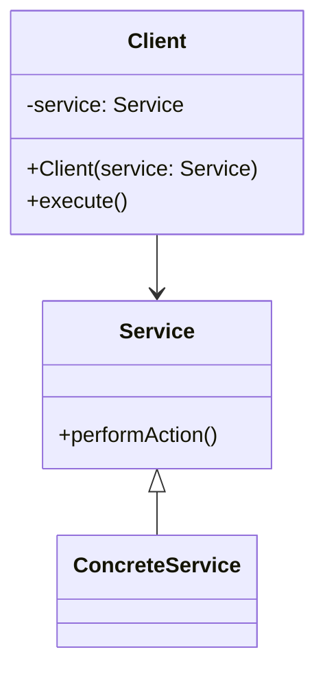
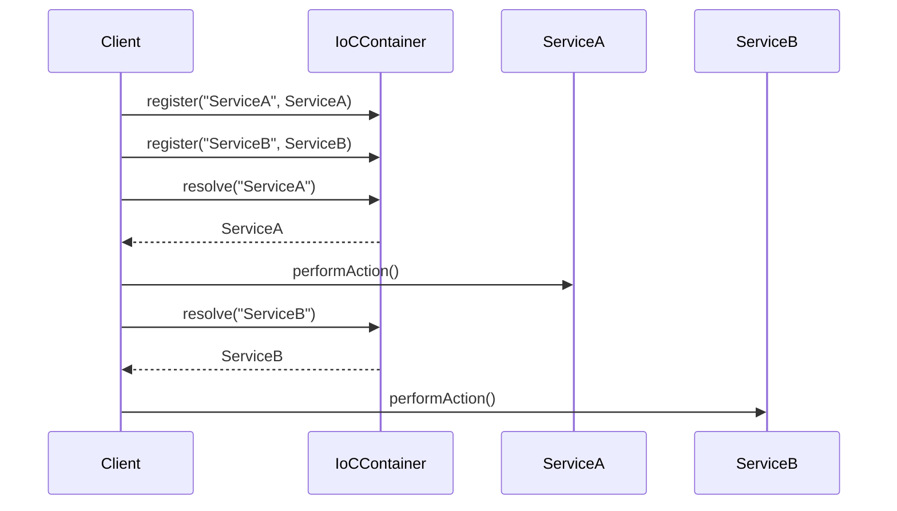

## 18.6. Dependency Injection and Inversion of Control

In the realm of software design, managing dependencies effectively is crucial for creating flexible, maintainable, and scalable applications. Two powerful design patterns that address this challenge are Dependency Injection (DI) and Inversion of Control (IoC). These patterns help reduce hard-coded couplings between components, allowing for more modular and testable code. In this section, we will delve deep into these concepts, exploring their principles, benefits, and practical implementations using pseudocode.

### Understanding Dependency Injection (DI)

**Dependency Injection** is a design pattern that allows a class to receive its dependencies from an external source rather than creating them internally. This approach promotes loose coupling and enhances testability by decoupling the creation of an object from its usage.

#### Key Concepts of Dependency Injection

1. **Dependency:** An object that a class requires to function correctly.
2. **Injection:** The process of providing dependencies to a class.
3. **Service:** The class that provides the functionality required by another class.
4. **Client:** The class that depends on the service to perform its operations.

#### Types of Dependency Injection

There are three primary types of dependency injection:

1. **Constructor Injection:** Dependencies are provided through a class constructor.
2. **Setter Injection:** Dependencies are provided through setter methods.
3. **Interface Injection:** The dependency provides an injector method that will inject the dependency into any client passed to it.

#### Benefits of Dependency Injection

- **Decoupling:** Reduces the dependency between classes, making the system more modular.
- **Testability:** Facilitates unit testing by allowing dependencies to be easily mocked or stubbed.
- **Flexibility:** Enables easy swapping of implementations without changing the client code.
- **Maintainability:** Simplifies code maintenance by centralizing the configuration of dependencies.

### Implementing Dependency Injection

Let's explore how to implement Dependency Injection using pseudocode. We'll illustrate each type of injection with examples.

#### Constructor Injection

In constructor injection, dependencies are provided when an instance of a class is created. This method ensures that the class is always in a valid state.

```pseudocode
class Service {
    method performAction() {
        // Implementation of service action
    }
}

class Client {
    private service

    constructor(service) {
        this.service = service
    }

    method execute() {
        this.service.performAction()
    }
}

// Usage
service = new Service()
client = new Client(service)
client.execute()
```

In this example, the `Client` class receives its dependency, `Service`, through its constructor. This approach ensures that the `Client` is always initialized with a valid `Service` instance.

#### Setter Injection

Setter injection allows dependencies to be set after the object is created, providing more flexibility in configuring dependencies.

```pseudocode
class Service {
    method performAction() {
        // Implementation of service action
    }
}

class Client {
    private service

    method setService(service) {
        this.service = service
    }

    method execute() {
        if (this.service != null) {
            this.service.performAction()
        } else {
            // Handle missing service
        }
    }
}

// Usage
service = new Service()
client = new Client()
client.setService(service)
client.execute()
```

Here, the `Client` class provides a `setService` method to inject the `Service` dependency. This approach allows for more dynamic configuration but requires additional checks to ensure the dependency is set before use.

#### Interface Injection

Interface injection involves defining an interface that the client must implement to receive the dependency.

```pseudocode
interface Service {
    method performAction()
}

class ConcreteService implements Service {
    method performAction() {
        // Implementation of service action
    }
}

interface ServiceInjector {
    method injectService(client)
}

class Client implements Service {
    private service

    method performAction() {
        this.service.performAction()
    }

    method setService(service) {
        this.service = service
    }
}

class ConcreteServiceInjector implements ServiceInjector {
    method injectService(client) {
        service = new ConcreteService()
        client.setService(service)
    }
}

// Usage
client = new Client()
injector = new ConcreteServiceInjector()
injector.injectService(client)
client.performAction()
```

In this example, the `Client` class implements the `Service` interface, and the `ConcreteServiceInjector` class injects the `ConcreteService` into the `Client`. This approach is less common but can be useful in certain scenarios.

### Visualizing Dependency Injection

To better understand the flow of Dependency Injection, let's visualize it using a class diagram.



**Diagram Description:** This class diagram illustrates the relationship between the `Client` and `Service` classes. The `Client` depends on the `Service` interface, and the `ConcreteService` implements the `Service` interface. The dependency is injected into the `Client` through its constructor.

### Understanding Inversion of Control (IoC)

**Inversion of Control** is a broader principle that refers to the decoupling of components by inverting the control of object creation and management. Dependency Injection is a specific implementation of IoC.

#### Key Concepts of Inversion of Control

1. **Control Inversion:** The framework or container controls the flow of the application, not the application itself.
2. **Decoupling:** Reduces dependencies between components, leading to more modular and flexible systems.
3. **Configuration:** The application is configured externally, often through configuration files or annotations.

#### Benefits of Inversion of Control

- **Modularity:** Promotes a modular architecture by decoupling components.
- **Flexibility:** Allows for easy swapping of components without changing the core logic.
- **Scalability:** Facilitates scaling by managing dependencies and configurations centrally.

### Implementing Inversion of Control

Inversion of Control is often implemented using a container or framework that manages the lifecycle and dependencies of objects. Let's explore a simple IoC container implementation using pseudocode.

```pseudocode
class IoCContainer {
    private services = {}

    method register(serviceName, service) {
        this.services[serviceName] = service
    }

    method resolve(serviceName) {
        return this.services[serviceName]
    }
}

// Define services
class ServiceA {
    method performAction() {
        // Implementation of ServiceA action
    }
}

class ServiceB {
    method performAction() {
        // Implementation of ServiceB action
    }
}

// Usage
container = new IoCContainer()
container.register("ServiceA", new ServiceA())
container.register("ServiceB", new ServiceB())

serviceA = container.resolve("ServiceA")
serviceA.performAction()

serviceB = container.resolve("ServiceB")
serviceB.performAction()
```

In this example, the `IoCContainer` class manages the registration and resolution of services. The `register` method adds a service to the container, and the `resolve` method retrieves the service by name.

### Visualizing Inversion of Control

Let's visualize the IoC container and its interactions using a sequence diagram.



**Diagram Description:** This sequence diagram shows the interaction between the `Client`, `IoCContainer`, `ServiceA`, and `ServiceB`. The `Client` registers services with the `IoCContainer` and resolves them when needed, demonstrating the inversion of control.

### Design Considerations

When implementing Dependency Injection and Inversion of Control, consider the following:

- **Complexity:** While these patterns promote flexibility, they can introduce complexity if not managed properly.
- **Performance:** Be mindful of the performance overhead introduced by IoC containers, especially in large-scale applications.
- **Configuration Management:** Ensure that configurations are managed effectively, especially in distributed systems.

### Differences and Similarities

Dependency Injection and Inversion of Control are closely related but distinct concepts. Here are some key differences and similarities:

- **Dependency Injection** is a specific implementation of the broader **Inversion of Control** principle.
- Both patterns aim to decouple components and promote modularity.
- IoC often involves a container or framework, while DI can be implemented without one.
- DI focuses on providing dependencies, while IoC focuses on controlling the flow of the application.

### Try It Yourself

To deepen your understanding, try modifying the pseudocode examples:

- Implement a new service and inject it into the client using constructor injection.
- Experiment with different types of injection (constructor, setter, interface) and observe the differences.
- Create a more complex IoC container that supports dependency resolution with parameters.

### Knowledge Check

Before we wrap up, let's test your understanding with a few questions:

1. What is the primary goal of Dependency Injection?
2. How does Inversion of Control differ from Dependency Injection?
3. What are the benefits of using an IoC container?
4. How can Dependency Injection improve testability?
5. What are the potential drawbacks of using DI and IoC?

### Conclusion

Dependency Injection and Inversion of Control are powerful design patterns that enhance the flexibility, maintainability, and testability of software applications. By decoupling components and managing dependencies effectively, these patterns enable developers to build robust and scalable systems. As you continue your journey in mastering design patterns, remember to embrace these principles thoughtfully and adapt them to your specific needs.

---

## Quiz Time!



### What is the primary benefit of Dependency Injection?

- [x] It reduces coupling between components.
- [ ] It increases the complexity of the code.
- [ ] It makes the code run faster.
- [ ] It eliminates the need for testing.

> **Explanation:** Dependency Injection reduces coupling between components, making the code more modular and easier to maintain.

### Which type of Dependency Injection involves providing dependencies through a class constructor?

- [x] Constructor Injection
- [ ] Setter Injection
- [ ] Interface Injection
- [ ] Field Injection

> **Explanation:** Constructor Injection involves providing dependencies through a class constructor, ensuring the class is always in a valid state.

### Inversion of Control is primarily about:

- [x] Decoupling the control of object creation and management.
- [ ] Increasing the number of dependencies in a system.
- [ ] Making all classes static.
- [ ] Eliminating the need for interfaces.

> **Explanation:** Inversion of Control is about decoupling the control of object creation and management, often using a container or framework.

### What is a common tool or framework used to implement Inversion of Control?

- [x] IoC Container
- [ ] Database
- [ ] Compiler
- [ ] Text Editor

> **Explanation:** An IoC Container is a common tool used to implement Inversion of Control by managing the lifecycle and dependencies of objects.

### How does Dependency Injection improve testability?

- [x] By allowing dependencies to be easily mocked or stubbed.
- [ ] By making the code more complex.
- [ ] By eliminating the need for tests.
- [ ] By hardcoding all dependencies.

> **Explanation:** Dependency Injection improves testability by allowing dependencies to be easily mocked or stubbed, facilitating unit testing.

### Which of the following is NOT a type of Dependency Injection?

- [ ] Constructor Injection
- [ ] Setter Injection
- [ ] Interface Injection
- [x] Static Injection

> **Explanation:** Static Injection is not a recognized type of Dependency Injection. The main types are Constructor, Setter, and Interface Injection.

### What is a potential drawback of using Dependency Injection?

- [x] It can introduce complexity if not managed properly.
- [ ] It eliminates the need for interfaces.
- [ ] It makes the code run slower.
- [ ] It increases coupling between components.

> **Explanation:** A potential drawback of using Dependency Injection is that it can introduce complexity if not managed properly.

### What is the relationship between Dependency Injection and Inversion of Control?

- [x] Dependency Injection is a specific implementation of Inversion of Control.
- [ ] They are completely unrelated concepts.
- [ ] Inversion of Control is a specific implementation of Dependency Injection.
- [ ] They are both types of databases.

> **Explanation:** Dependency Injection is a specific implementation of the broader Inversion of Control principle.

### True or False: Inversion of Control always requires a container or framework.

- [ ] True
- [x] False

> **Explanation:** While Inversion of Control is often implemented using a container or framework, it is not strictly required.

### Which of the following is a benefit of using an IoC container?

- [x] It centralizes the configuration of dependencies.
- [ ] It makes the code more difficult to understand.
- [ ] It eliminates the need for testing.
- [ ] It increases the number of dependencies.

> **Explanation:** An IoC container centralizes the configuration of dependencies, making the system more modular and easier to manage.



Remember, this is just the beginning. As you progress, you'll build more complex and interactive systems. Keep experimenting, stay curious, and enjoy the journey!
