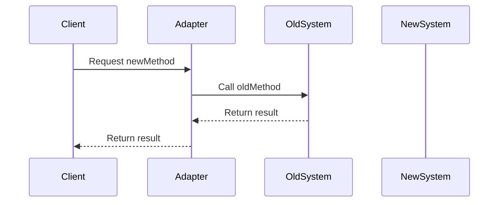

## 19.2. The Role of Design Patterns in Modern Software Development

In the ever-evolving landscape of software development, design patterns have emerged as a cornerstone for building robust, scalable, and maintainable systems. As technologies advance and paradigms shift, the role of design patterns becomes increasingly significant. They serve as a bridge between theoretical concepts and practical implementation, providing a shared language and framework for developers to address common challenges. In this section, we will explore how design patterns facilitate adaptation to changing technologies and foster continuous learning among developers.

### Understanding Design Patterns

Before delving into their role in modern development, let's revisit what design patterns are. Design patterns are proven solutions to recurring design problems in software development. They encapsulate best practices and offer a template for solving specific issues, making them invaluable tools for developers.

#### Key Characteristics of Design Patterns

- **Reusability:** Design patterns promote code reuse, reducing redundancy and enhancing efficiency.
- **Scalability:** They provide a foundation for building scalable systems that can grow with changing requirements.
- **Maintainability:** By encouraging clean and organized code, design patterns simplify maintenance and updates.
- **Communication:** Patterns offer a common vocabulary for developers, facilitating collaboration and understanding.

### Adapting to Changing Technologies

In today's fast-paced tech world, adaptability is crucial. Design patterns equip developers with the tools to navigate and integrate new technologies seamlessly.

#### Bridging Old and New Technologies

Design patterns enable the integration of legacy systems with modern solutions, ensuring continuity and minimizing disruptions. For instance, the **Adapter Pattern** allows incompatible interfaces to work together, facilitating the transition from old to new systems.

```pseudocode
// Adapter Pattern Pseudocode
class OldSystem {
    method oldMethod() {
        // Old implementation
    }
}

class NewSystem {
    method newMethod() {
        // New implementation
    }
}

class Adapter {
    private OldSystem oldSystem;

    method Adapter(OldSystem os) {
        this.oldSystem = os;
    }

    method newMethod() {
        oldSystem.oldMethod();
    }
}

// Usage
OldSystem oldSystem = new OldSystem();
Adapter adapter = new Adapter(oldSystem);
adapter.newMethod(); // Calls oldMethod through adapter
```

#### Supporting Emerging Paradigms

As programming paradigms evolve, design patterns adapt to support new approaches. For example, the **Observer Pattern** is widely used in reactive programming to manage asynchronous data streams, demonstrating its versatility across paradigms.

```pseudocode
// Observer Pattern Pseudocode
interface Observer {
    method update(data);
}

class ConcreteObserver implements Observer {
    method update(data) {
        // Handle the update
    }
}

class Subject {
    private List<Observer> observers;

    method attach(Observer observer) {
        observers.add(observer);
    }

    method notifyObservers(data) {
        foreach (Observer observer in observers) {
            observer.update(data);
        }
    }
}

// Usage
Subject subject = new Subject();
Observer observer1 = new ConcreteObserver();
subject.attach(observer1);
subject.notifyObservers("New Data");
```

#### Facilitating Cloud and Microservices Architecture

In cloud-native and microservices architectures, design patterns play a pivotal role in managing distributed systems. Patterns like **Circuit Breaker** and **Service Registry** are essential for ensuring reliability and scalability in these environments.

```pseudocode
// Circuit Breaker Pattern Pseudocode
class CircuitBreaker {
    private boolean isOpen = false;
    private int failureCount = 0;
    private int threshold = 5;

    method callService(Service service) {
        if (isOpen) {
            throw new Exception("Circuit is open");
        }
        try {
            service.execute();
            reset();
        } catch (Exception e) {
            failureCount++;
            if (failureCount >= threshold) {
                isOpen = true;
            }
        }
    }

    method reset() {
        failureCount = 0;
        isOpen = false;
    }
}

// Usage
Service service = new SomeService();
CircuitBreaker cb = new CircuitBreaker();
cb.callService(service);
```

### Continuous Learning and Improvement

Design patterns not only aid in adapting to new technologies but also foster a culture of continuous learning and improvement among developers.

#### Encouraging Best Practices

By adhering to design patterns, developers internalize best practices, leading to more efficient and effective coding habits. This continuous refinement of skills is essential in keeping pace with technological advancements.

#### Promoting Collaborative Learning

Design patterns serve as a common language among developers, enabling knowledge sharing and collaborative problem-solving. This communal learning environment accelerates skill development and innovation.

#### Inspiring Innovation

While design patterns provide established solutions, they also inspire creativity and innovation. Developers can build upon these patterns to create novel solutions tailored to specific challenges, pushing the boundaries of what's possible.

### Visualizing Design Patterns in Action

To better understand the role of design patterns, let's visualize their application in a modern software architecture using a sequence diagram.



This diagram illustrates how the Adapter Pattern facilitates communication between a client and an old system, enabling the integration of new functionalities without altering the existing codebase.

### Try It Yourself

To deepen your understanding, try modifying the pseudocode examples provided. Experiment with different scenarios, such as changing the threshold in the Circuit Breaker pattern or adding more observers in the Observer pattern. This hands-on approach will reinforce your grasp of design patterns and their adaptability.

### References and Further Reading

For more information on design patterns and their applications, consider exploring the following resources:

- [Design Patterns: Elements of Reusable Object-Oriented Software](https://en.wikipedia.org/wiki/Design_Patterns) by Erich Gamma, Richard Helm, Ralph Johnson, and John Vlissides
- [Refactoring: Improving the Design of Existing Code](https://martinfowler.com/books/refactoring.html) by Martin Fowler
- [The Pragmatic Programmer: Your Journey to Mastery](https://pragprog.com/titles/tpp20/the-pragmatic-programmer-20th-anniversary-edition/) by Andrew Hunt and David Thomas

### Knowledge Check

Let's test your understanding of the role of design patterns in modern software development. Consider the following questions and challenges:

1. How do design patterns facilitate the integration of legacy systems with modern technologies?
2. In what ways do design patterns support emerging programming paradigms?
3. Describe a scenario where the Circuit Breaker pattern would be beneficial.
4. How can design patterns inspire innovation among developers?

### Embrace the Journey

Remember, mastering design patterns is a journey, not a destination. As you continue to explore and apply these patterns, you'll enhance your problem-solving skills and become a more versatile developer. Stay curious, keep experimenting, and enjoy the process of continuous learning and improvement.

## Quiz Time!



### How do design patterns promote code reusability?

- [x] By providing proven solutions to common problems
- [ ] By enforcing strict coding standards
- [ ] By limiting the use of certain programming languages
- [ ] By preventing the use of external libraries

> **Explanation:** Design patterns offer established solutions to recurring design problems, allowing developers to reuse code efficiently.

### Which pattern is commonly used to integrate legacy systems with modern solutions?

- [x] Adapter Pattern
- [ ] Singleton Pattern
- [ ] Observer Pattern
- [ ] Strategy Pattern

> **Explanation:** The Adapter Pattern allows incompatible interfaces to work together, making it ideal for integrating legacy systems with new technologies.

### What role do design patterns play in cloud-native architectures?

- [x] They ensure reliability and scalability
- [ ] They simplify user interface design
- [ ] They enforce security protocols
- [ ] They replace the need for databases

> **Explanation:** In cloud-native architectures, patterns like Circuit Breaker and Service Registry help manage distributed systems, ensuring reliability and scalability.

### How do design patterns encourage continuous learning?

- [x] By internalizing best practices
- [ ] By providing step-by-step tutorials
- [ ] By limiting access to new technologies
- [ ] By enforcing strict coding rules

> **Explanation:** Design patterns help developers internalize best practices, leading to continuous skill refinement and adaptation to new technologies.

### What is a key benefit of using the Observer Pattern in reactive programming?

- [x] Managing asynchronous data streams
- [ ] Simplifying database queries
- [x] Reducing code complexity
- [ ] Enforcing security measures

> **Explanation:** The Observer Pattern is useful in reactive programming for managing asynchronous data streams and reducing code complexity.

### How can design patterns inspire innovation?

- [x] By providing a foundation for novel solutions
- [ ] By enforcing strict coding guidelines
- [ ] By limiting the use of certain technologies
- [ ] By preventing code reuse

> **Explanation:** While design patterns offer established solutions, they also inspire creativity and innovation by providing a foundation for novel solutions.

### What is a common characteristic of design patterns?

- [x] Scalability
- [ ] Complexity
- [x] Maintainability
- [ ] Obsolescence

> **Explanation:** Design patterns are known for their scalability and maintainability, making them valuable in modern software development.

### How do design patterns facilitate collaborative learning?

- [x] By providing a common language
- [ ] By enforcing individual work
- [ ] By limiting access to resources
- [ ] By preventing code sharing

> **Explanation:** Design patterns offer a common vocabulary, enabling knowledge sharing and collaborative problem-solving among developers.

### Which pattern is essential for managing distributed systems in microservices architecture?

- [x] Circuit Breaker Pattern
- [ ] Singleton Pattern
- [ ] Observer Pattern
- [ ] Strategy Pattern

> **Explanation:** The Circuit Breaker Pattern is crucial for managing distributed systems in microservices architecture, ensuring reliability and scalability.

### True or False: Design patterns are only applicable to object-oriented programming.

- [ ] True
- [x] False

> **Explanation:** Design patterns are applicable across various programming paradigms, including object-oriented and functional programming.


