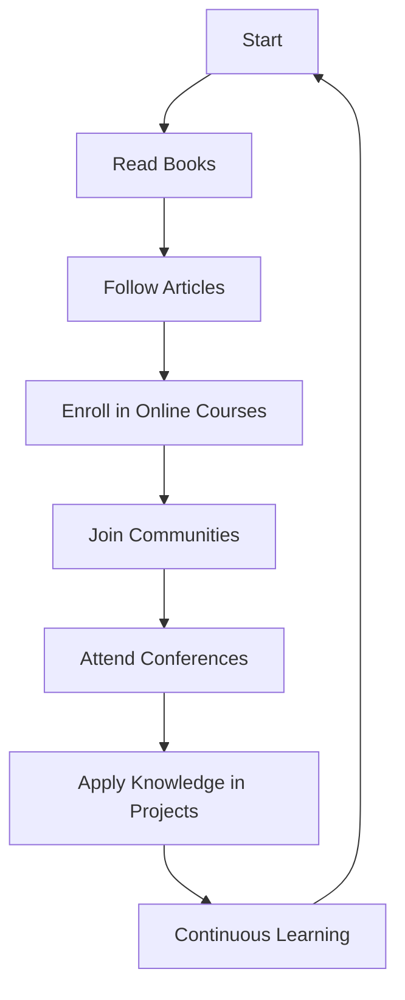

## 19.3. Continuing Education and Resources

In the ever-evolving field of software development, continuous learning is essential to stay ahead and maintain expertise. Design patterns are a fundamental aspect of software architecture, providing solutions to common problems and enhancing code maintainability and scalability. This section will guide you through various resources that can aid in mastering design patterns, including books, articles, online courses, communities, and conferences.

### Books, Articles, and Online Courses

#### Books

Books are a timeless resource for deepening your understanding of design patterns. Here are some highly recommended titles:

1. **"Design Patterns: Elements of Reusable Object-Oriented Software" by Erich Gamma, Richard Helm, Ralph Johnson, and John Vlissides (Gang of Four)**

   This seminal book is a must-read for any software engineer. It introduces 23 classic design patterns and provides detailed explanations and examples. The book's influence is profound, and it remains a cornerstone in the study of design patterns.

2. **"Head First Design Patterns" by Eric Freeman, Bert Bates, Kathy Sierra, and Elisabeth Robson**

   Known for its engaging and interactive approach, this book simplifies complex concepts with visual aids and real-world examples. It's an excellent resource for those new to design patterns or looking for a more intuitive understanding.

3. **"Patterns of Enterprise Application Architecture" by Martin Fowler**

   This book focuses on architectural patterns and is particularly useful for those involved in enterprise-level software development. Fowler's insights into the design and implementation of large-scale applications are invaluable.

4. **"Refactoring: Improving the Design of Existing Code" by Martin Fowler**

   While not exclusively about design patterns, this book is crucial for understanding how to improve code structure and apply patterns effectively. It complements the study of design patterns by focusing on code quality and maintainability.

5. **"Domain-Driven Design: Tackling Complexity in the Heart of Software" by Eric Evans**

   This book introduces the concept of domain-driven design (DDD), which is closely related to design patterns. It provides strategies for managing complex software projects and aligning software design with business needs.

#### Articles

Articles and blog posts are excellent for staying updated with the latest trends and insights in design patterns. Here are some platforms and authors to follow:

- **Medium**: A platform where many software engineers share their experiences and insights. Look for articles tagged with "Design Patterns" or "Software Architecture."

- **Martin Fowler's Blog**: Known for his expertise in software architecture, Martin Fowler's blog is a treasure trove of articles on design patterns, refactoring, and more.

- **DZone**: Offers a wide range of articles on design patterns, including practical examples and case studies.

- **InfoQ**: Provides in-depth articles and interviews with industry experts on design patterns and software architecture.

#### Online Courses

Online courses offer structured learning experiences and often include interactive components such as quizzes and projects. Here are some platforms offering courses on design patterns:

1. **Coursera**

   - **"Design Patterns" by University of Alberta**: This course covers the fundamental design patterns and their applications in software development. It includes video lectures, quizzes, and hands-on projects.

2. **Udemy**

   - **"Java Design Patterns & Architecture"**: This course provides a comprehensive overview of design patterns using Java. It's suitable for both beginners and experienced developers.

3. **edX**

   - **"Software Design and Architecture" by University of British Columbia**: This course explores software design principles and patterns, focusing on creating scalable and maintainable software systems.

4. **Pluralsight**

   - **"Design Patterns in C#"**: This course covers design patterns in the context of C#, providing practical examples and exercises.

5. **Khan Academy**

   - While not specifically focused on design patterns, Khan Academy offers courses on computer science fundamentals, which are essential for understanding design patterns.

### Communities and Conferences

Engaging with communities and attending conferences are excellent ways to learn from others, share knowledge, and stay updated with industry trends.

#### Communities

1. **Stack Overflow**

   - A platform where developers ask and answer questions. It's a great place to seek help and share knowledge about design patterns.

2. **Reddit**

   - Subreddits like r/programming and r/softwarearchitecture are active communities where developers discuss design patterns and share resources.

3. **GitHub**

   - Explore repositories related to design patterns. Many developers share their implementations and projects, which can be a valuable learning resource.

4. **Meetup**

   - Look for local meetups focused on software development and design patterns. These events provide opportunities to network and learn from peers.

5. **LinkedIn Groups**

   - Join groups related to software architecture and design patterns. Engage in discussions and connect with industry professionals.

#### Conferences

Attending conferences allows you to learn from experts, discover new tools and techniques, and network with other professionals. Here are some notable conferences:

1. **O'Reilly Software Architecture Conference**

   - Focuses on software architecture and design patterns. It features talks, workshops, and networking opportunities with industry leaders.

2. **QCon**

   - An international software development conference that covers a wide range of topics, including design patterns and software architecture.

3. **Devoxx**

   - A community-driven conference series that offers sessions on design patterns, programming languages, and software development.

4. **GOTO Conference**

   - Features talks and workshops on software development, including design patterns and best practices.

5. **ACM SIGPLAN Conference on Object-Oriented Programming, Systems, Languages, and Applications (OOPSLA)**

   - Focuses on object-oriented programming and design patterns. It's an excellent venue for academic and industry professionals to share research and insights.

### Visualizing Your Learning Path

To help you visualize your learning journey, let's create a flowchart that outlines the steps you can take to master design patterns.

**Caption:** This flowchart represents a continuous learning cycle for mastering design patterns. Start by reading foundational books, then follow articles to stay updated. Enroll in online courses for structured learning, join communities for networking, and attend conferences to learn from experts. Apply your knowledge in projects and continue the cycle of learning.

### Try It Yourself

To truly master design patterns, it's important to apply what you've learned. Here are some suggestions for hands-on practice:

1. **Implement Design Patterns in a Project**

   - Choose a project you're working on and identify areas where design patterns can be applied. Implement these patterns and observe the impact on code maintainability and scalability.

2. **Contribute to Open Source**

   - Find open-source projects on GitHub that use design patterns. Contribute by fixing bugs, adding features, or improving documentation.

3. **Create a Design Pattern Portfolio**

   - Document your implementations of various design patterns. Include code snippets, diagrams, and explanations of how each pattern was applied.

4. **Teach Others**

   - Share your knowledge by writing blog posts, creating video tutorials, or giving talks at local meetups. Teaching is a powerful way to reinforce your understanding.

### Knowledge Check

Let's reinforce your learning with some questions and challenges:

- **Question:** What are the benefits of using design patterns in software development?
- **Challenge:** Implement the Observer pattern in a simple chat application. Allow users to subscribe to messages and receive updates in real-time.

### Embrace the Journey

Remember, mastering design patterns is a journey, not a destination. As you progress, you'll encounter new challenges and opportunities to apply your knowledge. Stay curious, keep experimenting, and enjoy the process of continuous learning.

### References and Links

Here are some links to further explore the resources mentioned:

- [Design Patterns: Elements of Reusable Object-Oriented Software](https://www.amazon.com/Design-Patterns-Elements-Reusable-Object-Oriented/dp/0201633612)
- [Head First Design Patterns](https://www.oreilly.com/library/view/head-first-design/0596007124/)
- [Patterns of Enterprise Application Architecture](https://martinfowler.com/books/eaa.html)
- [Refactoring: Improving the Design of Existing Code](https://martinfowler.com/books/refactoring.html)
- [Domain-Driven Design: Tackling Complexity in the Heart of Software](https://www.amazon.com/Domain-Driven-Design-Tackling-Complexity-Software/dp/0321125215)

### Quiz Time!



### What is a key benefit of using design patterns?

- [x] They provide reusable solutions to common problems.
- [ ] They increase code complexity.
- [ ] They eliminate the need for testing.
- [ ] They are only applicable to object-oriented programming.

> **Explanation:** Design patterns offer reusable solutions to common software design problems, enhancing code maintainability and scalability.

### Which book is considered the seminal work on design patterns?

- [x] "Design Patterns: Elements of Reusable Object-Oriented Software"
- [ ] "Head First Design Patterns"
- [ ] "Patterns of Enterprise Application Architecture"
- [ ] "Refactoring: Improving the Design of Existing Code"

> **Explanation:** "Design Patterns: Elements of Reusable Object-Oriented Software" by the Gang of Four is the seminal work that introduced 23 classic design patterns.

### What is one advantage of joining online communities?

- [x] Networking with other professionals
- [ ] Avoiding new trends
- [ ] Reducing learning opportunities
- [ ] Limiting access to resources

> **Explanation:** Online communities provide opportunities to network with other professionals, share knowledge, and stay updated with industry trends.

### Which platform offers a course titled "Design Patterns" by the University of Alberta?

- [x] Coursera
- [ ] Udemy
- [ ] edX
- [ ] Pluralsight

> **Explanation:** Coursera offers the "Design Patterns" course by the University of Alberta, covering fundamental design patterns and their applications.

### What is a benefit of attending conferences?

- [x] Learning from industry experts
- [ ] Avoiding new tools and techniques
- [ ] Isolating from the community
- [ ] Limiting professional growth

> **Explanation:** Conferences provide opportunities to learn from industry experts, discover new tools and techniques, and network with other professionals.

### Which book focuses on architectural patterns for enterprise applications?

- [x] "Patterns of Enterprise Application Architecture"
- [ ] "Head First Design Patterns"
- [ ] "Refactoring: Improving the Design of Existing Code"
- [ ] "Domain-Driven Design: Tackling Complexity in the Heart of Software"

> **Explanation:** "Patterns of Enterprise Application Architecture" by Martin Fowler focuses on architectural patterns for enterprise-level software development.

### What is one way to apply design patterns in practice?

- [x] Implement them in a project
- [ ] Avoid using them in code
- [ ] Ignore their impact on maintainability
- [ ] Limit their use to theoretical discussions

> **Explanation:** Implementing design patterns in a project allows you to observe their impact on code maintainability and scalability.

### Which conference focuses on object-oriented programming and design patterns?

- [x] OOPSLA
- [ ] QCon
- [ ] Devoxx
- [ ] GOTO Conference

> **Explanation:** The ACM SIGPLAN Conference on Object-Oriented Programming, Systems, Languages, and Applications (OOPSLA) focuses on object-oriented programming and design patterns.

### What is a key aspect of continuous learning?

- [x] Staying curious and experimenting
- [ ] Avoiding new challenges
- [ ] Limiting knowledge acquisition
- [ ] Ignoring industry trends

> **Explanation:** Continuous learning involves staying curious, experimenting with new ideas, and keeping up with industry trends.

### True or False: Teaching others is a powerful way to reinforce your understanding of design patterns.

- [x] True
- [ ] False

> **Explanation:** Teaching others helps reinforce your understanding of design patterns by requiring you to articulate and explain concepts clearly.


