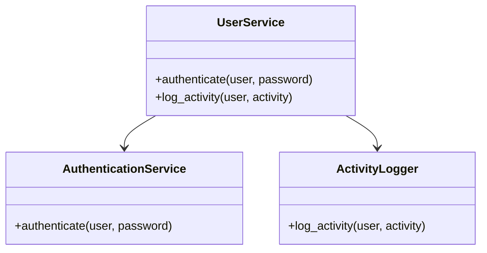
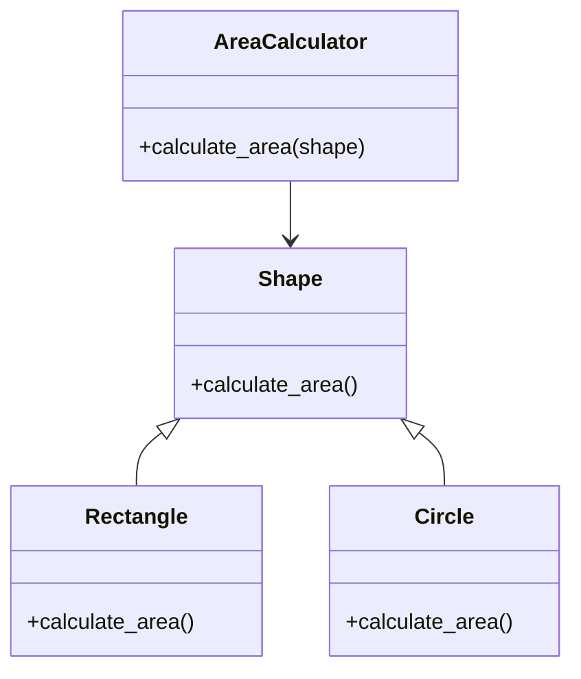
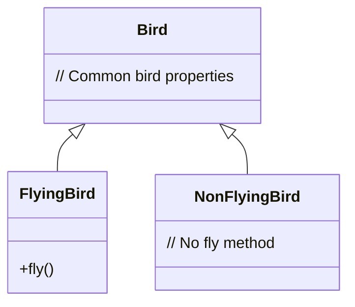

## 2.1. SOLID Principles

In the realm of software design, the SOLID principles stand as a beacon for creating robust, maintainable, and scalable systems. These principles, introduced by Robert C. Martin, are a set of guidelines that help developers craft software that is easy to understand, flexible, and adaptable to change. Let's delve into each of these principles in detail, exploring their significance, application, and how they can be implemented using pseudocode.

### Introduction to SOLID Principles

The SOLID principles are a collection of five design principles intended to make software designs more understandable, flexible, and maintainable. These principles are:

1. **Single Responsibility Principle (SRP)**
2. **Open/Closed Principle (OCP)**
3. **Liskov Substitution Principle (LSP)**
4. **Interface Segregation Principle (ISP)**
5. **Dependency Inversion Principle (DIP)**

Each principle addresses a specific aspect of software design, ensuring that code remains clean and manageable as it evolves over time.

### 1. Single Responsibility Principle (SRP)

**Definition:** A class should have only one reason to change, meaning it should have only one job or responsibility.

**Intent:** The SRP aims to reduce the complexity of code by ensuring that each class or module has a single responsibility, thereby making the system easier to understand and maintain.

#### Key Concepts

- **Cohesion:** A class should encapsulate only the functionality that is closely related, promoting high cohesion.
- **Separation of Concerns:** Different concerns or responsibilities should be separated into distinct classes or modules.

#### Example and Explanation

Consider a class that handles both user authentication and logging. This violates the SRP because it has two responsibilities.

```pseudocode
class UserService:
    method authenticate(user, password):
        # Authentication logic
        if user.is_valid(password):
            return True
        return False

    method log_activity(user, activity):
        # Logging logic
        log_to_file(user, activity)
```

**Refactored Example:**

```pseudocode
class AuthenticationService:
    method authenticate(user, password):
        # Authentication logic
        if user.is_valid(password):
            return True
        return False

class ActivityLogger:
    method log_activity(user, activity):
        # Logging logic
        log_to_file(user, activity)
```

**Explanation:** By separating authentication and logging into distinct classes, each class now has a single responsibility, adhering to the SRP.

#### Visualizing SRP



### 2. Open/Closed Principle (OCP)

**Definition:** Software entities (classes, modules, functions, etc.) should be open for extension but closed for modification.

**Intent:** The OCP encourages the design of software that can be extended without altering existing code, thus reducing the risk of introducing bugs.

#### Key Concepts

- **Extensibility:** New functionality can be added to the system by extending existing code.
- **Stability:** Existing code remains unchanged, preserving its integrity and reducing the likelihood of errors.

#### Example and Explanation

Suppose we have a class that calculates the area of different shapes. Initially, it only supports rectangles.

```pseudocode
class AreaCalculator:
    method calculate_area(shape):
        if shape.type == "rectangle":
            return shape.width * shape.height
```

**Refactored Example:**

```pseudocode
class Shape:
    method calculate_area()

class Rectangle extends Shape:
    method calculate_area():
        return self.width * self.height

class Circle extends Shape:
    method calculate_area():
        return 3.14 * self.radius * self.radius

class AreaCalculator:
    method calculate_area(shape):
        return shape.calculate_area()
```

**Explanation:** By using inheritance and polymorphism, we can extend the `Shape` class to support new shapes without modifying the `AreaCalculator` class, adhering to the OCP.

#### Visualizing OCP



### 3. Liskov Substitution Principle (LSP)

**Definition:** Objects of a superclass should be replaceable with objects of a subclass without affecting the correctness of the program.

**Intent:** The LSP ensures that a subclass can stand in for its superclass without altering the desirable properties of the program.

#### Key Concepts

- **Substitutability:** Subclasses should be able to replace their base classes seamlessly.
- **Behavioral Consistency:** Subclasses should adhere to the expected behavior of the base class.

#### Example and Explanation

Consider a class hierarchy for birds where a `Bird` class is extended by `FlyingBird` and `NonFlyingBird`.

```pseudocode
class Bird:
    method fly()

class FlyingBird extends Bird:
    method fly():
        # Flying logic

class NonFlyingBird extends Bird:
    method fly():
        # Throws an error
```

**Refactored Example:**

```pseudocode
class Bird:
    # Common bird properties

class FlyingBird extends Bird:
    method fly():
        # Flying logic

class NonFlyingBird extends Bird:
    # No fly method
```

**Explanation:** By removing the `fly()` method from `NonFlyingBird`, we ensure that only `FlyingBird` can be used where flying behavior is expected, adhering to the LSP.

#### Visualizing LSP



### 4. Interface Segregation Principle (ISP)

**Definition:** Clients should not be forced to depend on interfaces they do not use.

**Intent:** The ISP encourages the creation of smaller, more specific interfaces rather than large, general-purpose ones.

#### Key Concepts

- **Client-Specific Interfaces:** Interfaces should be tailored to the specific needs of clients.
- **Avoiding Fat Interfaces:** Large interfaces should be broken down into smaller, more focused ones.

#### Example and Explanation

Suppose we have an interface for a printer that includes methods for printing, scanning, and faxing.

```pseudocode
interface MultiFunctionPrinter:
    method print(document)
    method scan(document)
    method fax(document)
```

**Refactored Example:**

```pseudocode
interface Printer:
    method print(document)

interface Scanner:
    method scan(document)

interface Fax:
    method fax(document)

class MultiFunctionPrinter implements Printer, Scanner, Fax:
    method print(document):
        # Print logic

    method scan(document):
        # Scan logic

    method fax(document):
        # Fax logic
```

**Explanation:** By splitting the `MultiFunctionPrinter` interface into smaller interfaces, we allow clients to depend only on the functionality they need, adhering to the ISP.

#### Visualizing ISP

```mermaid
classDiagram
    interface Printer {
        +print(document)
    }
    interface Scanner {
        +scan(document)
    }
    interface Fax {
        +fax(document)
    }
    class MultiFunctionPrinter {
        +print(document)
        +scan(document)
        +fax(document)
    }
    MultiFunctionPrinter ..|> Printer
    MultiFunctionPrinter ..|> Scanner
    MultiFunctionPrinter ..|> Fax
```

### 5. Dependency Inversion Principle (DIP)

**Definition:** High-level modules should not depend on low-level modules. Both should depend on abstractions. Abstractions should not depend on details. Details should depend on abstractions.

**Intent:** The DIP aims to reduce the coupling between high-level and low-level components by introducing abstractions.

#### Key Concepts

- **Inversion of Control:** The flow of control is inverted by relying on abstractions rather than concrete implementations.
- **Dependency Injection:** Dependencies are provided to a class rather than being created within the class.

#### Example and Explanation

Consider a class that directly instantiates its dependencies.

```pseudocode
class ReportGenerator:
    method generate_report():
        printer = LaserPrinter()
        printer.print("Report Content")
```

**Refactored Example:**

```pseudocode
interface Printer:
    method print(content)

class ReportGenerator:
    constructor(printer: Printer)
    method generate_report():
        printer.print("Report Content")
```

**Explanation:** By depending on an abstraction (`Printer` interface) rather than a concrete class (`LaserPrinter`), we adhere to the DIP, allowing for greater flexibility and testability.

#### Visualizing DIP

```mermaid
classDiagram
    interface Printer {
        +print(content)
    }
    class ReportGenerator {
        +generate_report()
    }
    class LaserPrinter {
        +print(content)
    }
    ReportGenerator --> Printer
    LaserPrinter ..|> Printer
```

### Try It Yourself

Now that we've explored the SOLID principles, let's encourage some experimentation. Try modifying the pseudocode examples to:

- Add a new shape to the `AreaCalculator` without altering its existing code.
- Create a new class that implements the `Printer` interface and use it in the `ReportGenerator`.
- Refactor the `MultiFunctionPrinter` to include a new interface for photocopying.

### Knowledge Check

- What is the main goal of the Single Responsibility Principle?
- How does the Open/Closed Principle facilitate software extensibility?
- Why is the Liskov Substitution Principle important for polymorphism?
- What problem does the Interface Segregation Principle solve?
- How does the Dependency Inversion Principle promote flexibility in software design?

### Conclusion

The SOLID principles are foundational to creating software that is easy to maintain and extend. By adhering to these principles, developers can ensure that their code remains clean, robust, and adaptable to change. Remember, mastering these principles is a journey, and with practice, you'll find yourself writing more intuitive and efficient code.

## Quiz Time!



### What is the main goal of the Single Responsibility Principle?

- [x] To ensure a class has only one reason to change
- [ ] To allow a class to perform multiple functions
- [ ] To make a class open for extension
- [ ] To enforce strict type checking

> **Explanation:** The Single Responsibility Principle states that a class should have only one reason to change, meaning it should have only one job or responsibility.

### How does the Open/Closed Principle facilitate software extensibility?

- [x] By allowing classes to be extended without modifying existing code
- [ ] By making all classes final
- [ ] By enforcing single inheritance
- [ ] By requiring all methods to be static

> **Explanation:** The Open/Closed Principle states that software entities should be open for extension but closed for modification, allowing new functionality to be added without altering existing code.

### Why is the Liskov Substitution Principle important for polymorphism?

- [x] It ensures subclasses can replace their base classes without altering program correctness
- [ ] It requires all subclasses to override base class methods
- [ ] It enforces strict encapsulation
- [ ] It mandates the use of interfaces

> **Explanation:** The Liskov Substitution Principle ensures that objects of a superclass can be replaced with objects of a subclass without affecting the correctness of the program, which is crucial for polymorphism.

### What problem does the Interface Segregation Principle solve?

- [x] It prevents clients from being forced to depend on interfaces they do not use
- [ ] It requires all classes to implement multiple interfaces
- [ ] It mandates the use of abstract classes
- [ ] It enforces a single interface for all classes

> **Explanation:** The Interface Segregation Principle states that clients should not be forced to depend on interfaces they do not use, promoting the creation of smaller, more specific interfaces.

### How does the Dependency Inversion Principle promote flexibility in software design?

- [x] By making high-level modules independent of low-level modules through abstractions
- [ ] By enforcing the use of concrete classes
- [ ] By requiring all dependencies to be instantiated within the class
- [ ] By eliminating the need for interfaces

> **Explanation:** The Dependency Inversion Principle states that high-level modules should not depend on low-level modules. Both should depend on abstractions, promoting flexibility and reducing coupling.

### Which principle encourages the separation of concerns?

- [x] Single Responsibility Principle
- [ ] Open/Closed Principle
- [ ] Liskov Substitution Principle
- [ ] Dependency Inversion Principle

> **Explanation:** The Single Responsibility Principle encourages the separation of concerns by ensuring that a class has only one responsibility.

### What is a key benefit of adhering to the Interface Segregation Principle?

- [x] It allows clients to depend only on the methods they use
- [ ] It reduces the number of interfaces in a system
- [ ] It simplifies the implementation of classes
- [ ] It mandates the use of inheritance

> **Explanation:** The Interface Segregation Principle allows clients to depend only on the methods they use, promoting more focused and specific interfaces.

### What does the Dependency Inversion Principle suggest about dependencies?

- [x] Dependencies should be injected rather than instantiated within a class
- [ ] Dependencies should always be instantiated within a class
- [ ] Dependencies should be avoided altogether
- [ ] Dependencies should be hardcoded

> **Explanation:** The Dependency Inversion Principle suggests that dependencies should be injected rather than instantiated within a class, promoting flexibility and testability.

### Which principle is primarily concerned with substitutability?

- [x] Liskov Substitution Principle
- [ ] Single Responsibility Principle
- [ ] Open/Closed Principle
- [ ] Interface Segregation Principle

> **Explanation:** The Liskov Substitution Principle is primarily concerned with substitutability, ensuring that subclasses can replace their base classes without affecting program correctness.

### True or False: The Open/Closed Principle means that classes should be open for modification.

- [ ] True
- [x] False

> **Explanation:** False. The Open/Closed Principle means that classes should be open for extension but closed for modification.


