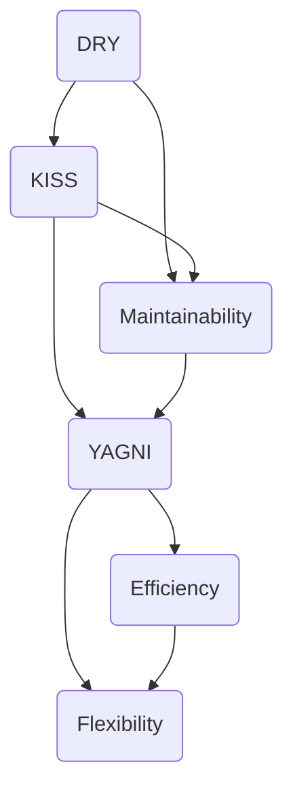

## 2.2. DRY, KISS, and YAGNI

In the realm of software engineering, principles like DRY, KISS, and YAGNI serve as guiding lights, helping developers create efficient, maintainable, and scalable code. These principles are not just theoretical concepts but practical guidelines that can significantly impact the quality of your software. Let's delve into each of these principles, understand their importance, and explore how to apply them effectively in your development process.

### Don't Repeat Yourself (DRY)

**Intent:** The DRY principle emphasizes reducing repetition of software patterns, replacing them with abstractions or using data normalization to avoid redundancy.

**Key Participants:**
- **Developers:** Responsible for identifying and eliminating redundancy.
- **Codebase:** The target for applying DRY to enhance maintainability.

**Applicability:** Use DRY when you notice repeated code blocks, logic, or data structures across your codebase.

**Design Considerations:**
- Ensure that abstractions introduced to eliminate repetition do not become overly complex.
- Balance DRY with readability and simplicity.

#### Understanding DRY

The DRY principle, coined by Andy Hunt and Dave Thomas in their book "The Pragmatic Programmer," is a fundamental tenet of software development. It states that "every piece of knowledge must have a single, unambiguous, authoritative representation within a system." In simpler terms, DRY encourages developers to avoid duplicating code or logic across their applications.

#### Benefits of DRY

- **Maintainability:** Changes need to be made in only one place, reducing the risk of errors.
- **Readability:** A cleaner codebase is easier to understand and navigate.
- **Scalability:** DRY code is more adaptable to changes and new requirements.

#### Implementing DRY in Pseudocode

Let's consider a scenario where we have a function to calculate the area of different shapes. Without DRY, the code might look like this:

```pseudocode
function calculateRectangleArea(width, height) {
    return width * height
}

function calculateSquareArea(side) {
    return side * side
}

function calculateTriangleArea(base, height) {
    return 0.5 * base * height
}
```

To apply DRY, we can abstract the common logic into a single function:

```pseudocode
function calculateArea(shape, dimensions) {
    if shape == "rectangle" {
        return dimensions.width * dimensions.height
    } else if shape == "square" {
        return dimensions.side * dimensions.side
    } else if shape == "triangle" {
        return 0.5 * dimensions.base * dimensions.height
    }
}
```

#### Try It Yourself

Experiment with the code by adding a new shape, such as a circle, and see how the DRY principle helps you integrate it seamlessly.

### Keep It Simple, Stupid (KISS)

**Intent:** The KISS principle advocates for simplicity in design, suggesting that systems should be as simple as possible but no simpler.

**Key Participants:**
- **Developers:** Tasked with designing and implementing simple solutions.
- **Users:** Benefit from intuitive and straightforward software.

**Applicability:** Apply KISS when designing systems, writing code, or solving problems.

**Design Considerations:**
- Avoid over-engineering and unnecessary complexity.
- Focus on solving the problem at hand with the simplest solution.

#### Understanding KISS

The KISS principle, often attributed to the U.S. Navy in 1960, stands for "Keep It Simple, Stupid." It emphasizes the importance of simplicity in software design and development. The idea is that simple solutions are easier to understand, maintain, and extend.

#### Benefits of KISS

- **Ease of Understanding:** Simple code is easier for developers to read and comprehend.
- **Reduced Errors:** Simplicity often leads to fewer bugs and issues.
- **Faster Development:** Simple solutions can be implemented more quickly.

#### Implementing KISS in Pseudocode

Consider a function that checks if a number is prime. A complex implementation might involve unnecessary steps:

```pseudocode
function isPrimeComplex(number) {
    if number <= 1 {
        return false
    }
    for i from 2 to number - 1 {
        if number % i == 0 {
            return false
        }
    }
    return true
}
```

A simpler, KISS-compliant version would be:

```pseudocode
function isPrimeSimple(number) {
    if number <= 1 {
        return false
    }
    for i from 2 to sqrt(number) {
        if number % i == 0 {
            return false
        }
    }
    return true
}
```

#### Try It Yourself

Modify the function to handle edge cases, such as negative numbers or zero, while maintaining simplicity.

### You Aren't Gonna Need It (YAGNI)

**Intent:** YAGNI advises against adding functionality until it is necessary, promoting a focus on current requirements.

**Key Participants:**
- **Developers:** Responsible for resisting the temptation to over-engineer.
- **Project Managers:** Ensure that development efforts align with current needs.

**Applicability:** Use YAGNI during the planning and development phases to avoid unnecessary features.

**Design Considerations:**
- Prioritize current requirements and avoid speculative features.
- Regularly review and refactor code to remove unused functionality.

#### Understanding YAGNI

YAGNI, an acronym for "You Aren't Gonna Need It," is a principle from Extreme Programming (XP) that discourages developers from implementing features until they are actually needed. It helps prevent over-engineering and keeps the focus on delivering value.

#### Benefits of YAGNI

- **Efficiency:** Saves time and resources by focusing on what's necessary.
- **Flexibility:** Allows for easier adaptation to changing requirements.
- **Reduced Complexity:** Keeps the codebase lean and manageable.

#### Implementing YAGNI in Pseudocode

Imagine a scenario where you're developing a user authentication system. Instead of building a complex role-based access control system from the start, you might begin with a simple login feature:

```pseudocode
function login(username, password) {
    if authenticate(username, password) {
        return "Login successful"
    } else {
        return "Invalid credentials"
    }
}
```

As the application evolves and the need for roles arises, you can then extend the system:

```pseudocode
function loginWithRoles(username, password) {
    if authenticate(username, password) {
        role = getUserRole(username)
        return "Login successful, role: " + role
    } else {
        return "Invalid credentials"
    }
}
```

#### Try It Yourself

Consider a feature you plan to implement. Ask yourself if it's truly necessary now or if it can wait until there's a clear need.

### Visualizing the Principles

To better understand how these principles interact and support each other, let's visualize them using a Venn diagram.



**Diagram Description:** This Venn diagram illustrates the relationships between DRY, KISS, and YAGNI principles, highlighting their shared benefits such as simplicity, maintainability, and efficiency.

### Applying the Principles in Practice

#### Balancing DRY, KISS, and YAGNI

While each principle offers distinct advantages, it's crucial to balance them in practice. Overemphasizing one principle can lead to issues. For instance, excessive DRY can result in overly abstract code that's hard to understand, while strict adherence to KISS might overlook necessary complexity for scalability.

#### Real-World Example

Consider a team developing a web application. Initially, they focus on implementing core features using KISS to ensure a quick launch. As the application grows, they apply DRY to refactor and optimize the codebase, reducing redundancy. Throughout the process, they adhere to YAGNI, avoiding premature optimization and feature bloat.

#### Knowledge Check

- **Question:** How can DRY and KISS principles conflict with each other?
  - **Answer:** DRY might lead to complex abstractions, while KISS emphasizes simplicity.

- **Question:** Why is YAGNI important in agile development?
  - **Answer:** It helps teams focus on delivering immediate value and adapting to change.

### Conclusion

DRY, KISS, and YAGNI are foundational principles that guide software developers in creating efficient, maintainable, and scalable systems. By understanding and applying these principles, you can improve your code quality and development process. Remember, the key is to balance these principles, adapting them to your specific context and needs.

### Embrace the Journey

As you continue your journey in software development, keep these principles in mind. They are not rigid rules but flexible guidelines that can help you navigate the complexities of coding. Stay curious, keep experimenting, and enjoy the process of learning and growing as a developer.

## Quiz Time!



### What does the DRY principle stand for?

- [x] Don't Repeat Yourself
- [ ] Do Repeat Yourself
- [ ] Don't Refactor Yourself
- [ ] Do Refactor Yourself

> **Explanation:** DRY stands for "Don't Repeat Yourself," emphasizing the reduction of code duplication.

### Which principle advises against adding functionality until necessary?

- [ ] DRY
- [ ] KISS
- [x] YAGNI
- [ ] SOLID

> **Explanation:** YAGNI stands for "You Aren't Gonna Need It," advising against implementing features until they are needed.

### What is a potential downside of over-applying the DRY principle?

- [x] Overly complex abstractions
- [ ] Simplicity
- [ ] Reduced code duplication
- [ ] Increased readability

> **Explanation:** Over-applying DRY can lead to complex abstractions that are difficult to understand.

### How does the KISS principle benefit software development?

- [x] By promoting simplicity and reducing errors
- [ ] By encouraging complex solutions
- [ ] By increasing code duplication
- [ ] By delaying feature implementation

> **Explanation:** KISS promotes simplicity, making code easier to understand and reducing the likelihood of errors.

### Which principle is most aligned with agile methodologies?

- [ ] DRY
- [ ] KISS
- [x] YAGNI
- [ ] SOLID

> **Explanation:** YAGNI aligns with agile methodologies by focusing on delivering immediate value and adapting to change.

### What does KISS stand for?

- [x] Keep It Simple, Stupid
- [ ] Keep It Sophisticated, Stupid
- [ ] Keep It Simple, Smart
- [ ] Keep It Sophisticated, Smart

> **Explanation:** KISS stands for "Keep It Simple, Stupid," emphasizing simplicity in design.

### Which principle helps in reducing code redundancy?

- [x] DRY
- [ ] KISS
- [ ] YAGNI
- [ ] SOLID

> **Explanation:** DRY helps in reducing code redundancy by promoting the use of abstractions.

### How can YAGNI improve development efficiency?

- [x] By focusing on current requirements
- [ ] By adding all possible features upfront
- [ ] By increasing code complexity
- [ ] By duplicating code

> **Explanation:** YAGNI improves efficiency by focusing on current requirements and avoiding unnecessary features.

### What is a common benefit shared by DRY, KISS, and YAGNI?

- [x] Improved maintainability
- [ ] Increased complexity
- [ ] Reduced readability
- [ ] Delayed development

> **Explanation:** All three principles contribute to improved maintainability of the codebase.

### True or False: KISS encourages over-engineering.

- [ ] True
- [x] False

> **Explanation:** False. KISS discourages over-engineering by promoting simplicity.


