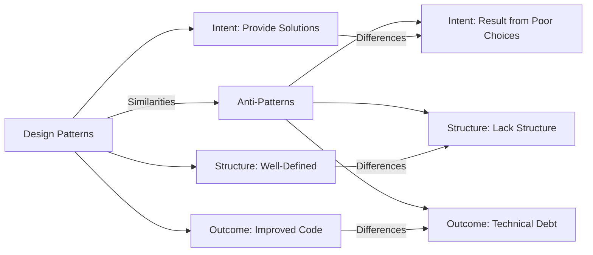

## 2.3. Design Patterns vs. Anti-Patterns

In the realm of software development, understanding the distinction between design patterns and anti-patterns is crucial for creating robust, maintainable, and efficient systems. While design patterns provide tried-and-tested solutions to common problems, anti-patterns represent poor practices that can lead to suboptimal solutions. In this section, we will delve into the world of design patterns and anti-patterns, exploring how to recognize, avoid, and transform anti-patterns into beneficial patterns.

### Recognizing and Avoiding Anti-Patterns

#### What Are Anti-Patterns?

Anti-patterns are common responses to recurring problems that are ineffective and counterproductive. Unlike design patterns, which offer a structured approach to solving problems, anti-patterns often arise from a lack of understanding, poor design choices, or misapplication of design principles. Recognizing these anti-patterns is the first step toward avoiding them and improving the quality of your software.

#### Common Anti-Patterns

1. **Spaghetti Code**

   - **Description:** Code that lacks structure, making it difficult to understand and maintain.
   - **Symptoms:** High complexity, tangled control structures, and lack of modularity.
   - **Solution:** Refactor the code to improve modularity and readability. Use design patterns like the **Facade** or **Decorator** to organize and simplify code.

2. **The God Object**

   - **Description:** A class that knows too much or does too much, violating the Single Responsibility Principle.
   - **Symptoms:** Overloaded classes with too many responsibilities.
   - **Solution:** Break down the God Object into smaller, more focused classes. Apply the **Single Responsibility Principle** and use patterns like **Strategy** or **Observer** to distribute responsibilities.

3. **Lava Flow**

   - **Description:** Dead code that remains in the system due to fear of removing it.
   - **Symptoms:** Unused code, outdated comments, and confusing logic.
   - **Solution:** Conduct regular code reviews and refactoring sessions to remove dead code and improve clarity.

4. **Golden Hammer**

   - **Description:** Over-reliance on a familiar technology or pattern, regardless of its suitability.
   - **Symptoms:** Use of the same solution for different problems, leading to inefficiencies.
   - **Solution:** Evaluate each problem individually and choose the most appropriate design pattern or technology.

5. **Boat Anchor**

   - **Description:** Retaining unnecessary code or components in the system.
   - **Symptoms:** Unused libraries, components, or code blocks.
   - **Solution:** Regularly audit and clean up the codebase to remove unused elements.

6. **Dead End Patterns**

   - **Description:** Patterns that lead to a situation where further development is difficult or impossible.
   - **Symptoms:** Lack of extensibility, rigid architecture, and high coupling.
   - **Solution:** Use design patterns like **Adapter** or **Bridge** to introduce flexibility and extensibility.

### Turning Anti-Patterns into Patterns

#### Transforming Anti-Patterns

Recognizing anti-patterns is only the first step; the real challenge lies in transforming them into effective design patterns. This involves understanding the root cause of the anti-pattern and applying the appropriate design principles and patterns to address it.

1. **From Spaghetti Code to Modular Design**

   - **Approach:** Break down complex code into smaller, manageable modules. Use the **Facade Pattern** to provide a simplified interface to a complex subsystem.
   
   ```pseudocode
   // Pseudocode for Facade Pattern
   class Facade {
       private subsystem1: Subsystem1
       private subsystem2: Subsystem2

       function operation() {
           subsystem1.operation1()
           subsystem2.operation2()
       }
   }
   ```

   - **Diagram: Visualizing the Facade Pattern**

   ```mermaid
   classDiagram
       class Facade {
           +operation()
       }
       class Subsystem1 {
           +operation1()
       }
       class Subsystem2 {
           +operation2()
       }
       Facade --> Subsystem1
       Facade --> Subsystem2
   ```

   - **Key Participants:**
     - **Facade:** Provides a unified interface to a set of interfaces in a subsystem.
     - **Subsystems:** The classes that implement the subsystem functionality.

2. **From God Object to Single Responsibility**

   - **Approach:** Decompose the God Object into smaller classes, each with a single responsibility. Use the **Strategy Pattern** to encapsulate algorithms within classes.
   
   ```pseudocode
   // Pseudocode for Strategy Pattern
   class Context {
       private strategy: Strategy

       function setStrategy(strategy: Strategy) {
           this.strategy = strategy
       }

       function executeStrategy() {
           strategy.execute()
       }
   }

   interface Strategy {
       function execute()
   }

   class ConcreteStrategyA implements Strategy {
       function execute() {
           // Implementation of algorithm A
       }
   }

   class ConcreteStrategyB implements Strategy {
       function execute() {
           // Implementation of algorithm B
       }
   }
   ```

   - **Diagram: Visualizing the Strategy Pattern**

   ```mermaid
   classDiagram
       class Context {
           +setStrategy(strategy: Strategy)
           +executeStrategy()
       }
       class Strategy {
           <<interface>>
           +execute()
       }
       class ConcreteStrategyA {
           +execute()
       }
       class ConcreteStrategyB {
           +execute()
       }
       Context --> Strategy
       Strategy <|-- ConcreteStrategyA
       Strategy <|-- ConcreteStrategyB
   ```

   - **Key Participants:**
     - **Context:** Maintains a reference to a Strategy object.
     - **Strategy:** Declares an interface common to all supported algorithms.
     - **ConcreteStrategy:** Implements the algorithm using the Strategy interface.

3. **From Lava Flow to Clean Code**

   - **Approach:** Regularly refactor and clean up the codebase. Use the **Observer Pattern** to manage dependencies and improve code clarity.
   
   ```pseudocode
   // Pseudocode for Observer Pattern
   class Subject {
       private observers: List<Observer>

       function attach(observer: Observer) {
           observers.add(observer)
       }

       function notify() {
           for each observer in observers {
               observer.update()
           }
       }
   }

   interface Observer {
       function update()
   }

   class ConcreteObserver implements Observer {
       function update() {
           // React to subject's state change
       }
   }
   ```

   - **Diagram: Visualizing the Observer Pattern**

   ```mermaid
   classDiagram
       class Subject {
           +attach(observer: Observer)
           +notify()
       }
       class Observer {
           <<interface>>
           +update()
       }
       class ConcreteObserver {
           +update()
       }
       Subject --> Observer
       Observer <|-- ConcreteObserver
   ```

   - **Key Participants:**
     - **Subject:** Knows its observers and provides an interface for attaching and detaching them.
     - **Observer:** Defines an updating interface for objects that should be notified of changes in a subject.
     - **ConcreteObserver:** Implements the Observer interface to keep its state consistent with the subject's.

### Differences and Similarities

#### Design Patterns vs. Anti-Patterns

Understanding the differences and similarities between design patterns and anti-patterns is essential for applying them effectively.

- **Design Patterns:**
  - **Intent:** Provide proven solutions to common design problems.
  - **Structure:** Well-defined with clear roles and responsibilities.
  - **Outcome:** Improve code maintainability, flexibility, and scalability.

- **Anti-Patterns:**
  - **Intent:** Result from poor design choices or misapplication of principles.
  - **Structure:** Often lack structure, leading to code that is difficult to maintain.
  - **Outcome:** Lead to technical debt, reduced performance, and increased complexity.

#### Similarities

Despite their differences, design patterns and anti-patterns share some commonalities:

- **Repetition:** Both arise from recurring problems in software development.
- **Learning Opportunities:** Both offer valuable lessons for improving software design.
- **Evolution:** Anti-patterns can evolve into design patterns through refactoring and application of design principles.

### Practical Applications

#### Real-World Scenarios

Let's explore some real-world scenarios where design patterns and anti-patterns play a crucial role:

1. **Scenario: Building a Notification System**

   - **Anti-Pattern:** Using a monolithic class to handle all types of notifications, leading to a God Object.
   - **Solution:** Apply the **Observer Pattern** to decouple the notification logic and allow for easy addition of new notification types.

2. **Scenario: Implementing a Payment Gateway**

   - **Anti-Pattern:** Hardcoding payment methods, resulting in a Golden Hammer.
   - **Solution:** Use the **Strategy Pattern** to encapsulate payment algorithms and allow for easy addition of new payment methods.

3. **Scenario: Managing User Sessions**

   - **Anti-Pattern:** Storing session data in a single, large object, leading to Spaghetti Code.
   - **Solution:** Apply the **Facade Pattern** to provide a simplified interface for session management.

### Try It Yourself

Encourage experimentation by suggesting modifications to the code examples provided. For instance, try implementing a new strategy in the Strategy Pattern example or adding a new observer in the Observer Pattern example. This hands-on approach will reinforce the concepts and enhance your understanding.

### Visualizing Design Patterns and Anti-Patterns

#### Diagram: Comparing Design Patterns and Anti-Patterns



### Knowledge Check

Pose questions or small challenges within the text to engage readers. For example, ask readers to identify anti-patterns in a given code snippet or suggest design patterns that could improve the code.

### Summary

In this section, we've explored the crucial differences between design patterns and anti-patterns, learning how to recognize, avoid, and transform anti-patterns into effective design patterns. By understanding these concepts, you can enhance the quality of your software and become a more proficient developer.

### Embrace the Journey

Remember, mastering design patterns and avoiding anti-patterns is a continuous journey. As you progress, you'll build more complex and efficient systems. Keep experimenting, stay curious, and enjoy the journey!

## Quiz Time!



### What is the primary intent of design patterns?

- [x] Provide proven solutions to common design problems.
- [ ] Result from poor design choices.
- [ ] Lead to technical debt.
- [ ] Lack structure.

> **Explanation:** Design patterns are intended to provide proven solutions to common design problems, improving code maintainability and flexibility.

### Which anti-pattern is characterized by a lack of structure and tangled control structures?

- [x] Spaghetti Code
- [ ] The God Object
- [ ] Lava Flow
- [ ] Golden Hammer

> **Explanation:** Spaghetti Code is characterized by a lack of structure and tangled control structures, making it difficult to understand and maintain.

### How can the God Object anti-pattern be transformed into a design pattern?

- [x] By decomposing it into smaller classes with single responsibilities.
- [ ] By adding more responsibilities to the class.
- [ ] By using the same solution for different problems.
- [ ] By retaining unnecessary code.

> **Explanation:** The God Object can be transformed by decomposing it into smaller classes with single responsibilities, following the Single Responsibility Principle.

### What is the outcome of applying anti-patterns in software design?

- [ ] Improved code maintainability.
- [x] Technical debt and increased complexity.
- [ ] Enhanced flexibility.
- [ ] Better scalability.

> **Explanation:** Anti-patterns lead to technical debt, reduced performance, and increased complexity in software design.

### Which design pattern can be used to provide a simplified interface to a complex subsystem?

- [x] Facade Pattern
- [ ] Strategy Pattern
- [ ] Observer Pattern
- [ ] Adapter Pattern

> **Explanation:** The Facade Pattern provides a simplified interface to a complex subsystem, improving code organization and readability.

### How can the Golden Hammer anti-pattern be avoided?

- [x] By evaluating each problem individually and choosing the most appropriate solution.
- [ ] By using the same solution for all problems.
- [ ] By retaining unnecessary code.
- [ ] By overloading classes with responsibilities.

> **Explanation:** The Golden Hammer can be avoided by evaluating each problem individually and choosing the most appropriate solution or design pattern.

### What is a common symptom of the Lava Flow anti-pattern?

- [ ] Overloaded classes with too many responsibilities.
- [x] Unused code and outdated comments.
- [ ] High complexity and tangled control structures.
- [ ] Over-reliance on a familiar technology.

> **Explanation:** Lava Flow is characterized by unused code, outdated comments, and confusing logic, often due to fear of removing dead code.

### Which design pattern encapsulates algorithms within classes?

- [ ] Facade Pattern
- [x] Strategy Pattern
- [ ] Observer Pattern
- [ ] Adapter Pattern

> **Explanation:** The Strategy Pattern encapsulates algorithms within classes, allowing for easy swapping of different strategies.

### True or False: Anti-patterns can evolve into design patterns through refactoring.

- [x] True
- [ ] False

> **Explanation:** Anti-patterns can evolve into design patterns through refactoring and the application of design principles, improving code quality.

### Which design pattern is suitable for managing dependencies and improving code clarity?

- [ ] Facade Pattern
- [ ] Strategy Pattern
- [x] Observer Pattern
- [ ] Adapter Pattern

> **Explanation:** The Observer Pattern is suitable for managing dependencies and improving code clarity by decoupling the notification logic.


