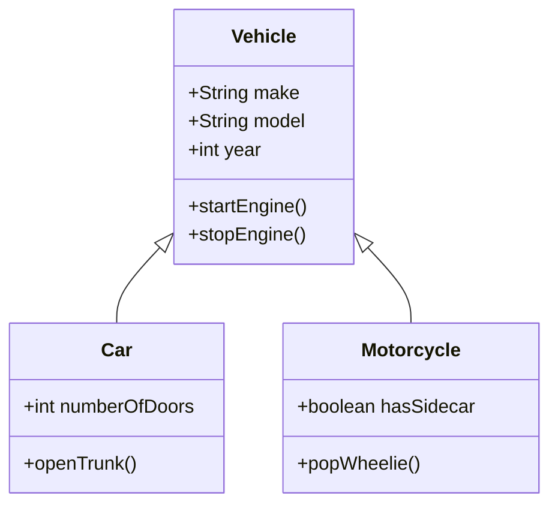
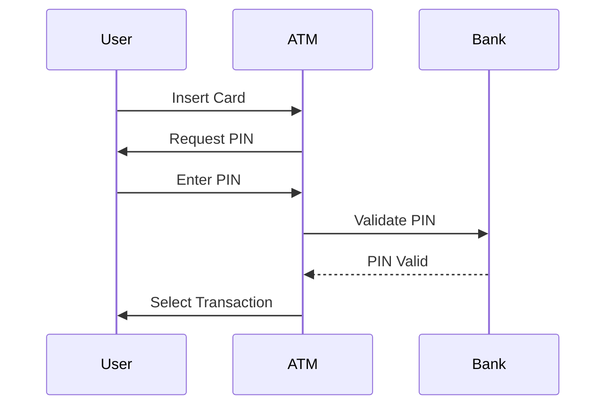
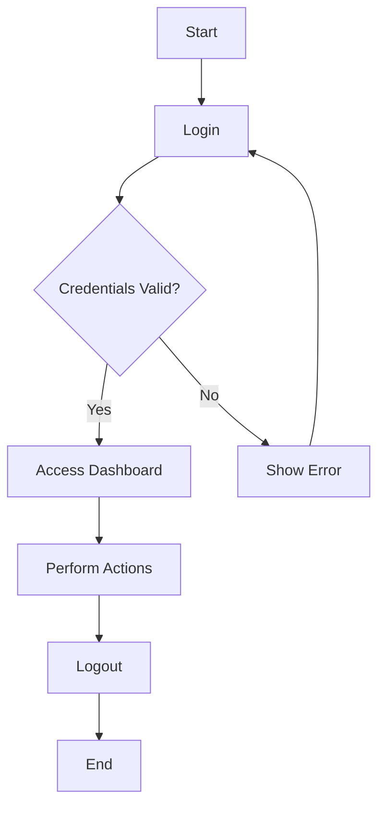
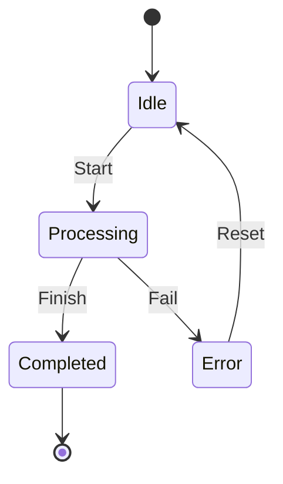

## 2.4. UML Diagrams and Notations

Unified Modeling Language (UML) is a standardized modeling language that provides a suite of diagrams to visualize the design of a system. UML diagrams are essential tools for software engineers and architects, offering a way to represent complex systems in a clear and structured manner. In this section, we will delve into four primary types of UML diagrams: Class Diagrams, Sequence Diagrams, Activity Diagrams, and State Diagrams. Each diagram type serves a unique purpose and provides different insights into the system's architecture and behavior.

### Introduction to UML

UML is a powerful tool that helps developers and architects visualize, specify, construct, and document the artifacts of a software system. It is widely used across various programming paradigms, including Object-Oriented Programming (OOP) and Functional Programming (FP). UML diagrams facilitate communication among team members and stakeholders, ensuring a shared understanding of the system's design.

### Class Diagrams

Class diagrams are the backbone of UML, representing the static structure of a system. They depict the system's classes, their attributes, methods, and the relationships between them. Class diagrams are instrumental in object-oriented design, providing a blueprint for the system's architecture.

#### Key Components of Class Diagrams

1. **Classes**: Represented as rectangles divided into three compartments: the top for the class name, the middle for attributes, and the bottom for methods.

2. **Attributes**: Variables that hold data specific to a class. They are listed in the middle compartment of the class rectangle.

3. **Methods**: Functions or operations that a class can perform, listed in the bottom compartment.

4. **Relationships**: Lines connecting classes, indicating associations, dependencies, generalizations, and realizations.

5. **Visibility**: Symbols preceding attributes and methods to denote access levels: `+` (public), `-` (private), `#` (protected), and `~` (package).

#### Example of a Class Diagram

In this example, `Vehicle` is a superclass with attributes `make`, `model`, and `year`, and methods `startEngine()` and `stopEngine()`. `Car` and `Motorcycle` are subclasses inheriting from `Vehicle`, each with additional attributes and methods.

#### Design Considerations

- **Encapsulation**: Ensure that attributes are private and accessed via public methods to maintain encapsulation.
- **Inheritance**: Use inheritance to promote code reuse and establish a hierarchy.
- **Associations**: Clearly define relationships between classes to avoid ambiguity.

### Sequence Diagrams

Sequence diagrams capture the dynamic behavior of a system by showing how objects interact over time. They are particularly useful for detailing the logic of complex operations and understanding the sequence of method calls.

#### Key Components of Sequence Diagrams

1. **Lifelines**: Represent objects or actors involved in the interaction, depicted as vertical dashed lines.

2. **Activation Bars**: Indicate periods during which an object is active or controlling the flow of the interaction.

3. **Messages**: Horizontal arrows between lifelines representing communication between objects.

4. **Loops and Conditions**: Denote repetitive or conditional interactions using frames.

#### Example of a Sequence Diagram

In this example, the sequence diagram illustrates the interaction between a `User`, an `ATM`, and a `Bank` during a typical ATM transaction. The arrows indicate the flow of messages, while the activation bars show the active periods of each participant.

#### Design Considerations

- **Clarity**: Ensure that the sequence of messages is clear and logical.
- **Simplicity**: Avoid overcrowding the diagram with too many details; focus on key interactions.
- **Consistency**: Maintain consistency with other diagrams to ensure a cohesive design.

### Activity Diagrams

Activity diagrams represent the flow of control or data within a system, similar to flowcharts. They are useful for modeling the logic of complex operations, workflows, and business processes.

#### Key Components of Activity Diagrams

1. **Activities**: Rounded rectangles representing tasks or actions within the workflow.

2. **Transitions**: Arrows indicating the flow from one activity to another.

3. **Decision Nodes**: Diamonds representing branching points with multiple possible paths.

4. **Swimlanes**: Vertical or horizontal partitions that organize activities by the responsible actor or component.

#### Example of an Activity Diagram

This activity diagram models a simple login process. It begins with a `Start` node, followed by a `Login` activity. A decision node checks if the credentials are valid, leading to either accessing the dashboard or showing an error.

#### Design Considerations

- **Flow**: Ensure that the flow of activities is logical and easy to follow.
- **Decisions**: Clearly define decision nodes and possible outcomes.
- **Responsibility**: Use swimlanes to assign responsibilities and clarify roles.

### State Diagrams

State diagrams depict the states of an object and the transitions between those states. They are particularly useful for modeling the lifecycle of an object or system component.

#### Key Components of State Diagrams

1. **States**: Rounded rectangles representing the various states an object can be in.

2. **Transitions**: Arrows indicating the movement from one state to another, often triggered by events.

3. **Initial State**: A filled circle representing the starting point of the state machine.

4. **Final State**: A circle with a dot inside, indicating the end of the state machine.

#### Example of a State Diagram

In this state diagram, an object begins in an `Idle` state, transitions to `Processing` upon receiving a `Start` event, and can either complete successfully or encounter an error. The `Error` state allows for a reset back to `Idle`.

#### Design Considerations

- **Completeness**: Ensure all possible states and transitions are represented.
- **Clarity**: Use clear labels for states and transitions to avoid confusion.
- **Consistency**: Align state diagrams with other UML diagrams to maintain a coherent design.

### Try It Yourself

To deepen your understanding of UML diagrams, try modifying the examples provided:

- **Class Diagram**: Add a new subclass to the `Vehicle` class, such as `Truck`, and define its unique attributes and methods.
- **Sequence Diagram**: Extend the ATM transaction sequence to include a withdrawal operation.
- **Activity Diagram**: Add error handling to the login process, such as locking the account after multiple failed attempts.
- **State Diagram**: Introduce a new state, such as `Paused`, to the processing lifecycle.

### Visualizing UML Diagrams

UML diagrams are powerful tools for visualizing complex systems. By using Mermaid.js, we can create clear and concise diagrams that enhance our understanding of software design patterns. Each diagram type offers unique insights into the system's structure and behavior, making them invaluable for expert developers.

### References and Links

For further reading on UML diagrams and notations, consider exploring the following resources:

- [UML Diagrams - A Comprehensive Guide](https://www.uml-diagrams.org/)
- [Unified Modeling Language (UML) Resource Page](https://www.uml.org/)
- [Mermaid.js Documentation](https://mermaid-js.github.io/mermaid/#/)

### Knowledge Check

1. **What is the primary purpose of a class diagram?**
   - To represent the static structure of a system, including classes, attributes, methods, and relationships.

2. **How do sequence diagrams differ from activity diagrams?**
   - Sequence diagrams focus on the dynamic interaction between objects over time, while activity diagrams model the flow of control or data within a system.

3. **What is a key design consideration for state diagrams?**
   - Ensure all possible states and transitions are represented to capture the complete lifecycle of an object.

### Embrace the Journey

Remember, mastering UML diagrams is a journey. As you progress, you'll gain deeper insights into software design patterns and enhance your ability to communicate complex ideas. Keep experimenting, stay curious, and enjoy the process!

## Quiz Time!



### What is the primary purpose of a class diagram?

- [x] To represent the static structure of a system, including classes, attributes, methods, and relationships.
- [ ] To model the flow of control or data within a system.
- [ ] To capture the dynamic interaction between objects over time.
- [ ] To depict the states of an object and the transitions between those states.

> **Explanation:** Class diagrams provide a blueprint for the system's architecture by representing its static structure.

### How do sequence diagrams differ from activity diagrams?

- [x] Sequence diagrams focus on the dynamic interaction between objects over time.
- [ ] Sequence diagrams model the flow of control or data within a system.
- [ ] Activity diagrams capture the dynamic interaction between objects over time.
- [ ] Activity diagrams depict the states of an object and the transitions between those states.

> **Explanation:** Sequence diagrams illustrate the sequence of method calls and interactions, while activity diagrams focus on workflows and processes.

### What is a key design consideration for state diagrams?

- [x] Ensure all possible states and transitions are represented.
- [ ] Avoid overcrowding with too many details.
- [ ] Clearly define decision nodes and possible outcomes.
- [ ] Use swimlanes to assign responsibilities.

> **Explanation:** State diagrams should capture the complete lifecycle of an object by representing all possible states and transitions.

### Which UML diagram is particularly useful for modeling the logic of complex operations?

- [ ] Class Diagram
- [ ] Sequence Diagram
- [x] Activity Diagram
- [ ] State Diagram

> **Explanation:** Activity diagrams are similar to flowcharts and are used to model the logic of complex operations and workflows.

### What symbol denotes a public attribute or method in a class diagram?

- [x] +
- [ ] -
- [ ] #
- [ ] ~

> **Explanation:** The `+` symbol denotes public visibility for attributes and methods in a class diagram.

### In a sequence diagram, what do activation bars indicate?

- [x] Periods during which an object is active or controlling the flow of interaction.
- [ ] The starting point of the interaction.
- [ ] The end of the interaction.
- [ ] The flow of messages between objects.

> **Explanation:** Activation bars show when an object is active or controlling the flow of interaction in a sequence diagram.

### What is the purpose of swimlanes in an activity diagram?

- [x] To organize activities by the responsible actor or component.
- [ ] To represent the flow of control or data.
- [ ] To indicate periods during which an object is active.
- [ ] To depict the states of an object.

> **Explanation:** Swimlanes help organize activities by assigning responsibilities to actors or components in an activity diagram.

### Which UML diagram type is most useful for understanding the sequence of method calls?

- [ ] Class Diagram
- [x] Sequence Diagram
- [ ] Activity Diagram
- [ ] State Diagram

> **Explanation:** Sequence diagrams are designed to show the sequence of method calls and interactions between objects.

### What does a filled circle represent in a state diagram?

- [x] Initial State
- [ ] Final State
- [ ] Transition
- [ ] State

> **Explanation:** A filled circle represents the initial state of an object in a state diagram.

### True or False: UML diagrams are only useful for Object-Oriented Programming.

- [ ] True
- [x] False

> **Explanation:** UML diagrams are versatile and can be used across various programming paradigms, including Functional Programming.



