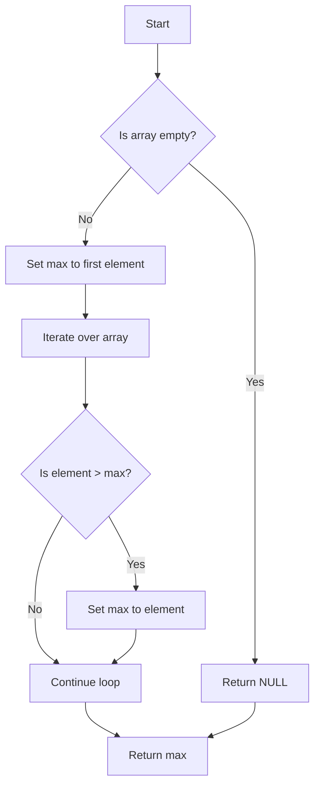

## 2.5. Pseudocode Conventions

Pseudocode serves as a bridge between human thought processes and computer programming languages. It allows us to articulate complex algorithms and design patterns in a way that is both understandable and implementable across various programming paradigms. In this section, we will delve into the conventions of pseudocode, focusing on syntax, style, variables, data types, and control structures. By mastering these conventions, you will be equipped to communicate your design ideas effectively, regardless of the programming language or paradigm you are working with.

### Syntax and Style Guide

Pseudocode is not bound by the syntax rules of any specific programming language, which gives it the flexibility to express algorithms in a clear and concise manner. However, to ensure consistency and readability, it is essential to adhere to certain syntax and style guidelines.

#### 1. **Clarity and Simplicity**

- **Use Plain Language:** Write pseudocode in plain English, using simple and clear language that is easy to understand. Avoid jargon and complex terminology unless necessary.
- **Be Concise:** Keep your pseudocode concise while ensuring it fully describes the algorithm or pattern. Avoid unnecessary details that do not contribute to understanding the logic.

#### 2. **Structure and Organization**

- **Indentation:** Use consistent indentation to indicate blocks of code, such as loops and conditionals. This helps to visually separate different sections and enhances readability.
- **Line Breaks:** Use line breaks to separate logical sections or steps within the pseudocode. This makes it easier to follow the flow of the algorithm.

#### 3. **Comments and Annotations**

- **Use Comments Sparingly:** Include comments to explain non-obvious parts of the pseudocode or to provide additional context. However, avoid over-commenting, as this can clutter the pseudocode.
- **Annotations for Clarity:** Use annotations to highlight important steps or decisions within the pseudocode. This can be particularly useful in complex algorithms.

### Variables and Data Types

In pseudocode, variables and data types are used to represent data and its manipulation. While pseudocode is not bound by strict data type definitions, it is important to convey the intent and nature of the data being used.

#### 1. **Variable Naming**

- **Descriptive Names:** Use descriptive names for variables that clearly indicate their purpose or the data they hold. This aids in understanding the pseudocode without needing additional explanations.
- **Consistency:** Maintain consistency in variable naming conventions throughout the pseudocode. This helps to avoid confusion and ensures that the pseudocode is easy to follow.

#### 2. **Data Types**

- **Implicit Understanding:** While pseudocode does not require explicit data type declarations, it is important to convey the type of data being manipulated. Use context and naming to imply data types.
- **Common Data Types:** Common data types in pseudocode include integers, floats, strings, booleans, arrays, and objects. Use these types to represent data appropriately.

#### 3. **Variable Scope**

- **Scope Indication:** Clearly indicate the scope of variables, especially in complex pseudocode with multiple blocks or functions. This helps to avoid confusion about where variables can be accessed or modified.

### Control Structures and Flow

Control structures are fundamental to expressing logic and flow in pseudocode. They allow us to define the sequence of operations and decision-making processes within an algorithm.

#### 1. **Conditional Statements**

- **If-Else Statements:** Use `IF`, `ELSE IF`, and `ELSE` statements to express conditional logic. Ensure that conditions are clear and logically structured.
- **Nested Conditionals:** Use indentation and line breaks to clearly indicate nested conditionals. This helps to maintain readability and understanding.

#### 2. **Loops and Iteration**

- **For Loops:** Use `FOR` loops to iterate over a known range or collection. Clearly indicate the loop variable and the range or collection being iterated over.
- **While Loops:** Use `WHILE` loops for indefinite iteration, where the number of iterations is not known beforehand. Clearly state the loop condition.

#### 3. **Flow Control**

- **Break and Continue:** Use `BREAK` and `CONTINUE` statements to control the flow within loops. Clearly indicate the purpose of these statements to avoid confusion.
- **Return Statements:** Use `RETURN` statements to indicate the end of a function or to return a value. Clearly state what is being returned and why.

### Sample Code Snippets

To illustrate these conventions, let's look at some sample pseudocode snippets that demonstrate the use of variables, data types, and control structures.

#### Example 1: Calculating the Sum of an Array

```pseudocode
// Function to calculate the sum of an array
FUNCTION CalculateSum(array)
    SET sum TO 0
    FOR EACH element IN array
        sum = sum + element
    END FOR
    RETURN sum
END FUNCTION
```

In this example, we use descriptive variable names (`sum`, `element`, `array`) and a `FOR EACH` loop to iterate over the array. The pseudocode is structured with indentation and comments to enhance readability.

#### Example 2: Finding the Maximum Value

```pseudocode
// Function to find the maximum value in an array
FUNCTION FindMaxValue(array)
    IF array IS EMPTY
        RETURN NULL
    END IF

    SET max TO array[0]
    FOR EACH element IN array
        IF element > max
            max = element
        END IF
    END FOR
    RETURN max
END FUNCTION
```

This example demonstrates the use of an `IF` statement to handle edge cases (empty array) and a `FOR EACH` loop to iterate over the array. The pseudocode is clear and concise, with comments to explain the logic.

### Visualizing Pseudocode Concepts

To further enhance understanding, let's visualize some of these concepts using diagrams. These visual aids can help clarify the flow and structure of pseudocode.

#### Visualizing Control Structures



**Diagram Description:** This flowchart visualizes the control structure of the `FindMaxValue` function, showing the decision-making process and flow of operations.

### Try It Yourself

To reinforce your understanding, try modifying the sample pseudocode examples. For instance, you could:

- Change the `CalculateSum` function to calculate the average of the array instead.
- Modify the `FindMaxValue` function to return both the maximum value and its index in the array.

### References and Links

For further reading on pseudocode conventions and design patterns, consider the following resources:

- [MDN Web Docs: Algorithms and Data Structures](https://developer.mozilla.org/en-US/docs/Web/JavaScript/Guide/Algorithms_and_Data_Structures)
- [W3Schools: Pseudocode](https://www.w3schools.com/)

### Knowledge Check

Let's test your understanding of pseudocode conventions with some questions and exercises.

1. What are the key benefits of using pseudocode in software design?
2. How can you ensure clarity and simplicity in your pseudocode?
3. Why is it important to use descriptive variable names in pseudocode?
4. How do control structures like loops and conditionals enhance the expressiveness of pseudocode?

### Embrace the Journey

Remember, mastering pseudocode conventions is just the beginning. As you continue to explore design patterns and programming paradigms, you'll find that pseudocode is an invaluable tool for articulating complex ideas and solutions. Keep experimenting, stay curious, and enjoy the journey!

## Quiz Time!



### What is the primary purpose of pseudocode?

- [x] To express algorithms in a language-agnostic manner
- [ ] To execute code across different programming languages
- [ ] To replace programming languages entirely
- [ ] To compile code into machine language

> **Explanation:** Pseudocode is used to express algorithms in a clear, language-agnostic manner, making it easier to understand and implement across different programming paradigms.

### Which of the following is a key feature of pseudocode?

- [x] It uses plain language and is not bound by strict syntax rules
- [ ] It requires strict data type declarations
- [ ] It must be written in a specific programming language
- [ ] It is used to directly execute algorithms

> **Explanation:** Pseudocode uses plain language and is not bound by strict syntax rules, allowing for flexibility in expressing algorithms.

### How should variables be named in pseudocode?

- [x] Descriptively, to indicate their purpose
- [ ] Randomly, to save time
- [ ] With single letters, to keep it short
- [ ] Using numbers, to differentiate them

> **Explanation:** Variables should be named descriptively in pseudocode to clearly indicate their purpose and enhance understanding.

### What is the role of indentation in pseudocode?

- [x] To visually separate different sections and enhance readability
- [ ] To execute code in the correct order
- [ ] To indicate data types
- [ ] To replace comments

> **Explanation:** Indentation is used in pseudocode to visually separate different sections, such as loops and conditionals, enhancing readability.

### Which control structure is used for indefinite iteration in pseudocode?

- [x] WHILE loop
- [ ] FOR loop
- [ ] IF statement
- [ ] SWITCH statement

> **Explanation:** A WHILE loop is used for indefinite iteration in pseudocode, where the number of iterations is not known beforehand.

### What is the benefit of using comments in pseudocode?

- [x] To explain non-obvious parts and provide additional context
- [ ] To replace variable names
- [ ] To execute code
- [ ] To define data types

> **Explanation:** Comments in pseudocode are used to explain non-obvious parts and provide additional context, helping to clarify the logic.

### How can you indicate the scope of variables in pseudocode?

- [x] By clearly stating where they can be accessed or modified
- [ ] By using different colors
- [ ] By numbering them
- [ ] By writing them in capital letters

> **Explanation:** Indicating the scope of variables in pseudocode involves clearly stating where they can be accessed or modified, especially in complex pseudocode.

### What should be done if an array is empty in the `FindMaxValue` function?

- [x] Return NULL
- [ ] Return 0
- [ ] Print an error message
- [ ] Continue the loop

> **Explanation:** If an array is empty in the `FindMaxValue` function, the pseudocode should return NULL to handle the edge case.

### Which statement is used to return a value in pseudocode?

- [x] RETURN
- [ ] PRINT
- [ ] OUTPUT
- [ ] DISPLAY

> **Explanation:** The RETURN statement is used in pseudocode to indicate the end of a function or to return a value.

### True or False: Pseudocode can be directly executed by a computer.

- [ ] True
- [x] False

> **Explanation:** Pseudocode cannot be directly executed by a computer; it is a tool for expressing algorithms in a human-readable format.


