## 20.2. Design Pattern Reference Guide

Welcome to the Design Pattern Reference Guide, a comprehensive resource designed to provide expert developers with a concise overview of key design patterns. This guide includes the intent, applicability, and primary features of each pattern, along with visual diagrams and pseudocode examples. Let's delve into the world of design patterns and explore how they can enhance your software development practices.

### Singleton Pattern

- **Category**: Creational
- **Intent**: Ensure a class has only one instance and provide a global point of access to it.
- **Structure Diagram**:

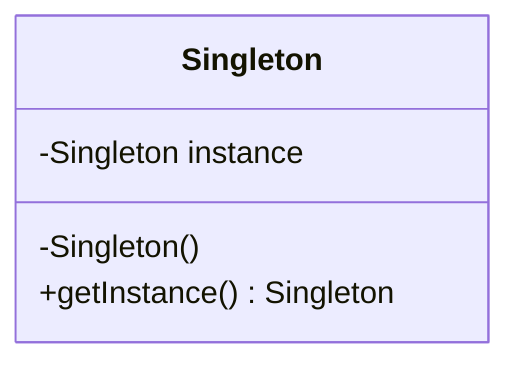

- **Key Participants**:
  - **Singleton**: Declares a static method for accessing the unique instance.

- **Applicability**:
  - Use when a single instance of a class is needed to coordinate actions across the system.
  
- **Design Considerations**:
  - Ensure thread safety in multithreaded environments.
  - Be cautious of global state issues.

- **Differences and Similarities**:
  - Similar to global variables but provides controlled access.

### Factory Method Pattern

- **Category**: Creational
- **Intent**: Define an interface for creating an object, but let subclasses alter the type of objects that will be created.
- **Structure Diagram**:

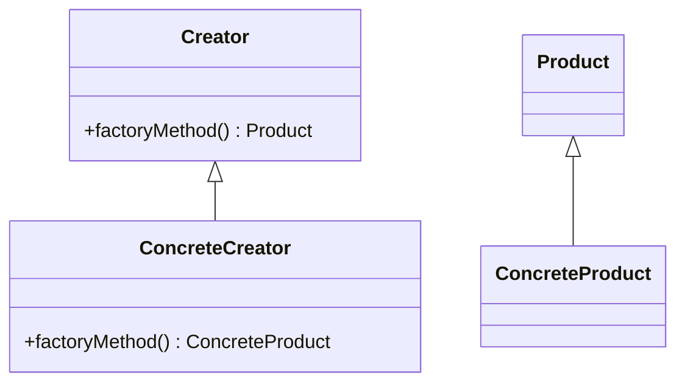

- **Key Participants**:
  - **Creator**: Declares the factory method.
  - **ConcreteCreator**: Overrides the factory method to return an instance of a ConcreteProduct.
  - **Product**: Defines the interface of objects the factory method creates.
  - **ConcreteProduct**: Implements the Product interface.

- **Applicability**:
  - Use when a class cannot anticipate the class of objects it must create.
  
- **Design Considerations**:
  - Promotes loose coupling by eliminating the need to bind application-specific classes into the code.
  
- **Differences and Similarities**:
  - Often confused with Abstract Factory, but Factory Method uses inheritance while Abstract Factory uses composition.

### Abstract Factory Pattern

- **Category**: Creational
- **Intent**: Provide an interface for creating families of related or dependent objects without specifying their concrete classes.
- **Structure Diagram**:

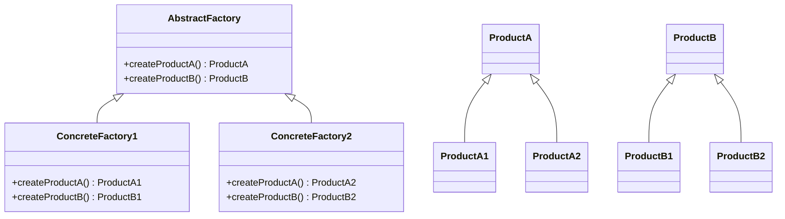

- **Key Participants**:
  - **AbstractFactory**: Declares an interface for operations that create abstract product objects.
  - **ConcreteFactory**: Implements the operations to create concrete product objects.
  - **Product**: Defines a product object to be created by the corresponding factory method.

- **Applicability**:
  - Use when the system should be independent of how its products are created, composed, and represented.
  
- **Design Considerations**:
  - Adds a level of indirection that can make a system more configurable and extensible.
  
- **Differences and Similarities**:
  - Similar to Factory Method but focuses on creating families of objects.

### Builder Pattern

- **Category**: Creational
- **Intent**: Separate the construction of a complex object from its representation, allowing the same construction process to create different representations.
- **Structure Diagram**:

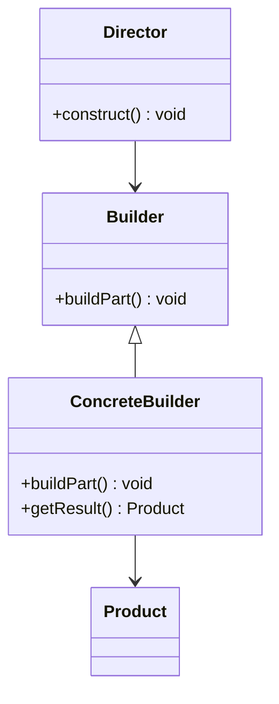

- **Key Participants**:
  - **Builder**: Specifies an abstract interface for creating parts of a Product object.
  - **ConcreteBuilder**: Constructs and assembles parts of the product by implementing the Builder interface.
  - **Director**: Constructs an object using the Builder interface.
  - **Product**: Represents the complex object under construction.

- **Applicability**:
  - Use when the algorithm for creating a complex object should be independent of the parts that make up the object and how they are assembled.
  
- **Design Considerations**:
  - Facilitates the creation of complex objects by providing a step-by-step approach.
  
- **Differences and Similarities**:
  - Often confused with Factory Method; however, Builder focuses on constructing a complex object step by step.

### Prototype Pattern

- **Category**: Creational
- **Intent**: Specify the kinds of objects to create using a prototypical instance, and create new objects by copying this prototype.
- **Structure Diagram**:

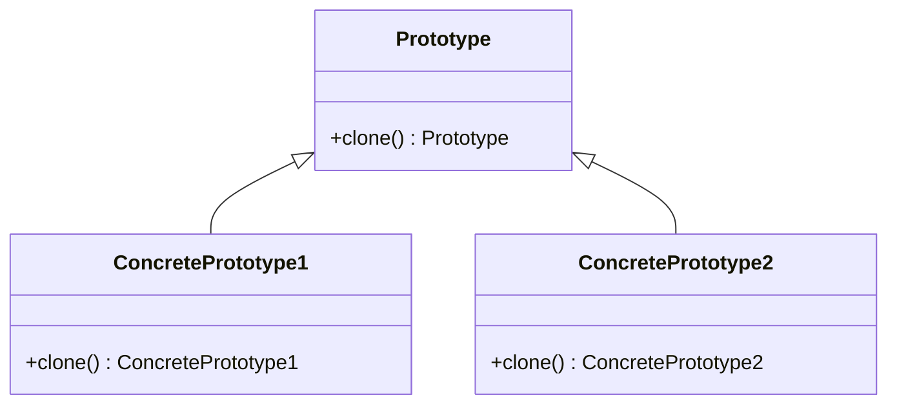

- **Key Participants**:
  - **Prototype**: Declares an interface for cloning itself.
  - **ConcretePrototype**: Implements the operation for cloning itself.

- **Applicability**:
  - Use when a system should be independent of how its products are created, composed, and represented.
  
- **Design Considerations**:
  - Reduces the need for subclasses to create objects.
  
- **Differences and Similarities**:
  - Similar to Factory Method but uses cloning rather than instantiation.

### Adapter Pattern

- **Category**: Structural
- **Intent**: Convert the interface of a class into another interface clients expect. Adapter lets classes work together that couldn't otherwise because of incompatible interfaces.
- **Structure Diagram**:

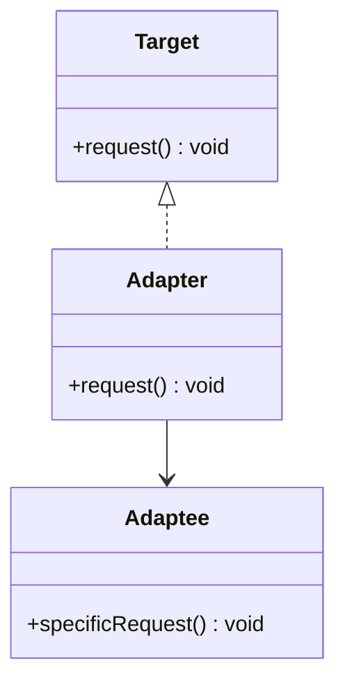

- **Key Participants**:
  - **Target**: Defines the domain-specific interface that Client uses.
  - **Adapter**: Adapts the interface of Adaptee to the Target interface.
  - **Adaptee**: Defines an existing interface that needs adapting.

- **Applicability**:
  - Use when you want to use an existing class, and its interface does not match the one you need.
  
- **Design Considerations**:
  - Can be implemented as a class or an object adapter.
  
- **Differences and Similarities**:
  - Often confused with Bridge; however, Adapter changes the interface of an existing object, while Bridge separates an abstraction from its implementation.

### Bridge Pattern

- **Category**: Structural
- **Intent**: Decouple an abstraction from its implementation so that the two can vary independently.
- **Structure Diagram**:

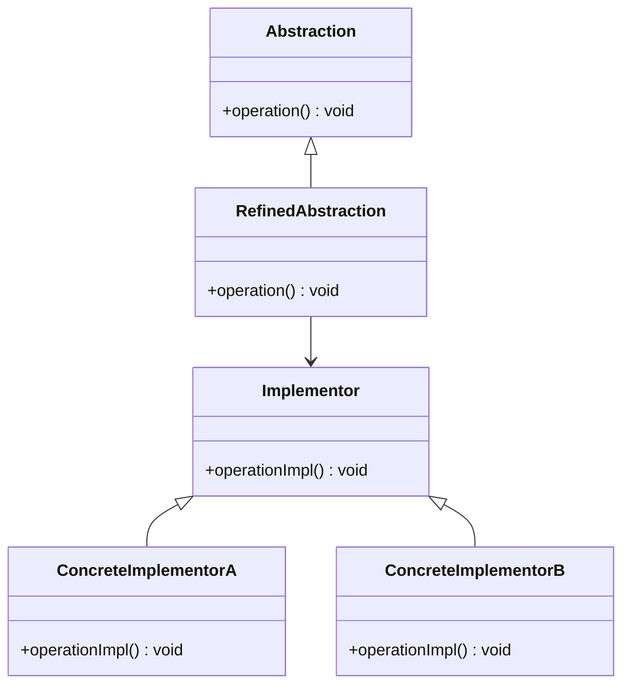

- **Key Participants**:
  - **Abstraction**: Defines the abstraction's interface.
  - **RefinedAbstraction**: Extends the interface defined by Abstraction.
  - **Implementor**: Defines the interface for implementation classes.
  - **ConcreteImplementor**: Implements the Implementor interface.

- **Applicability**:
  - Use when you want to avoid a permanent binding between an abstraction and its implementation.
  
- **Design Considerations**:
  - Allows for flexibility and extensibility by separating abstraction and implementation.
  
- **Differences and Similarities**:
  - Often confused with Adapter; however, Bridge is used to separate abstraction from implementation, while Adapter is used to change the interface of an existing object.

### Composite Pattern

- **Category**: Structural
- **Intent**: Compose objects into tree structures to represent part-whole hierarchies. Composite lets clients treat individual objects and compositions of objects uniformly.
- **Structure Diagram**:

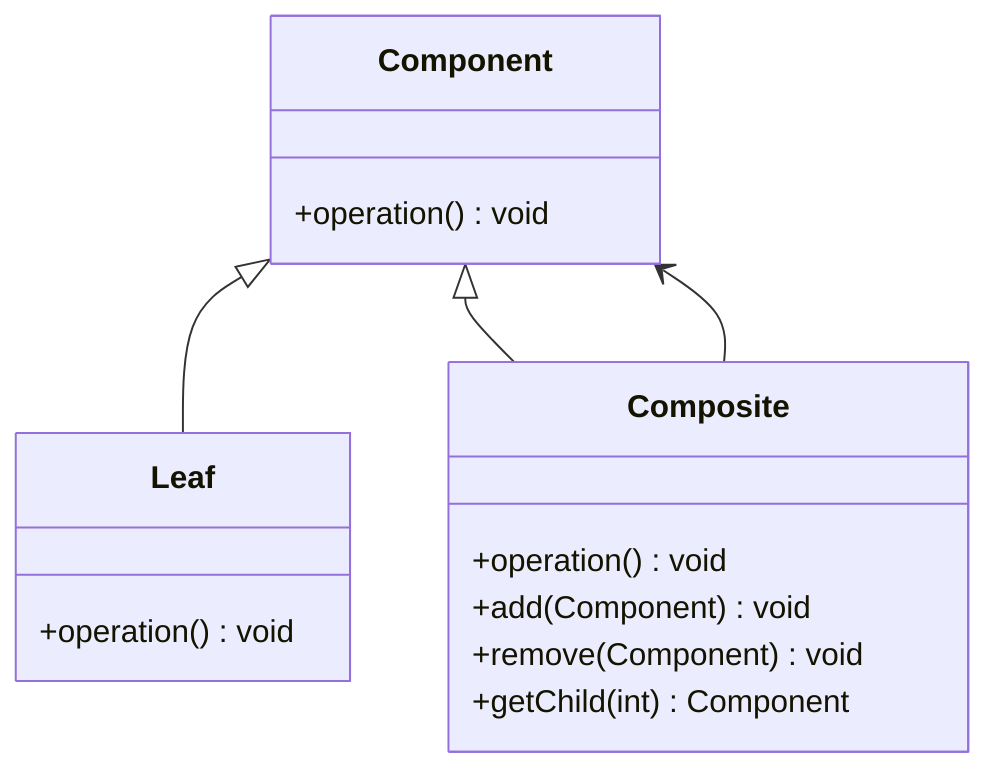

- **Key Participants**:
  - **Component**: Declares the interface for objects in the composition.
  - **Leaf**: Represents leaf objects in the composition.
  - **Composite**: Represents a composite node with children.

- **Applicability**:
  - Use when you want to represent part-whole hierarchies of objects.
  
- **Design Considerations**:
  - Simplifies client code by treating individual objects and compositions uniformly.
  
- **Differences and Similarities**:
  - Similar to Decorator but focuses on part-whole hierarchies.

### Decorator Pattern

- **Category**: Structural
- **Intent**: Attach additional responsibilities to an object dynamically. Decorators provide a flexible alternative to subclassing for extending functionality.
- **Structure Diagram**:

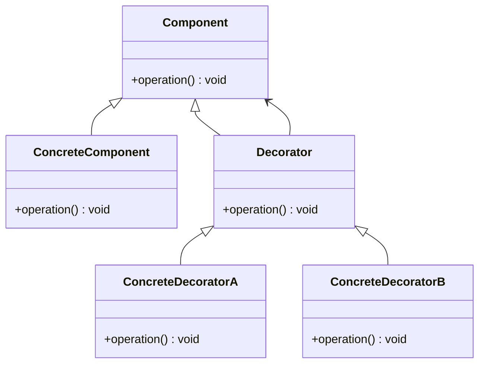

- **Key Participants**:
  - **Component**: Defines the interface for objects that can have responsibilities added to them dynamically.
  - **ConcreteComponent**: Defines an object to which additional responsibilities can be attached.
  - **Decorator**: Maintains a reference to a Component object and defines an interface that conforms to Component's interface.
  - **ConcreteDecorator**: Adds responsibilities to the component.

- **Applicability**:
  - Use to add responsibilities to individual objects dynamically and transparently.
  
- **Design Considerations**:
  - Provides a flexible alternative to subclassing for extending functionality.
  
- **Differences and Similarities**:
  - Similar to Composite but focuses on adding responsibilities.

### Facade Pattern

- **Category**: Structural
- **Intent**: Provide a unified interface to a set of interfaces in a subsystem. Facade defines a higher-level interface that makes the subsystem easier to use.
- **Structure Diagram**:

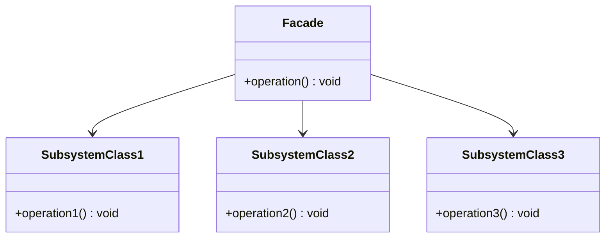

- **Key Participants**:
  - **Facade**: Knows which subsystem classes are responsible for a request.
  - **Subsystem classes**: Implement subsystem functionality.

- **Applicability**:
  - Use when you want to provide a simple interface to a complex subsystem.
  
- **Design Considerations**:
  - Reduces the number of objects that clients deal with and makes the subsystem easier to use.
  
- **Differences and Similarities**:
  - Similar to Adapter but focuses on simplifying interfaces.

### Flyweight Pattern

- **Category**: Structural
- **Intent**: Use sharing to support large numbers of fine-grained objects efficiently.
- **Structure Diagram**:

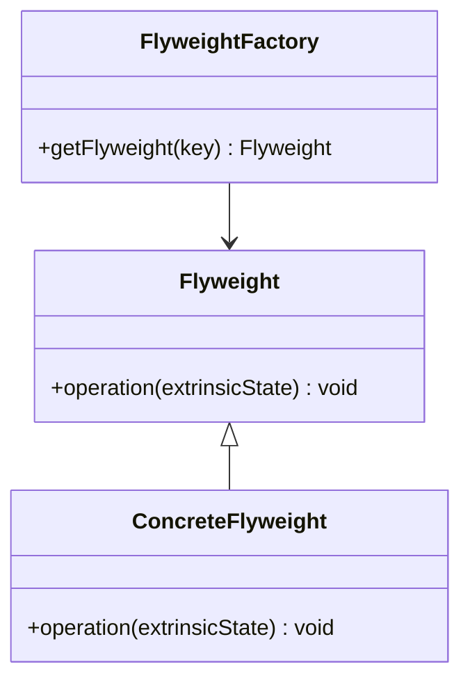

- **Key Participants**:
  - **Flyweight**: Declares an interface through which flyweights can receive and act on extrinsic state.
  - **ConcreteFlyweight**: Implements the Flyweight interface and adds storage for intrinsic state.
  - **FlyweightFactory**: Creates and manages flyweight objects.

- **Applicability**:
  - Use when many objects must be manipulated and storage costs are high.
  
- **Design Considerations**:
  - Reduces the number of objects created and decreases memory usage.
  
- **Differences and Similarities**:
  - Often confused with Singleton, but Flyweight focuses on sharing objects.

### Proxy Pattern

- **Category**: Structural
- **Intent**: Provide a surrogate or placeholder for another object to control access to it.
- **Structure Diagram**:

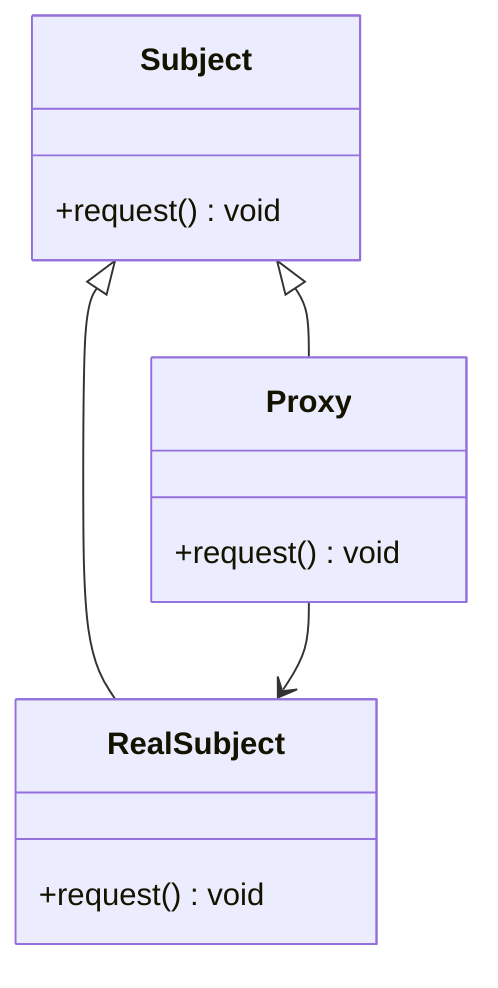

- **Key Participants**:
  - **Subject**: Defines the common interface for RealSubject and Proxy.
  - **RealSubject**: Defines the real object that the proxy represents.
  - **Proxy**: Maintains a reference to the RealSubject and provides an interface identical to Subject's.

- **Applicability**:
  - Use when you need a more versatile or sophisticated reference to an object.
  
- **Design Considerations**:
  - Controls access to the real object and can add additional functionality.
  
- **Differences and Similarities**:
  - Similar to Decorator but focuses on controlling access.

### Chain of Responsibility Pattern

- **Category**: Behavioral
- **Intent**: Avoid coupling the sender of a request to its receiver by giving more than one object a chance to handle the request. Chain the receiving objects and pass the request along the chain until an object handles it.
- **Structure Diagram**:

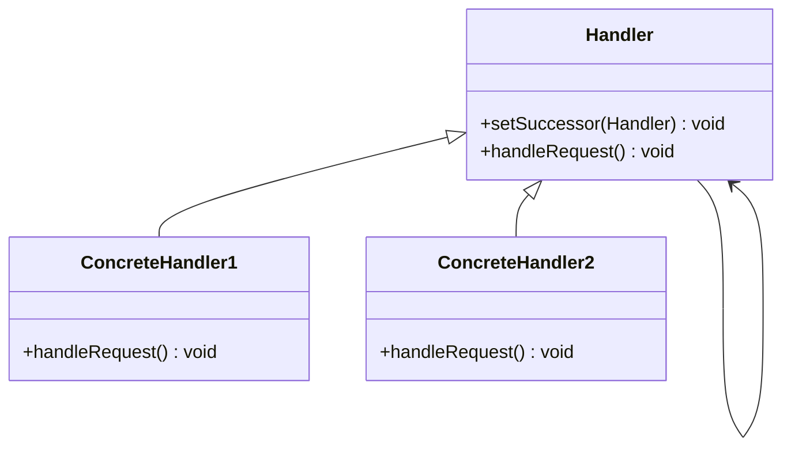

- **Key Participants**:
  - **Handler**: Defines an interface for handling requests and optionally implements the successor link.
  - **ConcreteHandler**: Handles requests it is responsible for and can access its successor.

- **Applicability**:
  - Use when more than one object may handle a request, and the handler isn't known a priori.
  
- **Design Considerations**:
  - Reduces coupling between sender and receiver.
  
- **Differences and Similarities**:
  - Similar to Command but focuses on passing requests along a chain.

### Command Pattern

- **Category**: Behavioral
- **Intent**: Encapsulate a request as an object, thereby letting you parameterize clients with queues, requests, and operations, and support undoable operations.
- **Structure Diagram**:

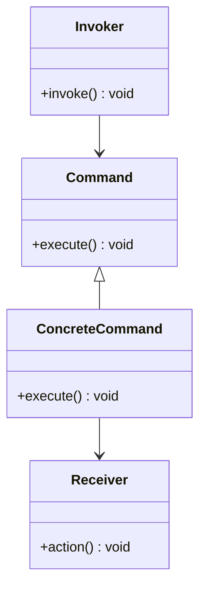

- **Key Participants**:
  - **Command**: Declares an interface for executing an operation.
  - **ConcreteCommand**: Defines a binding between a Receiver object and an action.
  - **Invoker**: Asks the command to carry out the request.
  - **Receiver**: Knows how to perform the operations associated with carrying out a request.

- **Applicability**:
  - Use when you want to parameterize objects with operations.
  
- **Design Considerations**:
  - Supports undoable operations and logging changes.
  
- **Differences and Similarities**:
  - Similar to Strategy but focuses on encapsulating requests.

### Observer Pattern

- **Category**: Behavioral
- **Intent**: Define a one-to-many dependency between objects so that when one object changes state, all its dependents are notified and updated automatically.
- **Structure Diagram**:

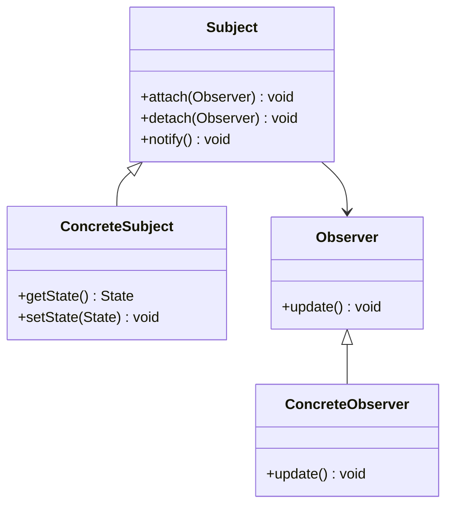

- **Key Participants**:
  - **Subject**: Knows its observers and provides an interface for attaching and detaching observers.
  - **ConcreteSubject**: Stores state of interest to ConcreteObserver objects.
  - **Observer**: Defines an updating interface for objects that should be notified of changes in a subject.
  - **ConcreteObserver**: Maintains a reference to a ConcreteSubject object and implements the Observer updating interface.

- **Applicability**:
  - Use when a change to one object requires changing others, and you don't know how many objects need to be changed.
  
- **Design Considerations**:
  - Promotes loose coupling between the subject and its observers.
  
- **Differences and Similarities**:
  - Similar to Mediator but focuses on notifying dependents of state changes.

### Strategy Pattern

- **Category**: Behavioral
- **Intent**: Define a family of algorithms, encapsulate each one, and make them interchangeable. Strategy lets the algorithm vary independently from clients that use it.
- **Structure Diagram**:

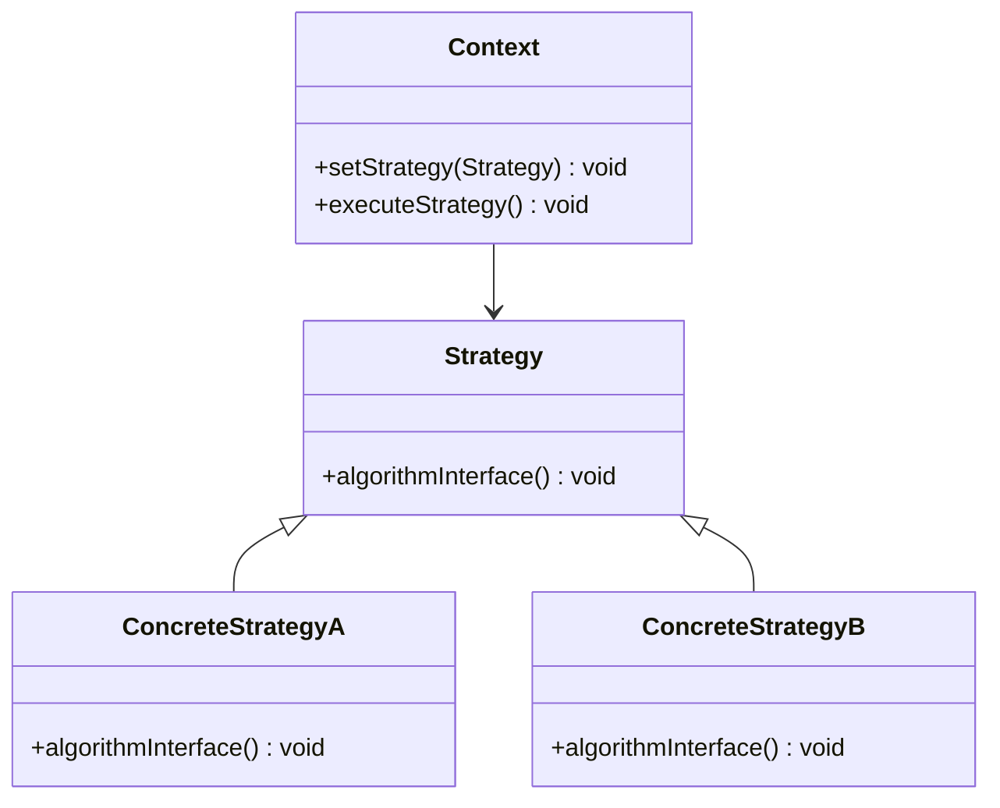

- **Key Participants**:
  - **Context**: Maintains a reference to a Strategy object.
  - **Strategy**: Declares an interface common to all supported algorithms.
  - **ConcreteStrategy**: Implements the algorithm using the Strategy interface.

- **Applicability**:
  - Use when many related classes differ only in their behavior.
  
- **Design Considerations**:
  - Promotes the use of composition over inheritance.
  
- **Differences and Similarities**:
  - Similar to State but focuses on interchangeable algorithms.

### Template Method Pattern

- **Category**: Behavioral
- **Intent**: Define the skeleton of an algorithm in an operation, deferring some steps to subclasses. Template Method lets subclasses redefine certain steps of an algorithm without changing the algorithm's structure.
- **Structure Diagram**:

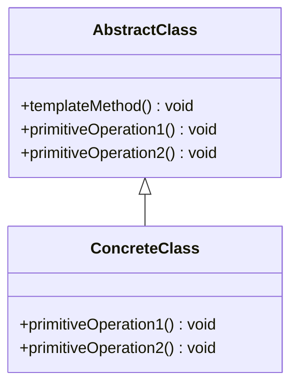

- **Key Participants**:
  - **AbstractClass**: Defines abstract primitive operations that concrete subclasses define to implement steps of an algorithm.
  - **ConcreteClass**: Implements the primitive operations to carry out subclass-specific steps of the algorithm.

- **Applicability**:
  - Use to implement the invariant parts of an algorithm once and leave it up to subclasses to implement the behavior that can vary.
  
- **Design Considerations**:
  - Promotes code reuse and enforces a consistent algorithm structure.
  
- **Differences and Similarities**:
  - Similar to Strategy but focuses on a fixed algorithm structure.

### Quiz Time!



### What is the primary intent of the Singleton pattern?

- [x] Ensure a class has only one instance and provide a global point of access to it.
- [ ] Define an interface for creating an object.
- [ ] Attach additional responsibilities to an object dynamically.
- [ ] Convert the interface of a class into another interface clients expect.

> **Explanation:** The Singleton pattern ensures that a class has only one instance and provides a global point of access to it.

### Which pattern is used to create families of related or dependent objects without specifying their concrete classes?

- [ ] Factory Method
- [x] Abstract Factory
- [ ] Builder
- [ ] Prototype

> **Explanation:** The Abstract Factory pattern provides an interface for creating families of related or dependent objects without specifying their concrete classes.

### In the Adapter pattern, what is the role of the Adaptee?

- [ ] Defines the domain-specific interface that Client uses.
- [x] Defines an existing interface that needs adapting.
- [ ] Declares an interface for handling requests.
- [ ] Declares an interface for executing an operation.

> **Explanation:** The Adaptee defines an existing interface that needs adapting in the Adapter pattern.

### What is the main difference between the Bridge and Adapter patterns?

- [x] Bridge separates an abstraction from its implementation, while Adapter changes the interface of an existing object.
- [ ] Bridge focuses on creating families of objects, while Adapter focuses on adding responsibilities.
- [ ] Bridge is used for creating complex objects, while Adapter is used for simplifying interfaces.
- [ ] Bridge and Adapter are the same and can be used interchangeably.

> **Explanation:** The Bridge pattern separates an abstraction from its implementation, while the Adapter pattern changes the interface of an existing object.

### Which pattern is best suited for representing part-whole hierarchies of objects?

- [ ] Decorator
- [x] Composite
- [ ] Facade
- [ ] Proxy

> **Explanation:** The Composite pattern is best suited for representing part-whole hierarchies of objects.

### What is the primary intent of the Command pattern?

- [ ] Define a one-to-many dependency between objects.
- [x] Encapsulate a request as an object.
- [ ] Convert the interface of a class into another interface clients expect.
- [ ] Provide a surrogate or placeholder for another object.

> **Explanation:** The Command pattern encapsulates a request as an object, allowing for parameterization of clients with queues, requests, and operations.

### Which pattern is used to notify dependents automatically when an object's state changes?

- [ ] Strategy
- [ ] Command
- [x] Observer
- [ ] Template Method

> **Explanation:** The Observer pattern defines a one-to-many dependency between objects so that when one object changes state, all its dependents are notified and updated automatically.

### What is the main difference between the Strategy and State patterns?

- [ ] Strategy focuses on a fixed algorithm structure, while State focuses on interchangeable algorithms.
- [x] Strategy focuses on interchangeable algorithms, while State focuses on managing state transitions.
- [ ] Strategy and State are the same and can be used interchangeably.
- [ ] Strategy focuses on creating complex objects, while State focuses on simplifying interfaces.

> **Explanation:** The Strategy pattern focuses on interchangeable algorithms, while the State pattern focuses on managing state transitions.

### Which pattern provides a unified interface to a set of interfaces in a subsystem?

- [ ] Adapter
- [ ] Composite
- [x] Facade
- [ ] Proxy

> **Explanation:** The Facade pattern provides a unified interface to a set of interfaces in a subsystem, making it easier to use.

### True or False: The Flyweight pattern is often confused with the Singleton pattern because both focus on sharing objects.

- [x] True
- [ ] False

> **Explanation:** The Flyweight pattern is often confused with the Singleton pattern because both focus on sharing objects, but Flyweight focuses on sharing fine-grained objects efficiently.



Remember, mastering design patterns is a journey. As you continue to explore and apply these patterns, you'll enhance your ability to create robust, scalable, and maintainable software solutions. Keep experimenting, stay curious, and enjoy the journey!
