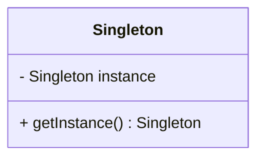
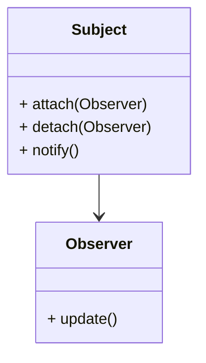

## 20.4. Additional Reading and Resources

In the ever-evolving world of software development, staying informed and continuously expanding your knowledge is crucial. Whether you're an expert software engineer, an architect, or a developer seeking to deepen your understanding of design patterns, this section provides a curated list of additional reading materials and resources. These resources will help you explore design patterns across various programming paradigms, offering insights into their applications, benefits, and nuances.

### Recommended Books and Papers

#### 1. "Design Patterns: Elements of Reusable Object-Oriented Software" by Erich Gamma, Richard Helm, Ralph Johnson, and John Vlissides

**Description:** Often referred to as the "Gang of Four" book, this seminal work is a must-read for anyone interested in design patterns. It introduces 23 classic design patterns, providing detailed explanations and examples in C++ and Smalltalk.

**Key Takeaways:**
- Understand the foundational design patterns that have shaped modern software engineering.
- Learn how to apply these patterns to solve common design problems.
- Gain insights into the principles of object-oriented design.

**Why It's Essential:** This book is the cornerstone of design pattern literature and serves as a reference for understanding the core concepts and applications of design patterns.

#### 2. "Patterns of Enterprise Application Architecture" by Martin Fowler

**Description:** This book provides a comprehensive guide to enterprise application architecture patterns, focusing on the challenges of building complex systems.

**Key Takeaways:**
- Explore architectural patterns that address scalability, performance, and maintainability.
- Learn about domain logic patterns, data source architectural patterns, and more.
- Understand how to apply these patterns in real-world enterprise applications.

**Why It's Essential:** Martin Fowler's work is renowned for its practical approach to software architecture, making it an invaluable resource for architects and developers working on large-scale systems.

#### 3. "Refactoring: Improving the Design of Existing Code" by Martin Fowler

**Description:** This book introduces the concept of refactoring, providing techniques for improving the design of existing code without changing its functionality.

**Key Takeaways:**
- Discover a catalog of refactoring techniques with detailed examples.
- Learn how to identify code smells and apply refactoring to improve code quality.
- Understand the role of design patterns in refactoring.

**Why It's Essential:** Refactoring is a critical skill for maintaining and improving software systems, and this book offers practical guidance on how to do it effectively.

#### 4. "Domain-Driven Design: Tackling Complexity in the Heart of Software" by Eric Evans

**Description:** This book explores the concept of domain-driven design (DDD), emphasizing the importance of modeling complex domains.

**Key Takeaways:**
- Learn how to create a shared understanding of the domain through ubiquitous language.
- Explore strategic and tactical design patterns for managing complexity.
- Understand the role of bounded contexts and aggregates in DDD.

**Why It's Essential:** DDD is a powerful approach for managing complexity in software systems, and this book provides the foundational knowledge needed to apply it effectively.

#### 5. "Functional Programming in Scala" by Paul Chiusano and Rúnar Bjarnason

**Description:** This book introduces functional programming concepts using Scala, a language that blends object-oriented and functional programming paradigms.

**Key Takeaways:**
- Understand the principles of functional programming, including immutability and pure functions.
- Learn how to apply functional programming patterns to solve complex problems.
- Explore the benefits of using functional programming in modern software development.

**Why It's Essential:** As functional programming gains popularity, this book offers a practical introduction to its concepts and applications, making it a valuable resource for developers looking to expand their skills.

### Online Tutorials and Videos

#### 1. "Design Patterns in Python" by Corey Schafer (YouTube Series)

**Description:** This YouTube series provides an in-depth exploration of design patterns using Python, with clear explanations and practical examples.

**Key Takeaways:**
- Learn how to implement classic design patterns in Python.
- Understand the nuances of each pattern and its applicability.
- Gain hands-on experience through coding exercises and examples.

**Why It's Essential:** Corey Schafer's tutorials are known for their clarity and accessibility, making them an excellent resource for developers looking to learn design patterns in Python.

#### 2. "Refactoring Guru" (Website)

**Description:** Refactoring Guru is a comprehensive online resource that provides detailed explanations of design patterns, refactoring techniques, and code smells.

**Key Takeaways:**
- Explore a wide range of design patterns with examples in multiple programming languages.
- Learn about refactoring techniques and how to apply them to improve code quality.
- Understand common code smells and how to address them.

**Why It's Essential:** This website offers a wealth of information on design patterns and refactoring, making it a valuable resource for developers seeking to enhance their skills.

#### 3. "Functional Programming Principles in Scala" by Martin Odersky (Coursera Course)

**Description:** This Coursera course, taught by Martin Odersky, the creator of Scala, introduces the principles of functional programming using Scala.

**Key Takeaways:**
- Understand the core concepts of functional programming, including immutability and higher-order functions.
- Learn how to apply functional programming techniques to solve real-world problems.
- Gain hands-on experience through coding assignments and projects.

**Why It's Essential:** This course provides a solid foundation in functional programming, making it an excellent resource for developers looking to expand their knowledge and skills.

#### 4. "The Clean Code Blog" by Robert C. Martin (Uncle Bob)

**Description:** The Clean Code Blog, written by Robert C. Martin (Uncle Bob), offers insights into software craftsmanship, design patterns, and clean code practices.

**Key Takeaways:**
- Explore topics related to clean code, design patterns, and software architecture.
- Gain insights into best practices for writing maintainable and scalable code.
- Learn from one of the leading voices in software craftsmanship.

**Why It's Essential:** Uncle Bob's blog is a treasure trove of knowledge for developers seeking to improve their coding practices and design skills.

#### 5. "Design Patterns for Humans" (GitHub Repository)

**Description:** This GitHub repository provides a human-friendly explanation of design patterns, with examples in multiple programming languages.

**Key Takeaways:**
- Understand design patterns through simple, easy-to-understand explanations.
- Explore examples in languages such as Python, JavaScript, and Java.
- Gain insights into the practical applications of design patterns.

**Why It's Essential:** This repository offers a unique approach to learning design patterns, making them accessible to developers of all skill levels.

### Visualizing Design Patterns

To enhance your understanding of design patterns, it's helpful to visualize their structures and interactions. Below are some examples of how to use Mermaid.js diagrams to represent design patterns:

#### Example: Singleton Pattern

**Description:** This diagram illustrates the Singleton pattern, where a single instance of a class is created and accessed through a static method.

#### Example: Observer Pattern

**Description:** This diagram represents the Observer pattern, where observers are notified of changes in the subject's state.

### Try It Yourself

To reinforce your understanding of design patterns, try implementing the following exercises:

1. **Modify the Singleton Pattern:**
   - Add a method to reset the Singleton instance and test its behavior.

2. **Implement the Observer Pattern:**
   - Create a simple weather station application where observers receive updates on temperature changes.

### References and Links

For further exploration, consider visiting the following reputable resources:

- [MDN Web Docs](https://developer.mozilla.org/): A comprehensive resource for web technologies, including JavaScript, HTML, and CSS.
- [W3Schools](https://www.w3schools.com/): Offers tutorials and references on web development languages.
- [Coursera](https://www.coursera.org/): Provides online courses on various topics, including programming and software development.
- [GitHub](https://github.com/): A platform for hosting and collaborating on open-source projects, with numerous repositories related to design patterns.

### Knowledge Check

To test your understanding of the concepts covered in this section, consider the following questions:

1. What are the key benefits of using design patterns in software development?
2. How can refactoring improve the design of existing code?
3. What is the role of domain-driven design in managing complexity?
4. How do functional programming principles differ from object-oriented programming?
5. Why is visualization important in understanding design patterns?

### Embrace the Journey

Remember, mastering design patterns is a continuous journey. As you explore these resources and apply what you've learned, you'll gain deeper insights into software design and architecture. Keep experimenting, stay curious, and enjoy the process of learning and growing as a developer.

## Quiz Time!



### What is the primary focus of the "Gang of Four" book on design patterns?

- [x] Introducing 23 classic design patterns
- [ ] Exploring functional programming paradigms
- [ ] Discussing modern web development techniques
- [ ] Analyzing data structures and algorithms

> **Explanation:** The "Gang of Four" book is renowned for introducing 23 classic design patterns in software engineering.

### Which book is known for providing a comprehensive guide to enterprise application architecture patterns?

- [x] "Patterns of Enterprise Application Architecture" by Martin Fowler
- [ ] "Domain-Driven Design" by Eric Evans
- [ ] "Refactoring" by Martin Fowler
- [ ] "Functional Programming in Scala" by Paul Chiusano and Rúnar Bjarnason

> **Explanation:** Martin Fowler's book focuses on architectural patterns for enterprise applications.

### What is the main benefit of refactoring code?

- [x] Improving the design of existing code without changing its functionality
- [ ] Increasing the complexity of the codebase
- [ ] Introducing new features to the software
- [ ] Enhancing the performance of the application

> **Explanation:** Refactoring aims to improve code design while maintaining its existing functionality.

### What is the purpose of domain-driven design (DDD)?

- [x] Managing complexity in software systems through domain modeling
- [ ] Enhancing the performance of web applications
- [ ] Simplifying user interface design
- [ ] Optimizing database queries

> **Explanation:** DDD focuses on managing complexity by modeling the domain effectively.

### Which resource provides a human-friendly explanation of design patterns?

- [x] "Design Patterns for Humans" GitHub Repository
- [ ] "The Clean Code Blog" by Robert C. Martin
- [ ] "Refactoring Guru" Website
- [ ] "Functional Programming Principles in Scala" Coursera Course

> **Explanation:** The GitHub repository offers simple explanations of design patterns.

### What is the main advantage of using functional programming principles?

- [x] Immutability and pure functions lead to more predictable code
- [ ] Increased reliance on global variables
- [ ] Enhanced object-oriented design capabilities
- [ ] Simplified user interface development

> **Explanation:** Functional programming emphasizes immutability and pure functions for predictability.

### Why is visualization important in understanding design patterns?

- [x] It helps illustrate the structure and interactions of patterns
- [ ] It simplifies the process of writing code
- [ ] It enhances the performance of the application
- [ ] It reduces the need for documentation

> **Explanation:** Visualization aids in comprehending the structure and interactions within design patterns.

### What is the role of bounded contexts in domain-driven design?

- [x] Defining clear boundaries for different parts of the domain
- [ ] Enhancing the performance of web applications
- [ ] Simplifying user interface design
- [ ] Optimizing database queries

> **Explanation:** Bounded contexts help define clear boundaries within the domain model.

### How does the Observer pattern work?

- [x] Observers are notified of changes in the subject's state
- [ ] Observers directly modify the subject's state
- [ ] Observers are responsible for managing the subject's lifecycle
- [ ] Observers act as intermediaries between different subjects

> **Explanation:** In the Observer pattern, observers are notified of changes in the subject's state.

### True or False: The Singleton pattern ensures that a class has multiple instances.

- [ ] True
- [x] False

> **Explanation:** The Singleton pattern ensures that a class has only one instance.


