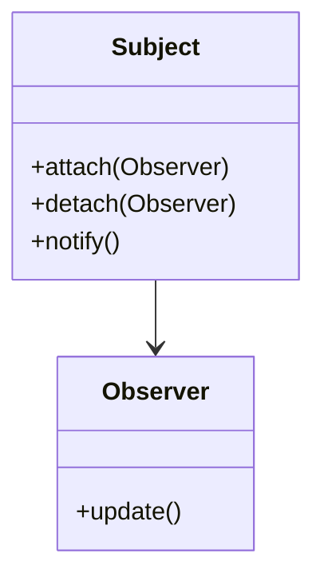
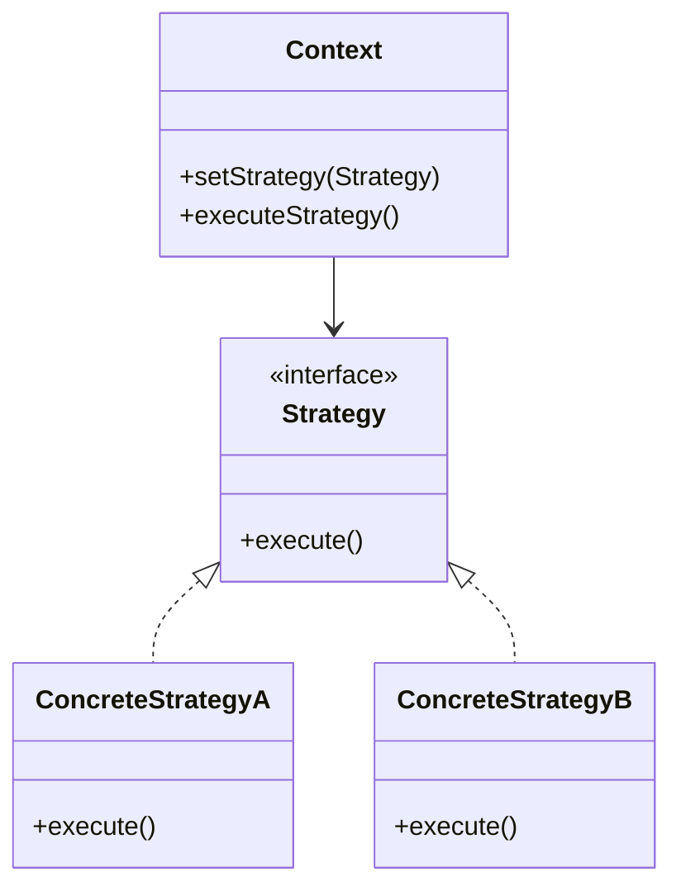

## 20.5. Common Interview Questions on Design Patterns

Design patterns are a crucial aspect of software engineering, offering reusable solutions to common problems. Understanding these patterns is essential for expert developers and architects, especially when preparing for technical interviews. This section provides a comprehensive guide to common interview questions on design patterns, complete with explanations, pseudocode examples, and insights into their applications across different programming paradigms.

### Preparing for Technical Interviews

When preparing for interviews, it's important to not only understand the theoretical aspects of design patterns but also to be able to articulate their applications and implementations. This section will guide you through sample questions and provide detailed answers to help you prepare effectively.

### Sample Questions and Answers

Below are some common interview questions on design patterns, along with comprehensive answers and pseudocode examples.

---

### 1. What is a Design Pattern?

**Answer:** A design pattern is a general, reusable solution to a commonly occurring problem within a given context in software design. It is not a finished design that can be directly transformed into code but rather a template for how to solve a problem that can be used in many different situations.

**Key Points:**
- Design patterns are categorized into Creational, Structural, and Behavioral patterns.
- They promote code reusability, scalability, and maintainability.

**Example Question:** Can you explain the Singleton pattern and provide a pseudocode example?

### 2. Explain the Singleton Pattern.

**Category:** Creational

**Intent:** Ensure a class has only one instance and provide a global point of access to it.

**Pseudocode Example:**

```pseudocode
class Singleton {
    private static instance = null

    private Singleton() {
        // private constructor to prevent instantiation
    }

    public static getInstance() {
        if (instance == null) {
            instance = new Singleton()
        }
        return instance
    }
}
```

**Design Considerations:**
- Use the Singleton pattern when you need exactly one instance of a class.
- Be cautious of multithreading issues; consider using double-checked locking.

**Try It Yourself:** Modify the pseudocode to implement a thread-safe Singleton pattern.

### 3. What is the Factory Method Pattern?

**Category:** Creational

**Intent:** Define an interface for creating an object, but let subclasses alter the type of objects that will be created.

**Pseudocode Example:**

```pseudocode
abstract class Creator {
    abstract createProduct(): Product

    operation() {
        product = createProduct()
        // use the product
    }
}

class ConcreteCreator extends Creator {
    createProduct(): Product {
        return new ConcreteProduct()
    }
}
```

**Design Considerations:**
- Use the Factory Method pattern when a class cannot anticipate the class of objects it must create.
- It helps in adhering to the Open/Closed Principle.

**Try It Yourself:** Extend the pseudocode to create multiple types of products.

### 4. Describe the Observer Pattern.

**Category:** Behavioral

**Intent:** Define a one-to-many dependency between objects so that when one object changes state, all its dependents are notified and updated automatically.

**Pseudocode Example:**

```pseudocode
class Subject {
    private observers = []

    attach(observer) {
        observers.add(observer)
    }

    detach(observer) {
        observers.remove(observer)
    }

    notify() {
        for each observer in observers {
            observer.update()
        }
    }
}

class ConcreteObserver implements Observer {
    update() {
        // update logic
    }
}
```

**Design Considerations:**
- Use the Observer pattern when changes to one object require changing others, and you don't know how many objects need to be changed.
- Be aware of potential performance issues with a large number of observers.

**Try It Yourself:** Implement a pull model where observers query the subject for updates.

### 5. What is the Strategy Pattern?

**Category:** Behavioral

**Intent:** Define a family of algorithms, encapsulate each one, and make them interchangeable. Strategy lets the algorithm vary independently from clients that use it.

**Pseudocode Example:**

```pseudocode
interface Strategy {
    execute()
}

class ConcreteStrategyA implements Strategy {
    execute() {
        // implementation of algorithm A
    }
}

class ConcreteStrategyB implements Strategy {
    execute() {
        // implementation of algorithm B
    }
}

class Context {
    private strategy: Strategy

    setStrategy(strategy: Strategy) {
        this.strategy = strategy
    }

    executeStrategy() {
        strategy.execute()
    }
}
```

**Design Considerations:**
- Use the Strategy pattern when you have multiple algorithms for a specific task and want to switch between them.
- It promotes the Open/Closed Principle.

**Try It Yourself:** Add a new strategy and integrate it into the context.

### 6. Explain the Decorator Pattern.

**Category:** Structural

**Intent:** Attach additional responsibilities to an object dynamically. Decorators provide a flexible alternative to subclassing for extending functionality.

**Pseudocode Example:**

```pseudocode
interface Component {
    operation()
}

class ConcreteComponent implements Component {
    operation() {
        // base operation
    }
}

class Decorator implements Component {
    private component: Component

    Decorator(component: Component) {
        this.component = component
    }

    operation() {
        component.operation()
        // additional behavior
    }
}
```

**Design Considerations:**
- Use the Decorator pattern to add responsibilities to individual objects dynamically and transparently.
- Avoid using it when you need to add responsibilities to all instances of a class.

**Try It Yourself:** Create multiple decorators and chain them together.

### 7. What is the Adapter Pattern?

**Category:** Structural

**Intent:** Convert the interface of a class into another interface clients expect. Adapter lets classes work together that couldn't otherwise because of incompatible interfaces.

**Pseudocode Example:**

```pseudocode
class Target {
    request() {
        // target request
    }
}

class Adaptee {
    specificRequest() {
        // specific request
    }
}

class Adapter extends Target {
    private adaptee: Adaptee

    Adapter(adaptee: Adaptee) {
        this.adaptee = adaptee
    }

    request() {
        adaptee.specificRequest()
    }
}
```

**Design Considerations:**
- Use the Adapter pattern when you want to use an existing class, and its interface does not match the one you need.
- It can be implemented using class or object composition.

**Try It Yourself:** Implement an object adapter instead of a class adapter.

### 8. Describe the Command Pattern.

**Category:** Behavioral

**Intent:** Encapsulate a request as an object, thereby allowing for parameterization of clients with queues, requests, and operations.

**Pseudocode Example:**

```pseudocode
interface Command {
    execute()
}

class ConcreteCommand implements Command {
    private receiver: Receiver

    ConcreteCommand(receiver: Receiver) {
        this.receiver = receiver
    }

    execute() {
        receiver.action()
    }
}

class Invoker {
    private command: Command

    setCommand(command: Command) {
        this.command = command
    }

    executeCommand() {
        command.execute()
    }
}
```

**Design Considerations:**
- Use the Command pattern to parameterize objects with operations.
- It supports undoable operations.

**Try It Yourself:** Implement a command history for undo/redo functionality.

### 9. What is the Composite Pattern?

**Category:** Structural

**Intent:** Compose objects into tree structures to represent part-whole hierarchies. Composite lets clients treat individual objects and compositions of objects uniformly.

**Pseudocode Example:**

```pseudocode
interface Component {
    operation()
}

class Leaf implements Component {
    operation() {
        // leaf operation
    }
}

class Composite implements Component {
    private children = []

    operation() {
        for each child in children {
            child.operation()
        }
    }

    add(Component component) {
        children.add(component)
    }

    remove(Component component) {
        children.remove(component)
    }
}
```

**Design Considerations:**
- Use the Composite pattern to represent part-whole hierarchies.
- It simplifies client code by treating individual objects and compositions uniformly.

**Try It Yourself:** Extend the composite to handle different types of components.

### 10. Explain the Facade Pattern.

**Category:** Structural

**Intent:** Provide a unified interface to a set of interfaces in a subsystem. Facade defines a higher-level interface that makes the subsystem easier to use.

**Pseudocode Example:**

```pseudocode
class SubsystemA {
    operationA() {
        // operation A
    }
}

class SubsystemB {
    operationB() {
        // operation B
    }
}

class Facade {
    private subsystemA: SubsystemA
    private subsystemB: SubsystemB

    Facade() {
        subsystemA = new SubsystemA()
        subsystemB = new SubsystemB()
    }

    operation() {
        subsystemA.operationA()
        subsystemB.operationB()
    }
}
```

**Design Considerations:**
- Use the Facade pattern to provide a simple interface to a complex subsystem.
- It reduces the number of objects that clients deal with and makes the subsystem easier to use.

**Try It Yourself:** Add more subsystems and integrate them into the facade.

### 11. What is the Builder Pattern?

**Category:** Creational

**Intent:** Separate the construction of a complex object from its representation so that the same construction process can create different representations.

**Pseudocode Example:**

```pseudocode
class Builder {
    buildPartA()
    buildPartB()
    getResult()
}

class ConcreteBuilder implements Builder {
    private product: Product

    buildPartA() {
        // build part A
    }

    buildPartB() {
        // build part B
    }

    getResult() {
        return product
    }
}

class Director {
    construct(builder: Builder) {
        builder.buildPartA()
        builder.buildPartB()
    }
}
```

**Design Considerations:**
- Use the Builder pattern when the construction process must allow different representations.
- It provides control over the construction process.

**Try It Yourself:** Implement a builder for a different product with additional parts.

### 12. Describe the Prototype Pattern.

**Category:** Creational

**Intent:** Specify the kinds of objects to create using a prototypical instance, and create new objects by copying this prototype.

**Pseudocode Example:**

```pseudocode
interface Prototype {
    clone()
}

class ConcretePrototype implements Prototype {
    clone() {
        return new ConcretePrototype(this)
    }
}
```

**Design Considerations:**
- Use the Prototype pattern when a system should be independent of how its products are created, composed, and represented.
- It helps in reducing the number of classes.

**Try It Yourself:** Implement deep cloning for complex objects.

### 13. What is the Chain of Responsibility Pattern?

**Category:** Behavioral

**Intent:** Avoid coupling the sender of a request to its receiver by giving more than one object a chance to handle the request. Chain the receiving objects and pass the request along the chain until an object handles it.

**Pseudocode Example:**

```pseudocode
class Handler {
    private next: Handler

    setNext(handler: Handler) {
        next = handler
    }

    handleRequest(request) {
        if (next != null) {
            next.handleRequest(request)
        }
    }
}

class ConcreteHandler1 extends Handler {
    handleRequest(request) {
        if (canHandle(request)) {
            // handle request
        } else {
            super.handleRequest(request)
        }
    }
}
```

**Design Considerations:**
- Use the Chain of Responsibility pattern when more than one object may handle a request, and the handler isn't known a priori.
- It decouples senders and receivers.

**Try It Yourself:** Create a chain with multiple handlers and test different request scenarios.

### 14. Explain the Template Method Pattern.

**Category:** Behavioral

**Intent:** Define the skeleton of an algorithm in an operation, deferring some steps to subclasses. Template Method lets subclasses redefine certain steps of an algorithm without changing the algorithm's structure.

**Pseudocode Example:**

```pseudocode
abstract class AbstractClass {
    templateMethod() {
        primitiveOperation1()
        primitiveOperation2()
    }

    abstract primitiveOperation1()
    abstract primitiveOperation2()
}

class ConcreteClass extends AbstractClass {
    primitiveOperation1() {
        // implementation
    }

    primitiveOperation2() {
        // implementation
    }
}
```

**Design Considerations:**
- Use the Template Method pattern to let subclasses implement behavior that can vary.
- It promotes code reuse.

**Try It Yourself:** Add a new primitive operation and integrate it into the template method.

### 15. Describe the State Pattern.

**Category:** Behavioral

**Intent:** Allow an object to alter its behavior when its internal state changes. The object will appear to change its class.

**Pseudocode Example:**

```pseudocode
class Context {
    private state: State

    setState(state: State) {
        this.state = state
    }

    request() {
        state.handle()
    }
}

interface State {
    handle()
}

class ConcreteStateA implements State {
    handle() {
        // handle state A
    }
}

class ConcreteStateB implements State {
    handle() {
        // handle state B
    }
}
```

**Design Considerations:**
- Use the State pattern when an object's behavior depends on its state, and it must change its behavior at runtime depending on that state.
- It encapsulates state-specific behavior and transitions.

**Try It Yourself:** Implement additional states and transitions between them.

### 16. What is the Memento Pattern?

**Category:** Behavioral

**Intent:** Without violating encapsulation, capture and externalize an object's internal state so that the object can be restored to this state later.

**Pseudocode Example:**

```pseudocode
class Memento {
    private state

    Memento(state) {
        this.state = state
    }

    getState() {
        return state
    }
}

class Originator {
    private state

    setState(state) {
        this.state = state
    }

    saveStateToMemento() {
        return new Memento(state)
    }

    getStateFromMemento(memento: Memento) {
        state = memento.getState()
    }
}
```

**Design Considerations:**
- Use the Memento pattern when you need to save and restore the state of an object.
- It preserves encapsulation boundaries.

**Try It Yourself:** Implement a caretaker class to manage multiple mementos.

### 17. Explain the Visitor Pattern.

**Category:** Behavioral

**Intent:** Represent an operation to be performed on the elements of an object structure. Visitor lets you define a new operation without changing the classes of the elements on which it operates.

**Pseudocode Example:**

```pseudocode
interface Visitor {
    visitConcreteElementA(element: ConcreteElementA)
    visitConcreteElementB(element: ConcreteElementB)
}

class ConcreteVisitor implements Visitor {
    visitConcreteElementA(element: ConcreteElementA) {
        // operation on ConcreteElementA
    }

    visitConcreteElementB(element: ConcreteElementB) {
        // operation on ConcreteElementB
    }
}

interface Element {
    accept(visitor: Visitor)
}

class ConcreteElementA implements Element {
    accept(visitor: Visitor) {
        visitor.visitConcreteElementA(this)
    }
}

class ConcreteElementB implements Element {
    accept(visitor: Visitor) {
        visitor.visitConcreteElementB(this)
    }
}
```

**Design Considerations:**
- Use the Visitor pattern when you need to perform operations across a complex object structure.
- It allows you to add new operations without modifying the elements.

**Try It Yourself:** Add a new element and visitor operation.

### 18. What is the Flyweight Pattern?

**Category:** Structural

**Intent:** Use sharing to support large numbers of fine-grained objects efficiently.

**Pseudocode Example:**

```pseudocode
class Flyweight {
    operation(extrinsicState)
}

class ConcreteFlyweight implements Flyweight {
    operation(extrinsicState) {
        // operation using extrinsicState
    }
}

class FlyweightFactory {
    private flyweights = {}

    getFlyweight(key) {
        if (!flyweights.containsKey(key)) {
            flyweights[key] = new ConcreteFlyweight()
        }
        return flyweights[key]
    }
}
```

**Design Considerations:**
- Use the Flyweight pattern when you need to create a large number of similar objects.
- It reduces memory usage by sharing objects.

**Try It Yourself:** Implement a flyweight for a different context with varying extrinsic states.

### 19. Describe the Proxy Pattern.

**Category:** Structural

**Intent:** Provide a surrogate or placeholder for another object to control access to it.

**Pseudocode Example:**

```pseudocode
interface Subject {
    request()
}

class RealSubject implements Subject {
    request() {
        // real request
    }
}

class Proxy implements Subject {
    private realSubject: RealSubject

    request() {
        if (realSubject == null) {
            realSubject = new RealSubject()
        }
        realSubject.request()
    }
}
```

**Design Considerations:**
- Use the Proxy pattern to control access to an object.
- It can be used for lazy initialization, access control, logging, etc.

**Try It Yourself:** Implement a virtual proxy that loads data on demand.

### 20. Explain the Mediator Pattern.

**Category:** Behavioral

**Intent:** Define an object that encapsulates how a set of objects interact. Mediator promotes loose coupling by keeping objects from referring to each other explicitly.

**Pseudocode Example:**

```pseudocode
interface Mediator {
    notify(sender: object, event: string)
}

class ConcreteMediator implements Mediator {
    private component1: Component1
    private component2: Component2

    notify(sender: object, event: string) {
        if (event == "A") {
            // handle event A
        } else if (event == "B") {
            // handle event B
        }
    }
}

class Component1 {
    private mediator: Mediator

    triggerEventA() {
        mediator.notify(this, "A")
    }
}

class Component2 {
    private mediator: Mediator

    triggerEventB() {
        mediator.notify(this, "B")
    }
}
```

**Design Considerations:**
- Use the Mediator pattern to centralize complex communications and control between related objects.
- It reduces the dependencies between communicating objects.

**Try It Yourself:** Add more components and events to the mediator.

---

### Visualizing Design Patterns

To better understand the relationships and interactions within design patterns, let's visualize some of them using Mermaid.js diagrams.

#### Example: Observer Pattern



**Description:** This diagram illustrates the relationship between the `Subject` and `Observer` classes in the Observer pattern.

#### Example: Strategy Pattern



**Description:** This diagram shows how the `Context` class interacts with different `Strategy` implementations.

---

### References and Links

For further reading on design patterns, consider exploring the following resources:

- [Design Patterns: Elements of Reusable Object-Oriented Software](https://en.wikipedia.org/wiki/Design_Patterns) by Erich Gamma, Richard Helm, Ralph Johnson, and John Vlissides.
- [Refactoring: Improving the Design of Existing Code](https://martinfowler.com/books/refactoring.html) by Martin Fowler.
- [Head First Design Patterns](https://www.oreilly.com/library/view/head-first-design/0596007124/) by Eric Freeman and Elisabeth Robson.

---

### Knowledge Check

To reinforce your understanding of design patterns, consider the following questions:

1. Why is the Singleton pattern considered an anti-pattern in some cases?
2. How does the Factory Method pattern adhere to the Open/Closed Principle?
3. What are the benefits of using the Observer pattern in event-driven systems?
4. How can the Strategy pattern improve the flexibility of an application?
5. In what scenarios would you choose the Decorator pattern over inheritance?

---

### Embrace the Journey

Remember, mastering design patterns is a journey. As you continue to explore and apply these patterns, you'll gain deeper insights into software design and architecture. Keep experimenting, stay curious, and enjoy the process of learning and growing as a developer.

---

## Quiz Time!



### What is the primary intent of the Singleton pattern?

- [x] Ensure a class has only one instance and provide a global point of access to it.
- [ ] Define a family of algorithms and make them interchangeable.
- [ ] Convert the interface of a class into another interface clients expect.
- [ ] Compose objects into tree structures to represent part-whole hierarchies.

> **Explanation:** The Singleton pattern ensures that a class has only one instance and provides a global point of access to it.

### Which pattern is used to define a one-to-many dependency between objects?

- [ ] Strategy
- [x] Observer
- [ ] Factory Method
- [ ] Adapter

> **Explanation:** The Observer pattern defines a one-to-many dependency between objects so that when one object changes state, all its dependents are notified and updated automatically.

### What is the key benefit of the Strategy pattern?

- [ ] It provides a surrogate or placeholder for another object.
- [x] It allows the algorithm to vary independently from clients that use it.
- [ ] It attaches additional responsibilities to an object dynamically.
- [ ] It provides a unified interface to a set of interfaces in a subsystem.

> **Explanation:** The Strategy pattern allows the algorithm to vary independently from clients that use it, promoting flexibility and reusability.

### In the Decorator pattern, what is the primary purpose of the Decorator class?

- [x] To attach additional responsibilities to an object dynamically.
- [ ] To encapsulate a request as an object.
- [ ] To define a skeleton of an algorithm in an operation.
- [ ] To represent an operation to be performed on elements of an object structure.

> **Explanation:** The Decorator class in the Decorator pattern is used to attach additional responsibilities to an object dynamically.

### How does the Adapter pattern help in software design?

- [x] It converts the interface of a class into another interface clients expect.
- [ ] It composes objects into tree structures to represent part-whole hierarchies.
- [ ] It defines a family of algorithms and makes them interchangeable.
- [ ] It provides a unified interface to a set of interfaces in a subsystem.

> **Explanation:** The Adapter pattern converts the interface of a class into another interface clients expect, allowing classes to work together that couldn't otherwise because of incompatible interfaces.

### What is the primary role of the Command pattern?

- [ ] To define an object that encapsulates how a set of objects interact.
- [x] To encapsulate a request as an object.
- [ ] To provide a surrogate or placeholder for another object.
- [ ] To compose objects into tree structures to represent part-whole hierarchies.

> **Explanation:** The Command pattern encapsulates a request as an object, allowing for parameterization of clients with queues, requests, and operations.

### Which pattern is best suited for representing part-whole hierarchies?

- [ ] Strategy
- [ ] Observer
- [ ] Adapter
- [x] Composite

> **Explanation:** The Composite pattern is best suited for representing part-whole hierarchies, allowing clients to treat individual objects and compositions of objects uniformly.

### What is the main advantage of using the Facade pattern?

- [x] It provides a unified interface to a set of interfaces in a subsystem.
- [ ] It allows the algorithm to vary independently from clients that use it.
- [ ] It defines a family of algorithms and makes them interchangeable.
- [ ] It attaches additional responsibilities to an object dynamically.

> **Explanation:** The Facade pattern provides a unified interface to a set of interfaces in a subsystem, making the subsystem easier to use.

### True or False: The Builder pattern is used to separate the construction of a complex object from its representation.

- [x] True
- [ ] False

> **Explanation:** True. The Builder pattern separates the construction of a complex object from its representation, allowing the same construction process to create different representations.

### True or False: The Prototype pattern is used to create new objects by copying an existing object.

- [x] True
- [ ] False

> **Explanation:** True. The Prototype pattern specifies the kinds of objects to create using a prototypical instance and creates new objects by copying this prototype.


