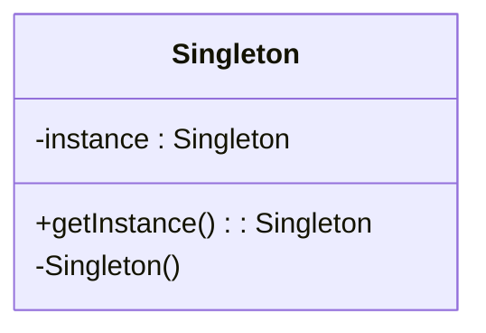

## 20.6. Frequently Asked Questions (FAQ)

In this section, we address some of the most frequently asked questions about design patterns. These questions often arise from common misconceptions or challenges that developers face when learning and applying design patterns. By providing clear explanations, tips, and advice, we aim to enhance your understanding and mastery of design patterns across different programming paradigms.

### What Are Design Patterns?

**Q: What exactly are design patterns, and why are they important?**

Design patterns are reusable solutions to common problems that occur in software design. They provide a template for how to solve a problem in a way that is proven to be effective. Design patterns are important because they help developers write code that is more flexible, reusable, and easier to maintain. They also facilitate communication among developers by providing a common vocabulary for discussing design solutions.

### History and Evolution of Design Patterns

**Q: How did design patterns originate, and how have they evolved over time?**

Design patterns originated from the work of Christopher Alexander, an architect who applied patterns to building design. The concept was later adapted to software engineering by the "Gang of Four" (GoF) in their seminal book "Design Patterns: Elements of Reusable Object-Oriented Software." Since then, design patterns have evolved to include patterns for functional programming, concurrency, and other paradigms, reflecting the changing landscape of software development.

### Importance of Design Patterns in Modern Programming

**Q: Why are design patterns still relevant in modern programming?**

Design patterns remain relevant because they address fundamental design challenges that persist regardless of technological advancements. They promote best practices such as separation of concerns, encapsulation, and modularity, which are crucial for building scalable and maintainable systems. Moreover, as programming paradigms evolve, design patterns adapt to provide solutions that are applicable in new contexts, such as functional programming and microservices architecture.

### Common Misconceptions About Design Patterns

**Q: Are design patterns only applicable to object-oriented programming?**

No, design patterns are not limited to object-oriented programming (OOP). While many classic design patterns were initially described in the context of OOP, they can be adapted to other paradigms, including functional programming (FP) and procedural programming. For example, the Strategy pattern can be implemented using higher-order functions in FP, demonstrating the versatility of design patterns across paradigms.

**Q: Do design patterns encourage over-engineering?**

This is a common misconception. Design patterns should not be applied indiscriminately; they are tools to be used judiciously. Over-engineering occurs when patterns are applied without a clear need, leading to unnecessary complexity. The key is to understand the problem at hand and select the appropriate pattern that provides a clear benefit.

### Tips for Learning and Applying Design Patterns

**Q: What is the best way to learn design patterns?**

The best way to learn design patterns is through a combination of theoretical study and practical application. Start by understanding the intent and structure of each pattern, then implement them in small projects or exercises. Gradually, apply patterns to real-world problems, reflecting on their effectiveness and any challenges encountered. Engaging with the developer community, reading books, and attending workshops can also enhance your understanding.

**Q: How can I decide which design pattern to use?**

Choosing the right design pattern involves understanding the problem you are trying to solve and the context in which it occurs. Consider factors such as the need for flexibility, scalability, and maintainability. Analyze the trade-offs of each pattern, such as complexity versus simplicity, and select the one that aligns with your design goals. Experience and practice will improve your ability to make these decisions.

### Addressing Specific Design Pattern Questions

**Q: What is the difference between the Factory Method and Abstract Factory patterns?**

The Factory Method pattern defines an interface for creating an object but allows subclasses to alter the type of objects that will be created. In contrast, the Abstract Factory pattern provides an interface for creating families of related or dependent objects without specifying their concrete classes. The key difference lies in the scope and complexity: Factory Method is simpler and deals with one product, while Abstract Factory handles multiple products.

**Q: How does the Singleton pattern ensure a single instance?**

The Singleton pattern restricts the instantiation of a class to one object. It typically involves a private constructor, a static method to access the instance, and a static variable to hold the instance. This ensures that only one instance is created, and it is accessible globally. However, care must be taken in concurrent environments to ensure thread safety.

```pseudocode
class Singleton {
    private static instance = null

    private Singleton() {
        // Private constructor to prevent instantiation
    }

    public static getInstance() {
        if (instance == null) {
            instance = new Singleton()
        }
        return instance
    }
}
```

### Design Patterns and Software Architecture

**Q: How do design patterns relate to software architecture?**

Design patterns are building blocks for software architecture. While architecture defines the high-level structure of a system, design patterns provide solutions to specific design problems within that structure. For example, an MVC architecture might use Observer and Strategy patterns to manage user interactions and business logic, respectively. Understanding both architecture and design patterns is crucial for creating robust systems.

### Visualizing Design Patterns

**Q: Can diagrams help in understanding design patterns?**

Yes, diagrams are a powerful tool for visualizing design patterns. They can illustrate the relationships between classes and objects, the flow of data, and the interactions within a pattern. Using UML diagrams, such as class diagrams and sequence diagrams, can enhance comprehension and communication among team members.



### Design Patterns in Different Paradigms

**Q: How do design patterns differ between OOP and FP?**

In OOP, design patterns often involve classes and objects, focusing on inheritance and polymorphism. In FP, patterns emphasize functions, immutability, and higher-order functions. For example, the Command pattern in OOP can be implemented using closures in FP. Understanding these differences allows developers to adapt patterns to the paradigm they are working in.

### Practical Applications of Design Patterns

**Q: Can you provide an example of a real-world application of a design pattern?**

Certainly! Consider the Observer pattern, which is widely used in event-driven systems. In a stock market application, the Observer pattern can be used to notify multiple clients about changes in stock prices. Each client subscribes to updates, and when a stock price changes, all subscribed clients are notified.

```pseudocode
class StockMarket {
    observers = []

    addObserver(observer) {
        observers.add(observer)
    }

    removeObserver(observer) {
        observers.remove(observer)
    }

    notifyObservers(priceChange) {
        for observer in observers {
            observer.update(priceChange)
        }
    }
}

class Client {
    update(priceChange) {
        // Handle the price change
    }
}
```

### Try It Yourself

**Q: How can I experiment with design patterns?**

Try implementing a simple application using different design patterns. For instance, create a text editor that uses the Command pattern to implement undo and redo functionality. Experiment by modifying the code to see how changes affect the overall design. This hands-on approach will deepen your understanding and help you see the practical benefits of design patterns.

### Knowledge Check

**Q: What are some key takeaways about design patterns?**

- Design patterns provide proven solutions to common design problems.
- They are applicable across different programming paradigms.
- Understanding the intent and structure of each pattern is crucial.
- Practical application and experimentation enhance learning.
- Diagrams and pseudocode can aid in understanding and communication.

### Embrace the Journey

Remember, mastering design patterns is a journey. As you progress, you'll encounter new challenges and opportunities to apply what you've learned. Stay curious, keep experimenting, and don't hesitate to seek out resources and communities that can support your growth. Design patterns are a powerful tool in your software development toolkit, and with practice, you'll become adept at using them to create elegant and effective solutions.

## Quiz Time!



### What is the primary purpose of design patterns?

- [x] To provide reusable solutions to common software design problems
- [ ] To enforce strict coding standards
- [ ] To replace the need for software architecture
- [ ] To eliminate the need for documentation

> **Explanation:** Design patterns offer reusable solutions to common design problems, promoting best practices and improving code quality.

### Which of the following is a common misconception about design patterns?

- [ ] They are only applicable to object-oriented programming
- [x] They encourage over-engineering
- [ ] They simplify communication among developers
- [ ] They improve code maintainability

> **Explanation:** While design patterns can be misused, they are not inherently over-engineering. They should be applied judiciously to solve specific problems.

### How does the Singleton pattern ensure a single instance?

- [x] By using a private constructor and a static method to access the instance
- [ ] By creating multiple instances and selecting one at random
- [ ] By using a public constructor and a static variable
- [ ] By implementing the pattern in a functional programming language

> **Explanation:** The Singleton pattern uses a private constructor and a static method to control instance creation, ensuring only one instance exists.

### What is the key difference between the Factory Method and Abstract Factory patterns?

- [x] Factory Method creates one product, while Abstract Factory creates families of products
- [ ] Factory Method is used in functional programming, while Abstract Factory is used in OOP
- [ ] Factory Method is simpler than Abstract Factory
- [ ] Factory Method is always preferred over Abstract Factory

> **Explanation:** The Factory Method pattern focuses on creating a single product, whereas Abstract Factory deals with families of related products.

### How can diagrams aid in understanding design patterns?

- [x] By illustrating relationships and interactions within a pattern
- [ ] By providing detailed code examples
- [ ] By replacing the need for pseudocode
- [ ] By simplifying the implementation process

> **Explanation:** Diagrams help visualize the structure and interactions of design patterns, enhancing comprehension and communication.

### What is a key benefit of using design patterns in software development?

- [x] They promote code reusability and maintainability
- [ ] They eliminate the need for testing
- [ ] They guarantee faster development times
- [ ] They replace the need for software architecture

> **Explanation:** Design patterns enhance code reusability and maintainability by providing proven solutions to common design problems.

### How do design patterns differ between OOP and FP?

- [x] OOP patterns focus on classes and objects, while FP patterns emphasize functions and immutability
- [ ] OOP patterns are more efficient than FP patterns
- [ ] FP patterns are only applicable to concurrent programming
- [ ] OOP patterns are simpler than FP patterns

> **Explanation:** OOP patterns often involve classes and objects, while FP patterns leverage functions and immutability, reflecting the paradigms' differences.

### What is a practical application of the Observer pattern?

- [x] Implementing event-driven systems, such as a stock market application
- [ ] Managing database transactions
- [ ] Optimizing algorithm performance
- [ ] Simplifying user interface design

> **Explanation:** The Observer pattern is commonly used in event-driven systems to notify multiple clients of changes, such as stock price updates.

### What should you consider when choosing a design pattern?

- [x] The specific problem and context, as well as the trade-offs of each pattern
- [ ] The popularity of the pattern
- [ ] The complexity of the pattern
- [ ] The programming language being used

> **Explanation:** Selecting a design pattern involves understanding the problem, context, and trade-offs to choose the most suitable solution.

### True or False: Design patterns are only useful for large-scale systems.

- [ ] True
- [x] False

> **Explanation:** Design patterns are applicable to systems of all sizes, providing solutions to common design problems regardless of scale.


