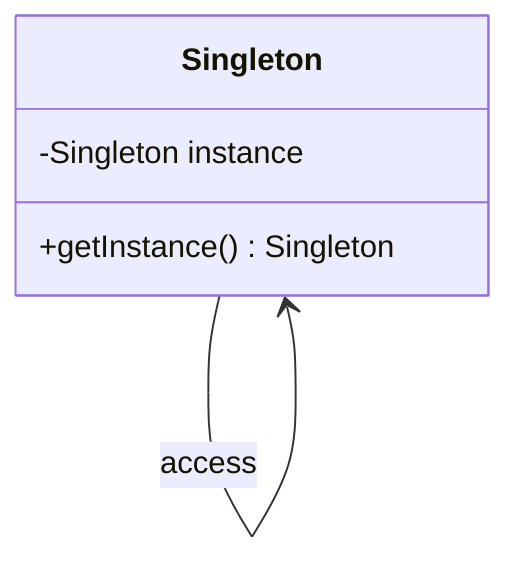
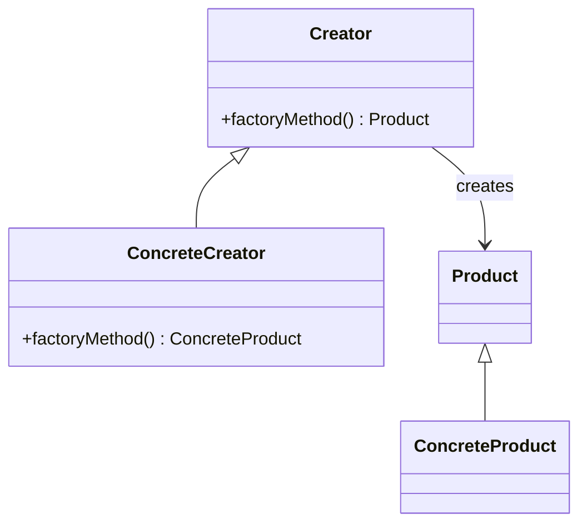
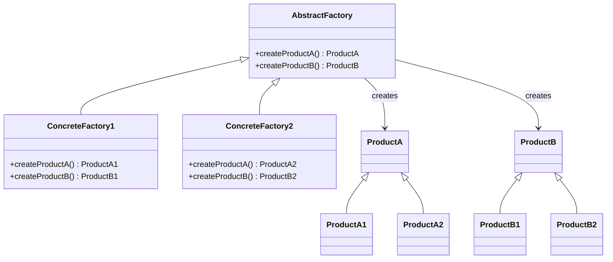
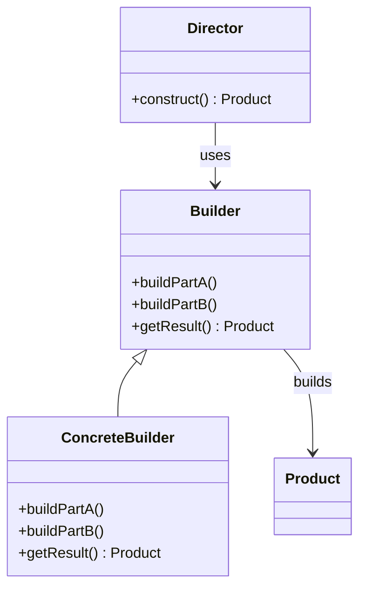
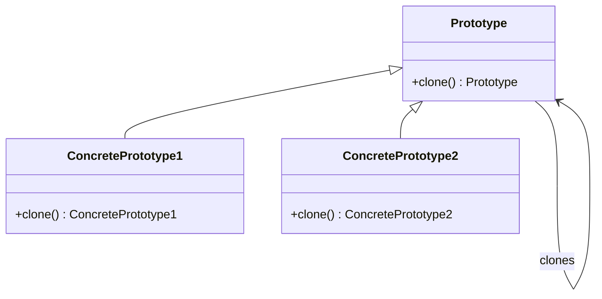

## 3.1. Overview of Creational Patterns

In the realm of software design, creational patterns play a pivotal role in object creation mechanisms, enhancing flexibility and reuse of existing code. These patterns abstract the instantiation process, making a system independent of how its objects are created, composed, and represented. By understanding and applying creational patterns, developers can write code that is more modular, maintainable, and scalable.

### Purpose and Use Cases

Creational patterns are essential for managing the complexities of object creation. They provide various mechanisms to create objects in a manner suitable to the situation. Let's delve into the purpose and use cases of creational patterns:

#### Purpose of Creational Patterns

1. **Encapsulation of Object Creation**: Creational patterns encapsulate the knowledge about which concrete classes the system uses, thus hiding the instantiation logic.
   
2. **Flexibility and Scalability**: By abstracting the instantiation process, creational patterns allow systems to be more flexible and scalable, accommodating new types of objects with minimal changes.

3. **Decoupling**: These patterns decouple the client code from the concrete classes it needs to instantiate, promoting a more modular architecture.

4. **Control Over Object Creation**: They provide control over the creation process, allowing for the management of complex creation logic, such as object pooling or lazy initialization.

#### Use Cases for Creational Patterns

1. **Complex Object Creation**: When the creation of an object involves complex processes, such as setting up numerous parameters or dependencies, creational patterns simplify this complexity.

2. **Resource Management**: In scenarios where resource management is critical, such as in object pooling, creational patterns help manage resources efficiently.

3. **System Independence**: When a system needs to be independent of how its objects are created or represented, creational patterns provide the necessary abstraction.

4. **Dynamic System Configuration**: In systems that require dynamic configuration or runtime object creation, these patterns offer the flexibility needed to adapt to changing requirements.

### Choosing the Right Creational Pattern

Selecting the appropriate creational pattern depends on the specific requirements and constraints of your project. Here are some guidelines to help you choose the right pattern:

1. **Singleton Pattern**: Use this pattern when you need to ensure that a class has only one instance and provide a global point of access to it. It's ideal for managing shared resources, such as configuration settings or connection pools.

2. **Factory Method Pattern**: Opt for this pattern when you need to delegate the instantiation of objects to subclasses. It is useful when a class cannot anticipate the class of objects it must create.

3. **Abstract Factory Pattern**: Choose this pattern when you need to create families of related or dependent objects without specifying their concrete classes. It is suitable for systems that require a high degree of flexibility and extensibility.

4. **Builder Pattern**: This pattern is ideal when you need to construct complex objects step by step. It is particularly useful when the construction process involves several steps or when the object needs to be immutable.

5. **Prototype Pattern**: Use this pattern when you need to create new objects by copying existing ones. It is beneficial in scenarios where object creation is costly, and you want to avoid the overhead of creating new instances from scratch.

6. **Object Pool Pattern**: This pattern is suitable when you need to manage a pool of reusable objects, such as database connections or thread pools. It helps optimize resource usage and improve performance.

7. **Dependency Injection Pattern**: Consider this pattern when you want to decouple the creation of an object from its behavior. It is useful for managing dependencies and promoting testability.

### Visualizing Creational Patterns

To better understand how creational patterns work, let's visualize them using diagrams. These diagrams will help illustrate the relationships and interactions between different components involved in the pattern.

#### Singleton Pattern Diagram



**Description**: The Singleton pattern ensures that a class has only one instance and provides a global point of access to it. The `getInstance` method is responsible for returning the single instance of the class.

#### Factory Method Pattern Diagram



**Description**: The Factory Method pattern defines an interface for creating an object but lets subclasses alter the type of objects that will be created. The `ConcreteCreator` class overrides the `factoryMethod` to return an instance of `ConcreteProduct`.

#### Abstract Factory Pattern Diagram



**Description**: The Abstract Factory pattern provides an interface for creating families of related or dependent objects without specifying their concrete classes. `ConcreteFactory1` and `ConcreteFactory2` implement the `AbstractFactory` interface to create specific products.

#### Builder Pattern Diagram



**Description**: The Builder pattern separates the construction of a complex object from its representation. The `Director` class constructs the object using the `Builder` interface, which is implemented by `ConcreteBuilder`.

#### Prototype Pattern Diagram



**Description**: The Prototype pattern creates new objects by copying existing ones. The `clone` method is responsible for creating a new instance of the object.

### Sample Code Snippets

Let's explore some pseudocode examples to illustrate how these creational patterns can be implemented.

#### Singleton Pattern Pseudocode

```pseudocode
class Singleton {
    private static instance = null

    private Singleton() {
        // Private constructor to prevent instantiation
    }

    public static getInstance() {
        if (instance == null) {
            instance = new Singleton()
        }
        return instance
    }
}
```

**Explanation**: The `Singleton` class has a private constructor to prevent direct instantiation. The `getInstance` method checks if an instance already exists; if not, it creates one.

#### Factory Method Pattern Pseudocode

```pseudocode
abstract class Creator {
    public abstract factoryMethod()

    public someOperation() {
        product = factoryMethod()
        // Use the product
    }
}

class ConcreteCreator extends Creator {
    public factoryMethod() {
        return new ConcreteProduct()
    }
}
```

**Explanation**: The `Creator` class defines an abstract `factoryMethod` that subclasses must implement. The `ConcreteCreator` class provides the implementation for creating `ConcreteProduct`.

#### Abstract Factory Pattern Pseudocode

```pseudocode
interface AbstractFactory {
    createProductA()
    createProductB()
}

class ConcreteFactory1 implements AbstractFactory {
    public createProductA() {
        return new ProductA1()
    }

    public createProductB() {
        return new ProductB1()
    }
}

class ConcreteFactory2 implements AbstractFactory {
    public createProductA() {
        return new ProductA2()
    }

    public createProductB() {
        return new ProductB2()
    }
}
```

**Explanation**: The `AbstractFactory` interface defines methods for creating products. `ConcreteFactory1` and `ConcreteFactory2` implement these methods to create specific product variants.

#### Builder Pattern Pseudocode

```pseudocode
class Builder {
    public buildPartA()
    public buildPartB()
    public getResult()
}

class ConcreteBuilder extends Builder {
    private product = new Product()

    public buildPartA() {
        // Build part A of the product
    }

    public buildPartB() {
        // Build part B of the product
    }

    public getResult() {
        return product
    }
}

class Director {
    private builder

    public construct() {
        builder.buildPartA()
        builder.buildPartB()
        return builder.getResult()
    }
}
```

**Explanation**: The `Builder` class defines methods for building parts of a product. The `ConcreteBuilder` class implements these methods, and the `Director` class uses the builder to construct the product.

#### Prototype Pattern Pseudocode

```pseudocode
abstract class Prototype {
    public abstract clone()
}

class ConcretePrototype1 extends Prototype {
    public clone() {
        return new ConcretePrototype1(this)
    }
}

class ConcretePrototype2 extends Prototype {
    public clone() {
        return new ConcretePrototype2(this)
    }
}
```

**Explanation**: The `Prototype` class defines an abstract `clone` method. `ConcretePrototype1` and `ConcretePrototype2` implement this method to create copies of themselves.

### Design Considerations

When choosing a creational pattern, consider the following:

1. **Complexity**: Evaluate the complexity of the object creation process. If it involves multiple steps or parameters, consider using the Builder pattern.

2. **Flexibility**: Determine the level of flexibility required. If you need to create families of related objects, the Abstract Factory pattern is a good choice.

3. **Performance**: Consider the performance implications of object creation. The Prototype pattern can be beneficial when creating new instances is costly.

4. **Resource Management**: If resource management is a concern, such as managing a pool of reusable objects, the Object Pool pattern is suitable.

5. **Dependency Management**: For managing dependencies and promoting testability, consider the Dependency Injection pattern.

### Differences and Similarities

Creational patterns can sometimes be confused with one another. Here are some distinctions:

- **Singleton vs. Factory Method**: The Singleton pattern ensures a single instance, while the Factory Method pattern delegates object creation to subclasses.

- **Abstract Factory vs. Builder**: The Abstract Factory pattern creates families of related objects, while the Builder pattern constructs complex objects step by step.

- **Prototype vs. Factory Method**: The Prototype pattern creates objects by copying existing ones, while the Factory Method pattern relies on subclasses to create objects.

### Try It Yourself

To deepen your understanding, try modifying the pseudocode examples provided. For instance, experiment with adding new product types in the Factory Method pattern or implementing a new builder in the Builder pattern. This hands-on approach will help solidify your grasp of creational patterns.

### Conclusion

Creational patterns are a cornerstone of software design, providing powerful tools for managing object creation. By understanding their purpose, use cases, and selection criteria, you can make informed decisions that enhance the flexibility, scalability, and maintainability of your code. Remember, mastering these patterns is a journey. Keep experimenting, stay curious, and enjoy the process!

## Quiz Time!



### What is the primary purpose of creational patterns?

- [x] To abstract the instantiation process and make a system independent of how objects are created
- [ ] To manage the lifecycle of objects
- [ ] To define the structure of an application
- [ ] To ensure that a class has only one instance

> **Explanation:** Creational patterns abstract the instantiation process, making a system independent of how its objects are created, composed, and represented.

### Which pattern is ideal for managing a pool of reusable objects?

- [ ] Singleton Pattern
- [ ] Factory Method Pattern
- [ ] Builder Pattern
- [x] Object Pool Pattern

> **Explanation:** The Object Pool pattern is suitable for managing a pool of reusable objects, optimizing resource usage and improving performance.

### In which scenario should you use the Prototype pattern?

- [ ] When you need to ensure a single instance of a class
- [x] When you need to create new objects by copying existing ones
- [ ] When you need to delegate object creation to subclasses
- [ ] When you need to construct complex objects step by step

> **Explanation:** The Prototype pattern is beneficial in scenarios where object creation is costly, and you want to avoid the overhead of creating new instances from scratch.

### What is a key benefit of the Builder pattern?

- [ ] It ensures a single instance of a class
- [x] It constructs complex objects step by step
- [ ] It creates families of related objects
- [ ] It manages a pool of reusable objects

> **Explanation:** The Builder pattern is ideal when you need to construct complex objects step by step, especially when the construction process involves several steps.

### Which pattern should you choose when you need to create families of related objects?

- [ ] Singleton Pattern
- [ ] Factory Method Pattern
- [x] Abstract Factory Pattern
- [ ] Prototype Pattern

> **Explanation:** The Abstract Factory pattern is suitable for creating families of related or dependent objects without specifying their concrete classes.

### What is the main difference between the Singleton and Factory Method patterns?

- [x] Singleton ensures a single instance, while Factory Method delegates object creation to subclasses
- [ ] Singleton creates families of related objects, while Factory Method constructs complex objects
- [ ] Singleton manages a pool of reusable objects, while Factory Method ensures a single instance
- [ ] Singleton constructs complex objects, while Factory Method creates families of related objects

> **Explanation:** The Singleton pattern ensures a single instance, while the Factory Method pattern delegates object creation to subclasses.

### How does the Abstract Factory pattern differ from the Builder pattern?

- [ ] Abstract Factory constructs complex objects, while Builder creates families of related objects
- [x] Abstract Factory creates families of related objects, while Builder constructs complex objects step by step
- [ ] Abstract Factory manages a pool of reusable objects, while Builder ensures a single instance
- [ ] Abstract Factory ensures a single instance, while Builder manages a pool of reusable objects

> **Explanation:** The Abstract Factory pattern creates families of related objects, while the Builder pattern constructs complex objects step by step.

### What is a key consideration when choosing a creational pattern?

- [ ] The number of classes in the system
- [ ] The programming language used
- [x] The complexity of the object creation process
- [ ] The number of developers on the team

> **Explanation:** When choosing a creational pattern, consider the complexity of the object creation process, as it can influence the choice of pattern.

### Which pattern is useful for managing dependencies and promoting testability?

- [ ] Singleton Pattern
- [ ] Factory Method Pattern
- [ ] Prototype Pattern
- [x] Dependency Injection Pattern

> **Explanation:** The Dependency Injection pattern is useful for managing dependencies and promoting testability by decoupling the creation of an object from its behavior.

### True or False: The Prototype pattern is beneficial when creating new instances is inexpensive.

- [ ] True
- [x] False

> **Explanation:** The Prototype pattern is beneficial when creating new instances is costly, as it allows for creating new objects by copying existing ones.


