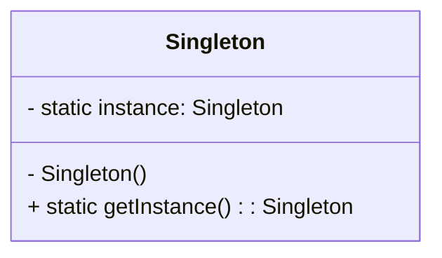

## 3.2. Singleton Pattern

The Singleton Pattern is a widely recognized creational design pattern that ensures a class has only one instance and provides a global point of access to that instance. This pattern is particularly useful when exactly one object is needed to coordinate actions across the system. In this section, we will delve into the intent and motivation behind the Singleton Pattern, explore its applicability through examples, provide a detailed pseudocode implementation, and discuss its advantages and disadvantages.

### Intent and Motivation

The primary intent of the Singleton Pattern is to control object creation, limiting the number of instances to one. This is particularly useful in scenarios where a single instance of a class is required to coordinate actions, manage shared resources, or maintain a consistent state across the application.

#### Key Motivations:

- **Resource Management**: When managing shared resources such as database connections, a Singleton can ensure that only one instance is used, preventing resource conflicts and reducing overhead.
- **Global Access**: The Singleton Pattern provides a global point of access to the instance, making it easy to access the shared resource from anywhere in the application.
- **Consistency**: By ensuring that only one instance of a class exists, the Singleton Pattern helps maintain a consistent state across the application.

### Applicability and Examples

The Singleton Pattern is applicable in various scenarios where a single instance is required. Here are some common examples:

- **Configuration Management**: In applications where configuration settings need to be accessed globally, a Singleton can be used to manage these settings.
- **Logging**: A Singleton can be used to manage logging operations, ensuring that all parts of the application log to the same file or console.
- **Caching**: When caching data, a Singleton can ensure that all parts of the application access the same cache, reducing redundancy and improving performance.
- **Thread Pool Management**: A Singleton can manage a pool of threads, ensuring that the same pool is used throughout the application.

### Pseudocode Implementation

Let's explore how the Singleton Pattern can be implemented using pseudocode. We'll start with a basic implementation and then discuss variations and enhancements.

#### Basic Singleton Implementation

```pseudocode
class Singleton {
    private static instance: Singleton

    // Private constructor to prevent instantiation
    private Singleton() {}

    // Method to get the instance of the Singleton
    public static getInstance(): Singleton {
        if (instance == null) {
            instance = new Singleton()
        }
        return instance
    }
}
```

**Explanation:**

- **Private Constructor**: The constructor is private to prevent direct instantiation of the class.
- **Static Instance**: A static variable holds the single instance of the class.
- **getInstance Method**: This method checks if the instance is null. If it is, it creates a new instance. Otherwise, it returns the existing instance.

#### Thread-Safe Singleton

In a multithreaded environment, the basic Singleton implementation may lead to multiple instances being created. To prevent this, we can make the Singleton thread-safe.

```pseudocode
class Singleton {
    private static instance: Singleton
    private static lock: Lock = new Lock()

    private Singleton() {}

    public static getInstance(): Singleton {
        lock.acquire()
        try {
            if (instance == null) {
                instance = new Singleton()
            }
        } finally {
            lock.release()
        }
        return instance
    }
}
```

**Explanation:**

- **Lock Mechanism**: A lock is used to ensure that only one thread can execute the getInstance method at a time, preventing multiple instances from being created.

#### Double-Checked Locking

Double-checked locking is an optimization to reduce the overhead of acquiring a lock every time the getInstance method is called.

```pseudocode
class Singleton {
    private static volatile instance: Singleton
    private static lock: Lock = new Lock()

    private Singleton() {}

    public static getInstance(): Singleton {
        if (instance == null) {
            lock.acquire()
            try {
                if (instance == null) {
                    instance = new Singleton()
                }
            } finally {
                lock.release()
            }
        }
        return instance
    }
}
```

**Explanation:**

- **Volatile Keyword**: The instance variable is declared volatile to ensure visibility of changes across threads.
- **Double Check**: The instance is checked twice, once before acquiring the lock and once after, to minimize synchronization overhead.

### Advantages and Disadvantages

#### Advantages

- **Controlled Access**: The Singleton Pattern provides controlled access to the single instance, ensuring that only one instance exists.
- **Reduced Overhead**: By sharing a single instance, the pattern reduces the overhead associated with creating and managing multiple instances.
- **Consistency**: The Singleton Pattern ensures a consistent state across the application by providing a single point of access to the instance.

#### Disadvantages

- **Global State**: The Singleton Pattern introduces a global state, which can lead to hidden dependencies and make testing difficult.
- **Limited Scalability**: In some cases, the Singleton Pattern can limit scalability, as it restricts the number of instances to one.
- **Complexity in Multithreading**: Ensuring thread safety in a Singleton can introduce complexity and potential performance bottlenecks.

### Visualizing the Singleton Pattern

To better understand the Singleton Pattern, let's visualize its structure using a class diagram.



**Diagram Explanation:**

- **Singleton Class**: The class has a private static instance variable and a private constructor.
- **getInstance Method**: The public static method provides access to the single instance.

### Design Considerations

When implementing the Singleton Pattern, consider the following:

- **Lazy Initialization**: Decide whether to use lazy initialization (creating the instance when needed) or eager initialization (creating the instance at startup).
- **Thread Safety**: In multithreaded environments, ensure that the Singleton is thread-safe to prevent multiple instances from being created.
- **Testing**: Be mindful of the challenges the Singleton Pattern introduces in testing, such as hidden dependencies and global state.

### Differences and Similarities

The Singleton Pattern is often compared to other creational patterns, such as Factory Method and Abstract Factory. Here are some key differences and similarities:

- **Singleton vs. Factory Method**: While the Singleton Pattern ensures a single instance, the Factory Method Pattern is used to create instances based on a specific interface or class.
- **Singleton vs. Abstract Factory**: The Abstract Factory Pattern provides an interface for creating families of related objects, whereas the Singleton Pattern focuses on a single instance.
- **Similarities**: Both Singleton and Factory patterns are creational patterns that manage object creation, but they serve different purposes.

### Try It Yourself

Now that we've explored the Singleton Pattern, try implementing it in your preferred programming language. Experiment with different variations, such as thread-safe and double-checked locking, to see how they affect performance and behavior.

### Knowledge Check

Before we conclude, let's reinforce what we've learned with some questions and exercises:

- **Question**: What is the primary intent of the Singleton Pattern?
- **Exercise**: Implement a thread-safe Singleton in pseudocode, ensuring that only one instance is created in a multithreaded environment.
- **Question**: What are the advantages and disadvantages of using the Singleton Pattern?

### Embrace the Journey

Remember, mastering design patterns is a journey. The Singleton Pattern is just one of many patterns you'll encounter. As you continue to explore and apply these patterns, you'll gain a deeper understanding of software design and architecture. Keep experimenting, stay curious, and enjoy the journey!

## Quiz Time!



### What is the primary intent of the Singleton Pattern?

- [x] To ensure a class has only one instance and provide a global point of access to it.
- [ ] To create multiple instances of a class.
- [ ] To manage the lifecycle of objects.
- [ ] To define a family of algorithms.

> **Explanation:** The Singleton Pattern ensures a class has only one instance and provides a global point of access to it, making it ideal for managing shared resources.

### Which of the following is a common use case for the Singleton Pattern?

- [x] Configuration management
- [ ] Sorting algorithms
- [ ] Data encryption
- [ ] User authentication

> **Explanation:** The Singleton Pattern is commonly used for configuration management, where a single instance is needed to manage global settings.

### How does the Singleton Pattern ensure only one instance is created?

- [x] By using a private constructor and a static method to control instance creation.
- [ ] By using a public constructor.
- [ ] By creating multiple instances and selecting one.
- [ ] By using a factory method.

> **Explanation:** The Singleton Pattern uses a private constructor to prevent direct instantiation and a static method to control instance creation.

### What is a disadvantage of the Singleton Pattern?

- [x] It introduces a global state, which can lead to hidden dependencies.
- [ ] It allows multiple instances to be created.
- [ ] It simplifies testing.
- [ ] It improves scalability.

> **Explanation:** The Singleton Pattern introduces a global state, which can lead to hidden dependencies and make testing difficult.

### What is the purpose of the volatile keyword in a thread-safe Singleton?

- [x] To ensure visibility of changes to the instance variable across threads.
- [ ] To prevent the instance from being modified.
- [ ] To make the instance immutable.
- [ ] To increase performance.

> **Explanation:** The volatile keyword ensures that changes to the instance variable are visible across threads, preventing multiple instances from being created.

### What is double-checked locking?

- [x] An optimization to reduce the overhead of acquiring a lock every time the getInstance method is called.
- [ ] A method to create multiple instances.
- [ ] A technique to improve performance by avoiding locks.
- [ ] A way to ensure thread safety without locks.

> **Explanation:** Double-checked locking is an optimization to reduce the overhead of acquiring a lock every time the getInstance method is called, ensuring thread safety.

### Which of the following is a key motivation for using the Singleton Pattern?

- [x] Resource management
- [ ] Data encryption
- [ ] Sorting algorithms
- [ ] User authentication

> **Explanation:** Resource management is a key motivation for using the Singleton Pattern, as it ensures that only one instance is used to manage shared resources.

### What is a common challenge when testing a Singleton?

- [x] Hidden dependencies and global state
- [ ] Lack of instances
- [ ] Excessive memory usage
- [ ] Complex algorithms

> **Explanation:** Testing a Singleton can be challenging due to hidden dependencies and global state, which can make it difficult to isolate and test individual components.

### How can the Singleton Pattern affect scalability?

- [x] It can limit scalability by restricting the number of instances to one.
- [ ] It improves scalability by allowing multiple instances.
- [ ] It has no impact on scalability.
- [ ] It enhances scalability by distributing instances.

> **Explanation:** The Singleton Pattern can limit scalability by restricting the number of instances to one, which may not be suitable for all scenarios.

### True or False: The Singleton Pattern is only applicable in object-oriented programming.

- [ ] True
- [x] False

> **Explanation:** The Singleton Pattern is applicable across various programming paradigms, not just object-oriented programming, as it focuses on controlling object creation.




