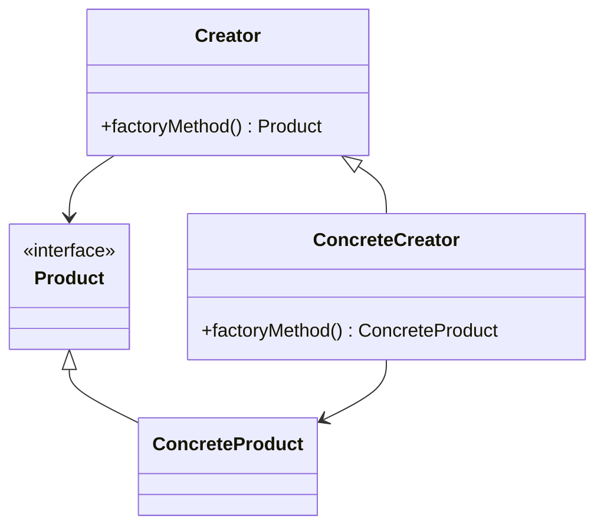

## 3.3. Factory Method Pattern

In the realm of software design, the Factory Method Pattern stands as a cornerstone of the creational design patterns. It provides a way to encapsulate object creation, offering flexibility and scalability in software architecture. This section delves into the Factory Method Pattern, exploring its intent, key participants, and implementation across different programming paradigms.

### Intent and Motivation

The Factory Method Pattern is designed to define an interface for creating an object, but it allows subclasses to alter the type of objects that will be created. This pattern is particularly useful when a class cannot anticipate the class of objects it must create, or when a class wants its subclasses to specify the objects it creates.

**Motivation:**

- **Decoupling Object Creation:** By using the Factory Method Pattern, we can decouple the client code from the concrete classes it needs to instantiate. This leads to more maintainable and flexible code.
- **Promoting Code Reusability:** The pattern encourages reusability by allowing new types of objects to be introduced with minimal changes to existing code.
- **Facilitating Testing and Maintenance:** With object creation encapsulated, testing becomes easier as mock objects can be introduced without altering the client code.

### Key Participants

The Factory Method Pattern involves several key participants:

1. **Product:** Defines the interface of objects the factory method creates.
2. **ConcreteProduct:** Implements the Product interface.
3. **Creator:** Declares the factory method, which returns an object of type Product. The Creator may also define a default implementation of the factory method that returns a default ConcreteProduct object.
4. **ConcreteCreator:** Overrides the factory method to return an instance of a ConcreteProduct.

### Diagrams

To better understand the Factory Method Pattern, let's visualize it using a class diagram:



**Diagram Explanation:** The diagram illustrates the relationship between the Creator and the ConcreteCreator, as well as between the Product and the ConcreteProduct. The Creator class declares the factory method, while the ConcreteCreator class provides the implementation.

### Applicability

The Factory Method Pattern is applicable in the following scenarios:

- When a class cannot anticipate the class of objects it must create.
- When a class wants its subclasses to specify the objects it creates.
- When classes delegate responsibility to one of several helper subclasses, and you want to localize the knowledge of which helper subclass is the delegate.

### Pseudocode Implementation

Let's explore a pseudocode implementation of the Factory Method Pattern. We'll consider a scenario where we need to create different types of documents (e.g., WordDocument, PDFDocument).

```pseudocode
// Product interface
interface Document {
    method open()
    method close()
    method save()
}

// ConcreteProduct implementations
class WordDocument implements Document {
    method open() {
        // Open Word document
    }
    method close() {
        // Close Word document
    }
    method save() {
        // Save Word document
    }
}

class PDFDocument implements Document {
    method open() {
        // Open PDF document
    }
    method close() {
        // Close PDF document
    }
    method save() {
        // Save PDF document
    }
}

// Creator class
abstract class DocumentCreator {
    method createDocument() Document
}

// ConcreteCreator implementations
class WordDocumentCreator extends DocumentCreator {
    method createDocument() Document {
        return new WordDocument()
    }
}

class PDFDocumentCreator extends DocumentCreator {
    method createDocument() Document {
        return new PDFDocument()
    }
}

// Client code
function main() {
    creator = new WordDocumentCreator()
    document = creator.createDocument()
    document.open()
    document.save()
    document.close()
}
```

**Pseudocode Explanation:** In this implementation, we define a `Document` interface with methods `open`, `close`, and `save`. The `WordDocument` and `PDFDocument` classes implement this interface. The `DocumentCreator` class declares the `createDocument` method, which is overridden by `WordDocumentCreator` and `PDFDocumentCreator` to return specific document types.

### Pros and Cons

**Pros:**

- **Flexibility:** The Factory Method Pattern provides flexibility in terms of object creation, allowing new types of products to be introduced without altering existing client code.
- **Encapsulation:** By encapsulating the object creation process, the pattern promotes encapsulation and reduces dependencies between client code and concrete classes.
- **Scalability:** The pattern supports scalability by allowing new product types to be added with minimal changes to the existing codebase.

**Cons:**

- **Complexity:** The pattern can introduce additional complexity due to the creation of multiple classes and interfaces.
- **Overhead:** In some cases, the overhead of creating new subclasses for each product type may not be justified, especially for simple object creation tasks.

### Design Considerations

When implementing the Factory Method Pattern, consider the following:

- **Subclassing:** Ensure that the subclasses are designed to handle the specific product creation logic.
- **Interface Design:** Carefully design the product interface to accommodate different types of products.
- **Testing:** Leverage the encapsulation of object creation to facilitate testing by introducing mock objects.

### Differences and Similarities

The Factory Method Pattern is often compared to the Abstract Factory Pattern. While both patterns deal with object creation, they differ in scope and complexity:

- **Factory Method Pattern:** Focuses on creating a single product and allows subclasses to determine the product type.
- **Abstract Factory Pattern:** Provides an interface for creating families of related or dependent objects without specifying their concrete classes.

### Try It Yourself

To deepen your understanding of the Factory Method Pattern, try modifying the pseudocode example to include a new document type, such as `SpreadsheetDocument`. Consider how the changes affect the existing codebase and how the pattern facilitates this extension.

### Knowledge Check

- What are the key participants in the Factory Method Pattern?
- How does the Factory Method Pattern promote flexibility in software design?
- What are some potential drawbacks of using the Factory Method Pattern?

### Embrace the Journey

Remember, mastering design patterns is a journey. As you explore the Factory Method Pattern, consider how it can be applied to your own projects. Keep experimenting, stay curious, and enjoy the process of learning and growing as a software engineer.

## Quiz Time!



### What is the primary intent of the Factory Method Pattern?

- [x] To define an interface for creating an object, but allow subclasses to alter the type of objects that will be created.
- [ ] To create a single instance of a class.
- [ ] To provide an interface for creating families of related or dependent objects.
- [ ] To encapsulate a group of individual factories.

> **Explanation:** The Factory Method Pattern is intended to define an interface for creating an object, but allows subclasses to alter the type of objects that will be created.

### Which of the following is a key participant in the Factory Method Pattern?

- [x] Creator
- [ ] Singleton
- [ ] Adapter
- [ ] Observer

> **Explanation:** The Creator is a key participant in the Factory Method Pattern, responsible for declaring the factory method.

### What is a potential drawback of the Factory Method Pattern?

- [x] It can introduce additional complexity due to the creation of multiple classes and interfaces.
- [ ] It limits the flexibility of object creation.
- [ ] It requires a global point of access to the instance.
- [ ] It cannot be used in conjunction with other patterns.

> **Explanation:** The Factory Method Pattern can introduce additional complexity due to the creation of multiple classes and interfaces.

### How does the Factory Method Pattern promote code reusability?

- [x] By allowing new types of objects to be introduced with minimal changes to existing code.
- [ ] By ensuring that only one instance of a class is created.
- [ ] By encapsulating a group of individual factories.
- [ ] By providing a global point of access to the instance.

> **Explanation:** The Factory Method Pattern promotes code reusability by allowing new types of objects to be introduced with minimal changes to existing code.

### In the Factory Method Pattern, what does the ConcreteCreator do?

- [x] It overrides the factory method to return an instance of a ConcreteProduct.
- [ ] It declares the factory method.
- [ ] It provides an interface for creating families of related objects.
- [ ] It ensures that only one instance of a class is created.

> **Explanation:** The ConcreteCreator overrides the factory method to return an instance of a ConcreteProduct.

### Which pattern is often compared to the Factory Method Pattern?

- [x] Abstract Factory Pattern
- [ ] Singleton Pattern
- [ ] Observer Pattern
- [ ] Adapter Pattern

> **Explanation:** The Abstract Factory Pattern is often compared to the Factory Method Pattern, as both deal with object creation.

### What is the role of the Product in the Factory Method Pattern?

- [x] It defines the interface of objects the factory method creates.
- [ ] It declares the factory method.
- [ ] It overrides the factory method to return an instance of a ConcreteProduct.
- [ ] It provides a global point of access to the instance.

> **Explanation:** The Product defines the interface of objects the factory method creates.

### How does the Factory Method Pattern facilitate testing?

- [x] By encapsulating object creation, allowing mock objects to be introduced without altering client code.
- [ ] By ensuring that only one instance of a class is created.
- [ ] By providing a global point of access to the instance.
- [ ] By encapsulating a group of individual factories.

> **Explanation:** The Factory Method Pattern facilitates testing by encapsulating object creation, allowing mock objects to be introduced without altering client code.

### True or False: The Factory Method Pattern is only applicable in object-oriented programming.

- [ ] True
- [x] False

> **Explanation:** False. The Factory Method Pattern can be adapted and applied across different programming paradigms, including functional programming.

### What should you consider when implementing the Factory Method Pattern?

- [x] Subclassing, interface design, and testing.
- [ ] Ensuring only one instance of a class is created.
- [ ] Providing a global point of access to the instance.
- [ ] Encapsulating a group of individual factories.

> **Explanation:** When implementing the Factory Method Pattern, consider subclassing, interface design, and testing.




