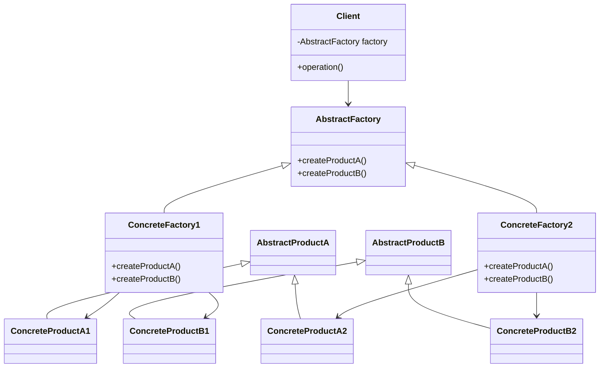

## 3.4. Abstract Factory Pattern

In the realm of software design, the Abstract Factory Pattern stands as a pivotal creational design pattern, offering a robust solution for creating families of related or dependent objects without specifying their concrete classes. This pattern is instrumental in promoting flexibility and scalability in software architecture, making it a cornerstone for expert developers and architects aiming to build maintainable and adaptable systems.

### Intent and Motivation

The primary intent of the Abstract Factory Pattern is to provide an interface for creating families of related or dependent objects without specifying their concrete classes. This pattern is particularly useful when a system needs to be independent of how its objects are created, composed, and represented.

#### Key Motivations:

- **Decoupling Object Creation**: By abstracting the process of object creation, the Abstract Factory Pattern decouples the client code from the concrete classes it needs to instantiate. This promotes a higher level of flexibility and reduces the dependency on specific implementations.
  
- **Enhancing Scalability**: As systems evolve, the need to introduce new product families or variants often arises. The Abstract Factory Pattern facilitates this by allowing new factories to be added with minimal changes to existing code.

- **Promoting Consistency**: When multiple related objects are required to work together, the Abstract Factory Pattern ensures that they are compatible and consistent, as they are created through a unified interface.

### Structure and Participants

The Abstract Factory Pattern is composed of several key participants that collaborate to achieve its objectives:

#### Participants:

1. **AbstractFactory**: Declares an interface for operations that create abstract product objects.
2. **ConcreteFactory**: Implements the operations to create concrete product objects.
3. **AbstractProduct**: Declares an interface for a type of product object.
4. **ConcreteProduct**: Defines a product object to be created by the corresponding concrete factory and implements the AbstractProduct interface.
5. **Client**: Uses only interfaces declared by AbstractFactory and AbstractProduct classes.

#### Structure:

The structure of the Abstract Factory Pattern can be visualized using a class diagram, which illustrates the relationships between the various participants.



**Diagram Description**: The diagram above shows the Abstract Factory Pattern's structure, highlighting the relationships between the abstract factory, concrete factories, abstract products, and concrete products. The client interacts with the abstract factory to obtain product instances, thereby decoupling itself from the concrete implementations.

### Pseudocode Implementation

To better understand the Abstract Factory Pattern, let's delve into a pseudocode implementation. This example will illustrate how the pattern can be applied to create a family of related products.

#### Problem Statement

Consider a scenario where we need to create a user interface toolkit that supports multiple themes, such as "Light" and "Dark." Each theme consists of related components like buttons and checkboxes. The Abstract Factory Pattern can be used to encapsulate the creation of these theme-specific components.

#### Pseudocode

```pseudocode
// Abstract Factory Interface
interface ThemeFactory {
    createButton(): Button
    createCheckbox(): Checkbox
}

// Concrete Factory for Light Theme
class LightThemeFactory implements ThemeFactory {
    createButton(): Button {
        return new LightButton()
    }
    createCheckbox(): Checkbox {
        return new LightCheckbox()
    }
}

// Concrete Factory for Dark Theme
class DarkThemeFactory implements ThemeFactory {
    createButton(): Button {
        return new DarkButton()
    }
    createCheckbox(): Checkbox {
        return new DarkCheckbox()
    }
}

// Abstract Product for Button
interface Button {
    render(): void
}

// Concrete Product for Light Button
class LightButton implements Button {
    render(): void {
        print("Rendering Light Button")
    }
}

// Concrete Product for Dark Button
class DarkButton implements Button {
    render(): void {
        print("Rendering Dark Button")
    }
}

// Abstract Product for Checkbox
interface Checkbox {
    render(): void
}

// Concrete Product for Light Checkbox
class LightCheckbox implements Checkbox {
    render(): void {
        print("Rendering Light Checkbox")
    }
}

// Concrete Product for Dark Checkbox
class DarkCheckbox implements Checkbox {
    render(): void {
        print("Rendering Dark Checkbox")
    }
}

// Client Code
class Application {
    private factory: ThemeFactory

    constructor(factory: ThemeFactory) {
        this.factory = factory
    }

    renderUI(): void {
        button = this.factory.createButton()
        checkbox = this.factory.createCheckbox()
        button.render()
        checkbox.render()
    }
}

// Usage
themeFactory = new LightThemeFactory()
app = new Application(themeFactory)
app.renderUI()

themeFactory = new DarkThemeFactory()
app = new Application(themeFactory)
app.renderUI()
```

**Explanation**: In this pseudocode, we define an `AbstractFactory` interface `ThemeFactory` with methods to create abstract products `Button` and `Checkbox`. Concrete factories `LightThemeFactory` and `DarkThemeFactory` implement these methods to create theme-specific components. The client `Application` uses the factory to render the UI without knowing the concrete classes of the products.

### Real-World Examples

The Abstract Factory Pattern is widely used in software development, particularly in scenarios where systems need to be platform-independent or support multiple configurations.

#### Example 1: Cross-Platform UI Libraries

Many cross-platform UI libraries, such as Qt and Java's AWT/Swing, use the Abstract Factory Pattern to provide a consistent interface for creating UI components across different operating systems. This allows developers to write code that is independent of the underlying platform, promoting code reuse and reducing maintenance efforts.

#### Example 2: Database Connection Libraries

Database connection libraries often use the Abstract Factory Pattern to support multiple database engines. By providing a unified interface for creating connections, executing queries, and handling transactions, these libraries enable applications to switch between different databases with minimal code changes.

#### Example 3: Game Development

In game development, the Abstract Factory Pattern can be used to create different types of game objects, such as characters, weapons, and environments, based on the current game level or theme. This allows for flexible game design and easy addition of new levels or themes.

### Design Considerations

When implementing the Abstract Factory Pattern, several design considerations should be kept in mind:

- **Complexity**: The Abstract Factory Pattern can introduce additional complexity due to the increased number of classes and interfaces. Ensure that the benefits of using the pattern outweigh the added complexity.

- **Extensibility**: The pattern facilitates the addition of new product families by introducing new concrete factories. However, adding new products to an existing family may require changes to the abstract factory interface and all its concrete implementations.

- **Consistency**: Ensure that all products created by a concrete factory are compatible and consistent with each other, as they are intended to be used together.

### Differences and Similarities

The Abstract Factory Pattern is often compared with other creational patterns, such as the Factory Method Pattern and the Builder Pattern. Understanding their differences and similarities is crucial for selecting the appropriate pattern for a given scenario.

- **Factory Method Pattern**: While both patterns deal with object creation, the Factory Method Pattern focuses on creating a single product, whereas the Abstract Factory Pattern deals with creating families of related products.

- **Builder Pattern**: The Builder Pattern is used to construct complex objects step by step, allowing for greater control over the construction process. In contrast, the Abstract Factory Pattern focuses on creating a set of related objects.

### Try It Yourself

To deepen your understanding of the Abstract Factory Pattern, try modifying the pseudocode example provided:

- **Add a New Theme**: Introduce a new theme, such as "High Contrast," by creating a new concrete factory and corresponding product classes. Update the client code to support the new theme.

- **Extend Product Families**: Add a new product type, such as `Slider`, to the existing themes. Update the abstract factory interface and all concrete factories to support the new product.

### Conclusion

The Abstract Factory Pattern is a powerful tool for creating families of related objects while maintaining flexibility and scalability in software design. By decoupling object creation from concrete implementations, this pattern promotes code reuse and adaptability, making it an essential pattern for expert developers and architects.

Remember, mastering design patterns is a journey. As you continue to explore and apply these patterns, you'll gain deeper insights into their nuances and applications. Keep experimenting, stay curious, and enjoy the journey!

## Quiz Time!



### What is the primary intent of the Abstract Factory Pattern?

- [x] To provide an interface for creating families of related or dependent objects without specifying their concrete classes.
- [ ] To create a single object with a complex construction process.
- [ ] To ensure a class has only one instance.
- [ ] To define a family of algorithms.

> **Explanation:** The Abstract Factory Pattern's primary intent is to provide an interface for creating families of related or dependent objects without specifying their concrete classes.

### Which participant in the Abstract Factory Pattern declares an interface for creating abstract product objects?

- [x] AbstractFactory
- [ ] ConcreteFactory
- [ ] AbstractProduct
- [ ] Client

> **Explanation:** The AbstractFactory participant declares an interface for creating abstract product objects.

### In the provided pseudocode, what role does the `ThemeFactory` play?

- [x] It acts as the AbstractFactory.
- [ ] It acts as the ConcreteFactory.
- [ ] It acts as the AbstractProduct.
- [ ] It acts as the Client.

> **Explanation:** The `ThemeFactory` in the pseudocode acts as the AbstractFactory, providing an interface for creating theme-specific components.

### How does the Abstract Factory Pattern promote consistency?

- [x] By ensuring that all products created by a concrete factory are compatible and consistent with each other.
- [ ] By simplifying the construction process of a single complex object.
- [ ] By enforcing a single instance of a class.
- [ ] By defining a family of algorithms.

> **Explanation:** The Abstract Factory Pattern promotes consistency by ensuring that all products created by a concrete factory are compatible and consistent with each other.

### What is a potential drawback of using the Abstract Factory Pattern?

- [x] It can introduce additional complexity due to the increased number of classes and interfaces.
- [ ] It limits the flexibility of object creation.
- [ ] It enforces a single instance of a class.
- [ ] It makes it difficult to add new product families.

> **Explanation:** A potential drawback of using the Abstract Factory Pattern is that it can introduce additional complexity due to the increased number of classes and interfaces.

### Which pattern is often compared with the Abstract Factory Pattern for dealing with object creation?

- [x] Factory Method Pattern
- [ ] Singleton Pattern
- [ ] Observer Pattern
- [ ] Strategy Pattern

> **Explanation:** The Factory Method Pattern is often compared with the Abstract Factory Pattern for dealing with object creation.

### In the context of the Abstract Factory Pattern, what is the role of the `Client`?

- [x] It uses only interfaces declared by AbstractFactory and AbstractProduct classes.
- [ ] It implements the operations to create concrete product objects.
- [ ] It declares an interface for a type of product object.
- [ ] It defines a product object to be created by the corresponding concrete factory.

> **Explanation:** In the context of the Abstract Factory Pattern, the `Client` uses only interfaces declared by AbstractFactory and AbstractProduct classes.

### What is a real-world example of the Abstract Factory Pattern?

- [x] Cross-platform UI libraries
- [ ] A single-instance configuration manager
- [ ] A notification system using the Observer Pattern
- [ ] A sorting algorithm using the Strategy Pattern

> **Explanation:** Cross-platform UI libraries are a real-world example of the Abstract Factory Pattern, providing a consistent interface for creating UI components across different operating systems.

### True or False: The Abstract Factory Pattern can be used to create a single complex object step by step.

- [ ] True
- [x] False

> **Explanation:** False. The Abstract Factory Pattern is used to create families of related objects, not a single complex object step by step. The Builder Pattern is used for constructing complex objects step by step.

### Which of the following is NOT a participant in the Abstract Factory Pattern?

- [ ] AbstractFactory
- [ ] ConcreteFactory
- [ ] AbstractProduct
- [x] Singleton

> **Explanation:** Singleton is not a participant in the Abstract Factory Pattern. The participants include AbstractFactory, ConcreteFactory, AbstractProduct, and ConcreteProduct.


