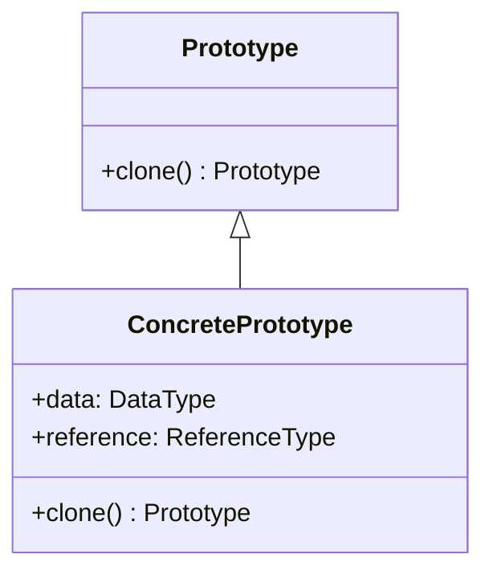

## 3.6. Prototype Pattern

The Prototype Pattern is a creational design pattern that focuses on the concept of cloning objects. It is particularly useful when the cost of creating a new instance of an object is more expensive than copying an existing instance. This pattern is widely used in scenarios where object creation is resource-intensive, and it provides a mechanism to create new objects by copying an existing object, known as the prototype.

### Intent and Motivation

The primary intent of the Prototype Pattern is to specify the kinds of objects to create using a prototypical instance and create new objects by copying this prototype. This pattern is motivated by the need to reduce the overhead associated with creating new objects, especially when the instantiation process is costly in terms of time or resources.

#### Key Benefits:

- **Efficiency**: Cloning an object can be more efficient than creating a new instance from scratch, especially if the object creation involves complex initialization.
- **Flexibility**: Allows for adding and removing objects at runtime by simply cloning existing prototypes.
- **Decoupling**: Reduces the dependency on specific classes by using a prototype interface for cloning.

### Cloning Objects

Cloning is the process of creating a new object that is a copy of an existing object. In the context of the Prototype Pattern, cloning can be categorized into two types: shallow copy and deep copy.

#### Shallow Copy

A shallow copy of an object copies the object's fields as they are. If the field is a primitive data type, its value is copied directly. However, if the field is a reference to an object, only the reference is copied, not the object itself. This means that both the original and the cloned object will reference the same object in memory.

#### Deep Copy

A deep copy, on the other hand, involves copying all fields of an object and the objects referenced by those fields, recursively. This means that the cloned object and the original object are completely independent of each other, with no shared references.

### Pseudocode Implementation

Let's explore the pseudocode implementation of the Prototype Pattern, focusing on both shallow and deep copying techniques.

#### Prototype Interface

First, define a prototype interface that declares a method for cloning objects.

```pseudocode
interface Prototype {
    method clone(): Prototype
}
```

#### Concrete Prototype Class

Next, implement the concrete prototype class that provides the actual implementation of the clone method.

```pseudocode
class ConcretePrototype implements Prototype {
    field data: DataType
    field reference: ReferenceType

    constructor(data: DataType, reference: ReferenceType) {
        this.data = data
        this.reference = reference
    }

    method clone(): Prototype {
        // Perform a shallow copy
        return new ConcretePrototype(this.data, this.reference)
    }
}
```

#### Client Code

The client code can use the prototype to create new objects by cloning.

```pseudocode
function main() {
    original = new ConcretePrototype(dataValue, referenceObject)
    clone = original.clone()

    // Verify that the clone is a separate instance
    assert clone != original
    assert clone.data == original.data
    assert clone.reference == original.reference
}
```

### Deep vs. Shallow Copy

Understanding the difference between deep and shallow copies is crucial when implementing the Prototype Pattern.

#### Shallow Copy Example

In the shallow copy example above, the `clone` method creates a new instance of `ConcretePrototype` but copies the reference to the `reference` field. This means changes to the `reference` object in the clone will affect the original object.

#### Deep Copy Implementation

To implement a deep copy, modify the `clone` method to create copies of the referenced objects as well.

```pseudocode
class ConcretePrototype implements Prototype {
    field data: DataType
    field reference: ReferenceType

    constructor(data: DataType, reference: ReferenceType) {
        this.data = data
        this.reference = reference
    }

    method clone(): Prototype {
        // Perform a deep copy
        clonedReference = this.reference.clone() // Assuming ReferenceType has a clone method
        return new ConcretePrototype(this.data, clonedReference)
    }
}
```

### Diagrams

To better understand the Prototype Pattern, let's visualize the cloning process using a class diagram.



**Diagram Description**: This class diagram illustrates the Prototype Pattern, where `ConcretePrototype` implements the `Prototype` interface. The `clone` method is responsible for creating a copy of the object.

### Key Participants

- **Prototype**: Declares an interface for cloning itself.
- **ConcretePrototype**: Implements the `clone` method to return a copy of itself.
- **Client**: Uses the prototype to create new objects by cloning.

### Applicability

The Prototype Pattern is applicable in the following scenarios:

- When the cost of creating a new object is more expensive than cloning an existing object.
- When the system should be independent of how its products are created, composed, and represented.
- When classes to be instantiated are specified at runtime.

### Design Considerations

When implementing the Prototype Pattern, consider the following:

- **Cloning Complexity**: Ensure that the cloning process is efficient and does not introduce unnecessary complexity.
- **Mutable vs. Immutable Objects**: Be cautious when cloning mutable objects, as changes to the clone may affect the original object if not handled properly.
- **Prototype Registry**: Consider maintaining a registry of prototypes to manage and access different prototypes easily.

### Differences and Similarities

The Prototype Pattern is often compared with other creational patterns like Factory Method and Abstract Factory. The key difference is that the Prototype Pattern relies on cloning existing instances rather than creating new instances from scratch.

- **Prototype vs. Factory Method**: The Factory Method creates objects through inheritance, while the Prototype Pattern creates objects by copying existing instances.
- **Prototype vs. Abstract Factory**: The Abstract Factory creates families of related objects, while the Prototype Pattern focuses on cloning a single object.

### Try It Yourself

To deepen your understanding of the Prototype Pattern, try modifying the pseudocode examples:

1. Implement a deep copy for a complex object with multiple references.
2. Create a prototype registry to manage different prototypes.
3. Experiment with cloning objects that have circular references.

### Knowledge Check

- What is the primary intent of the Prototype Pattern?
- How does a shallow copy differ from a deep copy?
- In what scenarios is the Prototype Pattern most beneficial?

### Embrace the Journey

Remember, mastering design patterns is a journey. As you explore the Prototype Pattern, you'll gain insights into efficient object creation and management. Keep experimenting, stay curious, and enjoy the process of learning and applying these concepts in your software development projects.

## Quiz Time!



### What is the primary intent of the Prototype Pattern?

- [x] To create new objects by cloning existing ones
- [ ] To define a family of algorithms
- [ ] To separate the construction of a complex object from its representation
- [ ] To encapsulate a request as an object

> **Explanation:** The Prototype Pattern's main intent is to create new objects by cloning existing ones, which can be more efficient than creating new instances from scratch.

### How does a shallow copy differ from a deep copy?

- [x] A shallow copy copies references to objects, while a deep copy duplicates the objects themselves
- [ ] A shallow copy duplicates objects, while a deep copy copies references to objects
- [ ] Both shallow and deep copies duplicate objects
- [ ] Both shallow and deep copies copy references to objects

> **Explanation:** A shallow copy copies the references to objects, meaning both the original and the copy share the same referenced objects. A deep copy duplicates the objects themselves, creating independent copies.

### In what scenarios is the Prototype Pattern most beneficial?

- [x] When object creation is resource-intensive
- [ ] When objects need to be created at compile time
- [ ] When objects are immutable
- [ ] When objects require complex initialization

> **Explanation:** The Prototype Pattern is beneficial when object creation is resource-intensive, as it allows for efficient cloning of existing objects.

### Which method is essential in the Prototype Pattern?

- [x] clone()
- [ ] create()
- [ ] build()
- [ ] initialize()

> **Explanation:** The `clone()` method is essential in the Prototype Pattern, as it is responsible for creating a copy of the object.

### What is a potential drawback of using the Prototype Pattern?

- [x] Cloning complexity
- [ ] Lack of flexibility
- [ ] Increased coupling
- [ ] Limited reusability

> **Explanation:** A potential drawback of the Prototype Pattern is the complexity involved in cloning objects, especially when dealing with deep copies and mutable objects.

### Which pattern is often compared with the Prototype Pattern?

- [x] Factory Method
- [ ] Singleton
- [ ] Observer
- [ ] Strategy

> **Explanation:** The Prototype Pattern is often compared with the Factory Method, as both are creational patterns with different approaches to object creation.

### What is the role of the Prototype interface?

- [x] To declare a method for cloning itself
- [ ] To manage object creation through inheritance
- [ ] To define a family of related objects
- [ ] To encapsulate a request as an object

> **Explanation:** The Prototype interface declares a method for cloning itself, which is implemented by concrete prototypes.

### How can a prototype registry be useful?

- [x] It manages and accesses different prototypes easily
- [ ] It increases the complexity of the system
- [ ] It limits the number of prototypes available
- [ ] It enforces strict type checking

> **Explanation:** A prototype registry can be useful for managing and accessing different prototypes easily, providing a centralized way to handle prototypes.

### True or False: The Prototype Pattern is only applicable in object-oriented programming.

- [ ] True
- [x] False

> **Explanation:** False. The Prototype Pattern can be applied across various programming paradigms, not just object-oriented programming.

### What is the main advantage of using a deep copy in the Prototype Pattern?

- [x] Independence of cloned objects
- [ ] Shared references between objects
- [ ] Reduced memory usage
- [ ] Simplified object structure

> **Explanation:** The main advantage of using a deep copy is the independence of cloned objects, ensuring that changes to one do not affect the other.


