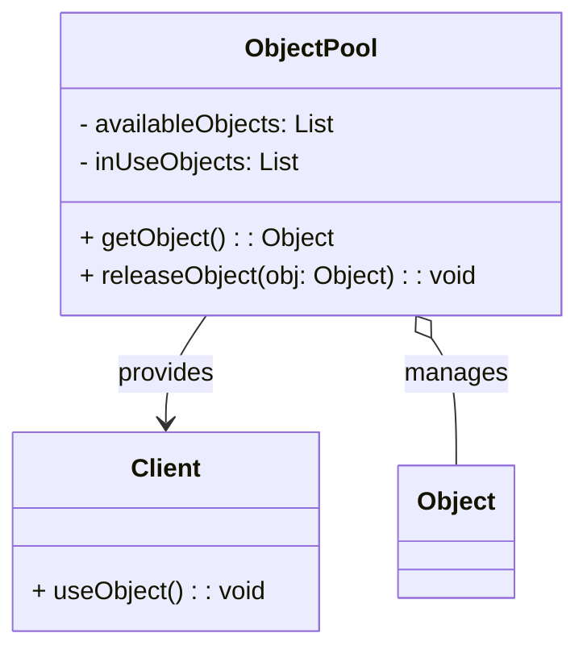
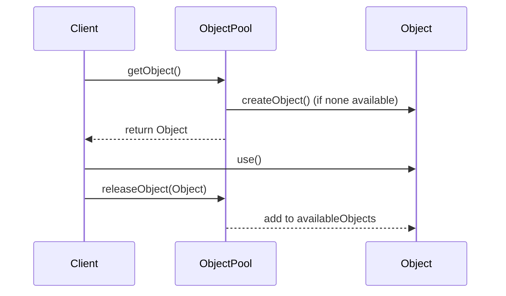

## 3.7. Object Pool Pattern

In the realm of software design, efficient resource management is crucial for building scalable and performant applications. The Object Pool Pattern is a creational design pattern that addresses this need by reusing objects instead of creating and destroying them repeatedly. This pattern is particularly useful in scenarios where object instantiation is costly in terms of time or system resources. In this section, we will delve into the intent and motivation behind the Object Pool Pattern, explore its implementation through pseudocode, and discuss its applicability and considerations.

### Intent and Motivation

The primary intent of the Object Pool Pattern is to manage a pool of reusable objects, optimizing resource utilization and improving application performance. By maintaining a set of initialized objects ready for use, the pattern minimizes the overhead associated with object creation and destruction. This is especially beneficial in resource-intensive applications, such as those involving database connections, network sockets, or large data structures.

#### Key Motivations:

1. **Performance Optimization**: Object creation can be resource-intensive, particularly for complex objects. By reusing objects, the Object Pool Pattern reduces the time and resources required for instantiation.
   
2. **Resource Management**: In environments with limited resources, such as mobile devices or embedded systems, efficient resource management is critical. The Object Pool Pattern helps conserve memory and processing power by reusing objects.

3. **Scalability**: Applications that handle a large number of concurrent operations, such as web servers or game engines, benefit from the scalability provided by object pooling. By reducing the overhead of object creation, the pattern supports higher throughput and responsiveness.

4. **Consistency**: By reusing objects, the pattern ensures consistent initialization and configuration, reducing the likelihood of errors associated with object setup.

### Diagrams

To better understand the Object Pool Pattern, let's visualize its structure and workflow using a class diagram and a sequence diagram.

#### Class Diagram



*Caption: The class diagram illustrates the relationship between the ObjectPool, Client, and Object classes. The ObjectPool manages a collection of available and in-use objects, providing them to clients as needed.*

#### Sequence Diagram



*Caption: The sequence diagram depicts the interaction between a client and the object pool. The client requests an object, uses it, and then releases it back to the pool.*

### Key Participants

1. **ObjectPool**: The core component that manages the pool of reusable objects. It is responsible for providing objects to clients and reclaiming them once they are no longer in use.

2. **Object**: The reusable resource managed by the pool. It can represent any object that is expensive to create or manage.

3. **Client**: The entity that requests objects from the pool and uses them for specific tasks.

### Applicability

The Object Pool Pattern is applicable in scenarios where:

- **Object Creation is Costly**: When creating objects involves significant computational overhead or resource allocation, such as database connections, thread creation, or large data structures.

- **High Frequency of Object Use**: In applications where objects are frequently requested and released, such as in server applications handling multiple client requests.

- **Limited Resources**: In environments with constrained resources, such as mobile applications or embedded systems, where efficient memory and CPU usage is critical.

### Pseudocode Implementation

Let's explore a pseudocode implementation of the Object Pool Pattern. This example demonstrates how to create and manage a pool of reusable objects.

```pseudocode
class ObjectPool:
    def __init__(self, max_size):
        self.available_objects = []
        self.in_use_objects = []
        self.max_size = max_size

    def get_object(self):
        if not self.available_objects and len(self.in_use_objects) < self.max_size:
            obj = self.create_object()
            self.in_use_objects.append(obj)
            return obj
        elif self.available_objects:
            obj = self.available_objects.pop()
            self.in_use_objects.append(obj)
            return obj
        else:
            raise Exception("No available objects in the pool")

    def release_object(self, obj):
        if obj in self.in_use_objects:
            self.in_use_objects.remove(obj)
            self.available_objects.append(obj)

    def create_object(self):
        # Create a new object (expensive operation)
        return Object()

class Object:
    def use(self):
        # Perform some operation with the object
        pass

pool = ObjectPool(max_size=10)
try:
    obj = pool.get_object()
    obj.use()
finally:
    pool.release_object(obj)
```

*Explanation:*

- **Initialization**: The `ObjectPool` class is initialized with a maximum size, which determines the maximum number of objects that can be in use at any given time.

- **Object Retrieval**: The `get_object` method checks if there are available objects in the pool. If not, it creates a new object if the pool has not reached its maximum size. The object is then added to the list of in-use objects and returned to the client.

- **Object Release**: The `release_object` method reclaims an object, moving it from the in-use list back to the available list.

- **Object Creation**: The `create_object` method simulates the creation of a new object, representing an expensive operation.

### Design Considerations

When implementing the Object Pool Pattern, consider the following:

1. **Thread Safety**: In multi-threaded environments, ensure that access to the pool is synchronized to prevent race conditions.

2. **Object Lifecycle**: Define clear rules for object initialization, usage, and cleanup to avoid resource leaks or inconsistent states.

3. **Pool Size Management**: Determine an appropriate pool size based on the application's resource requirements and usage patterns. An oversized pool can lead to wasted resources, while an undersized pool can cause bottlenecks.

4. **Object Validation**: Implement mechanisms to validate objects before returning them to clients. This ensures that objects are in a usable state and prevents errors.

5. **Resource Cleanup**: Provide mechanisms to clean up or dispose of objects that are no longer needed, especially in long-running applications.

### Differences and Similarities

The Object Pool Pattern shares similarities with other creational patterns, such as the Singleton Pattern, in terms of managing object instances. However, it differs in that it manages multiple instances rather than a single instance. Unlike the Factory Method Pattern, which focuses on object creation, the Object Pool Pattern emphasizes object reuse.

### Use Cases and Considerations

The Object Pool Pattern is widely used in various domains, including:

- **Database Connection Pools**: Managing a pool of database connections to optimize access and reduce latency in database-driven applications.

- **Thread Pools**: Reusing threads in multi-threaded applications to minimize the overhead of thread creation and destruction.

- **Graphics and Game Engines**: Reusing graphical objects, such as sprites or textures, to enhance performance in rendering-intensive applications.

- **Network Connections**: Managing a pool of network sockets or connections to improve communication efficiency in networked applications.

#### Considerations:

- **Overhead**: While the Object Pool Pattern reduces the cost of object creation, it introduces management overhead. Ensure that the benefits outweigh the costs in your specific use case.

- **Complexity**: Implementing an object pool adds complexity to the codebase. Evaluate whether the pattern is necessary or if simpler alternatives, such as lazy initialization, suffice.

- **Resource Leaks**: Improper management of objects can lead to resource leaks. Implement robust mechanisms for object reclamation and cleanup.

### Try It Yourself

To deepen your understanding of the Object Pool Pattern, try modifying the pseudocode example:

- **Experiment with Pool Size**: Change the maximum pool size and observe how it affects performance and resource utilization.

- **Implement Thread Safety**: Add synchronization mechanisms to handle concurrent access to the pool.

- **Extend Object Functionality**: Enhance the `Object` class with additional methods or properties to simulate real-world scenarios.

### Knowledge Check

- **What are the key motivations for using the Object Pool Pattern?**

- **How does the Object Pool Pattern differ from the Singleton Pattern?**

- **What are some common use cases for the Object Pool Pattern?**

### Embrace the Journey

Remember, mastering design patterns is a journey. The Object Pool Pattern is just one tool in your software design toolkit. As you continue to explore and experiment, you'll discover new ways to optimize resource management and enhance application performance. Stay curious, keep learning, and enjoy the journey!

## Quiz Time!



### What is the primary intent of the Object Pool Pattern?

- [x] To manage a pool of reusable objects and optimize resource utilization.
- [ ] To create a single instance of an object.
- [ ] To encapsulate object creation logic.
- [ ] To define a family of algorithms.

> **Explanation:** The Object Pool Pattern focuses on managing a pool of reusable objects to optimize resource utilization and improve performance.

### Which of the following is a key motivation for using the Object Pool Pattern?

- [x] Performance optimization by reusing objects.
- [ ] Simplifying object creation logic.
- [ ] Ensuring a single instance of an object.
- [ ] Defining a clear interface for object creation.

> **Explanation:** The Object Pool Pattern is motivated by the need to optimize performance by reusing objects, reducing the overhead of object creation.

### What is a common use case for the Object Pool Pattern?

- [x] Managing a pool of database connections.
- [ ] Creating a single instance of a configuration object.
- [ ] Defining a family of related algorithms.
- [ ] Simplifying the creation of complex objects.

> **Explanation:** The Object Pool Pattern is commonly used to manage a pool of database connections, optimizing access and reducing latency.

### How does the Object Pool Pattern differ from the Singleton Pattern?

- [x] It manages multiple instances rather than a single instance.
- [ ] It focuses on encapsulating object creation logic.
- [ ] It defines a family of related algorithms.
- [ ] It ensures a single instance of an object.

> **Explanation:** The Object Pool Pattern differs from the Singleton Pattern by managing multiple instances of objects, whereas the Singleton Pattern ensures a single instance.

### What should be considered when implementing the Object Pool Pattern?

- [x] Thread safety and object lifecycle management.
- [ ] Simplifying object creation logic.
- [ ] Ensuring a single instance of an object.
- [ ] Defining a clear interface for object creation.

> **Explanation:** When implementing the Object Pool Pattern, consider thread safety, object lifecycle management, and resource cleanup.

### Which component is responsible for managing the pool of reusable objects?

- [x] ObjectPool
- [ ] Client
- [ ] Object
- [ ] Factory

> **Explanation:** The ObjectPool component is responsible for managing the pool of reusable objects, providing them to clients and reclaiming them when no longer in use.

### What is a potential drawback of using the Object Pool Pattern?

- [x] Management overhead and complexity.
- [ ] Ensuring a single instance of an object.
- [ ] Simplifying object creation logic.
- [ ] Defining a family of related algorithms.

> **Explanation:** A potential drawback of the Object Pool Pattern is the management overhead and complexity it introduces to the codebase.

### How can you ensure thread safety in an object pool?

- [x] By adding synchronization mechanisms.
- [ ] By simplifying object creation logic.
- [ ] By ensuring a single instance of an object.
- [ ] By defining a clear interface for object creation.

> **Explanation:** To ensure thread safety in an object pool, add synchronization mechanisms to handle concurrent access.

### What is the role of the Client in the Object Pool Pattern?

- [x] To request and use objects from the pool.
- [ ] To manage the pool of reusable objects.
- [ ] To encapsulate object creation logic.
- [ ] To define a family of related algorithms.

> **Explanation:** The Client's role in the Object Pool Pattern is to request and use objects from the pool for specific tasks.

### True or False: The Object Pool Pattern is only applicable in multi-threaded environments.

- [ ] True
- [x] False

> **Explanation:** False. The Object Pool Pattern is applicable in both single-threaded and multi-threaded environments, wherever object reuse can optimize resource utilization.


