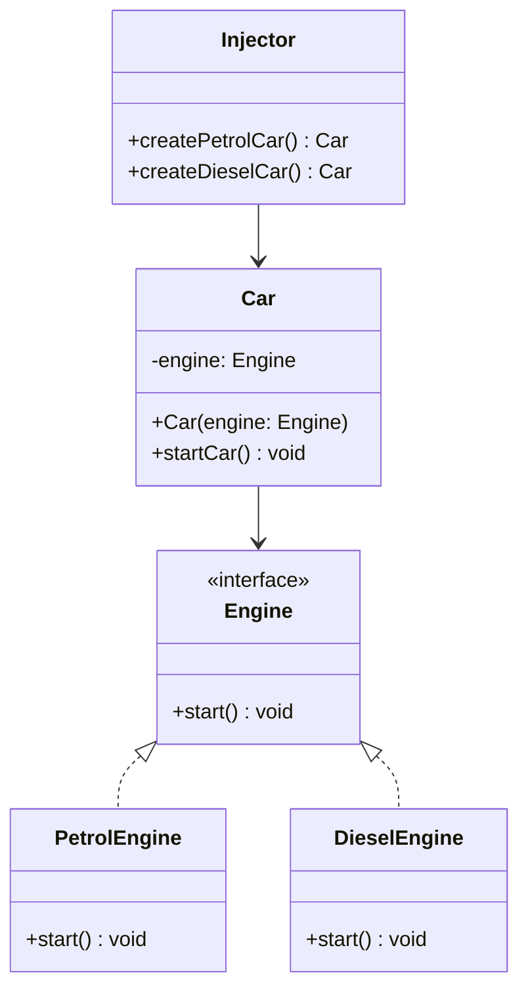

## 3.8. Dependency Injection Pattern

The Dependency Injection (DI) pattern is a fundamental concept in modern software design, particularly within the realm of creational design patterns. It is a technique that facilitates the decoupling of components by injecting dependencies into a class, rather than having the class create them itself. This pattern is integral to achieving Inversion of Control (IoC), a principle that shifts the control of object creation and management from the class to an external entity. In this section, we will delve into the intent and motivation behind Dependency Injection, explore its implementation through pseudocode, and discuss its benefits and potential pitfalls.

### Intent and Motivation

The primary intent of the Dependency Injection pattern is to promote loose coupling between classes and their dependencies. By externalizing the responsibility of dependency creation and management, DI allows for more flexible, testable, and maintainable code. Let's break down the core concepts:

- **Inversion of Control (IoC):** IoC is a design principle that inverts the flow of control in a program. Instead of the class controlling its dependencies, an external entity (often a framework or container) takes over this responsibility. This inversion leads to more modular and adaptable code structures.

- **Decoupling:** By decoupling the instantiation of dependencies from the class, DI enables easier testing and modification of code. Classes become more focused on their core responsibilities, adhering to the Single Responsibility Principle (SRP).

- **Flexibility and Reusability:** DI enhances flexibility by allowing different implementations of a dependency to be injected at runtime. This makes it easier to swap out components without altering the dependent class.

### Key Participants

In the Dependency Injection pattern, the key participants include:

1. **Client Class:** The class that requires dependencies to perform its functions. It does not create its dependencies but receives them from an external source.

2. **Service/Dependency:** The object or service that the client class depends on to execute its operations.

3. **Injector:** The component responsible for providing the necessary dependencies to the client class. This can be a framework, container, or a custom-built injector.

### Applicability

The Dependency Injection pattern is applicable in scenarios where:

- You need to manage complex object graphs and dependencies.
- You want to enhance the testability of your code by allowing mock dependencies to be injected during testing.
- You aim to adhere to SOLID principles, particularly the Dependency Inversion Principle (DIP).
- You require a flexible architecture that can adapt to changes in dependency implementations.

### Pseudocode Implementation

To illustrate the Dependency Injection pattern, let's consider a simple example involving a `Car` class that depends on an `Engine` interface. We'll demonstrate constructor injection, one of the most common forms of DI.

```pseudocode
// Define the Engine interface
interface Engine {
    function start(): void
}

// Implement a PetrolEngine class
class PetrolEngine implements Engine {
    function start(): void {
        print("Petrol engine starting...")
    }
}

// Implement a DieselEngine class
class DieselEngine implements Engine {
    function start(): void {
        print("Diesel engine starting...")
    }
}

// Define the Car class that depends on the Engine interface
class Car {
    private engine: Engine

    // Constructor Injection
    function Car(engine: Engine) {
        this.engine = engine
    }

    function startCar(): void {
        this.engine.start()
    }
}

// Injector class responsible for injecting dependencies
class Injector {
    function createPetrolCar(): Car {
        engine = new PetrolEngine()
        return new Car(engine)
    }

    function createDieselCar(): Car {
        engine = new DieselEngine()
        return new Car(engine)
    }
}

// Client code
injector = new Injector()
petrolCar = injector.createPetrolCar()
petrolCar.startCar()

dieselCar = injector.createDieselCar()
dieselCar.startCar()
```

In this example, the `Car` class does not instantiate its `Engine` dependency. Instead, it receives an `Engine` object through its constructor, allowing for different engine implementations to be injected. The `Injector` class manages the creation of `Car` objects with the appropriate `Engine` dependencies.

### Benefits and Pitfalls

#### Benefits

1. **Improved Testability:** DI allows for easy injection of mock dependencies during testing, enabling isolated unit tests and reducing the need for complex setup.

2. **Enhanced Flexibility:** By decoupling dependencies, DI enables the substitution of different implementations without modifying the client class.

3. **Adherence to SOLID Principles:** DI supports the Dependency Inversion Principle, promoting a design where high-level modules are not dependent on low-level modules.

4. **Simplified Code Maintenance:** With dependencies managed externally, classes become easier to maintain and extend.

#### Pitfalls

1. **Increased Complexity:** Implementing DI can introduce additional complexity, particularly when using DI frameworks or containers.

2. **Potential Overhead:** The use of DI containers may lead to performance overhead due to reflection and dynamic proxy generation.

3. **Steeper Learning Curve:** Developers unfamiliar with DI may find it challenging to understand and implement effectively.

4. **Overuse:** Overusing DI can lead to an over-engineered system with unnecessary abstraction layers.

### Visualizing Dependency Injection

To better understand the flow of Dependency Injection, let's visualize the relationships between the client class, dependencies, and the injector using a class diagram.



In this diagram, the `Car` class depends on the `Engine` interface, and the `Injector` class is responsible for providing the appropriate `Engine` implementation to the `Car`.

### Differences and Similarities

The Dependency Injection pattern is often compared to other patterns like the Factory Method and Service Locator. Here's how they differ:

- **Factory Method:** While both DI and Factory Method deal with object creation, DI focuses on injecting dependencies into a class, whereas Factory Method involves creating objects through a method in a subclass.

- **Service Locator:** Unlike DI, which pushes dependencies into a class, Service Locator involves a class pulling dependencies from a central registry. DI is generally preferred for its explicitness and ease of testing.

### Try It Yourself

To deepen your understanding of Dependency Injection, try modifying the pseudocode example:

- Implement a new `ElectricEngine` class and update the `Injector` class to create a `Car` with an `ElectricEngine`.
- Experiment with different forms of DI, such as setter injection or interface injection.
- Create unit tests for the `Car` class using mock `Engine` implementations.

### Knowledge Check

Before we move on, let's reinforce what we've learned:

- What is the primary intent of the Dependency Injection pattern?
- How does Dependency Injection promote adherence to SOLID principles?
- What are the potential pitfalls of using Dependency Injection?

### Conclusion

The Dependency Injection pattern is a powerful tool in the software engineer's arsenal, enabling the creation of flexible, testable, and maintainable code. By understanding and applying DI effectively, you can enhance the modularity and adaptability of your software designs. Remember, this is just the beginning. As you progress, you'll build more complex and interactive systems. Keep experimenting, stay curious, and enjoy the journey!

## Quiz Time!



### What is the primary intent of the Dependency Injection pattern?

- [x] To promote loose coupling between classes and their dependencies
- [ ] To increase the complexity of the codebase
- [ ] To ensure all dependencies are created within the class
- [ ] To replace the need for any design patterns

> **Explanation:** The primary intent of Dependency Injection is to promote loose coupling by externalizing the creation and management of dependencies.

### How does Dependency Injection adhere to the Dependency Inversion Principle?

- [x] By allowing high-level modules to depend on abstractions rather than concrete implementations
- [ ] By making low-level modules depend on high-level modules
- [ ] By removing the need for interfaces
- [ ] By enforcing strict coupling between classes

> **Explanation:** Dependency Injection adheres to the Dependency Inversion Principle by ensuring that high-level modules depend on abstractions, not concrete implementations.

### Which of the following is a benefit of using Dependency Injection?

- [x] Improved testability
- [ ] Increased code complexity
- [ ] Decreased flexibility
- [ ] Reduced modularity

> **Explanation:** Dependency Injection improves testability by allowing mock dependencies to be injected during testing.

### What is a potential pitfall of Dependency Injection?

- [x] Increased complexity
- [ ] Enhanced flexibility
- [ ] Improved code maintenance
- [ ] Adherence to SOLID principles

> **Explanation:** One potential pitfall of Dependency Injection is the increased complexity it can introduce, especially when using DI frameworks or containers.

### Which form of Dependency Injection involves passing dependencies through a constructor?

- [x] Constructor Injection
- [ ] Setter Injection
- [ ] Interface Injection
- [ ] Service Locator

> **Explanation:** Constructor Injection involves passing dependencies through a class's constructor.

### How does Dependency Injection enhance flexibility?

- [x] By allowing different implementations of a dependency to be injected at runtime
- [ ] By forcing a single implementation for all dependencies
- [ ] By removing the need for interfaces
- [ ] By increasing code complexity

> **Explanation:** Dependency Injection enhances flexibility by allowing different implementations of a dependency to be injected at runtime.

### What is a common alternative to Dependency Injection for managing dependencies?

- [x] Service Locator
- [ ] Factory Method
- [ ] Singleton Pattern
- [ ] Observer Pattern

> **Explanation:** Service Locator is a common alternative to Dependency Injection for managing dependencies, though DI is generally preferred for its explicitness.

### In the context of Dependency Injection, what is an Injector?

- [x] A component responsible for providing dependencies to a client class
- [ ] A class that creates its own dependencies
- [ ] A method that initializes objects
- [ ] A pattern that replaces Dependency Injection

> **Explanation:** An Injector is a component responsible for providing the necessary dependencies to a client class.

### What is the role of the Client Class in Dependency Injection?

- [x] To receive dependencies from an external source
- [ ] To create its own dependencies
- [ ] To act as a central registry for dependencies
- [ ] To enforce strict coupling between classes

> **Explanation:** The Client Class in Dependency Injection receives dependencies from an external source, rather than creating them itself.

### True or False: Dependency Injection can lead to over-engineering if overused.

- [x] True
- [ ] False

> **Explanation:** True. Overusing Dependency Injection can lead to an over-engineered system with unnecessary abstraction layers.


