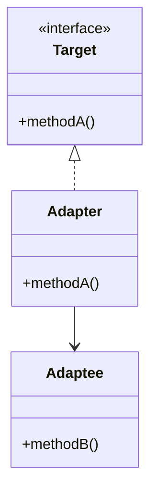

## 4.2. Adapter Pattern

The Adapter Pattern is a structural design pattern that allows objects with incompatible interfaces to collaborate. It acts as a bridge between two incompatible interfaces, enabling them to work together seamlessly. This pattern is particularly useful when integrating new components into existing systems, where the new components have interfaces that differ from those expected by the system.

### Intent and Motivation

The primary intent of the Adapter Pattern is to convert the interface of a class into another interface that clients expect. This pattern allows classes to work together that couldn't otherwise because of incompatible interfaces. The Adapter Pattern is often used when:

- You want to use an existing class, and its interface does not match the one you need.
- You want to create a reusable class that cooperates with unrelated or unforeseen classes, that is, classes that don't necessarily have compatible interfaces.
- You need to use several existing subclasses, but it's impractical to adapt their interface by subclassing every one. An object adapter can adapt the interface of its parent class.

### Class vs. Object Adapters

The Adapter Pattern can be implemented in two ways: using class adapters or object adapters. Each approach has its own advantages and trade-offs.

#### Class Adapters

Class adapters use inheritance to adapt one interface to another. This is achieved by creating a subclass that inherits from both the target interface and the adaptee class. The class adapter overrides the methods of the target interface to call the corresponding methods on the adaptee.

**Advantages:**

- Can override some of the adaptee's behavior since it is a subclass.
- Introduces only one object, and no additional pointer indirection is required.

**Disadvantages:**

- Requires multiple inheritance, which may not be supported in all languages.
- Tightly couples the adapter to the adaptee class, making it less flexible.

#### Object Adapters

Object adapters use composition to adapt one interface to another. This is achieved by creating an adapter class that contains an instance of the adaptee class. The adapter class implements the target interface and delegates calls to the adaptee instance.

**Advantages:**

- More flexible than class adapters because it can work with any subclass of the adaptee.
- Does not require multiple inheritance.

**Disadvantages:**

- Requires an additional level of indirection to delegate calls to the adaptee.

### Pseudocode Implementation

Let's explore how the Adapter Pattern can be implemented using pseudocode. We'll demonstrate both class and object adapters.

#### Class Adapter Implementation

```pseudocode
// Target interface that the client expects
interface Target {
    methodA()
}

// Adaptee class with an incompatible interface
class Adaptee {
    methodB()
}

// Class adapter that inherits from both Target and Adaptee
class ClassAdapter extends Adaptee implements Target {
    methodA() {
        // Call the incompatible method on the adaptee
        this.methodB()
    }
}

// Client code
function clientCode(target: Target) {
    target.methodA()
}

// Usage
let adapter = new ClassAdapter()
clientCode(adapter)
```

#### Object Adapter Implementation

```pseudocode
// Target interface that the client expects
interface Target {
    methodA()
}

// Adaptee class with an incompatible interface
class Adaptee {
    methodB()
}

// Object adapter that contains an instance of Adaptee
class ObjectAdapter implements Target {
    private adaptee: Adaptee

    constructor(adaptee: Adaptee) {
        this.adaptee = adaptee
    }

    methodA() {
        // Delegate the call to the adaptee's method
        this.adaptee.methodB()
    }
}

// Client code
function clientCode(target: Target) {
    target.methodA()
}

// Usage
let adaptee = new Adaptee()
let adapter = new ObjectAdapter(adaptee)
clientCode(adapter)
```

### Practical Examples

The Adapter Pattern is widely used in software development to integrate third-party libraries, legacy systems, or components with incompatible interfaces. Let's explore some practical examples to illustrate its application.

#### Example 1: Integrating a Third-Party Library

Imagine you are developing a payment processing system that needs to integrate with a third-party payment gateway. The payment gateway provides an API with a different interface than your system expects. You can use the Adapter Pattern to bridge this gap.

```pseudocode
// Target interface expected by the payment processing system
interface PaymentProcessor {
    processPayment(amount: float)
}

// Third-party payment gateway with an incompatible interface
class ThirdPartyPaymentGateway {
    makePayment(amount: float)
}

// Adapter that integrates the third-party payment gateway
class PaymentAdapter implements PaymentProcessor {
    private gateway: ThirdPartyPaymentGateway

    constructor(gateway: ThirdPartyPaymentGateway) {
        this.gateway = gateway
    }

    processPayment(amount: float) {
        // Delegate the call to the third-party gateway
        this.gateway.makePayment(amount)
    }
}

// Usage
let gateway = new ThirdPartyPaymentGateway()
let adapter = new PaymentAdapter(gateway)
adapter.processPayment(100.0)
```

#### Example 2: Bridging Legacy Systems

Suppose you are working on a modern application that needs to interact with a legacy system. The legacy system has an outdated interface that is incompatible with your application. The Adapter Pattern can help you bridge this gap.

```pseudocode
// Target interface expected by the modern application
interface ModernInterface {
    performAction()
}

// Legacy system with an incompatible interface
class LegacySystem {
    execute()
}

// Adapter that bridges the legacy system
class LegacyAdapter implements ModernInterface {
    private legacy: LegacySystem

    constructor(legacy: LegacySystem) {
        this.legacy = legacy
    }

    performAction() {
        // Delegate the call to the legacy system
        this.legacy.execute()
    }
}

// Usage
let legacySystem = new LegacySystem()
let adapter = new LegacyAdapter(legacySystem)
adapter.performAction()
```

### Visualizing the Adapter Pattern

To better understand the Adapter Pattern, let's visualize it using a class diagram. This diagram illustrates the relationships between the target interface, adaptee, and adapter.



**Diagram Description:** This class diagram shows the Adapter Pattern. The `Target` interface defines the method expected by the client. The `Adaptee` class has an incompatible method. The `Adapter` class implements the `Target` interface and delegates calls to the `Adaptee`.

### Design Considerations

When using the Adapter Pattern, consider the following:

- **Flexibility vs. Performance:** Object adapters offer more flexibility by allowing the adaptee to be replaced at runtime, but they introduce an additional level of indirection, which may impact performance.
- **Multiple Adaptees:** If you need to adapt multiple adaptees with different interfaces, consider using object adapters, as they can work with any subclass of the adaptee.
- **Language Support:** Some languages do not support multiple inheritance, making object adapters the preferred choice.

### Differences and Similarities

The Adapter Pattern is often confused with other design patterns, such as the Facade and Proxy patterns. Let's clarify the distinctions:

- **Adapter vs. Facade:** The Adapter Pattern is used to make two incompatible interfaces work together, while the Facade Pattern provides a simplified interface to a complex subsystem.
- **Adapter vs. Proxy:** The Adapter Pattern changes the interface of an existing object, while the Proxy Pattern provides a surrogate or placeholder for another object to control access to it.

### Try It Yourself

To deepen your understanding of the Adapter Pattern, try modifying the pseudocode examples provided:

- **Experiment with Different Adaptees:** Create additional adaptee classes with different interfaces and adapt them using the Adapter Pattern.
- **Implement a Class Adapter:** If your programming language supports multiple inheritance, try implementing a class adapter and compare it with the object adapter.
- **Extend the Adapter:** Add new methods to the adapter to provide additional functionality not present in the adaptee.

### Knowledge Check

Before moving on, let's reinforce what we've learned about the Adapter Pattern:

- **What is the primary purpose of the Adapter Pattern?**
- **How do class adapters differ from object adapters?**
- **When would you choose to use an object adapter over a class adapter?**
- **What are some practical scenarios where the Adapter Pattern is useful?**

### Embrace the Journey

Remember, mastering design patterns is a journey. The Adapter Pattern is just one of many tools in your software design toolkit. As you continue to explore and experiment with design patterns, you'll become more adept at crafting elegant and maintainable software solutions. Keep experimenting, stay curious, and enjoy the journey!

## Quiz Time!



### What is the primary purpose of the Adapter Pattern?

- [x] To allow incompatible interfaces to work together
- [ ] To provide a simplified interface to a complex subsystem
- [ ] To control access to another object
- [ ] To encapsulate a family of algorithms

> **Explanation:** The Adapter Pattern is designed to allow incompatible interfaces to work together by converting one interface into another that the client expects.

### How do class adapters differ from object adapters?

- [x] Class adapters use inheritance, while object adapters use composition
- [ ] Class adapters use composition, while object adapters use inheritance
- [ ] Class adapters are more flexible than object adapters
- [ ] Object adapters require multiple inheritance

> **Explanation:** Class adapters use inheritance to adapt interfaces, while object adapters use composition, making object adapters more flexible.

### When would you choose to use an object adapter over a class adapter?

- [x] When the programming language does not support multiple inheritance
- [x] When you need to adapt multiple subclasses of the adaptee
- [ ] When you want to override the adaptee's behavior
- [ ] When performance is a critical concern

> **Explanation:** Object adapters are preferred when the language does not support multiple inheritance and when you need to adapt multiple subclasses of the adaptee.

### What is a key disadvantage of class adapters?

- [x] They require multiple inheritance
- [ ] They introduce an additional level of indirection
- [ ] They cannot override the adaptee's behavior
- [ ] They are less flexible than object adapters

> **Explanation:** Class adapters require multiple inheritance, which may not be supported in all programming languages.

### In which scenario is the Adapter Pattern most useful?

- [x] Integrating a third-party library with an incompatible interface
- [x] Bridging a legacy system with a modern application
- [ ] Simplifying a complex subsystem
- [ ] Controlling access to a resource

> **Explanation:** The Adapter Pattern is most useful for integrating third-party libraries or bridging legacy systems with incompatible interfaces.

### What is a similarity between the Adapter and Facade patterns?

- [x] Both provide a way to work with existing interfaces
- [ ] Both simplify a complex subsystem
- [ ] Both control access to another object
- [ ] Both encapsulate a family of algorithms

> **Explanation:** Both patterns provide a way to work with existing interfaces, but the Adapter Pattern focuses on compatibility, while the Facade Pattern focuses on simplification.

### What is a key advantage of object adapters?

- [x] They are more flexible than class adapters
- [x] They do not require multiple inheritance
- [ ] They can override the adaptee's behavior
- [ ] They introduce less indirection than class adapters

> **Explanation:** Object adapters are more flexible and do not require multiple inheritance, making them suitable for adapting multiple subclasses.

### Which pattern provides a surrogate or placeholder for another object?

- [x] Proxy Pattern
- [ ] Adapter Pattern
- [ ] Facade Pattern
- [ ] Strategy Pattern

> **Explanation:** The Proxy Pattern provides a surrogate or placeholder for another object to control access to it.

### What is a disadvantage of using object adapters?

- [x] They introduce an additional level of indirection
- [ ] They require multiple inheritance
- [ ] They are less flexible than class adapters
- [ ] They cannot adapt multiple subclasses

> **Explanation:** Object adapters introduce an additional level of indirection due to the delegation of calls to the adaptee.

### True or False: The Adapter Pattern can be used to encapsulate a family of algorithms.

- [ ] True
- [x] False

> **Explanation:** False. The Adapter Pattern is not used to encapsulate a family of algorithms; that is the purpose of the Strategy Pattern.


