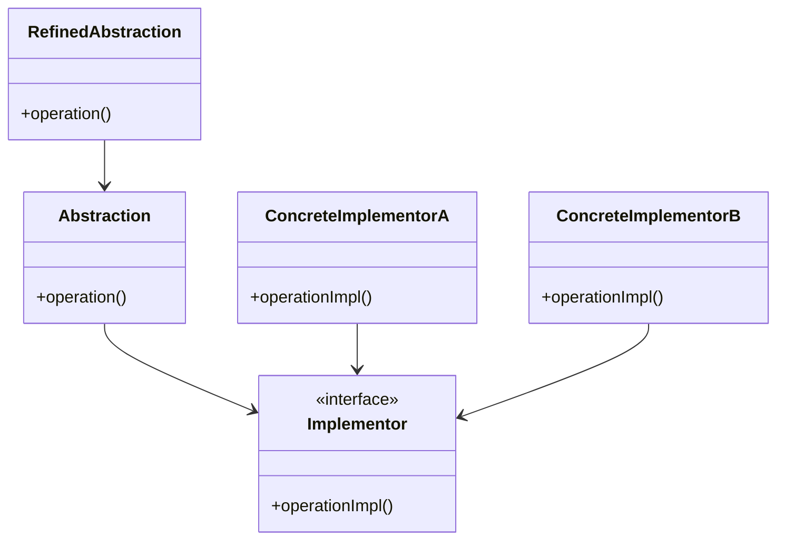
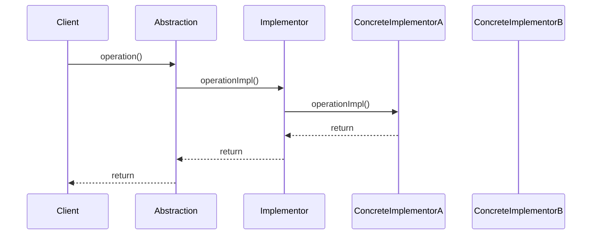

## 4.3. Bridge Pattern

### Introduction

The Bridge Pattern is a structural design pattern that plays a crucial role in software architecture by decoupling an abstraction from its implementation. This separation allows both the abstraction and the implementation to evolve independently without affecting each other. The Bridge Pattern is particularly useful when dealing with complex systems where changes in one part of the system should not necessitate changes in another.

### Intent and Motivation

The primary intent of the Bridge Pattern is to separate abstraction from implementation so that both can vary independently. This pattern is motivated by the need to avoid a proliferation of classes that can occur when combining multiple dimensions of variation. By using a bridge, we can create a flexible and scalable architecture that supports the extension of both abstraction and implementation hierarchies.

#### Key Concepts

- **Abstraction**: The high-level control layer of the system that defines the operations available to clients.
- **Implementation**: The low-level layer that contains the actual working code.
- **Bridge**: An interface that connects the abstraction and implementation, allowing them to work together.

### Diagrams

To better understand the Bridge Pattern, let's visualize its structure using a class diagram.



**Diagram Description**: In this diagram, `Abstraction` is the interface that defines the operations available to clients. `RefinedAbstraction` extends `Abstraction` and can add more functionalities. `Implementor` is the interface for the implementation classes, which `ConcreteImplementorA` and `ConcreteImplementorB` implement. The bridge is formed by the association between `Abstraction` and `Implementor`.

### Key Participants

- **Abstraction**: Defines the abstraction's interface and maintains a reference to an object of type `Implementor`.
- **RefinedAbstraction**: Extends the interface defined by `Abstraction`.
- **Implementor**: Defines the interface for implementation classes.
- **ConcreteImplementor**: Implements the `Implementor` interface and provides concrete behavior.

### Applicability

The Bridge Pattern is applicable when:

- You want to avoid a permanent binding between an abstraction and its implementation.
- Both the abstraction and implementation should be extensible by subclassing.
- Changes in the implementation should not impact client code.
- You need to switch implementations at runtime.

### Pseudocode Implementation

Let's delve into a pseudocode implementation of the Bridge Pattern to solidify our understanding.

```pseudocode
// Define the Implementor interface
interface Implementor {
    method operationImpl();
}

// Concrete Implementor A
class ConcreteImplementorA implements Implementor {
    method operationImpl() {
        // Implementation details for A
        print("ConcreteImplementorA operation");
    }
}

// Concrete Implementor B
class ConcreteImplementorB implements Implementor {
    method operationImpl() {
        // Implementation details for B
        print("ConcreteImplementorB operation");
    }
}

// Define the Abstraction
class Abstraction {
    protected Implementor implementor;

    constructor(Implementor implementor) {
        this.implementor = implementor;
    }

    method operation() {
        implementor.operationImpl();
    }
}

// Refined Abstraction
class RefinedAbstraction extends Abstraction {
    method operation() {
        print("RefinedAbstraction operation");
        implementor.operationImpl();
    }
}

// Client code
function main() {
    Implementor implA = new ConcreteImplementorA();
    Abstraction abstractionA = new RefinedAbstraction(implA);
    abstractionA.operation();

    Implementor implB = new ConcreteImplementorB();
    Abstraction abstractionB = new RefinedAbstraction(implB);
    abstractionB.operation();
}

main();
```

**Explanation**: In this pseudocode, we define an `Implementor` interface with a method `operationImpl()`. `ConcreteImplementorA` and `ConcreteImplementorB` provide specific implementations of this method. The `Abstraction` class maintains a reference to an `Implementor` and delegates the `operation()` call to the `operationImpl()` method of the `Implementor`. `RefinedAbstraction` extends `Abstraction` and can add additional behavior. The client code demonstrates how different implementations can be used interchangeably.

### Use Cases

The Bridge Pattern is widely used in scenarios where a system needs to support multiple variants of an abstraction and its implementation. Here are some practical use cases:

1. **Cross-Platform Interfaces**: When developing applications that need to run on multiple platforms, the Bridge Pattern can separate the platform-specific code from the application logic.

2. **Device Drivers**: In systems where hardware devices have different interfaces, the Bridge Pattern can abstract the device-specific code from the application logic.

3. **Graphical User Interfaces (GUIs)**: The Bridge Pattern can be used to separate the GUI abstraction from the platform-specific rendering code.

4. **Persistence Frameworks**: When dealing with different storage mechanisms, the Bridge Pattern can separate the persistence logic from the storage-specific code.

### Design Considerations

When implementing the Bridge Pattern, consider the following:

- **Complexity**: The Bridge Pattern can introduce additional complexity due to the separation of abstraction and implementation. Ensure that the benefits outweigh the complexity.
- **Performance**: The indirection introduced by the Bridge Pattern may impact performance. Evaluate the performance implications in your specific context.
- **Extensibility**: The Bridge Pattern excels in scenarios where both the abstraction and implementation are expected to evolve independently. Ensure that your design leverages this flexibility.

### Differences and Similarities

The Bridge Pattern is often confused with other structural patterns like Adapter and Decorator. Here are some distinctions:

- **Bridge vs. Adapter**: The Adapter Pattern is used to make two incompatible interfaces work together, while the Bridge Pattern separates abstraction from implementation.
- **Bridge vs. Decorator**: The Decorator Pattern adds responsibilities to objects dynamically, whereas the Bridge Pattern separates abstraction from implementation.

### Try It Yourself

To deepen your understanding of the Bridge Pattern, try modifying the pseudocode example:

- **Add a New Implementor**: Create a new `ConcreteImplementorC` and see how easily it integrates with the existing `Abstraction`.
- **Extend RefinedAbstraction**: Add new methods to `RefinedAbstraction` and observe how the separation of abstraction and implementation facilitates these changes.

### Visualizing the Bridge Pattern in Action

Let's visualize the interaction between the components of the Bridge Pattern using a sequence diagram.



**Diagram Description**: This sequence diagram illustrates the flow of a client calling the `operation()` method on an `Abstraction`, which delegates the call to the `operationImpl()` method of an `Implementor`. The `Implementor` then forwards the call to a `ConcreteImplementor`, which performs the actual operation.

### References and Links

For further reading on the Bridge Pattern, consider the following resources:

- [Design Patterns: Elements of Reusable Object-Oriented Software](https://en.wikipedia.org/wiki/Design_Patterns) by Erich Gamma, Richard Helm, Ralph Johnson, and John Vlissides.
- [Refactoring Guru's Bridge Pattern](https://refactoring.guru/design-patterns/bridge) for a detailed explanation and examples.

### Knowledge Check

To reinforce your understanding of the Bridge Pattern, consider the following questions:

- What is the primary intent of the Bridge Pattern?
- How does the Bridge Pattern differ from the Adapter Pattern?
- In what scenarios is the Bridge Pattern most beneficial?

### Embrace the Journey

Remember, mastering design patterns is a journey. The Bridge Pattern is just one of many tools in your software design toolkit. As you continue to explore and apply design patterns, you'll develop a deeper understanding of how to create flexible, scalable, and maintainable software architectures. Keep experimenting, stay curious, and enjoy the journey!

## Quiz Time!



### What is the primary intent of the Bridge Pattern?

- [x] To separate abstraction from implementation
- [ ] To adapt one interface to another
- [ ] To add responsibilities to objects dynamically
- [ ] To provide a simplified interface to a complex subsystem

> **Explanation:** The Bridge Pattern's primary intent is to separate abstraction from implementation, allowing them to vary independently.

### Which of the following is a key participant in the Bridge Pattern?

- [x] Abstraction
- [ ] Adapter
- [ ] Decorator
- [ ] Facade

> **Explanation:** The key participants in the Bridge Pattern include Abstraction, Implementor, and ConcreteImplementor.

### How does the Bridge Pattern differ from the Adapter Pattern?

- [x] The Bridge Pattern separates abstraction from implementation, while the Adapter Pattern makes two incompatible interfaces work together.
- [ ] The Bridge Pattern adds responsibilities to objects dynamically, while the Adapter Pattern separates abstraction from implementation.
- [ ] The Bridge Pattern provides a simplified interface to a complex subsystem, while the Adapter Pattern separates abstraction from implementation.
- [ ] The Bridge Pattern is used for cross-platform interfaces, while the Adapter Pattern is used for graphical user interfaces.

> **Explanation:** The Bridge Pattern separates abstraction from implementation, whereas the Adapter Pattern is used to make two incompatible interfaces work together.

### In which scenario is the Bridge Pattern most beneficial?

- [x] When you want to avoid a permanent binding between an abstraction and its implementation
- [ ] When you need to adapt one interface to another
- [ ] When you want to add responsibilities to objects dynamically
- [ ] When you need to provide a simplified interface to a complex subsystem

> **Explanation:** The Bridge Pattern is beneficial when you want to avoid a permanent binding between an abstraction and its implementation.

### What is the role of the Implementor in the Bridge Pattern?

- [x] To define the interface for implementation classes
- [ ] To provide a simplified interface to a complex subsystem
- [ ] To add responsibilities to objects dynamically
- [ ] To adapt one interface to another

> **Explanation:** The Implementor defines the interface for implementation classes in the Bridge Pattern.

### Which pattern is often confused with the Bridge Pattern?

- [x] Adapter Pattern
- [ ] Singleton Pattern
- [ ] Observer Pattern
- [ ] Factory Pattern

> **Explanation:** The Bridge Pattern is often confused with the Adapter Pattern due to their structural similarities.

### What is a potential downside of the Bridge Pattern?

- [x] It can introduce additional complexity due to the separation of abstraction and implementation.
- [ ] It can lead to a proliferation of classes.
- [ ] It can cause tight coupling between components.
- [ ] It can reduce code reusability.

> **Explanation:** The Bridge Pattern can introduce additional complexity due to the separation of abstraction and implementation.

### How can the Bridge Pattern impact performance?

- [x] The indirection introduced by the Bridge Pattern may impact performance.
- [ ] The Bridge Pattern always improves performance.
- [ ] The Bridge Pattern has no impact on performance.
- [ ] The Bridge Pattern reduces the need for performance optimization.

> **Explanation:** The indirection introduced by the Bridge Pattern may impact performance, so it's important to evaluate its implications.

### True or False: The Bridge Pattern allows both the abstraction and implementation to evolve independently.

- [x] True
- [ ] False

> **Explanation:** True. The Bridge Pattern allows both the abstraction and implementation to evolve independently, providing flexibility and scalability.

### What is a common use case for the Bridge Pattern?

- [x] Cross-Platform Interfaces
- [ ] Singleton Pattern
- [ ] Observer Pattern
- [ ] Factory Pattern

> **Explanation:** A common use case for the Bridge Pattern is cross-platform interfaces, where it separates platform-specific code from application logic.


