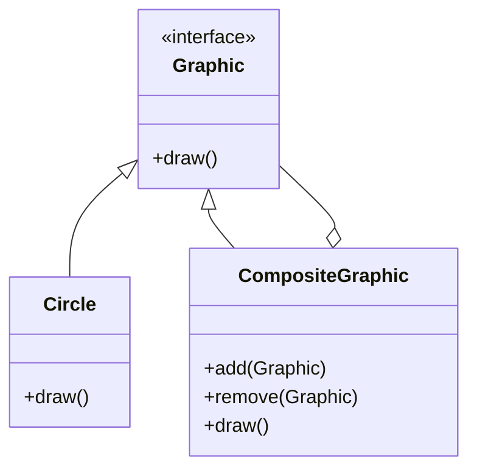

## 4.4. Composite Pattern

The Composite Pattern is a structural design pattern that facilitates the composition of objects into tree structures to represent part-whole hierarchies. It allows clients to treat individual objects and compositions of objects uniformly. This pattern is particularly useful when you want to represent a hierarchy of objects, such as a file system, a graphical user interface, or an organizational chart.

### Intent and Motivation

The primary intent of the Composite Pattern is to allow clients to treat both individual objects and compositions of objects uniformly. This is achieved by defining a common interface for all objects in the composition, thereby enabling recursive composition.

#### Key Motivations:

- **Uniformity**: Simplifies client code by allowing uniform treatment of individual and composite objects.
- **Flexibility**: Makes it easy to add new kinds of components.
- **Simplicity**: Reduces complexity by allowing clients to ignore the differences between compositions of objects and individual objects.

### Tree Structures and Hierarchies

The Composite Pattern is ideal for representing tree structures and hierarchies. A tree structure consists of nodes, where each node can be a composite (having children) or a leaf (having no children). This hierarchical structure is recursive in nature, as each composite node can contain other composite nodes or leaf nodes.

#### Examples of Tree Structures:

- **File Systems**: Directories containing files and other directories.
- **Organization Charts**: Departments containing teams and individuals.
- **GUI Components**: Containers containing widgets and other containers.

### Pseudocode Implementation

To implement the Composite Pattern, we define a common interface for both composite and leaf nodes. The composite nodes implement this interface and manage their children, while the leaf nodes implement the interface without managing children.

#### Step-by-Step Implementation:

1. **Define the Component Interface**: This interface declares common operations for both simple and complex objects of a composition.

2. **Create Leaf Nodes**: These are the end objects of a composition. A leaf doesn't have any children.

3. **Create Composite Nodes**: These nodes have children and implement methods to manipulate these children.

4. **Client Code**: The client interacts with the objects through the component interface.

#### Pseudocode Example:

```pseudocode
// Component Interface
interface Graphic {
    method draw()
}

// Leaf Node
class Circle implements Graphic {
    method draw() {
        print("Drawing a Circle")
    }
}

// Composite Node
class CompositeGraphic implements Graphic {
    private children: List<Graphic>

    method add(child: Graphic) {
        children.add(child)
    }

    method remove(child: Graphic) {
        children.remove(child)
    }

    method draw() {
        foreach (child in children) {
            child.draw()
        }
    }
}

// Client Code
method main() {
    // Create leaf nodes
    circle1 = new Circle()
    circle2 = new Circle()

    // Create composite node
    composite = new CompositeGraphic()
    composite.add(circle1)
    composite.add(circle2)

    // Draw composite
    composite.draw()
}
```

### Working with Recursive Structures

The Composite Pattern naturally supports recursive structures, as each composite node can contain other composite nodes. This recursive nature allows for complex hierarchies to be built and managed with ease.

#### Recursive Operations:

- **Traversal**: Navigating through the hierarchy is straightforward, as each node can recursively call operations on its children.
- **Manipulation**: Adding, removing, or modifying nodes can be done recursively, allowing for dynamic changes to the hierarchy.

### Visualizing the Composite Pattern

To better understand the Composite Pattern, let's visualize a simple hierarchy using a class diagram.



**Diagram Description**: The diagram shows the `Graphic` interface, which is implemented by both `Circle` and `CompositeGraphic`. The `CompositeGraphic` class can contain multiple `Graphic` objects, allowing for recursive composition.

### Design Considerations

When implementing the Composite Pattern, consider the following:

- **Transparency vs. Safety**: Decide whether to make all operations available to both leaf and composite nodes (transparency) or restrict some operations to composite nodes only (safety).
- **Performance**: Be mindful of the potential performance impact of recursive operations, especially in large hierarchies.
- **Complexity**: While the pattern simplifies client code, it can introduce complexity in the component hierarchy.

### Differences and Similarities

The Composite Pattern is often compared to other structural patterns, such as the Decorator and Flyweight patterns. Here are some distinctions:

- **Decorator Pattern**: Focuses on adding responsibilities to objects dynamically, while the Composite Pattern focuses on part-whole hierarchies.
- **Flyweight Pattern**: Aims to minimize memory usage by sharing objects, whereas the Composite Pattern focuses on uniformity in treating individual and composite objects.

### Try It Yourself

To deepen your understanding of the Composite Pattern, try modifying the pseudocode example:

- **Add New Leaf Types**: Create additional leaf classes, such as `Rectangle` or `Line`, and integrate them into the composite structure.
- **Implement Additional Operations**: Extend the `Graphic` interface with new methods, such as `resize()`, and implement these in both leaf and composite nodes.
- **Experiment with Different Hierarchies**: Create more complex composite structures and test their behavior.

### Knowledge Check

Before moving on, ensure you understand the following:

- How the Composite Pattern enables uniform treatment of individual and composite objects.
- The role of recursive structures in the pattern.
- The differences between the Composite Pattern and similar structural patterns.

### Embrace the Journey

Remember, mastering design patterns is a journey. As you experiment with the Composite Pattern, you'll gain insights into how to effectively manage complex hierarchies in your software designs. Keep exploring, stay curious, and enjoy the process of learning and applying these powerful concepts.

## Quiz Time!



### What is the primary intent of the Composite Pattern?

- [x] To allow clients to treat individual objects and compositions of objects uniformly.
- [ ] To add responsibilities to objects dynamically.
- [ ] To minimize memory usage by sharing objects.
- [ ] To simplify client code by removing the need for interfaces.

> **Explanation:** The Composite Pattern's primary intent is to enable uniform treatment of individual and composite objects, simplifying client interactions with complex hierarchies.

### Which of the following is a key motivation for using the Composite Pattern?

- [x] Flexibility in adding new kinds of components.
- [ ] Reducing memory usage in large systems.
- [ ] Enhancing security through encapsulation.
- [ ] Improving performance by caching results.

> **Explanation:** The Composite Pattern provides flexibility by allowing new components to be added easily, supporting dynamic and complex hierarchies.

### In the Composite Pattern, what is a leaf node?

- [x] An end object of a composition with no children.
- [ ] A node that contains other nodes.
- [ ] A node that shares state with other nodes.
- [ ] A node that dynamically adds responsibilities.

> **Explanation:** A leaf node is an end object in the hierarchy that does not have any children, representing the simplest form of a component.

### How does the Composite Pattern handle recursive structures?

- [x] By allowing composite nodes to contain other composite nodes.
- [ ] By minimizing memory usage through shared objects.
- [ ] By dynamically adding responsibilities to nodes.
- [ ] By encapsulating state within individual nodes.

> **Explanation:** The Composite Pattern naturally supports recursive structures by enabling composite nodes to contain other composite nodes, facilitating complex hierarchies.

### Which pattern is often compared to the Composite Pattern?

- [x] Decorator Pattern
- [ ] Singleton Pattern
- [ ] Observer Pattern
- [ ] Command Pattern

> **Explanation:** The Decorator Pattern is often compared to the Composite Pattern, as both involve structural modifications to objects, though they serve different purposes.

### What is a key consideration when implementing the Composite Pattern?

- [x] Balancing transparency and safety in operations.
- [ ] Ensuring all nodes share the same state.
- [ ] Maximizing memory usage for performance.
- [ ] Avoiding the use of interfaces for simplicity.

> **Explanation:** When implementing the Composite Pattern, it's important to balance transparency (uniform operations) and safety (restricting operations to certain nodes).

### What is a common application of the Composite Pattern?

- [x] Representing file systems with directories and files.
- [ ] Implementing caching mechanisms for performance.
- [ ] Managing network connections in distributed systems.
- [ ] Securing access to resources through proxies.

> **Explanation:** The Composite Pattern is commonly used to represent file systems, where directories can contain files and other directories, forming a hierarchical structure.

### What is the role of the component interface in the Composite Pattern?

- [x] To declare common operations for both simple and complex objects.
- [ ] To manage memory usage across nodes.
- [ ] To dynamically add responsibilities to objects.
- [ ] To encapsulate state within individual nodes.

> **Explanation:** The component interface declares common operations for both simple and complex objects, enabling uniform treatment in the Composite Pattern.

### How does the Composite Pattern simplify client code?

- [x] By allowing uniform treatment of individual and composite objects.
- [ ] By minimizing memory usage through shared objects.
- [ ] By dynamically adding responsibilities to nodes.
- [ ] By encapsulating state within individual nodes.

> **Explanation:** The Composite Pattern simplifies client code by allowing uniform treatment of individual and composite objects, reducing the need for complex conditional logic.

### True or False: The Composite Pattern is primarily concerned with minimizing memory usage.

- [ ] True
- [x] False

> **Explanation:** False. The Composite Pattern is primarily concerned with enabling uniform treatment of individual and composite objects, not minimizing memory usage.




