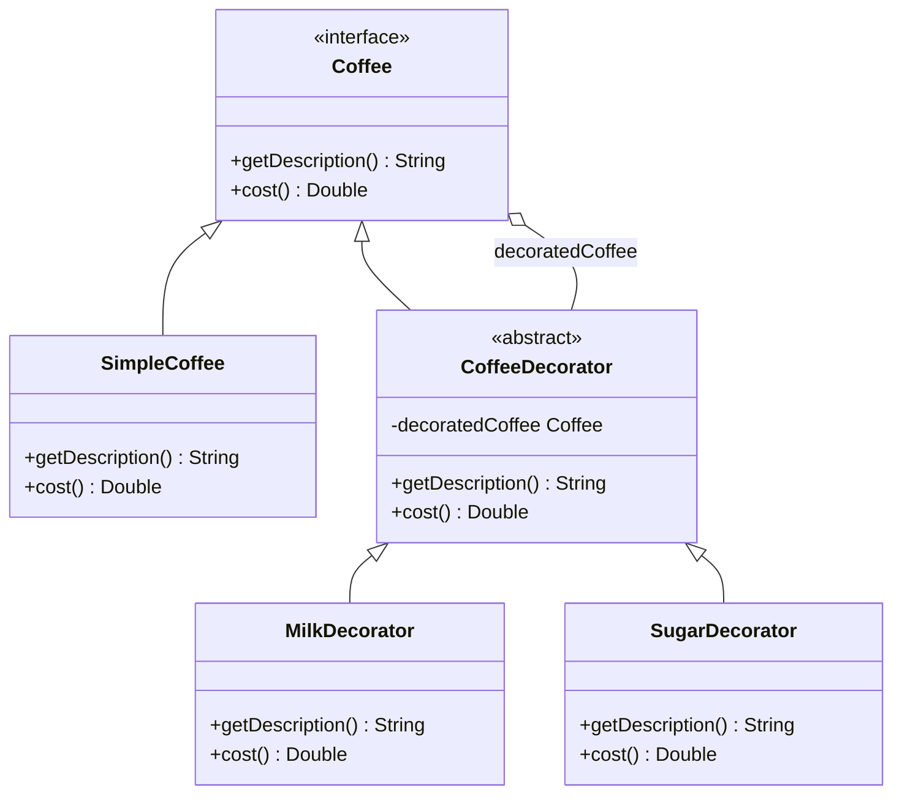

## 4.5. Decorator Pattern

In the realm of software design, the Decorator Pattern stands out as a powerful tool for dynamically adding responsibilities to objects without altering their structure. This pattern is part of the structural design patterns family, which focuses on how objects and classes are composed to form larger structures. Let's delve into the intricacies of the Decorator Pattern, exploring its intent, motivation, implementation, and how it compares to inheritance.

### Intent and Motivation

The primary intent of the Decorator Pattern is to attach additional responsibilities to an object dynamically. Unlike static inheritance, which adds behavior at compile time, the Decorator Pattern allows for flexible and reusable code by enabling behavior modification at runtime. This makes it particularly useful in scenarios where you need to extend the functionality of objects in a way that is transparent to the client.

#### Adding Responsibilities Dynamically

Consider a scenario where you have a `Coffee` class, and you want to add various condiments like milk, sugar, or whipped cream. Instead of creating multiple subclasses for each combination of coffee and condiments, the Decorator Pattern allows you to "decorate" the coffee object with these condiments dynamically. This approach adheres to the Open/Closed Principle, one of the SOLID principles, which states that software entities should be open for extension but closed for modification.

### Key Participants

Before diving into the implementation, let's outline the key participants in the Decorator Pattern:

1. **Component**: This is the interface or abstract class defining the object structure that can have responsibilities added to it.
2. **ConcreteComponent**: A class that implements the `Component` interface. It represents the core object to which additional responsibilities can be attached.
3. **Decorator**: An abstract class that implements the `Component` interface and contains a reference to a `Component` object. It serves as a base class for all concrete decorators.
4. **ConcreteDecorator**: A class that extends the `Decorator` class and adds responsibilities to the `Component`.

### Pseudocode Implementation

Let's illustrate the Decorator Pattern with a pseudocode example. We'll use the coffee and condiments scenario to demonstrate how this pattern can be implemented.

```pseudocode
// Component Interface
interface Coffee {
    method getDescription(): String
    method cost(): Double
}

// ConcreteComponent
class SimpleCoffee implements Coffee {
    method getDescription(): String
        return "Simple Coffee"

    method cost(): Double
        return 5.0
}

// Decorator
abstract class CoffeeDecorator implements Coffee {
    protected attribute decoratedCoffee: Coffee

    constructor(decoratedCoffee: Coffee)
        this.decoratedCoffee = decoratedCoffee

    method getDescription(): String
        return decoratedCoffee.getDescription()

    method cost(): Double
        return decoratedCoffee.cost()
}

// ConcreteDecorator
class MilkDecorator extends CoffeeDecorator {
    constructor(decoratedCoffee: Coffee)
        super(decoratedCoffee)

    method getDescription(): String
        return decoratedCoffee.getDescription() + ", Milk"

    method cost(): Double
        return decoratedCoffee.cost() + 1.5
}

class SugarDecorator extends CoffeeDecorator {
    constructor(decoratedCoffee: Coffee)
        super(decoratedCoffee)

    method getDescription(): String
        return decoratedCoffee.getDescription() + ", Sugar"

    method cost(): Double
        return decoratedCoffee.cost() + 0.5
}

// Client Code
coffee = new SimpleCoffee()
print(coffee.getDescription()) // Output: Simple Coffee
print(coffee.cost()) // Output: 5.0

coffeeWithMilk = new MilkDecorator(coffee)
print(coffeeWithMilk.getDescription()) // Output: Simple Coffee, Milk
print(coffeeWithMilk.cost()) // Output: 6.5

coffeeWithMilkAndSugar = new SugarDecorator(coffeeWithMilk)
print(coffeeWithMilkAndSugar.getDescription()) // Output: Simple Coffee, Milk, Sugar
print(coffeeWithMilkAndSugar.cost()) // Output: 7.0
```

### Visualizing the Decorator Pattern

To better understand the Decorator Pattern, let's visualize the relationships between the components using a class diagram.



**Diagram Description:** The diagram illustrates the relationship between the `Coffee` interface, `SimpleCoffee` class, `CoffeeDecorator` abstract class, and the `MilkDecorator` and `SugarDecorator` concrete classes. The `CoffeeDecorator` class holds a reference to a `Coffee` object, allowing it to add responsibilities dynamically.

### Comparisons with Inheritance

The Decorator Pattern is often compared to inheritance, as both are mechanisms for extending behavior. However, they differ significantly in their approach and flexibility.

#### Inheritance

- **Static Extension**: Inheritance extends behavior at compile time, making it less flexible for runtime changes.
- **Class Explosion**: Using inheritance to add multiple behaviors can lead to a proliferation of subclasses, each representing a different combination of behaviors.
- **Tight Coupling**: Inheritance creates a tight coupling between the base class and derived classes, making changes more challenging.

#### Decorator Pattern

- **Dynamic Extension**: The Decorator Pattern allows behavior to be added at runtime, offering greater flexibility.
- **Combinatorial Flexibility**: Decorators can be combined in various ways, enabling a wide range of behavior combinations without creating numerous subclasses.
- **Loose Coupling**: Decorators maintain a loose coupling between components, making it easier to modify or extend behavior.

### Applicability

The Decorator Pattern is applicable in scenarios where:

- You need to add responsibilities to individual objects dynamically and transparently.
- You want to avoid subclassing for every possible combination of behaviors.
- You need to adhere to the Open/Closed Principle, allowing objects to be extended without modifying existing code.

### Design Considerations

When implementing the Decorator Pattern, consider the following:

- **Transparency**: Ensure that the decorators are transparent to the client, meaning the client should not be aware of the presence of decorators.
- **Order Sensitivity**: The order in which decorators are applied can affect the final behavior, so it's essential to apply them in the correct sequence.
- **Performance Overhead**: Each decorator adds a layer of abstraction, which can introduce performance overhead. Consider the trade-offs between flexibility and performance.

### Differences and Similarities

The Decorator Pattern is often confused with other patterns, such as the Proxy and Adapter patterns. Let's clarify these distinctions:

- **Proxy Pattern**: The Proxy Pattern provides a surrogate or placeholder for another object to control access to it. Unlike the Decorator Pattern, the Proxy Pattern focuses on controlling access rather than adding behavior.
- **Adapter Pattern**: The Adapter Pattern allows incompatible interfaces to work together. It focuses on interface compatibility, whereas the Decorator Pattern focuses on adding responsibilities.

### Try It Yourself

To deepen your understanding of the Decorator Pattern, try modifying the pseudocode example:

- **Add a new decorator**: Implement a `WhippedCreamDecorator` that adds whipped cream to the coffee.
- **Change the order**: Experiment with applying decorators in different orders and observe how it affects the output.
- **Combine decorators**: Create a combination of decorators to simulate a complex coffee order, such as a "Latte with Sugar and Whipped Cream."

### Knowledge Check

Let's reinforce your understanding of the Decorator Pattern with a few questions:

- What is the primary intent of the Decorator Pattern?
- How does the Decorator Pattern differ from inheritance?
- In what scenarios is the Decorator Pattern most applicable?

### Embrace the Journey

Remember, mastering design patterns is a journey. The Decorator Pattern is just one of many tools in your software design toolkit. As you continue to explore and apply design patterns, you'll gain the skills to create more flexible, maintainable, and scalable software solutions. Keep experimenting, stay curious, and enjoy the journey!

## Quiz Time!



### What is the primary intent of the Decorator Pattern?

- [x] To add responsibilities to objects dynamically
- [ ] To control access to objects
- [ ] To allow incompatible interfaces to work together
- [ ] To manage object creation

> **Explanation:** The Decorator Pattern is designed to add responsibilities to objects dynamically without altering their structure.

### How does the Decorator Pattern differ from inheritance?

- [x] It allows dynamic behavior extension at runtime
- [ ] It creates a tight coupling between classes
- [ ] It leads to class explosion
- [ ] It extends behavior at compile time

> **Explanation:** The Decorator Pattern allows for dynamic behavior extension at runtime, offering greater flexibility compared to static inheritance.

### In what scenarios is the Decorator Pattern most applicable?

- [x] When you need to add responsibilities to individual objects dynamically
- [ ] When you need to control access to objects
- [ ] When you need to allow incompatible interfaces to work together
- [ ] When you need to manage object creation

> **Explanation:** The Decorator Pattern is most applicable when you need to add responsibilities to individual objects dynamically and transparently.

### Which pattern focuses on controlling access to objects?

- [ ] Decorator Pattern
- [x] Proxy Pattern
- [ ] Adapter Pattern
- [ ] Factory Pattern

> **Explanation:** The Proxy Pattern focuses on controlling access to objects, unlike the Decorator Pattern, which adds responsibilities.

### What is a key consideration when implementing the Decorator Pattern?

- [x] Order sensitivity of decorators
- [ ] Interface compatibility
- [ ] Object creation
- [ ] Access control

> **Explanation:** The order in which decorators are applied can affect the final behavior, so it's essential to apply them in the correct sequence.

### Which pattern allows incompatible interfaces to work together?

- [ ] Decorator Pattern
- [ ] Proxy Pattern
- [x] Adapter Pattern
- [ ] Singleton Pattern

> **Explanation:** The Adapter Pattern allows incompatible interfaces to work together, focusing on interface compatibility.

### What is a potential drawback of using the Decorator Pattern?

- [x] Performance overhead
- [ ] Tight coupling
- [ ] Class explosion
- [ ] Interface incompatibility

> **Explanation:** Each decorator adds a layer of abstraction, which can introduce performance overhead.

### How does the Decorator Pattern adhere to the Open/Closed Principle?

- [x] By allowing objects to be extended without modifying existing code
- [ ] By controlling access to objects
- [ ] By allowing incompatible interfaces to work together
- [ ] By managing object creation

> **Explanation:** The Decorator Pattern adheres to the Open/Closed Principle by allowing objects to be extended without modifying existing code.

### Which of the following is NOT a key participant in the Decorator Pattern?

- [ ] Component
- [ ] ConcreteComponent
- [x] Factory
- [ ] Decorator

> **Explanation:** The Factory is not a key participant in the Decorator Pattern. The key participants are Component, ConcreteComponent, Decorator, and ConcreteDecorator.

### True or False: The Decorator Pattern can lead to a proliferation of subclasses.

- [ ] True
- [x] False

> **Explanation:** False. The Decorator Pattern avoids subclass proliferation by allowing dynamic behavior extension without creating numerous subclasses.


