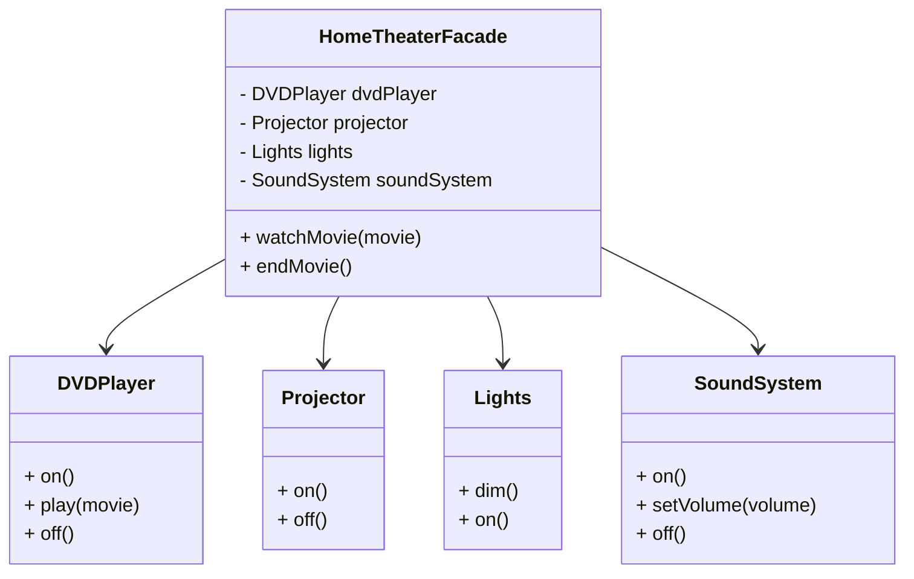

## 4.6. Facade Pattern

In the realm of software design, complexity is often an inevitable consequence of building robust and feature-rich systems. As systems grow, they tend to become intricate, with numerous interdependent components. The Facade Pattern emerges as a beacon of simplicity amidst this complexity, offering a way to streamline interactions with complex subsystems. In this section, we will delve into the Facade Pattern, exploring its intent, motivation, and practical implementation through pseudocode examples.

### Intent and Motivation

The Facade Pattern is a structural design pattern that provides a unified interface to a set of interfaces in a subsystem. It defines a higher-level interface that makes the subsystem easier to use. The primary motivation behind the Facade Pattern is to simplify interactions with complex systems by providing a single point of access.

#### Simplifying Complex Subsystems

Complex subsystems often consist of numerous classes and interfaces, each with its own responsibilities and interactions. While these components are necessary for the system's functionality, they can overwhelm clients that need to interact with them. The Facade Pattern addresses this challenge by introducing a facade class that encapsulates the complexity and exposes a simplified interface to the clients.

**Key Benefits of the Facade Pattern:**

- **Reduces Complexity:** By providing a single interface, the Facade Pattern reduces the number of interactions clients need to manage, thereby decreasing the overall complexity.
- **Improves Usability:** Clients can interact with the subsystem through a straightforward interface, enhancing usability and reducing the learning curve.
- **Promotes Loose Coupling:** The facade acts as a mediator between the client and the subsystem, promoting loose coupling and enhancing maintainability.
- **Facilitates Subsystem Evolution:** Changes within the subsystem can be managed internally without affecting clients, as long as the facade interface remains consistent.

### Key Participants

The Facade Pattern involves several key participants, each playing a crucial role in its implementation:

- **Facade:** The facade class provides a simple interface to the complex subsystem. It delegates client requests to appropriate subsystem objects.
- **Subsystem Classes:** These classes implement the subsystem's functionality. They handle the actual work and are often unaware of the facade.
- **Client:** The client interacts with the subsystem through the facade, benefiting from the simplified interface.

### Applicability

The Facade Pattern is applicable in scenarios where:

- A system is complex and difficult to understand or use.
- There is a need to provide a simple interface to a complex subsystem.
- You want to decouple clients from the subsystem, promoting loose coupling.
- You need to layer your subsystems to improve organization and manageability.

### Pseudocode Implementation

Let's explore a pseudocode implementation of the Facade Pattern. Consider a scenario where we have a complex subsystem responsible for managing a home theater system, including components like a DVD player, projector, lights, and sound system. The Facade Pattern can simplify the process of turning on the home theater system for a movie night.

```pseudocode
// Subsystem Classes

class DVDPlayer {
    method on() {
        print("DVD Player is on.")
    }
    
    method play(movie) {
        print("Playing movie: " + movie)
    }
    
    method off() {
        print("DVD Player is off.")
    }
}

class Projector {
    method on() {
        print("Projector is on.")
    }
    
    method off() {
        print("Projector is off.")
    }
}

class Lights {
    method dim() {
        print("Lights are dimmed.")
    }
    
    method on() {
        print("Lights are on.")
    }
}

class SoundSystem {
    method on() {
        print("Sound System is on.")
    }
    
    method setVolume(volume) {
        print("Volume set to " + volume)
    }
    
    method off() {
        print("Sound System is off.")
    }
}

// Facade Class

class HomeTheaterFacade {
    private dvdPlayer
    private projector
    private lights
    private soundSystem
    
    constructor(dvdPlayer, projector, lights, soundSystem) {
        this.dvdPlayer = dvdPlayer
        this.projector = projector
        this.lights = lights
        this.soundSystem = soundSystem
    }
    
    method watchMovie(movie) {
        print("Get ready to watch a movie...")
        lights.dim()
        projector.on()
        soundSystem.on()
        soundSystem.setVolume(10)
        dvdPlayer.on()
        dvdPlayer.play(movie)
    }
    
    method endMovie() {
        print("Shutting down the home theater...")
        lights.on()
        projector.off()
        soundSystem.off()
        dvdPlayer.off()
    }
}

// Client Code

dvdPlayer = new DVDPlayer()
projector = new Projector()
lights = new Lights()
soundSystem = new SoundSystem()

homeTheater = new HomeTheaterFacade(dvdPlayer, projector, lights, soundSystem)

homeTheater.watchMovie("Inception")
homeTheater.endMovie()
```

In this pseudocode example, the `HomeTheaterFacade` class acts as the facade, providing a simplified interface for the client to interact with the home theater subsystem. The client can easily start and end a movie without dealing with the intricacies of each subsystem component.

### Design Considerations

When implementing the Facade Pattern, consider the following:

- **Subsystem Independence:** The facade should not alter the subsystem's functionality. It merely provides a simplified interface.
- **Flexibility:** While the facade simplifies interactions, ensure that clients can still access the subsystem directly if needed.
- **Consistency:** Maintain a consistent facade interface even if the underlying subsystem evolves.

### Differences and Similarities

The Facade Pattern is often confused with other structural patterns, such as the Adapter Pattern. However, there are distinct differences:

- **Facade vs. Adapter:** The Facade Pattern provides a simplified interface to a complex subsystem, while the Adapter Pattern converts one interface into another. The facade is typically used to simplify interactions, whereas the adapter is used to make incompatible interfaces work together.
- **Facade vs. Proxy:** The Proxy Pattern provides a surrogate or placeholder for another object, controlling access to it. The facade, on the other hand, simplifies access to a complex subsystem without controlling it.

### Visualizing the Facade Pattern

To further enhance our understanding of the Facade Pattern, let's visualize it using a class diagram. This diagram illustrates the relationships between the facade, subsystem classes, and the client.



**Diagram Description:** This class diagram illustrates the Facade Pattern in the context of a home theater system. The `HomeTheaterFacade` class interacts with various subsystem classes (`DVDPlayer`, `Projector`, `Lights`, `SoundSystem`) to provide a simplified interface for the client.

### When to Use Facades

The Facade Pattern is particularly useful in the following scenarios:

- **Complex Subsystems:** When dealing with complex subsystems that have numerous interdependent components, a facade can simplify interactions and improve usability.
- **Legacy Systems:** Facades can be used to wrap legacy systems, providing a modern interface without altering the underlying code.
- **Layered Architectures:** In layered architectures, facades can act as intermediaries between layers, promoting loose coupling and enhancing maintainability.
- **Testing and Mocking:** Facades can simplify testing and mocking by providing a single point of interaction with the subsystem.

### Try It Yourself

To deepen your understanding of the Facade Pattern, try modifying the pseudocode example provided. Consider adding new components to the home theater system, such as a popcorn maker or a streaming device. Update the `HomeTheaterFacade` class to include these new components and test the changes.

### Knowledge Check

Before we conclude, let's reinforce our understanding of the Facade Pattern with a few questions:

- What is the primary intent of the Facade Pattern?
- How does the Facade Pattern promote loose coupling?
- In what scenarios is the Facade Pattern most beneficial?
- How does the Facade Pattern differ from the Adapter Pattern?

### Summary

The Facade Pattern is a powerful tool for simplifying interactions with complex subsystems. By providing a unified interface, it reduces complexity, improves usability, and promotes loose coupling. As we've seen through our pseudocode example and class diagram, the Facade Pattern can be effectively applied to real-world scenarios, enhancing the design and maintainability of software systems.

Remember, mastering design patterns is an ongoing journey. As you continue to explore and apply these patterns, you'll develop a deeper understanding of their nuances and benefits. Keep experimenting, stay curious, and embrace the power of design patterns in your software development endeavors.

## Quiz Time!



### What is the primary intent of the Facade Pattern?

- [x] To provide a unified interface to a set of interfaces in a subsystem.
- [ ] To convert one interface into another.
- [ ] To provide a surrogate or placeholder for another object.
- [ ] To encapsulate a group of individual factories.

> **Explanation:** The Facade Pattern aims to provide a simplified interface to a complex subsystem, making it easier for clients to interact with.

### How does the Facade Pattern promote loose coupling?

- [x] By acting as a mediator between the client and the subsystem.
- [ ] By converting one interface into another.
- [ ] By providing a surrogate for another object.
- [ ] By encapsulating a group of individual factories.

> **Explanation:** The facade acts as an intermediary, reducing direct dependencies between the client and the subsystem, thus promoting loose coupling.

### In what scenarios is the Facade Pattern most beneficial?

- [x] When dealing with complex subsystems.
- [x] When wrapping legacy systems.
- [ ] When converting incompatible interfaces.
- [ ] When providing a surrogate for another object.

> **Explanation:** The Facade Pattern is beneficial in simplifying interactions with complex subsystems and wrapping legacy systems to provide a modern interface.

### How does the Facade Pattern differ from the Adapter Pattern?

- [x] The Facade Pattern simplifies interactions, while the Adapter Pattern converts interfaces.
- [ ] The Facade Pattern provides a surrogate for another object.
- [ ] The Facade Pattern encapsulates a group of individual factories.
- [ ] The Facade Pattern is used for managing object creation.

> **Explanation:** The Facade Pattern provides a simplified interface, whereas the Adapter Pattern is used to make incompatible interfaces work together.

### Which of the following is a key benefit of the Facade Pattern?

- [x] Reduces complexity.
- [ ] Increases complexity.
- [ ] Provides a surrogate for another object.
- [ ] Converts one interface into another.

> **Explanation:** The Facade Pattern reduces complexity by providing a single, simplified interface to a complex subsystem.

### What role does the facade class play in the Facade Pattern?

- [x] It provides a simple interface to the complex subsystem.
- [ ] It converts one interface into another.
- [ ] It provides a surrogate for another object.
- [ ] It manages object creation.

> **Explanation:** The facade class provides a simplified interface, delegating client requests to the appropriate subsystem objects.

### How can facades facilitate subsystem evolution?

- [x] By managing changes internally without affecting clients.
- [ ] By converting one interface into another.
- [ ] By providing a surrogate for another object.
- [ ] By encapsulating a group of individual factories.

> **Explanation:** As long as the facade interface remains consistent, changes within the subsystem can be managed internally without impacting clients.

### What is a common misconception about the Facade Pattern?

- [x] That it alters the subsystem's functionality.
- [ ] That it simplifies interactions.
- [ ] That it provides a unified interface.
- [ ] That it promotes loose coupling.

> **Explanation:** The facade does not alter the subsystem's functionality; it merely provides a simplified interface for interaction.

### True or False: The Facade Pattern can be used in layered architectures to promote loose coupling.

- [x] True
- [ ] False

> **Explanation:** In layered architectures, facades can act as intermediaries between layers, promoting loose coupling and enhancing maintainability.

### Which pattern is often confused with the Facade Pattern due to its role in simplifying interactions?

- [x] Adapter Pattern
- [ ] Proxy Pattern
- [ ] Factory Pattern
- [ ] Singleton Pattern

> **Explanation:** The Adapter Pattern is often confused with the Facade Pattern because both involve simplifying interactions, but they serve different purposes.


