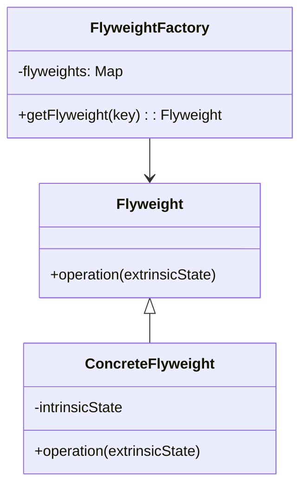
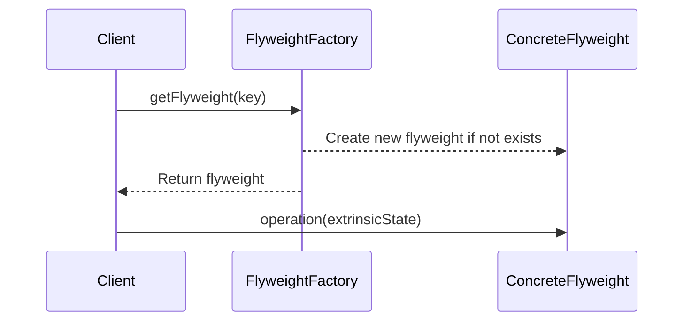

## 4.7. Flyweight Pattern

In the realm of software design, optimizing memory usage is a critical concern, especially when dealing with large numbers of similar objects. The Flyweight Pattern offers a solution by enabling the sharing of common state among multiple objects, thereby reducing memory consumption and improving performance. This section will delve into the Flyweight Pattern, exploring its intent, motivation, and practical implementation through pseudocode examples and diagrams.

### Intent and Motivation

The Flyweight Pattern is a structural design pattern that focuses on minimizing memory usage by sharing as much data as possible with similar objects. The primary intent is to use sharing to support a large number of fine-grained objects efficiently. This pattern is particularly useful in scenarios where an application needs to create a large number of objects that share common data.

#### Key Concepts

- **Intrinsic State**: This is the state that is shared among multiple objects. It is independent of the context in which the object is used and can be stored in a shared location.
- **Extrinsic State**: This is the state that is unique to each object and depends on the context. It cannot be shared and must be stored separately for each object.

#### Motivation

Consider a text editor where each character is represented as an object. If each character object stores its own font and style information, the memory usage can become significant. By using the Flyweight Pattern, we can share the font and style information (intrinsic state) among multiple character objects, while maintaining their position and context-specific data (extrinsic state) separately.

### Diagrams

To better understand the Flyweight Pattern, let's visualize its structure using a class diagram.



**Diagram Description**: This class diagram illustrates the Flyweight Pattern's key components. The `Flyweight` interface defines a method `operation` that takes an `extrinsicState` as a parameter. The `ConcreteFlyweight` class implements this interface and maintains an `intrinsicState`. The `FlyweightFactory` is responsible for creating and managing flyweight objects, ensuring that shared instances are reused.

### Key Participants

1. **Flyweight**: The interface or abstract class that defines the method for performing operations on flyweight objects.
2. **ConcreteFlyweight**: Implements the Flyweight interface and stores the intrinsic state. It provides methods to operate on the extrinsic state.
3. **FlyweightFactory**: Manages flyweight objects and ensures that shared instances are reused. It provides a method to get a flyweight object based on a key.

### Applicability

The Flyweight Pattern is applicable in scenarios where:

- A large number of objects need to be created, and they share common data.
- The memory cost of creating a new object is high.
- The intrinsic state can be shared among multiple objects, while the extrinsic state is stored externally.

### Pseudocode Implementation

Let's explore a pseudocode implementation of the Flyweight Pattern to see how it can be applied in practice.

```pseudocode
// Flyweight interface
interface Flyweight {
    method operation(extrinsicState)
}

// ConcreteFlyweight class
class ConcreteFlyweight implements Flyweight {
    private intrinsicState

    constructor(intrinsicState) {
        this.intrinsicState = intrinsicState
    }

    method operation(extrinsicState) {
        // Perform operation using intrinsic and extrinsic state
        print("Intrinsic State: " + this.intrinsicState + ", Extrinsic State: " + extrinsicState)
    }
}

// FlyweightFactory class
class FlyweightFactory {
    private flyweights = new Map()

    method getFlyweight(key) {
        if (!flyweights.containsKey(key)) {
            flyweights.put(key, new ConcreteFlyweight(key))
        }
        return flyweights.get(key)
    }
}

// Client code
flyweightFactory = new FlyweightFactory()

flyweight1 = flyweightFactory.getFlyweight("A")
flyweight1.operation("First Call")

flyweight2 = flyweightFactory.getFlyweight("A")
flyweight2.operation("Second Call")

flyweight3 = flyweightFactory.getFlyweight("B")
flyweight3.operation("Third Call")
```

**Explanation**: In this pseudocode, we define a `Flyweight` interface with an `operation` method. The `ConcreteFlyweight` class implements this interface and stores the intrinsic state. The `FlyweightFactory` class manages the creation and reuse of flyweight objects. The client code demonstrates how the factory is used to obtain flyweight objects and perform operations with extrinsic state.

### Managing Extrinsic and Intrinsic Data

One of the critical aspects of the Flyweight Pattern is the separation and management of intrinsic and extrinsic data. Let's explore how this is achieved and the considerations involved.

#### Intrinsic Data

Intrinsic data is the shared state that remains constant across different contexts. It is stored within the flyweight object and is not modified during operations. This data is typically immutable and can be shared among multiple flyweight instances.

#### Extrinsic Data

Extrinsic data is context-specific and varies between different instances. It is passed to the flyweight object during operations and is not stored within the flyweight. This separation allows for efficient memory usage, as only the unique data is stored for each instance.

### Design Considerations

When using the Flyweight Pattern, consider the following:

- **Immutable Intrinsic State**: Ensure that the intrinsic state is immutable to prevent unintended modifications that could affect all shared instances.
- **Efficient Factory Management**: The FlyweightFactory should efficiently manage the creation and reuse of flyweight objects to maximize memory savings.
- **Balance Between Intrinsic and Extrinsic State**: Carefully determine which data should be intrinsic and which should be extrinsic to optimize performance and memory usage.

### Differences and Similarities

The Flyweight Pattern is often compared to other structural patterns, such as the Singleton and Prototype patterns. Let's explore the differences and similarities:

- **Singleton Pattern**: The Singleton Pattern ensures a single instance of a class, while the Flyweight Pattern allows multiple instances with shared state. The Flyweight Pattern focuses on memory optimization, whereas the Singleton Pattern focuses on instance control.
- **Prototype Pattern**: The Prototype Pattern involves cloning objects, while the Flyweight Pattern involves sharing common state. The Prototype Pattern is useful for creating new instances with similar properties, whereas the Flyweight Pattern is useful for reducing memory usage by sharing state.

### Try It Yourself

To deepen your understanding of the Flyweight Pattern, try modifying the pseudocode example to include additional intrinsic and extrinsic states. Experiment with different configurations to see how they affect memory usage and performance.

### Visualizing the Flyweight Pattern in Action

Let's visualize the Flyweight Pattern in action using a sequence diagram to illustrate the interaction between the client, factory, and flyweight objects.



**Diagram Description**: This sequence diagram illustrates the process of obtaining a flyweight object from the factory and performing an operation with extrinsic state. The factory checks if a flyweight with the given key exists, creates a new one if necessary, and returns it to the client. The client then performs an operation on the flyweight with the extrinsic state.

### Knowledge Check

Before we conclude, let's reinforce our understanding of the Flyweight Pattern with a few questions:

- What is the primary intent of the Flyweight Pattern?
- How does the Flyweight Pattern optimize memory usage?
- What are the key differences between intrinsic and extrinsic state?
- How does the Flyweight Pattern differ from the Singleton and Prototype patterns?

### Embrace the Journey

Remember, mastering design patterns is a journey that requires practice and experimentation. The Flyweight Pattern is a powerful tool for optimizing memory usage, but it's essential to understand when and how to apply it effectively. Keep exploring and experimenting with different patterns to enhance your software design skills.

### References and Links

For further reading on the Flyweight Pattern and related topics, consider exploring the following resources:

- [Design Patterns: Elements of Reusable Object-Oriented Software](https://en.wikipedia.org/wiki/Design_Patterns) by Erich Gamma, Richard Helm, Ralph Johnson, and John Vlissides (Gang of Four)
- [Flyweight Pattern on Wikipedia](https://en.wikipedia.org/wiki/Flyweight_pattern)
- [Refactoring Guru: Flyweight Pattern](https://refactoring.guru/design-patterns/flyweight)

## Quiz Time!



### What is the primary intent of the Flyweight Pattern?

- [x] To minimize memory usage by sharing common state among multiple objects.
- [ ] To ensure a single instance of a class.
- [ ] To clone objects with similar properties.
- [ ] To encapsulate actions as objects.

> **Explanation:** The Flyweight Pattern aims to minimize memory usage by sharing common state among multiple objects, making it efficient for handling large numbers of similar objects.

### How does the Flyweight Pattern optimize memory usage?

- [x] By sharing intrinsic state among multiple objects.
- [ ] By creating a single instance of a class.
- [ ] By cloning objects with similar properties.
- [ ] By encapsulating actions as objects.

> **Explanation:** The Flyweight Pattern optimizes memory usage by sharing intrinsic state among multiple objects, reducing the need to store duplicate data.

### What is intrinsic state in the Flyweight Pattern?

- [x] The shared state that remains constant across different contexts.
- [ ] The context-specific state that varies between instances.
- [ ] The state that is unique to each object.
- [ ] The state that is passed during operations.

> **Explanation:** Intrinsic state is the shared state that remains constant across different contexts and is stored within the flyweight object.

### What is extrinsic state in the Flyweight Pattern?

- [x] The context-specific state that varies between instances.
- [ ] The shared state that remains constant across different contexts.
- [ ] The state that is stored within the flyweight object.
- [ ] The state that is immutable.

> **Explanation:** Extrinsic state is the context-specific state that varies between instances and is passed to the flyweight object during operations.

### How does the Flyweight Pattern differ from the Singleton Pattern?

- [x] The Flyweight Pattern allows multiple instances with shared state, while the Singleton Pattern ensures a single instance.
- [ ] The Flyweight Pattern ensures a single instance, while the Singleton Pattern allows multiple instances with shared state.
- [ ] Both patterns focus on memory optimization.
- [ ] Both patterns involve cloning objects.

> **Explanation:** The Flyweight Pattern allows multiple instances with shared state, focusing on memory optimization, while the Singleton Pattern ensures a single instance of a class.

### How does the Flyweight Pattern differ from the Prototype Pattern?

- [x] The Flyweight Pattern involves sharing common state, while the Prototype Pattern involves cloning objects.
- [ ] The Flyweight Pattern involves cloning objects, while the Prototype Pattern involves sharing common state.
- [ ] Both patterns focus on instance control.
- [ ] Both patterns involve encapsulating actions as objects.

> **Explanation:** The Flyweight Pattern involves sharing common state to optimize memory usage, while the Prototype Pattern involves cloning objects to create new instances with similar properties.

### In the Flyweight Pattern, what is the role of the FlyweightFactory?

- [x] To manage the creation and reuse of flyweight objects.
- [ ] To store the intrinsic state within flyweight objects.
- [ ] To encapsulate actions as objects.
- [ ] To ensure a single instance of a class.

> **Explanation:** The FlyweightFactory manages the creation and reuse of flyweight objects, ensuring that shared instances are used efficiently.

### What is a key consideration when using the Flyweight Pattern?

- [x] Ensuring the intrinsic state is immutable.
- [ ] Ensuring the extrinsic state is immutable.
- [ ] Cloning objects with similar properties.
- [ ] Encapsulating actions as objects.

> **Explanation:** Ensuring the intrinsic state is immutable is crucial to prevent unintended modifications that could affect all shared instances.

### True or False: The Flyweight Pattern is useful for optimizing memory usage in scenarios with a large number of similar objects.

- [x] True
- [ ] False

> **Explanation:** True. The Flyweight Pattern is particularly useful for optimizing memory usage in scenarios where a large number of similar objects need to be created and share common data.


