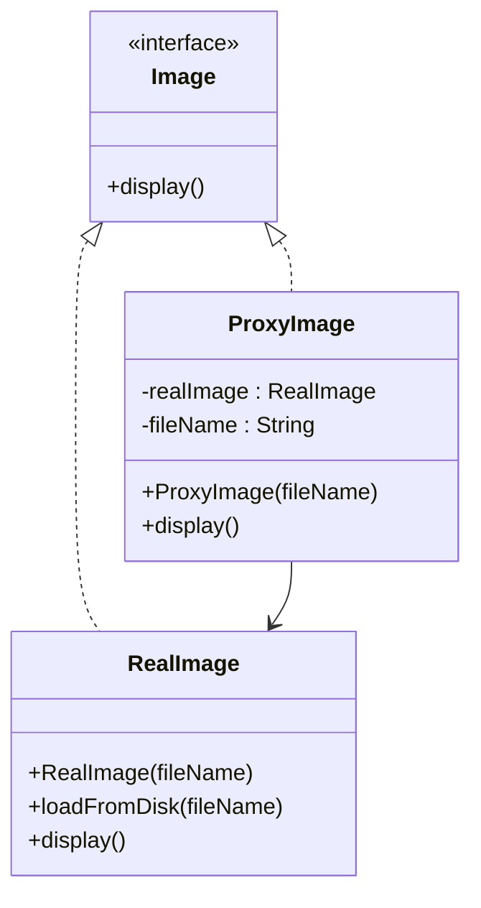

## 4.8. Proxy Pattern

### Introduction

The Proxy Pattern is a structural design pattern that provides a surrogate or placeholder for another object to control access to it. This pattern is particularly useful when you need to add an additional level of indirection to support controlled access, lazy initialization, logging, access control, or other similar functionalities. By using a proxy, you can encapsulate the complexity of the real object and provide a simplified interface to the client.

### Intent and Motivation

The primary intent of the Proxy Pattern is to provide a substitute or placeholder for another object to control access to it. This pattern is motivated by the need to manage the complexity of interacting with objects that may be resource-intensive, located remotely, or require access control.

#### Key Benefits:
- **Controlled Access**: Proxies can control access to the real object, providing an additional layer of security or functionality.
- **Lazy Initialization**: Proxies can delay the creation and initialization of the real object until it is absolutely necessary.
- **Remote Access**: Proxies can represent objects that are located in different address spaces, such as in remote servers.
- **Logging and Auditing**: Proxies can log requests and responses, providing a mechanism for auditing interactions with the real object.

### Types of Proxies

The Proxy Pattern can be implemented in various forms, each serving a different purpose. Here are the most common types:

#### 1. Virtual Proxy
A Virtual Proxy is used to manage the creation and initialization of resource-intensive objects. It acts as a stand-in for the real object and creates it only when it is needed.

#### 2. Remote Proxy
A Remote Proxy represents an object that exists in a different address space, such as on a remote server. It handles the communication between the client and the remote object.

#### 3. Protection Proxy
A Protection Proxy controls access to the real object by providing different levels of access rights to different clients. It ensures that only authorized clients can perform certain operations on the real object.

#### 4. Cache Proxy
A Cache Proxy stores the results of expensive operations and returns cached results to avoid redundant processing.

#### 5. Smart Proxy
A Smart Proxy provides additional functionality, such as reference counting or logging, when accessing the real object.

### Pseudocode Implementation

Let's explore the Proxy Pattern with a detailed pseudocode example. We'll implement a Virtual Proxy that controls access to a resource-intensive object.

#### Example: Virtual Proxy for Image Loading

Consider a scenario where we have an `Image` class that loads images from disk. Loading images can be resource-intensive, so we use a Virtual Proxy to delay loading until the image is actually needed.

```pseudocode
// The Subject interface declares common operations for both RealSubject and Proxy.
interface Image {
    method display()
}

// The RealSubject contains the actual implementation of the Image interface.
class RealImage implements Image {
    private variable fileName

    constructor RealImage(fileName) {
        this.fileName = fileName
        loadFromDisk(fileName)
    }

    method loadFromDisk(fileName) {
        print("Loading " + fileName)
    }

    method display() {
        print("Displaying " + fileName)
    }
}

// The Proxy class controls access to the RealSubject.
class ProxyImage implements Image {
    private variable realImage
    private variable fileName

    constructor ProxyImage(fileName) {
        this.fileName = fileName
    }

    method display() {
        if (realImage == null) {
            realImage = new RealImage(fileName)
        }
        realImage.display()
    }
}

// Client code
variable image = new ProxyImage("test_image.jpg")
image.display() // Loads and displays the image
image.display() // Displays the image without loading
```

### Diagram: Proxy Pattern Structure

To better understand the Proxy Pattern, let's visualize its structure using a class diagram.



**Diagram Explanation:**  
- The `Image` interface defines the common operations for both the `RealImage` and `ProxyImage`.
- The `RealImage` class implements the actual functionality.
- The `ProxyImage` class controls access to the `RealImage` and manages its lifecycle.

### Use Cases and Examples

The Proxy Pattern is widely used in software development to solve various problems. Here are some common use cases and examples:

#### 1. Lazy Initialization

In scenarios where object creation is expensive, a Virtual Proxy can be used to delay the creation of the object until it is needed. This is particularly useful in applications with large datasets or complex calculations.

#### 2. Access Control

A Protection Proxy can be used to enforce access control policies. For example, in a banking application, a Protection Proxy can ensure that only authorized users can perform transactions on an account.

#### 3. Remote Access

In distributed systems, a Remote Proxy can represent objects located on remote servers. This allows clients to interact with remote objects as if they were local, abstracting the complexities of network communication.

#### 4. Caching

A Cache Proxy can store the results of expensive operations and return cached results to improve performance. This is commonly used in web applications to cache responses from external APIs.

#### 5. Logging and Monitoring

A Smart Proxy can log requests and responses, providing a mechanism for monitoring and auditing interactions with the real object. This is useful in applications where tracking user actions is important.

### Design Considerations

When implementing the Proxy Pattern, consider the following:

- **Performance Overhead**: Proxies can introduce additional overhead, so it's important to balance the benefits with the performance impact.
- **Complexity**: Adding proxies can increase the complexity of the codebase, so use them judiciously.
- **Security**: Ensure that Protection Proxies are implemented securely to prevent unauthorized access.

### Differences and Similarities

The Proxy Pattern is often confused with other structural patterns, such as the Decorator and Adapter patterns. Here are some key differences:

- **Proxy vs. Decorator**: While both patterns provide a level of indirection, the Proxy Pattern controls access to an object, whereas the Decorator Pattern adds additional behavior to an object.
- **Proxy vs. Adapter**: The Adapter Pattern is used to make two incompatible interfaces work together, while the Proxy Pattern provides controlled access to an object.

### Try It Yourself

To deepen your understanding of the Proxy Pattern, try modifying the pseudocode example to implement a Protection Proxy that restricts access based on user roles. Consider how you would handle unauthorized access attempts and log them for auditing purposes.

### Conclusion

The Proxy Pattern is a powerful tool in the software engineer's toolkit, providing a flexible way to control access to objects. By understanding the different types of proxies and their use cases, you can apply this pattern effectively to solve complex design problems.

Remember, this is just the beginning. As you progress, you'll discover more ways to leverage the Proxy Pattern in your projects. Keep experimenting, stay curious, and enjoy the journey!

## Quiz Time!



### What is the primary intent of the Proxy Pattern?

- [x] To provide a surrogate or placeholder for another object to control access to it.
- [ ] To add additional behavior to an object dynamically.
- [ ] To make two incompatible interfaces work together.
- [ ] To encapsulate a family of algorithms.

> **Explanation:** The Proxy Pattern provides a surrogate or placeholder for another object to control access to it, unlike the Decorator which adds behavior, or the Adapter which makes interfaces compatible.

### Which type of proxy is used to manage the creation and initialization of resource-intensive objects?

- [x] Virtual Proxy
- [ ] Remote Proxy
- [ ] Protection Proxy
- [ ] Cache Proxy

> **Explanation:** A Virtual Proxy is used to manage the creation and initialization of resource-intensive objects, delaying their creation until necessary.

### What is a common use case for a Protection Proxy?

- [x] Enforcing access control policies.
- [ ] Delaying object creation.
- [ ] Caching expensive operations.
- [ ] Logging requests and responses.

> **Explanation:** A Protection Proxy is commonly used to enforce access control policies, ensuring only authorized clients can perform certain operations.

### In a distributed system, which type of proxy represents objects located on remote servers?

- [ ] Virtual Proxy
- [x] Remote Proxy
- [ ] Protection Proxy
- [ ] Smart Proxy

> **Explanation:** A Remote Proxy represents objects located on remote servers, allowing clients to interact with them as if they were local.

### What is the key difference between the Proxy and Decorator patterns?

- [x] Proxy controls access, Decorator adds behavior.
- [ ] Proxy adds behavior, Decorator controls access.
- [ ] Both control access.
- [ ] Both add behavior.

> **Explanation:** The Proxy Pattern controls access to an object, while the Decorator Pattern adds additional behavior to an object.

### Which type of proxy is used to store the results of expensive operations?

- [ ] Virtual Proxy
- [ ] Remote Proxy
- [ ] Protection Proxy
- [x] Cache Proxy

> **Explanation:** A Cache Proxy stores the results of expensive operations and returns cached results to avoid redundant processing.

### What is a Smart Proxy used for?

- [ ] Delaying object creation.
- [ ] Representing remote objects.
- [ ] Enforcing access control.
- [x] Providing additional functionality like logging.

> **Explanation:** A Smart Proxy provides additional functionality, such as logging or reference counting, when accessing the real object.

### Which pattern is often confused with the Proxy Pattern but is used to make two incompatible interfaces work together?

- [ ] Decorator Pattern
- [x] Adapter Pattern
- [ ] Strategy Pattern
- [ ] Observer Pattern

> **Explanation:** The Adapter Pattern is used to make two incompatible interfaces work together, unlike the Proxy Pattern which controls access.

### What should be considered when implementing the Proxy Pattern?

- [x] Performance overhead and complexity.
- [ ] Only performance overhead.
- [ ] Only complexity.
- [ ] Neither performance overhead nor complexity.

> **Explanation:** When implementing the Proxy Pattern, consider both performance overhead and complexity, as proxies can introduce additional layers and processing.

### True or False: The Proxy Pattern can be used for logging and monitoring interactions with an object.

- [x] True
- [ ] False

> **Explanation:** True, a Smart Proxy can log requests and responses, providing a mechanism for monitoring and auditing interactions with the real object.


