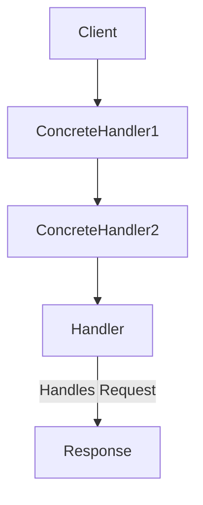
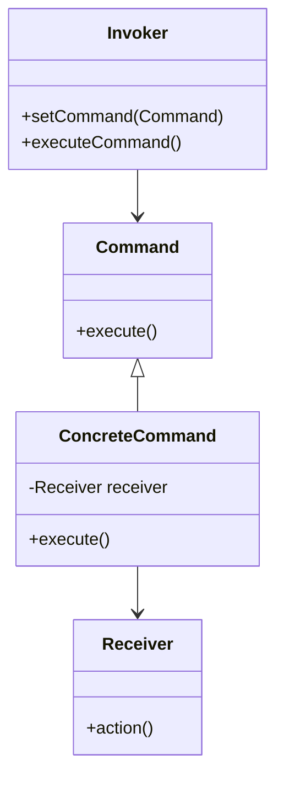

## 5.1. Overview of Behavioral Patterns

Behavioral design patterns are a critical aspect of software architecture that focus on the interaction and communication between objects. They define how objects collaborate to perform tasks, manage responsibilities, and handle algorithms efficiently. In this section, we will delve into the essence of behavioral patterns, exploring their intent, key participants, applicability, and how they can be implemented using pseudocode across different programming paradigms.

### Understanding Behavioral Patterns

Behavioral patterns are concerned with algorithms and the assignment of responsibilities between objects. They help in defining the communication patterns between objects and the flow of control in a system. By employing these patterns, developers can create flexible and reusable code that is easier to maintain and extend.

#### Key Objectives of Behavioral Patterns

1. **Communication Between Objects**: Behavioral patterns facilitate communication and interaction between objects, allowing them to work together to achieve a common goal.

2. **Managing Algorithms**: These patterns help in defining and managing algorithms, ensuring that they are encapsulated and can be easily modified or extended.

3. **Assigning Responsibilities**: Behavioral patterns help in distributing responsibilities among objects, ensuring that each object has a clear role and purpose.

4. **Enhancing Flexibility and Reusability**: By promoting loose coupling and high cohesion, behavioral patterns enhance the flexibility and reusability of code.

### Common Behavioral Patterns

Let's explore some of the most common behavioral patterns, understanding their intent, structure, and how they can be implemented using pseudocode.

#### Chain of Responsibility Pattern

**Intent**: The Chain of Responsibility pattern is used to avoid coupling the sender of a request to its receiver by giving more than one object a chance to handle the request. It chains the receiving objects and passes the request along the chain until an object handles it.

**Key Participants**:
- **Handler**: Defines an interface for handling requests.
- **ConcreteHandler**: Handles requests it is responsible for. It can access its successor.
- **Client**: Initiates the request to a ConcreteHandler object on the chain.

**Applicability**: Use this pattern when more than one object can handle a request, and the handler is not known a priori.

**Pseudocode Implementation**:

```pseudocode
class Handler:
    def set_successor(successor):
        this.successor = successor

    def handle_request(request):
        if this.successor:
            this.successor.handle_request(request)

class ConcreteHandler1(Handler):
    def handle_request(request):
        if request == "Condition1":
            // Handle request
        else:
            super.handle_request(request)

class ConcreteHandler2(Handler):
    def handle_request(request):
        if request == "Condition2":
            // Handle request
        else:
            super.handle_request(request)

// Client code
handler1 = ConcreteHandler1()
handler2 = ConcreteHandler2()
handler1.set_successor(handler2)

handler1.handle_request("Condition2")
```

**Design Considerations**: Use this pattern when you want to decouple the sender and receiver of a request and when you want to allow multiple objects to handle a request.

#### Command Pattern

**Intent**: The Command pattern encapsulates a request as an object, thereby allowing for parameterization of clients with queues, requests, and operations.

**Key Participants**:
- **Command**: Declares an interface for executing an operation.
- **ConcreteCommand**: Defines a binding between a Receiver object and an action.
- **Invoker**: Asks the command to carry out the request.
- **Receiver**: Knows how to perform the operations associated with carrying out a request.

**Applicability**: Use this pattern when you want to parameterize objects with operations, queue operations, or support undoable operations.

**Pseudocode Implementation**:

```pseudocode
class Command:
    def execute():
        pass

class ConcreteCommand(Command):
    def __init__(receiver):
        this.receiver = receiver

    def execute():
        this.receiver.action()

class Receiver:
    def action():
        // Perform action

class Invoker:
    def set_command(command):
        this.command = command

    def execute_command():
        this.command.execute()

// Client code
receiver = Receiver()
command = ConcreteCommand(receiver)
invoker = Invoker()
invoker.set_command(command)
invoker.execute_command()
```

**Design Considerations**: The Command pattern is useful for implementing callback functionality and supporting undo/redo operations.

#### Observer Pattern

**Intent**: The Observer pattern defines a one-to-many dependency between objects so that when one object changes state, all its dependents are notified and updated automatically.

**Key Participants**:
- **Subject**: Maintains a list of observers and notifies them of any state changes.
- **Observer**: Defines an updating interface for objects that should be notified of changes in a subject.
- **ConcreteSubject**: Stores state of interest to ConcreteObserver objects.
- **ConcreteObserver**: Implements the Observer updating interface to keep its state consistent with the subject's.

**Applicability**: Use this pattern when a change to one object requires changing others, and you don't know how many objects need to be changed.

**Pseudocode Implementation**:

```pseudocode
class Subject:
    def __init__():
        this.observers = []

    def attach(observer):
        this.observers.append(observer)

    def detach(observer):
        this.observers.remove(observer)

    def notify():
        for observer in this.observers:
            observer.update()

class ConcreteSubject(Subject):
    def __init__():
        super().__init__()
        this.state = 0

    def get_state():
        return this.state

    def set_state(state):
        this.state = state
        this.notify()

class Observer:
    def update():
        pass

class ConcreteObserver(Observer):
    def __init__(subject):
        this.subject = subject

    def update():
        // Update observer state based on subject state

// Client code
subject = ConcreteSubject()
observer1 = ConcreteObserver(subject)
observer2 = ConcreteObserver(subject)

subject.attach(observer1)
subject.attach(observer2)

subject.set_state(10)
```

**Design Considerations**: The Observer pattern is ideal for implementing distributed event handling systems and ensuring that changes in one part of an application are reflected in others.

### Visualizing Behavioral Patterns

To better understand how behavioral patterns facilitate communication and manage responsibilities, let's visualize some of these patterns using diagrams.

#### Chain of Responsibility Diagram



**Description**: This diagram illustrates the flow of a request through a chain of handlers, where each handler has the opportunity to process the request or pass it to the next handler.

#### Command Pattern Diagram



**Description**: This diagram shows the relationship between the invoker, command, and receiver, highlighting how commands encapsulate actions and can be executed by the invoker.

### Try It Yourself

To deepen your understanding of behavioral patterns, try modifying the pseudocode examples provided. For instance, in the Chain of Responsibility pattern, add a new handler to the chain and observe how the request is processed. In the Command pattern, experiment with adding new commands and receivers to see how the system adapts.

### Knowledge Check

Before we conclude, let's reinforce what we've learned with some questions and exercises:

1. **Question**: What is the primary purpose of the Chain of Responsibility pattern?
   - [ ] To encapsulate requests as objects
   - [x] To decouple senders and receivers of requests
   - [ ] To define a one-to-many dependency between objects
   - [ ] To encapsulate algorithms

2. **Exercise**: Implement a simple Observer pattern where a subject notifies multiple observers of changes in its state. Extend the example to include a new type of observer that reacts differently to state changes.

### Conclusion

Behavioral patterns play a crucial role in defining how objects interact and communicate within a system. By understanding and applying these patterns, developers can create flexible, maintainable, and scalable software architectures. Remember, mastering these patterns is a journey, and the more you practice, the more adept you'll become at designing robust systems.

## Quiz Time!



### What is the primary goal of behavioral design patterns?

- [x] To manage algorithms and responsibilities between objects
- [ ] To define object creation mechanisms
- [ ] To structure classes and objects
- [ ] To handle concurrency issues

> **Explanation:** Behavioral patterns focus on managing algorithms and responsibilities between objects, facilitating communication and interaction.

### Which pattern involves encapsulating a request as an object?

- [ ] Observer Pattern
- [x] Command Pattern
- [ ] Chain of Responsibility Pattern
- [ ] Strategy Pattern

> **Explanation:** The Command pattern encapsulates a request as an object, allowing for parameterization of clients with queues, requests, and operations.

### In the Chain of Responsibility pattern, what happens if no handler processes the request?

- [ ] The request is automatically processed by the client
- [ ] The request is discarded
- [x] The request is passed along the chain until a handler processes it
- [ ] The request is returned to the sender

> **Explanation:** In the Chain of Responsibility pattern, the request is passed along the chain until a handler processes it or the end of the chain is reached.

### What is a key benefit of the Observer pattern?

- [ ] It allows for encapsulating algorithms
- [x] It defines a one-to-many dependency between objects
- [ ] It supports undoable operations
- [ ] It manages object creation

> **Explanation:** The Observer pattern defines a one-to-many dependency between objects, ensuring that changes in one object are reflected in others.

### Which pattern is ideal for implementing callback functionality?

- [ ] Observer Pattern
- [ ] Chain of Responsibility Pattern
- [x] Command Pattern
- [ ] Strategy Pattern

> **Explanation:** The Command pattern is useful for implementing callback functionality and supporting undo/redo operations.

### What does the Invoker do in the Command pattern?

- [x] It asks the command to carry out the request
- [ ] It stores the state of interest to observers
- [ ] It defines an interface for handling requests
- [ ] It encapsulates a family of algorithms

> **Explanation:** In the Command pattern, the Invoker asks the command to carry out the request.

### How does the Observer pattern notify observers of changes?

- [ ] By encapsulating requests as objects
- [x] By calling the update method on each observer
- [ ] By passing requests along a chain
- [ ] By defining a family of algorithms

> **Explanation:** In the Observer pattern, the subject notifies observers of changes by calling the update method on each observer.

### What is the role of the Receiver in the Command pattern?

- [ ] To maintain a list of observers
- [ ] To define an interface for executing operations
- [x] To know how to perform the operations associated with a request
- [ ] To handle requests it is responsible for

> **Explanation:** In the Command pattern, the Receiver knows how to perform the operations associated with a request.

### Which pattern is best suited for decoupling senders and receivers of requests?

- [ ] Observer Pattern
- [ ] Command Pattern
- [x] Chain of Responsibility Pattern
- [ ] Strategy Pattern

> **Explanation:** The Chain of Responsibility pattern is best suited for decoupling senders and receivers of requests.

### True or False: Behavioral patterns are primarily concerned with object creation.

- [ ] True
- [x] False

> **Explanation:** False. Behavioral patterns are primarily concerned with communication between objects and managing algorithms and responsibilities, not object creation.



Remember, this is just the beginning. As you progress, you'll build more complex and interactive systems. Keep experimenting, stay curious, and enjoy the journey!
