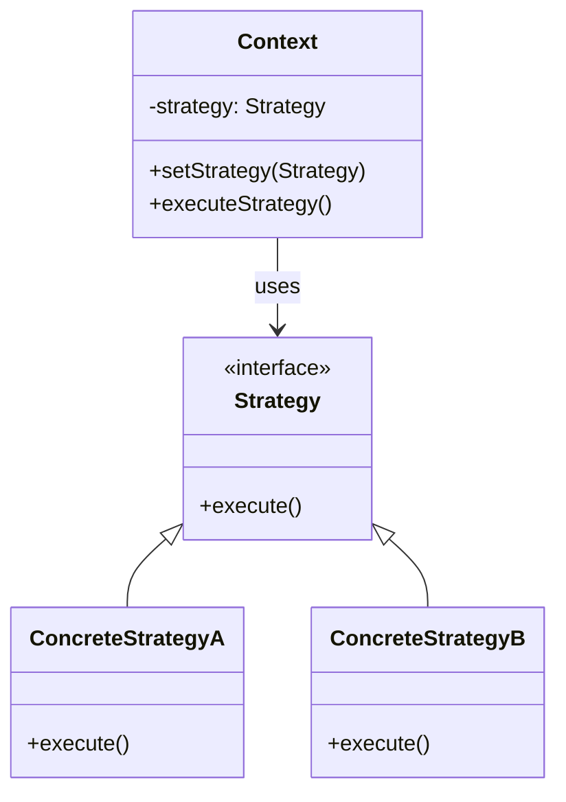

## 5.10. Strategy Pattern

In the world of software design, flexibility and maintainability are paramount. The Strategy Pattern is a behavioral design pattern that provides a way to define a family of algorithms, encapsulate each one, and make them interchangeable. This pattern allows the algorithm to vary independently from the clients that use it. In this section, we will delve into the Strategy Pattern, exploring its intent, motivation, and implementation through pseudocode examples and diagrams.

### Intent and Motivation

The primary intent of the Strategy Pattern is to define a family of algorithms, encapsulate each one, and make them interchangeable. This pattern is particularly useful when you have multiple algorithms for a specific task and want to switch between them easily.

#### Key Motivations

1. **Flexibility**: By encapsulating algorithms, the Strategy Pattern allows you to change the algorithm without modifying the client code. This flexibility is crucial in scenarios where the algorithm might change based on user input or other runtime conditions.

2. **Maintainability**: Separating algorithms into distinct classes makes the codebase easier to maintain. Each algorithm can be developed and tested independently, reducing the risk of introducing bugs when changes are made.

3. **Reusability**: Algorithms encapsulated as strategies can be reused across different parts of the application or even in different projects, promoting code reuse.

4. **Avoiding Conditional Logic**: The Strategy Pattern helps eliminate complex conditional statements that choose different behaviors based on various conditions. Instead, the appropriate strategy is selected and executed.

### Visualizing the Strategy Pattern

To better understand the Strategy Pattern, let's visualize its structure using a class diagram.



**Diagram Description**: The diagram above illustrates the Strategy Pattern. The `Context` class maintains a reference to a `Strategy` object and delegates the execution of the algorithm to the `Strategy` interface. `ConcreteStrategyA` and `ConcreteStrategyB` are implementations of the `Strategy` interface, each providing a different algorithm.

### Key Participants

- **Strategy**: This is the interface common to all supported algorithms. It declares a method that the `Context` uses to execute the algorithm.

- **ConcreteStrategy**: These are classes that implement the `Strategy` interface, providing specific implementations of the algorithm.

- **Context**: This class maintains a reference to a `Strategy` object and is configured with a `ConcreteStrategy` object. The `Context` interacts with the `Strategy` interface to execute the algorithm.

### Applicability

The Strategy Pattern is applicable in the following scenarios:

- When you have multiple algorithms for a specific task and want to switch between them dynamically.
- When you want to avoid using conditional statements to select different behaviors.
- When you need to isolate the implementation details of an algorithm from the client code.
- When a class has multiple behaviors that can be selected at runtime.

### Pseudocode Implementation

Let's explore a pseudocode implementation of the Strategy Pattern to solidify our understanding.

```pseudocode
// Strategy interface
interface Strategy {
    method execute()
}

// Concrete Strategy A
class ConcreteStrategyA implements Strategy {
    method execute() {
        // Implementation of algorithm A
        print("Executing Strategy A")
    }
}

// Concrete Strategy B
class ConcreteStrategyB implements Strategy {
    method execute() {
        // Implementation of algorithm B
        print("Executing Strategy B")
    }
}

// Context class
class Context {
    private strategy: Strategy

    method setStrategy(strategy: Strategy) {
        this.strategy = strategy
    }

    method executeStrategy() {
        this.strategy.execute()
    }
}

// Client code
context = new Context()

// Using Strategy A
context.setStrategy(new ConcreteStrategyA())
context.executeStrategy() // Output: Executing Strategy A

// Switching to Strategy B
context.setStrategy(new ConcreteStrategyB())
context.executeStrategy() // Output: Executing Strategy B
```

**Explanation**: In the pseudocode above, we define a `Strategy` interface with an `execute` method. `ConcreteStrategyA` and `ConcreteStrategyB` implement this interface, each providing a different algorithm. The `Context` class holds a reference to a `Strategy` object and delegates the execution to the strategy. The client code demonstrates how to switch between different strategies at runtime.

### Selecting Strategies at Runtime

One of the most powerful features of the Strategy Pattern is the ability to select strategies at runtime. This capability is particularly useful in applications where the behavior needs to change dynamically based on user input or other runtime conditions.

#### Example: Payment Processing System

Consider a payment processing system where different payment methods (e.g., credit card, PayPal, bank transfer) are implemented as strategies. The user selects a payment method at runtime, and the system processes the payment using the selected strategy.

```pseudocode
// Strategy interface for payment
interface PaymentStrategy {
    method pay(amount: float)
}

// Concrete Strategy for Credit Card Payment
class CreditCardPayment implements PaymentStrategy {
    method pay(amount: float) {
        print("Processing credit card payment of $" + amount)
    }
}

// Concrete Strategy for PayPal Payment
class PayPalPayment implements PaymentStrategy {
    method pay(amount: float) {
        print("Processing PayPal payment of $" + amount)
    }
}

// Concrete Strategy for Bank Transfer Payment
class BankTransferPayment implements PaymentStrategy {
    method pay(amount: float) {
        print("Processing bank transfer payment of $" + amount)
    }
}

// Context class for Payment
class PaymentContext {
    private strategy: PaymentStrategy

    method setPaymentStrategy(strategy: PaymentStrategy) {
        this.strategy = strategy
    }

    method processPayment(amount: float) {
        this.strategy.pay(amount)
    }
}

// Client code
paymentContext = new PaymentContext()

// User selects Credit Card Payment
paymentContext.setPaymentStrategy(new CreditCardPayment())
paymentContext.processPayment(100.0) // Output: Processing credit card payment of $100.0

// User switches to PayPal Payment
paymentContext.setPaymentStrategy(new PayPalPayment())
paymentContext.processPayment(150.0) // Output: Processing PayPal payment of $150.0
```

**Explanation**: In this example, `PaymentStrategy` is the strategy interface, and `CreditCardPayment`, `PayPalPayment`, and `BankTransferPayment` are concrete strategies. The `PaymentContext` class is configured with a `PaymentStrategy` and processes payments using the selected strategy. The client code demonstrates how to switch between different payment strategies at runtime.

### Design Considerations

When implementing the Strategy Pattern, consider the following:

- **Interface Design**: Ensure that the strategy interface is well-defined and captures the essence of the algorithm. This design will make it easier to add new strategies in the future.

- **Strategy Selection**: Consider how strategies will be selected at runtime. This selection can be based on user input, configuration files, or other runtime conditions.

- **Performance**: Be mindful of the performance implications of switching strategies at runtime. In some cases, the overhead of switching strategies might outweigh the benefits.

- **Complexity**: While the Strategy Pattern can simplify code by eliminating conditional logic, it can also introduce complexity by adding more classes. Ensure that the benefits outweigh the added complexity.

### Differences and Similarities

The Strategy Pattern is often confused with other patterns, such as the State Pattern and the Command Pattern. Let's clarify the distinctions:

- **Strategy vs. State Pattern**: Both patterns involve changing behavior at runtime. However, the Strategy Pattern focuses on encapsulating algorithms, while the State Pattern is about managing state transitions within an object.

- **Strategy vs. Command Pattern**: The Command Pattern encapsulates a request as an object, allowing for parameterization and queuing of requests. The Strategy Pattern, on the other hand, focuses on encapsulating algorithms and selecting them at runtime.

### Try It Yourself

To deepen your understanding of the Strategy Pattern, try modifying the pseudocode examples provided. Consider adding a new strategy or changing the criteria for selecting a strategy at runtime. Experiment with different scenarios to see how the Strategy Pattern can be applied in various contexts.

### Knowledge Check

1. What is the primary intent of the Strategy Pattern?
2. How does the Strategy Pattern promote flexibility and maintainability?
3. In what scenarios is the Strategy Pattern particularly useful?
4. How does the Strategy Pattern differ from the State Pattern?
5. What are some considerations when implementing the Strategy Pattern?

### Embrace the Journey

Remember, mastering design patterns is a journey. The Strategy Pattern is just one of many patterns that can enhance your software design skills. As you continue to explore and apply design patterns, you'll become more adept at creating flexible, maintainable, and reusable code. Keep experimenting, stay curious, and enjoy the journey!

## Quiz Time!



### What is the primary intent of the Strategy Pattern?

- [x] To define a family of algorithms and make them interchangeable
- [ ] To manage state transitions within an object
- [ ] To encapsulate a request as an object
- [ ] To simplify complex conditional logic

> **Explanation:** The Strategy Pattern's primary intent is to define a family of algorithms, encapsulate each one, and make them interchangeable.

### How does the Strategy Pattern promote flexibility?

- [x] By allowing algorithms to vary independently from clients
- [ ] By managing state transitions within an object
- [ ] By encapsulating requests as objects
- [ ] By simplifying complex conditional logic

> **Explanation:** The Strategy Pattern allows algorithms to vary independently from clients, promoting flexibility.

### In what scenarios is the Strategy Pattern particularly useful?

- [x] When you have multiple algorithms for a task and want to switch between them
- [ ] When you need to manage state transitions within an object
- [ ] When you need to encapsulate requests as objects
- [ ] When you need to simplify complex conditional logic

> **Explanation:** The Strategy Pattern is useful when you have multiple algorithms for a task and want to switch between them dynamically.

### How does the Strategy Pattern differ from the State Pattern?

- [x] Strategy focuses on encapsulating algorithms, while State manages state transitions
- [ ] Strategy encapsulates requests as objects, while State manages state transitions
- [ ] Strategy simplifies complex conditional logic, while State manages state transitions
- [ ] Strategy manages state transitions, while State encapsulates algorithms

> **Explanation:** The Strategy Pattern focuses on encapsulating algorithms, while the State Pattern manages state transitions within an object.

### What are some considerations when implementing the Strategy Pattern?

- [x] Interface design, strategy selection, performance, and complexity
- [ ] State management, request encapsulation, and algorithm encapsulation
- [ ] Conditional logic simplification, request encapsulation, and state transitions
- [ ] Request encapsulation, state management, and performance

> **Explanation:** When implementing the Strategy Pattern, consider interface design, strategy selection, performance, and complexity.

### What is a key benefit of using the Strategy Pattern?

- [x] It promotes code reuse by encapsulating algorithms
- [ ] It manages state transitions within an object
- [ ] It encapsulates requests as objects
- [ ] It simplifies complex conditional logic

> **Explanation:** The Strategy Pattern promotes code reuse by encapsulating algorithms, making them interchangeable.

### Which of the following is a key participant in the Strategy Pattern?

- [x] Strategy
- [ ] Command
- [ ] State
- [ ] Observer

> **Explanation:** The Strategy Pattern involves key participants such as Strategy, ConcreteStrategy, and Context.

### What does the Context class do in the Strategy Pattern?

- [x] It maintains a reference to a Strategy object and delegates execution
- [ ] It encapsulates requests as objects
- [ ] It manages state transitions within an object
- [ ] It simplifies complex conditional logic

> **Explanation:** The Context class maintains a reference to a Strategy object and delegates the execution of the algorithm to the strategy.

### What is a potential drawback of using the Strategy Pattern?

- [x] It can introduce complexity by adding more classes
- [ ] It simplifies complex conditional logic
- [ ] It manages state transitions within an object
- [ ] It encapsulates requests as objects

> **Explanation:** While the Strategy Pattern can simplify code by eliminating conditional logic, it can also introduce complexity by adding more classes.

### True or False: The Strategy Pattern and the Command Pattern are the same.

- [ ] True
- [x] False

> **Explanation:** The Strategy Pattern and the Command Pattern are different. The Strategy Pattern focuses on encapsulating algorithms, while the Command Pattern encapsulates requests as objects.


