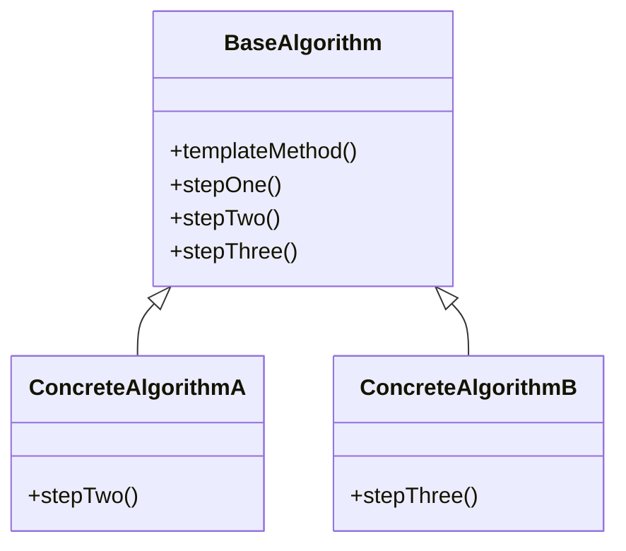

## 5.11. Template Method Pattern

The Template Method Pattern is a fundamental behavioral design pattern that plays a crucial role in defining the skeleton of an algorithm in a base class, allowing subclasses to override certain steps of the algorithm without changing its structure. This pattern is particularly useful in scenarios where you have a fixed sequence of steps, but some of those steps can vary depending on the context or subclass implementation. Let's dive into the intricacies of this pattern, its intent, motivation, and how to effectively implement it using pseudocode.

### Intent and Motivation

The primary intent of the Template Method Pattern is to define the overall structure of an algorithm in a base class while allowing subclasses to refine specific steps of the algorithm. This approach promotes code reuse and enforces a consistent algorithm structure across different implementations.

#### Key Motivations:

1. **Code Reuse**: By defining the common algorithm structure in a base class, you avoid duplicating code across subclasses. This makes maintenance easier and reduces the likelihood of errors.

2. **Consistency**: The pattern ensures that the algorithm's structure remains consistent across different implementations, which is essential for maintaining predictable behavior.

3. **Flexibility**: Subclasses can override specific steps of the algorithm to provide custom behavior without altering the overall structure.

4. **Separation of Concerns**: The pattern separates the invariant parts of the algorithm from the variant parts, allowing developers to focus on specific aspects of the implementation.

### Defining Algorithms in Base Classes

In the Template Method Pattern, the base class defines the template method, which outlines the algorithm's structure. This method calls other methods, some of which may be abstract or have default implementations. Subclasses can override these methods to provide specific behavior.

#### Example Structure:

```pseudocode
class BaseAlgorithm:
    method templateMethod():
        stepOne()
        stepTwo()
        stepThree()

    method stepOne():
        // Default implementation or abstract method

    method stepTwo():
        // Default implementation or abstract method

    method stepThree():
        // Default implementation or abstract method
```

In this structure, `templateMethod` is the template method that defines the algorithm's skeleton. `stepOne`, `stepTwo`, and `stepThree` are the steps that subclasses can override to customize the behavior.

### Pseudocode Implementation

Let's illustrate the Template Method Pattern with a practical example using pseudocode. Consider a scenario where we have a base class `DocumentProcessor` that defines the steps for processing a document. Subclasses can provide specific implementations for different document types.

```pseudocode
class DocumentProcessor:
    method processDocument():
        openDocument()
        parseDocument()
        closeDocument()

    method openDocument():
        // Default implementation for opening a document

    method parseDocument():
        // Abstract method to be implemented by subclasses

    method closeDocument():
        // Default implementation for closing a document

class XMLDocumentProcessor extends DocumentProcessor:
    method parseDocument():
        // Implementation for parsing XML documents

class JSONDocumentProcessor extends DocumentProcessor:
    method parseDocument():
        // Implementation for parsing JSON documents
```

In this example, `DocumentProcessor` defines the template method `processDocument`, which outlines the steps for processing a document. Subclasses `XMLDocumentProcessor` and `JSONDocumentProcessor` provide specific implementations for parsing XML and JSON documents, respectively.

### Hook Methods and Variations

Hook methods are optional methods in the base class that subclasses can override to add additional behavior or modify the algorithm's flow. These methods are not mandatory to override, providing flexibility to subclasses.

#### Example with Hook Methods:

```pseudocode
class Game:
    method play():
        startGame()
        while not isGameOver():
            playTurn()
        endGame()

    method startGame():
        // Default implementation

    method playTurn():
        // Abstract method

    method endGame():
        // Default implementation

    method isGameOver():
        return false // Default implementation

class ChessGame extends Game:
    method playTurn():
        // Implementation for playing a turn in chess

    method isGameOver():
        // Custom implementation to determine if the game is over
```

In this example, `isGameOver` is a hook method that `ChessGame` overrides to provide custom logic for determining when the game ends.

### Visualizing the Template Method Pattern

To better understand the Template Method Pattern, let's visualize the relationship between the base class and subclasses using a class diagram.



**Diagram Description:** This class diagram illustrates the Template Method Pattern, where `BaseAlgorithm` defines the template method and abstract steps. `ConcreteAlgorithmA` and `ConcreteAlgorithmB` are subclasses that provide specific implementations for different steps.

### Key Participants

1. **Abstract Class (Base Class)**: Defines the template method and the steps of the algorithm. It may provide default implementations for some steps.

2. **Concrete Class (Subclass)**: Implements the specific steps of the algorithm by overriding the methods defined in the abstract class.

### Applicability

Consider using the Template Method Pattern when:

- You have an algorithm with a fixed structure but variable steps.
- You want to enforce a consistent algorithm structure across different implementations.
- You need to provide default behavior for some steps while allowing customization for others.

### Sample Code Snippets

Here are some additional pseudocode examples to illustrate different use cases of the Template Method Pattern.

#### Example 1: Cooking Recipe

```pseudocode
class CookingRecipe:
    method cook():
        prepareIngredients()
        cookDish()
        serve()

    method prepareIngredients():
        // Default implementation

    method cookDish():
        // Abstract method

    method serve():
        // Default implementation

class PastaRecipe extends CookingRecipe:
    method cookDish():
        // Implementation for cooking pasta
```

#### Example 2: Data Processing

```pseudocode
class DataProcessor:
    method processData():
        loadData()
        processData()
        saveData()

    method loadData():
        // Default implementation

    method processData():
        // Abstract method

    method saveData():
        // Default implementation

class CSVDataProcessor extends DataProcessor:
    method processData():
        // Implementation for processing CSV data
```

### Design Considerations

When implementing the Template Method Pattern, consider the following:

- **Granularity**: Ensure that the steps defined in the base class are at the right level of granularity. Too fine-grained steps can lead to unnecessary complexity, while too coarse-grained steps may limit flexibility.

- **Default Implementations**: Provide sensible default implementations for steps that are not mandatory to override. This can simplify subclass implementations.

- **Hook Methods**: Use hook methods to allow subclasses to modify the algorithm's flow without requiring them to override every step.

- **Documentation**: Clearly document the purpose and expected behavior of each step in the base class to guide subclass implementations.

### Differences and Similarities

The Template Method Pattern is often compared to other patterns, such as the Strategy Pattern and the Factory Method Pattern. Here are some key differences and similarities:

- **Template Method vs. Strategy Pattern**: The Template Method Pattern defines the algorithm's structure in a base class, while the Strategy Pattern encapsulates the algorithm in separate strategy classes. The Template Method Pattern is more suitable when the algorithm's structure is fixed, whereas the Strategy Pattern provides more flexibility for changing the entire algorithm.

- **Template Method vs. Factory Method Pattern**: Both patterns involve defining steps in a base class and allowing subclasses to override them. However, the Factory Method Pattern focuses on object creation, while the Template Method Pattern focuses on defining an algorithm's structure.

### Try It Yourself

To deepen your understanding of the Template Method Pattern, try modifying the pseudocode examples provided. Here are some suggestions:

- **Add a New Document Type**: Extend the `DocumentProcessor` example by adding a new subclass for processing a different document type, such as CSV or PDF.

- **Customize Hook Methods**: In the `Game` example, add a new hook method to customize the game's scoring system.

- **Experiment with Default Implementations**: Modify the `CookingRecipe` example to provide default implementations for more steps and see how it affects subclass implementations.

### Knowledge Check

Before we conclude, let's reinforce what we've learned with a few questions:

- What is the primary intent of the Template Method Pattern?
- How does the Template Method Pattern promote code reuse?
- What are hook methods, and how do they enhance the Template Method Pattern?
- How does the Template Method Pattern differ from the Strategy Pattern?

### Embrace the Journey

Remember, mastering design patterns is a journey. The Template Method Pattern is just one of many tools in your software design toolkit. As you continue to explore and experiment with different patterns, you'll gain a deeper understanding of how to apply them effectively in your projects. Keep experimenting, stay curious, and enjoy the journey!

## Quiz Time!



### What is the primary intent of the Template Method Pattern?

- [x] To define the skeleton of an algorithm in a base class and allow subclasses to override specific steps.
- [ ] To encapsulate algorithms in separate strategy classes.
- [ ] To provide a way to create objects without specifying the exact class.
- [ ] To simplify complex subsystems by providing a unified interface.

> **Explanation:** The Template Method Pattern defines the skeleton of an algorithm in a base class, allowing subclasses to override specific steps without changing the algorithm's structure.

### How does the Template Method Pattern promote code reuse?

- [x] By defining common algorithm structures in a base class, reducing code duplication across subclasses.
- [ ] By allowing multiple algorithms to be encapsulated in separate strategy classes.
- [ ] By providing a unified interface for complex subsystems.
- [ ] By creating objects without specifying the exact class.

> **Explanation:** The Template Method Pattern promotes code reuse by defining common algorithm structures in a base class, which reduces code duplication across subclasses.

### What are hook methods in the Template Method Pattern?

- [x] Optional methods in the base class that subclasses can override to add additional behavior.
- [ ] Methods that encapsulate algorithms in separate strategy classes.
- [ ] Methods that provide a way to create objects without specifying the exact class.
- [ ] Methods that simplify complex subsystems by providing a unified interface.

> **Explanation:** Hook methods are optional methods in the base class that subclasses can override to add additional behavior or modify the algorithm's flow.

### How does the Template Method Pattern differ from the Strategy Pattern?

- [x] The Template Method Pattern defines the algorithm's structure in a base class, while the Strategy Pattern encapsulates the algorithm in separate strategy classes.
- [ ] The Template Method Pattern focuses on object creation, while the Strategy Pattern defines the algorithm's structure.
- [ ] The Template Method Pattern provides a unified interface for complex subsystems, while the Strategy Pattern simplifies object creation.
- [ ] The Template Method Pattern is used for creating objects, while the Strategy Pattern is used for defining algorithms.

> **Explanation:** The Template Method Pattern defines the algorithm's structure in a base class, whereas the Strategy Pattern encapsulates the algorithm in separate strategy classes, providing more flexibility for changing the entire algorithm.

### When should you consider using the Template Method Pattern?

- [x] When you have an algorithm with a fixed structure but variable steps.
- [ ] When you need to encapsulate multiple algorithms in separate strategy classes.
- [ ] When you want to provide a unified interface for complex subsystems.
- [ ] When you need to create objects without specifying the exact class.

> **Explanation:** The Template Method Pattern is suitable when you have an algorithm with a fixed structure but variable steps, allowing subclasses to customize specific steps.

### What is a key benefit of using hook methods in the Template Method Pattern?

- [x] They allow subclasses to modify the algorithm's flow without requiring them to override every step.
- [ ] They encapsulate algorithms in separate strategy classes.
- [ ] They provide a way to create objects without specifying the exact class.
- [ ] They simplify complex subsystems by providing a unified interface.

> **Explanation:** Hook methods allow subclasses to modify the algorithm's flow without requiring them to override every step, providing flexibility and customization.

### What should you consider when defining steps in the base class of the Template Method Pattern?

- [x] Ensure that the steps are at the right level of granularity to avoid unnecessary complexity.
- [ ] Encapsulate algorithms in separate strategy classes.
- [ ] Provide a unified interface for complex subsystems.
- [ ] Create objects without specifying the exact class.

> **Explanation:** When defining steps in the base class, ensure that they are at the right level of granularity to avoid unnecessary complexity and maintain flexibility.

### How can you experiment with the Template Method Pattern?

- [x] By adding new subclasses and customizing hook methods in the provided examples.
- [ ] By encapsulating multiple algorithms in separate strategy classes.
- [ ] By providing a unified interface for complex subsystems.
- [ ] By creating objects without specifying the exact class.

> **Explanation:** You can experiment with the Template Method Pattern by adding new subclasses and customizing hook methods in the provided examples, allowing you to explore different implementations.

### What is a common pitfall to avoid when using the Template Method Pattern?

- [x] Defining steps that are too fine-grained, leading to unnecessary complexity.
- [ ] Encapsulating algorithms in separate strategy classes.
- [ ] Providing a unified interface for complex subsystems.
- [ ] Creating objects without specifying the exact class.

> **Explanation:** A common pitfall is defining steps that are too fine-grained, leading to unnecessary complexity. Ensure that steps are at the right level of granularity.

### True or False: The Template Method Pattern is used for creating objects without specifying the exact class.

- [ ] True
- [x] False

> **Explanation:** False. The Template Method Pattern is not used for creating objects without specifying the exact class; it is used to define the skeleton of an algorithm in a base class, allowing subclasses to override specific steps.




