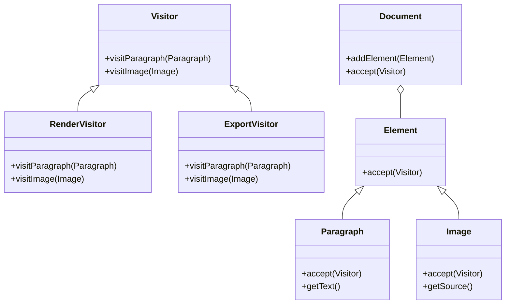

## 5.12. Visitor Pattern

The Visitor Pattern is a behavioral design pattern that allows you to separate algorithms from the objects on which they operate. This pattern is particularly useful when you need to perform operations on a composite object structure, such as a tree or a graph, without modifying the classes of the elements on which it operates. By using the Visitor Pattern, you can add new operations to existing object structures without altering their classes.

### Intent and Motivation

The primary intent of the Visitor Pattern is to define a new operation without changing the classes of the elements on which it operates. This is achieved by encapsulating the operation in a separate object known as a "visitor." The Visitor Pattern is particularly beneficial when you have a complex object structure and you need to perform various unrelated operations on it. By using this pattern, you can keep the operations separate from the object structure, promoting cleaner code and easier maintenance.

#### Key Benefits

- **Separation of Concerns**: By separating operations from the object structure, you can manage and maintain operations independently.
- **Extensibility**: Adding new operations becomes easier as you only need to create a new visitor class without modifying existing elements.
- **Flexibility**: The Visitor Pattern allows you to perform operations across a heterogeneous collection of objects.

#### Use Cases

- When you have a complex object structure and need to perform multiple operations that are unrelated to the structure itself.
- When you want to add new operations to an object structure without changing its classes.
- When the object structure is stable, but you expect frequent changes in the operations performed on it.

### Key Participants

To understand the Visitor Pattern, it's essential to identify its key participants:

1. **Visitor**: An interface or abstract class that declares a visit operation for each type of concrete element in the object structure.
2. **ConcreteVisitor**: A class that implements the visitor operations for each type of concrete element.
3. **Element**: An interface or abstract class that declares an `accept` method, which takes a visitor as an argument.
4. **ConcreteElement**: A class that implements the `accept` method, typically calling the visitor's corresponding visit method.
5. **ObjectStructure**: A class that can enumerate its elements and provide a high-level interface to allow the visitor to visit its elements.

### Applicability

The Visitor Pattern is applicable in scenarios where:

- You need to perform various operations on objects of different classes that form part of a structure.
- You want to avoid polluting the classes of the objects with unrelated operations.
- The operations need to be applied across a set of objects with different interfaces.

### Pseudocode Implementation

Let's delve into a pseudocode implementation of the Visitor Pattern. We'll use a simple example of a document structure consisting of different elements like `Paragraph` and `Image`, and we'll define a visitor that performs operations like rendering and exporting.

#### Step 1: Define the Visitor Interface

```pseudocode
interface Visitor {
    method visitParagraph(paragraph: Paragraph)
    method visitImage(image: Image)
}
```

#### Step 2: Create Concrete Visitors

```pseudocode
class RenderVisitor implements Visitor {
    method visitParagraph(paragraph: Paragraph) {
        // Render the paragraph
        print("Rendering paragraph: " + paragraph.getText())
    }

    method visitImage(image: Image) {
        // Render the image
        print("Rendering image with source: " + image.getSource())
    }
}

class ExportVisitor implements Visitor {
    method visitParagraph(paragraph: Paragraph) {
        // Export the paragraph
        print("Exporting paragraph to PDF: " + paragraph.getText())
    }

    method visitImage(image: Image) {
        // Export the image
        print("Exporting image to PDF with source: " + image.getSource())
    }
}
```

#### Step 3: Define the Element Interface

```pseudocode
interface Element {
    method accept(visitor: Visitor)
}
```

#### Step 4: Create Concrete Elements

```pseudocode
class Paragraph implements Element {
    private text: String

    method Paragraph(text: String) {
        this.text = text
    }

    method getText() {
        return this.text
    }

    method accept(visitor: Visitor) {
        visitor.visitParagraph(this)
    }
}

class Image implements Element {
    private source: String

    method Image(source: String) {
        this.source = source
    }

    method getSource() {
        return this.source
    }

    method accept(visitor: Visitor) {
        visitor.visitImage(this)
    }
}
```

#### Step 5: Define the Object Structure

```pseudocode
class Document {
    private elements: List<Element>

    method Document() {
        this.elements = new List<Element>()
    }

    method addElement(element: Element) {
        this.elements.add(element)
    }

    method accept(visitor: Visitor) {
        for each element in elements {
            element.accept(visitor)
        }
    }
}
```

#### Step 6: Use the Visitor Pattern

```pseudocode
// Create document elements
paragraph1 = new Paragraph("Hello, world!")
image1 = new Image("image1.png")

// Create document and add elements
document = new Document()
document.addElement(paragraph1)
document.addElement(image1)

// Create visitors
renderVisitor = new RenderVisitor()
exportVisitor = new ExportVisitor()

// Apply visitors
document.accept(renderVisitor)
document.accept(exportVisitor)
```

### Double Dispatch Technique

The Visitor Pattern relies on the double dispatch technique, which allows a function to be dynamically dispatched based on the runtime types of two objects. In the context of the Visitor Pattern, double dispatch is used to determine the appropriate operation to perform on an element based on both the type of the element and the type of the visitor.

#### How Double Dispatch Works

1. **First Dispatch**: The element calls the `accept` method, passing itself and the visitor as arguments.
2. **Second Dispatch**: The visitor's `visit` method is called, which is dynamically dispatched based on the type of the element.

This technique ensures that the correct operation is performed for each combination of element and visitor type.

### Visualizing the Visitor Pattern

To better understand the Visitor Pattern, let's visualize the relationships between the components using a class diagram.



### Design Considerations

When using the Visitor Pattern, consider the following:

- **Element Stability**: The Visitor Pattern is most effective when the object structure is stable, but the operations on it are likely to change.
- **Complexity**: The pattern can introduce complexity, especially if the object structure is large or if there are many visitors.
- **Performance**: Double dispatch may introduce a slight performance overhead, but this is usually negligible compared to the benefits of clean separation of concerns.

### Differences and Similarities

The Visitor Pattern is often compared to other patterns like the Strategy Pattern and the Command Pattern. Here are some key differences and similarities:

- **Visitor vs. Strategy**: While both patterns encapsulate operations, the Visitor Pattern is used for operations on a structure of objects, whereas the Strategy Pattern is used to select an algorithm at runtime.
- **Visitor vs. Command**: The Command Pattern encapsulates a request as an object, allowing for parameterization and queuing of requests. The Visitor Pattern, on the other hand, focuses on performing operations on object structures.

### Try It Yourself

To gain a deeper understanding of the Visitor Pattern, try modifying the pseudocode examples provided:

- **Add a New Element**: Implement a new element type, such as `Table`, and update the visitor classes to handle it.
- **Create a New Visitor**: Implement a new visitor that performs a different operation, such as converting elements to HTML.
- **Experiment with Object Structures**: Create a more complex document structure with nested elements and see how the Visitor Pattern handles it.

### Knowledge Check

Before we wrap up, let's reinforce what we've learned with some questions:

- What is the primary intent of the Visitor Pattern?
- How does the double dispatch technique work in the context of the Visitor Pattern?
- What are the key participants in the Visitor Pattern?

### Embrace the Journey

Remember, mastering design patterns like the Visitor Pattern is a journey. As you continue to explore and experiment, you'll gain a deeper understanding of how to apply these patterns effectively in your software designs. Keep experimenting, stay curious, and enjoy the journey!

## Quiz Time!



### What is the primary intent of the Visitor Pattern?

- [x] To define a new operation without changing the classes of the elements on which it operates.
- [ ] To encapsulate a request as an object.
- [ ] To select an algorithm at runtime.
- [ ] To manage object creation.

> **Explanation:** The Visitor Pattern allows new operations to be defined without altering the classes of the elements on which it operates.

### Which technique does the Visitor Pattern rely on?

- [x] Double Dispatch
- [ ] Single Dispatch
- [ ] Factory Method
- [ ] Observer

> **Explanation:** The Visitor Pattern uses double dispatch to dynamically determine the correct operation based on the element and visitor types.

### What is a key benefit of the Visitor Pattern?

- [x] Separation of concerns
- [ ] Simplifying object creation
- [ ] Reducing code duplication
- [ ] Managing state transitions

> **Explanation:** The Visitor Pattern separates operations from the object structure, allowing for independent management and maintenance.

### When is the Visitor Pattern most effective?

- [x] When the object structure is stable, but operations are likely to change.
- [ ] When the object structure is frequently changing.
- [ ] When operations are tightly coupled with the object structure.
- [ ] When there is a need for dynamic object creation.

> **Explanation:** The Visitor Pattern is ideal when the object structure is stable, but operations may change frequently.

### What is a potential drawback of the Visitor Pattern?

- [x] It can introduce complexity.
- [ ] It simplifies object creation.
- [ ] It reduces code duplication.
- [ ] It manages state transitions.

> **Explanation:** The Visitor Pattern can introduce complexity, especially with large object structures or many visitors.

### How does double dispatch work in the Visitor Pattern?

- [x] It allows a function to be dynamically dispatched based on the runtime types of two objects.
- [ ] It allows a function to be dispatched based on a single object type.
- [ ] It encapsulates a request as an object.
- [ ] It selects an algorithm at runtime.

> **Explanation:** Double dispatch enables dynamic function dispatch based on the types of both the element and the visitor.

### What is a common use case for the Visitor Pattern?

- [x] Performing operations on a composite object structure.
- [ ] Managing object creation.
- [ ] Selecting algorithms at runtime.
- [ ] Encapsulating requests as objects.

> **Explanation:** The Visitor Pattern is commonly used for operations on composite object structures.

### What is a key participant in the Visitor Pattern?

- [x] Visitor
- [ ] Factory
- [ ] Singleton
- [ ] Adapter

> **Explanation:** The Visitor is a key participant, defining operations for each type of concrete element.

### What is the role of the Element in the Visitor Pattern?

- [x] To declare an `accept` method that takes a visitor as an argument.
- [ ] To encapsulate a request as an object.
- [ ] To manage object creation.
- [ ] To select an algorithm at runtime.

> **Explanation:** The Element declares an `accept` method, allowing the visitor to perform operations on it.

### True or False: The Visitor Pattern is ideal for frequently changing object structures.

- [ ] True
- [x] False

> **Explanation:** The Visitor Pattern is best suited for stable object structures with changing operations.




