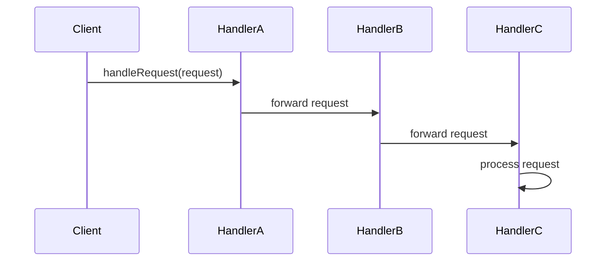

## 5.2. Chain of Responsibility Pattern

The Chain of Responsibility Pattern is a pivotal concept in software design, particularly within the realm of behavioral design patterns. It provides a powerful mechanism to decouple senders and receivers, allowing for flexible and dynamic handling of requests. In this section, we will delve into the intent and motivation behind this pattern, explore its implementation through pseudocode, and examine real-world use cases that illustrate its practical applications.

### Intent and Motivation

The primary intent of the Chain of Responsibility Pattern is to avoid coupling the sender of a request to its receiver by giving more than one object a chance to handle the request. This pattern allows for a chain of objects to process a request, with each object in the chain having the opportunity to handle the request or pass it along to the next object in the chain.

#### Avoiding Coupling Senders and Receivers

In traditional request-handling scenarios, the sender is often tightly coupled to a specific receiver, leading to rigid and inflexible designs. The Chain of Responsibility Pattern addresses this issue by introducing a chain of handlers, each capable of processing the request. This decoupling allows for greater flexibility and extensibility, as new handlers can be added to the chain without modifying existing code.

**Key Benefits:**

- **Flexibility:** The chain can be dynamically modified at runtime, allowing for adaptable request handling.
- **Extensibility:** New handlers can be added to the chain without altering existing handlers.
- **Decoupling:** The sender and receiver are decoupled, promoting a more modular and maintainable codebase.

### Pseudocode Implementation

To better understand the Chain of Responsibility Pattern, let's explore its implementation through pseudocode. This example will illustrate the core components of the pattern and demonstrate how they interact to process requests.

#### Key Participants

1. **Handler Interface:** Defines the interface for handling requests and setting the next handler in the chain.
2. **Concrete Handler:** Implements the handler interface and processes requests it is responsible for. If it cannot handle the request, it forwards it to the next handler.
3. **Client:** Initiates the request and sets up the chain of handlers.

#### Pseudocode Example

```pseudocode
// Handler Interface
interface Handler {
    method setNext(handler: Handler)
    method handleRequest(request: Request)
}

// Concrete Handler A
class ConcreteHandlerA implements Handler {
    private nextHandler: Handler

    method setNext(handler: Handler) {
        this.nextHandler = handler
    }

    method handleRequest(request: Request) {
        if (canHandle(request)) {
            // Process the request
            print("ConcreteHandlerA handled the request")
        } else if (this.nextHandler != null) {
            this.nextHandler.handleRequest(request)
        }
    }

    method canHandle(request: Request): Boolean {
        // Logic to determine if this handler can process the request
        return request.type == "TypeA"
    }
}

// Concrete Handler B
class ConcreteHandlerB implements Handler {
    private nextHandler: Handler

    method setNext(handler: Handler) {
        this.nextHandler = handler
    }

    method handleRequest(request: Request) {
        if (canHandle(request)) {
            // Process the request
            print("ConcreteHandlerB handled the request")
        } else if (this.nextHandler != null) {
            this.nextHandler.handleRequest(request)
        }
    }

    method canHandle(request: Request): Boolean {
        // Logic to determine if this handler can process the request
        return request.type == "TypeB"
    }
}

// Client Code
class Client {
    method main() {
        handlerA = new ConcreteHandlerA()
        handlerB = new ConcreteHandlerB()

        handlerA.setNext(handlerB)

        request = new Request("TypeB")
        handlerA.handleRequest(request)
    }
}
```

In this pseudocode, we define a `Handler` interface with methods for setting the next handler and handling requests. `ConcreteHandlerA` and `ConcreteHandlerB` implement this interface, each with logic to determine if they can handle a given request. The client sets up the chain by linking `handlerA` to `handlerB` and initiates a request, which is processed by the appropriate handler in the chain.

### Use Cases

The Chain of Responsibility Pattern is widely applicable in scenarios where requests need to be processed by multiple handlers. Let's explore some common use cases:

#### 1. Event Handling Systems

In event-driven architectures, the Chain of Responsibility Pattern can be used to process events through a series of handlers. Each handler can decide whether to process the event or pass it along, allowing for flexible event processing pipelines.

#### 2. Logging Frameworks

Logging frameworks often use the Chain of Responsibility Pattern to manage log messages. Different log levels (e.g., DEBUG, INFO, ERROR) can be handled by different handlers, each responsible for processing specific log levels.

#### 3. User Interface (UI) Components

In UI frameworks, user actions (e.g., mouse clicks, keyboard inputs) can be processed by a chain of components. Each component can decide whether to handle the action or pass it to the next component in the chain.

#### 4. Authentication and Authorization

The Chain of Responsibility Pattern can be employed in authentication and authorization systems, where multiple checks (e.g., password validation, role-based access control) are performed by different handlers in the chain.

### Visualizing the Chain of Responsibility Pattern

To enhance our understanding, let's visualize the Chain of Responsibility Pattern using a sequence diagram. This diagram illustrates the flow of a request through a chain of handlers.



In this sequence diagram, the `Client` sends a request to `HandlerA`, which forwards it to `HandlerB`, and finally to `HandlerC`, where it is processed. This visual representation highlights the decoupled nature of the pattern and the dynamic flow of requests through the chain.

### Design Considerations

When implementing the Chain of Responsibility Pattern, consider the following:

- **Order of Handlers:** The order in which handlers are linked can affect the behavior of the chain. Ensure that handlers are ordered logically based on their responsibilities.
- **Termination:** Ensure that the chain has a termination condition to prevent infinite loops. This can be achieved by having a default handler that handles any unprocessed requests.
- **Performance:** Be mindful of the performance implications of long chains, as requests may need to traverse multiple handlers before being processed.

### Differences and Similarities

The Chain of Responsibility Pattern is often compared to other behavioral patterns, such as the Command Pattern and the Observer Pattern. Here are some key distinctions:

- **Chain of Responsibility vs. Command Pattern:** While both patterns involve handling requests, the Command Pattern encapsulates requests as objects, allowing for queuing and logging, whereas the Chain of Responsibility Pattern focuses on decoupling request senders and receivers.
- **Chain of Responsibility vs. Observer Pattern:** The Observer Pattern involves notifying multiple observers of state changes, whereas the Chain of Responsibility Pattern involves passing a request through a chain of handlers until it is processed.

### Try It Yourself

To deepen your understanding of the Chain of Responsibility Pattern, try modifying the pseudocode example provided. Experiment with adding new handlers, changing the order of handlers, or introducing new request types. Observe how these changes affect the behavior of the chain.

### Knowledge Check

Before we conclude, let's reinforce our understanding of the Chain of Responsibility Pattern with a few questions:

- What is the primary intent of the Chain of Responsibility Pattern?
- How does the Chain of Responsibility Pattern promote flexibility and extensibility?
- What are some common use cases for the Chain of Responsibility Pattern?
- How does the Chain of Responsibility Pattern differ from the Command Pattern?

### Embrace the Journey

Remember, mastering design patterns is a journey. The Chain of Responsibility Pattern is just one of many tools in your software design toolkit. As you continue to explore and apply design patterns, you'll gain deeper insights into creating flexible, maintainable, and robust software systems. Keep experimenting, stay curious, and enjoy the journey!

## Quiz Time!



### What is the primary intent of the Chain of Responsibility Pattern?

- [x] To decouple senders and receivers by allowing multiple objects to handle a request.
- [ ] To encapsulate requests as objects for queuing and logging.
- [ ] To notify multiple observers of state changes.
- [ ] To manage log messages based on different log levels.

> **Explanation:** The Chain of Responsibility Pattern aims to decouple senders and receivers by allowing multiple objects to handle a request, promoting flexibility and extensibility.

### How does the Chain of Responsibility Pattern promote flexibility?

- [x] By allowing the chain of handlers to be modified at runtime.
- [ ] By encapsulating requests as objects.
- [ ] By notifying multiple observers of state changes.
- [ ] By using a single handler for all requests.

> **Explanation:** The Chain of Responsibility Pattern promotes flexibility by allowing the chain of handlers to be modified at runtime, enabling dynamic request handling.

### Which of the following is a common use case for the Chain of Responsibility Pattern?

- [ ] Implementing a singleton object.
- [x] Event handling systems.
- [ ] Defining a family of algorithms.
- [ ] Managing state transitions.

> **Explanation:** Event handling systems are a common use case for the Chain of Responsibility Pattern, where events are processed through a series of handlers.

### How does the Chain of Responsibility Pattern differ from the Command Pattern?

- [x] The Chain of Responsibility Pattern focuses on decoupling request senders and receivers, while the Command Pattern encapsulates requests as objects.
- [ ] The Chain of Responsibility Pattern notifies multiple observers of state changes, while the Command Pattern manages log messages.
- [ ] The Chain of Responsibility Pattern uses a single handler for all requests, while the Command Pattern allows multiple objects to handle a request.
- [ ] The Chain of Responsibility Pattern is used for managing state transitions, while the Command Pattern is used for event handling.

> **Explanation:** The Chain of Responsibility Pattern focuses on decoupling request senders and receivers, while the Command Pattern encapsulates requests as objects for queuing and logging.

### What is a key benefit of using the Chain of Responsibility Pattern?

- [x] Decoupling senders and receivers.
- [ ] Notifying multiple observers of state changes.
- [ ] Encapsulating requests as objects.
- [ ] Managing log messages based on different log levels.

> **Explanation:** A key benefit of the Chain of Responsibility Pattern is decoupling senders and receivers, promoting a more modular and maintainable codebase.

### What should be considered when implementing the Chain of Responsibility Pattern?

- [x] Order of handlers and termination conditions.
- [ ] Encapsulating requests as objects.
- [ ] Notifying multiple observers of state changes.
- [ ] Managing log messages based on different log levels.

> **Explanation:** When implementing the Chain of Responsibility Pattern, consider the order of handlers and ensure that the chain has a termination condition to prevent infinite loops.

### Which pattern is often compared to the Chain of Responsibility Pattern?

- [x] Observer Pattern.
- [ ] Singleton Pattern.
- [ ] Factory Pattern.
- [ ] Builder Pattern.

> **Explanation:** The Observer Pattern is often compared to the Chain of Responsibility Pattern, as both involve handling requests or notifications, but they differ in their approach and intent.

### What is the role of the client in the Chain of Responsibility Pattern?

- [x] To initiate the request and set up the chain of handlers.
- [ ] To encapsulate requests as objects.
- [ ] To notify multiple observers of state changes.
- [ ] To manage log messages based on different log levels.

> **Explanation:** In the Chain of Responsibility Pattern, the client initiates the request and sets up the chain of handlers, determining the flow of request processing.

### True or False: The Chain of Responsibility Pattern can be used in authentication and authorization systems.

- [x] True
- [ ] False

> **Explanation:** True. The Chain of Responsibility Pattern can be employed in authentication and authorization systems, where multiple checks are performed by different handlers in the chain.

### True or False: The Chain of Responsibility Pattern is primarily used for managing state transitions.

- [ ] True
- [x] False

> **Explanation:** False. The Chain of Responsibility Pattern is not primarily used for managing state transitions; it is used to decouple senders and receivers by allowing multiple objects to handle a request.


