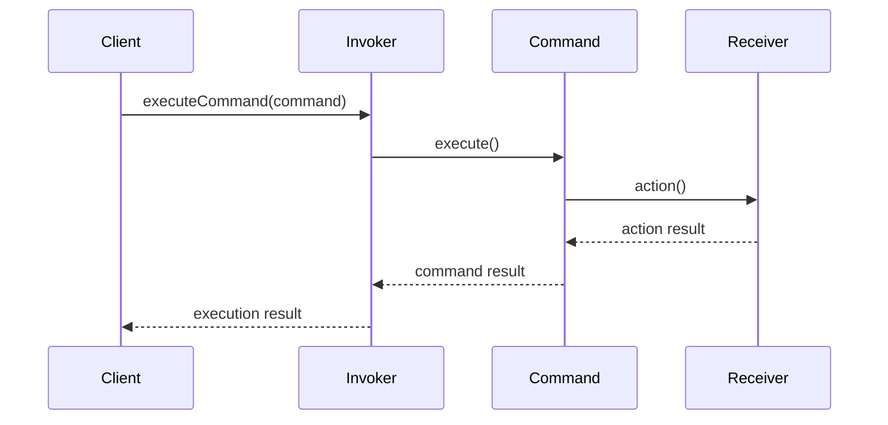

## 5.3. Command Pattern

The Command Pattern is a pivotal behavioral design pattern that encapsulates a request as an object, thereby allowing for parameterization of clients with queues, requests, and operations. It also provides support for undoable operations. This pattern is particularly useful in scenarios where you need to issue requests to objects without knowing anything about the operation being requested or the receiver of the request.

### Intent and Motivation

The primary intent of the Command Pattern is to decouple the object that invokes the operation from the one that knows how to perform it. By encapsulating a request as an object, the Command Pattern allows you to parameterize objects with operations, queue operations, and support undoable operations.

#### Key Benefits

- **Decoupling**: The Command Pattern decouples the sender and receiver, allowing for more flexible code.
- **Undo/Redo Functionality**: It provides a straightforward way to implement undo and redo operations.
- **Command Queuing**: Commands can be queued, logged, or scheduled for later execution.
- **Macro Commands**: It allows for the creation of composite commands, or macros, that can execute multiple commands in sequence.

### Key Participants

Before diving into the implementation, let's outline the key participants involved in the Command Pattern:

- **Command**: Declares an interface for executing an operation.
- **ConcreteCommand**: Defines a binding between a Receiver object and an action. Implements the Command interface to invoke the action on the Receiver.
- **Client**: Creates a ConcreteCommand object and sets its receiver.
- **Invoker**: Asks the command to carry out the request.
- **Receiver**: Knows how to perform the operations associated with carrying out a request.

### Applicability

Use the Command Pattern when you want to:

- Parameterize objects with operations.
- Specify, queue, and execute requests at different times.
- Support undoable operations.
- Structure a system around high-level operations built on primitive operations.

### Pseudocode Implementation

Let's explore a pseudocode implementation of the Command Pattern. We'll create a simple text editor application that supports undo and redo operations.

#### Step 1: Define the Command Interface

The Command interface declares a method for executing a command.

```pseudocode
interface Command {
    execute()
    undo()
}
```

#### Step 2: Create Concrete Commands

Concrete commands implement the Command interface and define the relationship between the Receiver and an action.

```pseudocode
class WriteCommand implements Command {
    constructor(receiver, text) {
        this.receiver = receiver
        this.text = text
    }

    execute() {
        this.receiver.write(this.text)
    }

    undo() {
        this.receiver.erase(this.text)
    }
}
```

#### Step 3: Implement the Receiver

The Receiver class knows how to perform the operations associated with carrying out a request.

```pseudocode
class TextEditor {
    constructor() {
        this.content = ""
    }

    write(text) {
        this.content += text
    }

    erase(text) {
        if (this.content.endsWith(text)) {
            this.content = this.content.substring(0, this.content.length - text.length)
        }
    }

    getContent() {
        return this.content
    }
}
```

#### Step 4: Create the Invoker

The Invoker is responsible for initiating requests and maintaining a history of executed commands for undo functionality.

```pseudocode
class CommandInvoker {
    constructor() {
        this.history = []
    }

    executeCommand(command) {
        command.execute()
        this.history.push(command)
    }

    undoLastCommand() {
        if (this.history.length > 0) {
            const command = this.history.pop()
            command.undo()
        }
    }
}
```

#### Step 5: Client Code

The Client creates ConcreteCommand objects and sets their receivers.

```pseudocode
// Client code
const editor = new TextEditor()
const invoker = new CommandInvoker()

const writeHello = new WriteCommand(editor, "Hello, ")
const writeWorld = new WriteCommand(editor, "World!")

invoker.executeCommand(writeHello)
invoker.executeCommand(writeWorld)

print(editor.getContent()) // Output: Hello, World!

invoker.undoLastCommand()
print(editor.getContent()) // Output: Hello,
```

### Implementing Undo/Redo

The Command Pattern naturally supports undo and redo functionality by maintaining a history of executed commands. Each command must implement an `undo` method that reverses the effects of the `execute` method.

#### Adding Redo Functionality

To implement redo functionality, we need to maintain a separate stack for undone commands.

```pseudocode
class CommandInvoker {
    constructor() {
        this.history = []
        this.redoStack = []
    }

    executeCommand(command) {
        command.execute()
        this.history.push(command)
        this.redoStack = [] // Clear redo stack on new command
    }

    undoLastCommand() {
        if (this.history.length > 0) {
            const command = this.history.pop()
            command.undo()
            this.redoStack.push(command)
        }
    }

    redoLastCommand() {
        if (this.redoStack.length > 0) {
            const command = this.redoStack.pop()
            command.execute()
            this.history.push(command)
        }
    }
}
```

### Visualizing the Command Pattern

To better understand the Command Pattern, let's visualize the interaction between its components using a sequence diagram.



**Diagram Explanation**: The sequence diagram illustrates how the Client sends a command to the Invoker, which then calls the `execute` method on the Command. The Command interacts with the Receiver to perform the desired action.

### Design Considerations

When implementing the Command Pattern, consider the following:

- **Command Granularity**: Determine the level of granularity for commands. Finer granularity provides more control but may lead to a large number of command classes.
- **Command Lifecycle**: Consider how commands are created, executed, and destroyed. Ensure that resources are managed efficiently.
- **Undo/Redo Complexity**: Implementing undo and redo can increase complexity. Ensure that the state is correctly managed and restored.

### Differences and Similarities

The Command Pattern is often confused with other behavioral patterns such as the Strategy Pattern and the Template Method Pattern. Here are some distinctions:

- **Command vs. Strategy**: The Command Pattern encapsulates a request as an object, while the Strategy Pattern encapsulates an algorithm. Commands are typically used for actions, whereas strategies are used for interchangeable algorithms.
- **Command vs. Template Method**: The Template Method Pattern defines the skeleton of an algorithm in a method, deferring some steps to subclasses. The Command Pattern encapsulates the entire request as an object.

### Try It Yourself

To deepen your understanding of the Command Pattern, try modifying the pseudocode examples:

- **Add New Commands**: Implement additional commands such as `DeleteCommand` or `ReplaceCommand`.
- **Enhance Undo/Redo**: Modify the `CommandInvoker` to support multiple levels of undo and redo.
- **Create Macro Commands**: Implement a `MacroCommand` that executes a sequence of commands.

### Knowledge Check

Let's reinforce your understanding with a few questions:

- What are the key benefits of using the Command Pattern?
- How does the Command Pattern support undo and redo functionality?
- What are the differences between the Command Pattern and the Strategy Pattern?

### Embrace the Journey

Remember, mastering design patterns is a journey. The Command Pattern is just one of many powerful tools in your software design toolkit. As you continue to explore and apply design patterns, you'll become more adept at crafting flexible, maintainable, and robust software solutions. Keep experimenting, stay curious, and enjoy the journey!

## Quiz Time!



### What is the primary intent of the Command Pattern?

- [x] To decouple the object that invokes the operation from the one that knows how to perform it.
- [ ] To encapsulate an algorithm in a class.
- [ ] To define the skeleton of an algorithm in a method.
- [ ] To provide a way to access the elements of an aggregate object sequentially.

> **Explanation:** The Command Pattern's primary intent is to decouple the object that invokes the operation from the one that knows how to perform it, allowing for flexible command execution.

### Which of the following is NOT a key participant in the Command Pattern?

- [ ] Command
- [ ] Receiver
- [ ] Invoker
- [x] Strategy

> **Explanation:** The Strategy is not a participant in the Command Pattern. The key participants are Command, Receiver, Invoker, ConcreteCommand, and Client.

### How does the Command Pattern support undo functionality?

- [x] By maintaining a history of executed commands and providing an undo method in each command.
- [ ] By encapsulating algorithms in classes.
- [ ] By defining the skeleton of an algorithm in a method.
- [ ] By providing a way to access the elements of an aggregate object sequentially.

> **Explanation:** The Command Pattern supports undo functionality by maintaining a history of executed commands and providing an undo method in each command to reverse the effects.

### What is the role of the Invoker in the Command Pattern?

- [x] To initiate requests and maintain a history of executed commands.
- [ ] To know how to perform the operations associated with carrying out a request.
- [ ] To declare an interface for executing an operation.
- [ ] To create ConcreteCommand objects and set their receivers.

> **Explanation:** The Invoker's role is to initiate requests and maintain a history of executed commands for undo functionality.

### Which pattern is often confused with the Command Pattern due to its encapsulation of behavior?

- [ ] Observer Pattern
- [ ] Template Method Pattern
- [x] Strategy Pattern
- [ ] Singleton Pattern

> **Explanation:** The Strategy Pattern is often confused with the Command Pattern because both encapsulate behavior, but they serve different purposes.

### What is a macro command in the context of the Command Pattern?

- [x] A command that executes a sequence of commands.
- [ ] A command that encapsulates an algorithm.
- [ ] A command that defines the skeleton of an algorithm.
- [ ] A command that provides a way to access elements sequentially.

> **Explanation:** A macro command is a command that executes a sequence of commands, allowing for composite command execution.

### How can the Command Pattern be used to implement redo functionality?

- [x] By maintaining a separate stack for undone commands and re-executing them.
- [ ] By encapsulating algorithms in classes.
- [ ] By defining the skeleton of an algorithm in a method.
- [ ] By providing a way to access the elements of an aggregate object sequentially.

> **Explanation:** Redo functionality can be implemented by maintaining a separate stack for undone commands and re-executing them when needed.

### What is the difference between the Command Pattern and the Template Method Pattern?

- [x] The Command Pattern encapsulates a request as an object, while the Template Method Pattern defines the skeleton of an algorithm in a method.
- [ ] The Command Pattern encapsulates an algorithm, while the Template Method Pattern encapsulates a request.
- [ ] The Command Pattern provides a way to access elements sequentially, while the Template Method Pattern encapsulates a request.
- [ ] The Command Pattern defines the skeleton of an algorithm in a method, while the Template Method Pattern encapsulates a request.

> **Explanation:** The Command Pattern encapsulates a request as an object, while the Template Method Pattern defines the skeleton of an algorithm in a method, deferring some steps to subclasses.

### True or False: The Command Pattern can be used to queue operations for later execution.

- [x] True
- [ ] False

> **Explanation:** True. The Command Pattern can be used to queue operations for later execution, providing flexibility in command scheduling.

### Which of the following is a benefit of using the Command Pattern?

- [x] It allows for parameterization of objects with operations.
- [ ] It encapsulates an algorithm in a class.
- [ ] It defines the skeleton of an algorithm in a method.
- [ ] It provides a way to access the elements of an aggregate object sequentially.

> **Explanation:** One of the benefits of using the Command Pattern is that it allows for parameterization of objects with operations, enabling flexible command execution.


