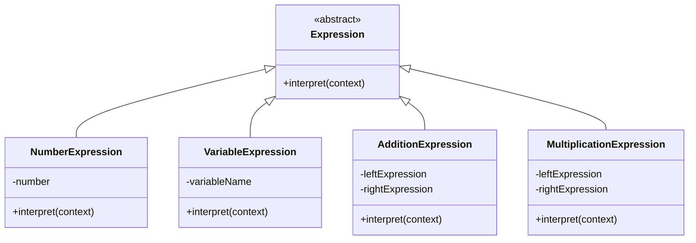

## 5.4. Interpreter Pattern

### Introduction

The Interpreter Pattern is a powerful behavioral design pattern that allows you to define a language's grammar and interpret sentences in that language. This pattern is particularly useful when you need to evaluate expressions or parse complex data structures. In this section, we'll delve into the intent and motivation behind the Interpreter Pattern, explore its pseudocode implementation, and examine its applications in parsing.

### Intent and Motivation

The primary intent of the Interpreter Pattern is to define a representation for a language's grammar and provide an interpreter to process sentences in that language. This pattern is motivated by the need to evaluate expressions or parse data in a structured manner. It is particularly useful in scenarios where you need to interpret or execute a set of instructions or expressions defined in a domain-specific language (DSL).

#### Key Concepts

1. **Grammar Representation**: The Interpreter Pattern allows you to represent the grammar of a language using a class hierarchy. Each class in the hierarchy corresponds to a rule in the grammar.

2. **Expression Evaluation**: The pattern provides a mechanism to evaluate expressions defined in the language. This involves traversing the class hierarchy and executing the appropriate operations for each rule.

3. **Flexibility**: The Interpreter Pattern offers flexibility by allowing you to easily extend the language's grammar by adding new classes to the hierarchy.

4. **Reusability**: The pattern promotes reusability by encapsulating the grammar rules and evaluation logic within the class hierarchy.

### Defining Grammars and Languages

To effectively use the Interpreter Pattern, it's essential to understand how to define grammars and languages. A grammar is a set of rules that defines the syntax of a language. In the context of the Interpreter Pattern, each rule in the grammar is represented by a class in the class hierarchy.

#### Components of a Grammar

1. **Terminal Expressions**: These are the basic building blocks of the language. They represent the atomic elements of the grammar, such as numbers, variables, or constants.

2. **Non-Terminal Expressions**: These are composite expressions that are made up of one or more terminal or non-terminal expressions. They represent the complex structures in the grammar.

3. **Context**: The context provides the necessary information for evaluating expressions. It typically includes a symbol table or a set of variables and their values.

#### Example Grammar

Consider a simple arithmetic grammar that supports addition and multiplication. The grammar can be defined as follows:

- **Expression**: An expression can be a number, a variable, or a combination of expressions using addition or multiplication.
- **Number**: A terminal expression representing a numeric value.
- **Variable**: A terminal expression representing a variable.
- **Addition**: A non-terminal expression representing the addition of two expressions.
- **Multiplication**: A non-terminal expression representing the multiplication of two expressions.

### Pseudocode Implementation

Let's explore the pseudocode implementation of the Interpreter Pattern using the arithmetic grammar defined above. We'll define a class hierarchy to represent the grammar and provide an interpreter to evaluate expressions.

#### Class Hierarchy

```pseudocode
// Abstract class representing an expression
class Expression {
    method interpret(context)
}

// Terminal expression representing a number
class NumberExpression extends Expression {
    private number

    constructor(number) {
        this.number = number
    }

    method interpret(context) {
        return this.number
    }
}

// Terminal expression representing a variable
class VariableExpression extends Expression {
    private variableName

    constructor(variableName) {
        this.variableName = variableName
    }

    method interpret(context) {
        return context.getValue(this.variableName)
    }
}

// Non-terminal expression representing addition
class AdditionExpression extends Expression {
    private leftExpression
    private rightExpression

    constructor(leftExpression, rightExpression) {
        this.leftExpression = leftExpression
        this.rightExpression = rightExpression
    }

    method interpret(context) {
        return this.leftExpression.interpret(context) + this.rightExpression.interpret(context)
    }
}

// Non-terminal expression representing multiplication
class MultiplicationExpression extends Expression {
    private leftExpression
    private rightExpression

    constructor(leftExpression, rightExpression) {
        this.leftExpression = leftExpression
        this.rightExpression = rightExpression
    }

    method interpret(context) {
        return this.leftExpression.interpret(context) * this.rightExpression.interpret(context)
    }
}
```

#### Context

The context provides the necessary information for evaluating expressions. In this example, the context includes a symbol table that maps variable names to their values.

```pseudocode
// Context class providing variable values
class Context {
    private symbolTable

    constructor() {
        this.symbolTable = new Map()
    }

    method setValue(variableName, value) {
        this.symbolTable.put(variableName, value)
    }

    method getValue(variableName) {
        return this.symbolTable.get(variableName)
    }
}
```

#### Interpreter

The interpreter evaluates expressions by traversing the class hierarchy and executing the appropriate operations for each rule.

```pseudocode
// Interpreter class for evaluating expressions
class Interpreter {
    method evaluate(expression, context) {
        return expression.interpret(context)
    }
}
```

### Applications in Parsing

The Interpreter Pattern is widely used in parsing applications, where it provides a structured approach to evaluating expressions or processing data. Here are some common applications of the Interpreter Pattern in parsing:

1. **Domain-Specific Languages (DSLs)**: The pattern is often used to implement interpreters for DSLs, allowing users to define and execute custom instructions or expressions.

2. **Expression Evaluation**: The pattern is used to evaluate mathematical expressions, logical expressions, or any other type of expressions defined in a language.

3. **Configuration Files**: The pattern can be used to parse and interpret configuration files, allowing users to define settings or parameters in a structured format.

4. **Scripting Languages**: The pattern is used to implement interpreters for scripting languages, enabling users to write and execute scripts.

5. **Query Languages**: The pattern is used to interpret queries in query languages, allowing users to retrieve or manipulate data based on specific criteria.

### Visualizing the Interpreter Pattern

To better understand the Interpreter Pattern, let's visualize the class hierarchy and the process of interpreting an expression.



**Diagram Description**: The class diagram illustrates the hierarchy of expressions in the arithmetic grammar. The `Expression` class is an abstract class that defines the `interpret` method. The `NumberExpression` and `VariableExpression` classes are terminal expressions, while the `AdditionExpression` and `MultiplicationExpression` classes are non-terminal expressions.

### Design Considerations

When using the Interpreter Pattern, consider the following design considerations:

1. **Complexity**: The pattern can become complex if the grammar is large or involves many rules. Consider using other parsing techniques, such as parser generators, for complex grammars.

2. **Performance**: The pattern may not be suitable for performance-critical applications, as it involves traversing a class hierarchy and executing operations for each rule.

3. **Extensibility**: The pattern offers flexibility by allowing you to easily extend the grammar by adding new classes to the hierarchy. However, adding new rules may require changes to existing classes.

4. **Reusability**: The pattern promotes reusability by encapsulating the grammar rules and evaluation logic within the class hierarchy. Consider using the pattern when you need to evaluate expressions or parse data in a structured manner.

### Differences and Similarities

The Interpreter Pattern is often confused with other design patterns, such as the Visitor Pattern and the Composite Pattern. Here are some key differences and similarities:

- **Visitor Pattern**: The Visitor Pattern is used to perform operations on elements of an object structure without changing the classes of the elements. The Interpreter Pattern, on the other hand, is used to define a language's grammar and interpret sentences in that language.

- **Composite Pattern**: The Composite Pattern is used to compose objects into tree structures to represent part-whole hierarchies. The Interpreter Pattern uses a similar structure to represent the grammar of a language, but it also provides an interpreter to evaluate expressions.

### Try It Yourself

To gain a deeper understanding of the Interpreter Pattern, try modifying the pseudocode examples to add support for subtraction and division. Consider how the class hierarchy and the interpreter would need to change to accommodate these new operations.

### Knowledge Check

1. **What is the primary intent of the Interpreter Pattern?**

   - The primary intent of the Interpreter Pattern is to define a representation for a language's grammar and provide an interpreter to process sentences in that language.

2. **What are terminal and non-terminal expressions?**

   - Terminal expressions are the basic building blocks of the language, representing atomic elements of the grammar. Non-terminal expressions are composite expressions made up of one or more terminal or non-terminal expressions.

3. **What is the role of the context in the Interpreter Pattern?**

   - The context provides the necessary information for evaluating expressions, typically including a symbol table or a set of variables and their values.

4. **What are some common applications of the Interpreter Pattern in parsing?**

   - The Interpreter Pattern is commonly used in domain-specific languages (DSLs), expression evaluation, configuration files, scripting languages, and query languages.

5. **What are some design considerations when using the Interpreter Pattern?**

   - Considerations include complexity, performance, extensibility, and reusability. The pattern can become complex with large grammars, may not be suitable for performance-critical applications, and offers flexibility and reusability.

### Conclusion

The Interpreter Pattern is a valuable tool for defining grammars and interpreting expressions in a structured manner. By understanding the intent and motivation behind the pattern, exploring its pseudocode implementation, and examining its applications in parsing, you can effectively use the Interpreter Pattern to solve complex problems in software development. Remember, this is just the beginning. As you progress, you'll build more complex and interactive applications. Keep experimenting, stay curious, and enjoy the journey!

## Quiz Time!



### What is the primary intent of the Interpreter Pattern?

- [x] To define a representation for a language's grammar and provide an interpreter to process sentences in that language.
- [ ] To perform operations on elements of an object structure without changing the classes of the elements.
- [ ] To compose objects into tree structures to represent part-whole hierarchies.
- [ ] To encapsulate algorithms in a way that allows them to be interchangeable.

> **Explanation:** The Interpreter Pattern is specifically designed to define a language's grammar and interpret sentences in that language, making it distinct from other patterns like Visitor or Composite.

### What are terminal expressions in the context of the Interpreter Pattern?

- [x] Basic building blocks of the language, representing atomic elements of the grammar.
- [ ] Composite expressions made up of one or more terminal or non-terminal expressions.
- [ ] A set of rules that defines the syntax of a language.
- [ ] Operations performed on elements of an object structure.

> **Explanation:** Terminal expressions are the simplest elements in the grammar, such as numbers or variables, and are not composed of other expressions.

### What role does the context play in the Interpreter Pattern?

- [x] It provides the necessary information for evaluating expressions, including a symbol table or a set of variables and their values.
- [ ] It defines the grammar rules and operations for interpreting expressions.
- [ ] It encapsulates the algorithms for evaluating expressions.
- [ ] It represents the composite structure of expressions in the grammar.

> **Explanation:** The context is crucial for evaluating expressions as it holds the data needed to interpret them, such as variable values.

### Which of the following is a common application of the Interpreter Pattern?

- [x] Domain-Specific Languages (DSLs)
- [ ] Object serialization
- [ ] Data encryption
- [ ] Network communication

> **Explanation:** The Interpreter Pattern is often used to implement interpreters for DSLs, allowing users to define and execute custom instructions or expressions.

### What is a key design consideration when using the Interpreter Pattern?

- [x] The pattern can become complex if the grammar is large or involves many rules.
- [ ] The pattern is always suitable for performance-critical applications.
- [ ] The pattern does not promote reusability.
- [ ] The pattern is not flexible and cannot be easily extended.

> **Explanation:** The Interpreter Pattern can become complex with large grammars, and while it offers flexibility and reusability, it may not be suitable for performance-critical applications.

### How does the Interpreter Pattern differ from the Visitor Pattern?

- [x] The Interpreter Pattern is used to define a language's grammar and interpret sentences, while the Visitor Pattern performs operations on elements of an object structure.
- [ ] The Interpreter Pattern is used to compose objects into tree structures, while the Visitor Pattern defines a language's grammar.
- [ ] The Interpreter Pattern encapsulates algorithms, while the Visitor Pattern provides an interpreter.
- [ ] The Interpreter Pattern is used for network communication, while the Visitor Pattern is for data encryption.

> **Explanation:** The Interpreter Pattern focuses on grammar and interpretation, whereas the Visitor Pattern is about performing operations on object structures.

### What is a non-terminal expression in the Interpreter Pattern?

- [x] A composite expression made up of one or more terminal or non-terminal expressions.
- [ ] A basic building block of the language, representing atomic elements of the grammar.
- [ ] A set of rules that defines the syntax of a language.
- [ ] An operation performed on elements of an object structure.

> **Explanation:** Non-terminal expressions are composed of other expressions and represent more complex structures in the grammar.

### What is a potential drawback of using the Interpreter Pattern?

- [x] It may not be suitable for performance-critical applications due to the overhead of traversing the class hierarchy.
- [ ] It cannot be extended to accommodate new grammar rules.
- [ ] It does not promote reusability of code.
- [ ] It is not flexible and cannot represent complex grammars.

> **Explanation:** The Interpreter Pattern can introduce performance overhead, making it less suitable for performance-critical applications.

### How can the Interpreter Pattern be extended to support new operations?

- [x] By adding new classes to the class hierarchy to represent the new operations.
- [ ] By modifying the context to include additional variables.
- [ ] By changing the terminal expressions to support new operations.
- [ ] By altering the existing grammar rules without adding new classes.

> **Explanation:** Extending the Interpreter Pattern involves adding new classes to the hierarchy to represent new grammar rules or operations.

### True or False: The Interpreter Pattern is ideal for large and complex grammars.

- [ ] True
- [x] False

> **Explanation:** The Interpreter Pattern can become cumbersome and complex with large grammars, and other parsing techniques may be more suitable for such scenarios.


