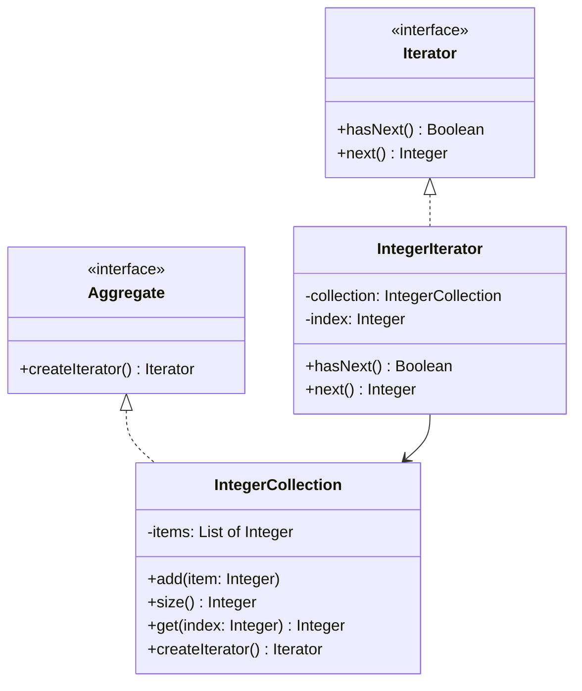

## 5.5. Iterator Pattern

### Intent and Motivation

The Iterator Pattern is one of the fundamental behavioral design patterns that provides a way to access the elements of an aggregate object sequentially without exposing its underlying representation. This pattern is particularly useful when you need to traverse a collection of objects without knowing the details of how the collection is structured.

#### Why Use the Iterator Pattern?

- **Encapsulation**: The Iterator Pattern encapsulates the traversal logic of a collection, allowing the client to access elements without exposing the internal structure of the collection.
- **Flexibility**: It provides a uniform interface for traversing different types of collections, making your code more flexible and adaptable to changes.
- **Simplification**: By separating the traversal logic from the collection itself, the Iterator Pattern simplifies the collection's interface and responsibilities.

### Key Participants

- **Iterator**: Defines an interface for accessing and traversing elements.
- **Concrete Iterator**: Implements the Iterator interface and keeps track of the current position in the traversal.
- **Aggregate**: Defines an interface for creating an Iterator object.
- **Concrete Aggregate**: Implements the Aggregate interface and returns an instance of the Concrete Iterator.

### Applicability

Use the Iterator Pattern when:

- You need to access the contents of a collection without exposing its internal structure.
- You want to provide multiple traversal strategies for a collection.
- You need a uniform traversal interface for different types of collections.

### Pseudocode Implementation

Let's explore the Iterator Pattern through a detailed pseudocode example. We'll create a simple collection of integers and implement an iterator to traverse this collection.

```pseudocode
// Define the Iterator interface
interface Iterator {
    method hasNext() -> Boolean
    method next() -> Integer
}

// Implement the Concrete Iterator
class IntegerIterator implements Iterator {
    private collection: IntegerCollection
    private index: Integer = 0

    constructor(collection: IntegerCollection) {
        this.collection = collection
    }

    method hasNext() -> Boolean {
        return index < collection.size()
    }

    method next() -> Integer {
        if this.hasNext() {
            return collection.get(index++)
        } else {
            throw new Error("No more elements")
        }
    }
}

// Define the Aggregate interface
interface Aggregate {
    method createIterator() -> Iterator
}

// Implement the Concrete Aggregate
class IntegerCollection implements Aggregate {
    private items: List of Integer = []

    method add(item: Integer) {
        items.add(item)
    }

    method size() -> Integer {
        return items.size()
    }

    method get(index: Integer) -> Integer {
        return items[index]
    }

    method createIterator() -> Iterator {
        return new IntegerIterator(this)
    }
}

// Client code
collection = new IntegerCollection()
collection.add(1)
collection.add(2)
collection.add(3)

iterator = collection.createIterator()

while iterator.hasNext() {
    print(iterator.next())
}
```

### Internal vs. External Iterators

The Iterator Pattern can be implemented in two main forms: internal and external iterators. Each has its own use cases and advantages.

#### External Iterators

External iterators are controlled by the client. The client explicitly requests the next element and checks if more elements are available. This gives the client more control over the iteration process.

**Advantages:**

- **Control**: The client has full control over the iteration process, which can be useful for complex traversal logic.
- **Flexibility**: External iterators can be paused and resumed, allowing for more flexible traversal strategies.

**Disadvantages:**

- **Complexity**: The client is responsible for managing the iteration state, which can lead to more complex code.

#### Internal Iterators

Internal iterators are controlled by the collection itself. The client provides a function or block of code to be executed for each element, and the collection handles the iteration.

**Advantages:**

- **Simplicity**: The collection manages the iteration state, simplifying the client's code.
- **Encapsulation**: The iteration logic is encapsulated within the collection, reducing the client's responsibilities.

**Disadvantages:**

- **Less Control**: The client has less control over the iteration process, which may not be suitable for complex traversal logic.

### Visualizing the Iterator Pattern

To better understand the Iterator Pattern, let's visualize the relationships between the key participants using a class diagram.



### Design Considerations

When implementing the Iterator Pattern, consider the following:

- **Thread Safety**: If your collection is accessed by multiple threads, ensure that your iterator is thread-safe.
- **Performance**: Iterators can introduce overhead, especially for large collections. Consider the performance implications of your implementation.
- **Consistency**: Ensure that your iterator remains consistent with the collection, especially if the collection is modified during iteration.

### Differences and Similarities

The Iterator Pattern is often compared to the **Composite Pattern**. While both patterns deal with collections of objects, the Composite Pattern focuses on treating individual objects and compositions uniformly, whereas the Iterator Pattern focuses on traversing collections.

### Try It Yourself

To deepen your understanding of the Iterator Pattern, try modifying the pseudocode example:

- **Add a Reverse Iterator**: Implement an iterator that traverses the collection in reverse order.
- **Filter Elements**: Modify the iterator to skip certain elements based on a condition.
- **Support Multiple Iterators**: Allow multiple iterators to traverse the collection simultaneously.

### Knowledge Check

Before we conclude, let's reinforce what we've learned:

- What are the key participants in the Iterator Pattern?
- How do internal and external iterators differ?
- When should you use the Iterator Pattern?

### Embrace the Journey

Remember, mastering design patterns is a journey. As you continue to explore and experiment with the Iterator Pattern, you'll gain a deeper understanding of how to apply it effectively in your software designs. Keep experimenting, stay curious, and enjoy the journey!

## Quiz Time!



### What is the primary intent of the Iterator Pattern?

- [x] To provide a way to access elements of an aggregate object sequentially without exposing its underlying representation.
- [ ] To encapsulate the creation of objects.
- [ ] To allow an object to alter its behavior when its internal state changes.
- [ ] To define a family of algorithms, encapsulate each one, and make them interchangeable.

> **Explanation:** The Iterator Pattern is designed to provide a way to access elements of an aggregate object sequentially without exposing its underlying representation.

### Which of the following is a key participant in the Iterator Pattern?

- [x] Iterator
- [ ] Observer
- [ ] Singleton
- [ ] Command

> **Explanation:** The Iterator is a key participant in the Iterator Pattern, defining an interface for accessing and traversing elements.

### What is a disadvantage of using an external iterator?

- [x] The client is responsible for managing the iteration state, which can lead to more complex code.
- [ ] The iteration logic is encapsulated within the collection, reducing the client's responsibilities.
- [ ] The client has less control over the iteration process.
- [ ] The collection manages the iteration state, simplifying the client's code.

> **Explanation:** In an external iterator, the client is responsible for managing the iteration state, which can lead to more complex code.

### What is an advantage of using an internal iterator?

- [x] The collection manages the iteration state, simplifying the client's code.
- [ ] The client has full control over the iteration process.
- [ ] External iterators can be paused and resumed.
- [ ] The client is responsible for managing the iteration state.

> **Explanation:** Internal iterators manage the iteration state within the collection, simplifying the client's code.

### Which pattern is often compared to the Iterator Pattern?

- [x] Composite Pattern
- [ ] Singleton Pattern
- [ ] Observer Pattern
- [ ] Strategy Pattern

> **Explanation:** The Composite Pattern is often compared to the Iterator Pattern, as both deal with collections of objects.

### How can you ensure thread safety when implementing the Iterator Pattern?

- [x] Ensure that your iterator is thread-safe if your collection is accessed by multiple threads.
- [ ] Use a Singleton Pattern.
- [ ] Avoid using iterators in multi-threaded environments.
- [ ] Use external iterators only.

> **Explanation:** To ensure thread safety, make sure your iterator is thread-safe if your collection is accessed by multiple threads.

### What is a key advantage of using the Iterator Pattern?

- [x] It provides a uniform interface for traversing different types of collections.
- [ ] It allows an object to alter its behavior when its internal state changes.
- [ ] It encapsulates the creation of objects.
- [ ] It defines a family of algorithms, encapsulates each one, and makes them interchangeable.

> **Explanation:** The Iterator Pattern provides a uniform interface for traversing different types of collections, making your code more flexible and adaptable.

### What should you consider regarding performance when implementing the Iterator Pattern?

- [x] Iterators can introduce overhead, especially for large collections.
- [ ] Iterators always improve performance.
- [ ] Performance is not a concern with iterators.
- [ ] Iterators reduce the need for memory.

> **Explanation:** Iterators can introduce overhead, especially for large collections, so consider the performance implications of your implementation.

### True or False: The Iterator Pattern can only be used with collections of integers.

- [x] False
- [ ] True

> **Explanation:** The Iterator Pattern can be used with any type of collection, not just collections of integers.

### What is one way to modify the provided pseudocode example to enhance its functionality?

- [x] Implement an iterator that traverses the collection in reverse order.
- [ ] Remove the iterator interface.
- [ ] Combine the iterator and collection into a single class.
- [ ] Limit the iterator to only traverse the first element.

> **Explanation:** Implementing an iterator that traverses the collection in reverse order is one way to enhance the functionality of the provided pseudocode example.




