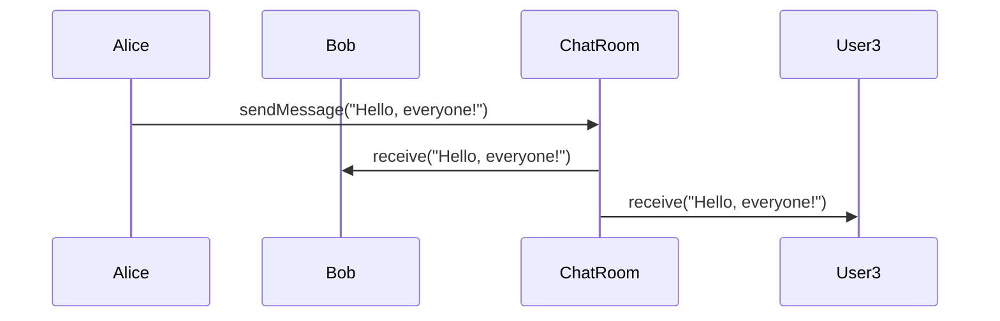

## 5.6. Mediator Pattern

The Mediator Pattern is a behavioral design pattern that facilitates communication between different objects in a system by introducing a mediator object. This pattern is particularly useful in complex systems where multiple objects interact with each other, leading to a tangled web of dependencies. By centralizing communication through a mediator, the pattern reduces direct dependencies between objects, enhancing modularity and maintainability.

### Intent and Motivation

The primary intent of the Mediator Pattern is to reduce the complexity of communication between objects in a system. In many applications, objects need to interact with each other to perform their tasks. Without a mediator, each object would need to know about other objects, leading to a tightly coupled system. This tight coupling makes the system difficult to maintain and extend.

**Motivation:**

- **Reducing Direct Communications:** By introducing a mediator, objects no longer communicate directly with each other. Instead, they communicate through the mediator, which handles the interactions. This reduces the number of dependencies each object has, leading to a more decoupled and flexible system.
  
- **Simplifying Complex Systems:** In systems with many interacting components, managing the interactions can become cumbersome. The mediator pattern simplifies this by centralizing the communication logic in a single place, making it easier to manage and modify.

- **Enhancing Reusability and Maintainability:** With reduced dependencies, objects become more reusable, and the system becomes easier to maintain. Changes to one object do not ripple through the system, as the mediator handles the communication.

### Key Participants

1. **Mediator Interface:** Defines the interface for communication between Colleague objects.
2. **Concrete Mediator:** Implements the Mediator interface and coordinates communication between Colleague objects.
3. **Colleague Objects:** Objects that communicate with each other through the Mediator.

### Applicability

Use the Mediator Pattern when:

- You have a complex set of interactions between multiple objects.
- You want to reduce the dependencies between interacting objects.
- You need to centralize control logic that affects multiple objects.

### Pseudocode Implementation

Let's explore a pseudocode implementation of the Mediator Pattern. We'll consider a simple chat application where users can send messages to each other. The mediator will handle the communication between users.

#### Step 1: Define the Mediator Interface

```pseudocode
// Mediator interface
interface ChatMediator {
    method sendMessage(message: String, user: User)
    method addUser(user: User)
}
```

#### Step 2: Implement the Concrete Mediator

```pseudocode
// Concrete Mediator
class ChatRoom implements ChatMediator {
    private users: List<User> = []

    method addUser(user: User) {
        users.add(user)
    }

    method sendMessage(message: String, user: User) {
        for each u in users {
            if u != user {
                u.receive(message)
            }
        }
    }
}
```

#### Step 3: Define the Colleague Interface

```pseudocode
// Colleague interface
abstract class User {
    protected mediator: ChatMediator
    protected name: String

    constructor(mediator: ChatMediator, name: String) {
        this.mediator = mediator
        this.name = name
    }

    abstract method send(message: String)
    abstract method receive(message: String)
}
```

#### Step 4: Implement Concrete Colleagues

```pseudocode
// Concrete Colleague
class ChatUser extends User {
    method send(message: String) {
        print(name + " sends: " + message)
        mediator.sendMessage(message, this)
    }

    method receive(message: String) {
        print(name + " receives: " + message)
    }
}
```

#### Step 5: Demonstrate the Pattern

```pseudocode
// Client code
mediator = new ChatRoom()

user1 = new ChatUser(mediator, "Alice")
user2 = new ChatUser(mediator, "Bob")
user3 = new ChatUser(mediator, "Charlie")

mediator.addUser(user1)
mediator.addUser(user2)
mediator.addUser(user3)

user1.send("Hello, everyone!")
```

### Benefits in Complex Systems

The Mediator Pattern offers several benefits in complex systems:

- **Decoupling:** By reducing direct dependencies between objects, the mediator pattern decouples the system, making it easier to manage and extend.
- **Centralized Control:** The mediator centralizes the control logic, making it easier to understand and modify the interactions between objects.
- **Enhanced Reusability:** With reduced dependencies, objects become more reusable across different contexts.
- **Improved Maintainability:** Changes to one object do not affect others, as the mediator handles the communication.

### Design Considerations

When implementing the Mediator Pattern, consider the following:

- **Complexity of the Mediator:** While the mediator simplifies the interactions between objects, it can become complex if it handles too many interactions. It's important to balance the responsibilities of the mediator to avoid creating a "god object."
- **Performance:** The mediator can introduce a performance overhead, as all interactions go through it. Ensure that the mediator is optimized for performance.
- **Scalability:** In large systems, the mediator can become a bottleneck. Consider using multiple mediators or a hierarchical mediator structure to improve scalability.

### Differences and Similarities

The Mediator Pattern is often confused with the Observer Pattern. While both patterns facilitate communication between objects, they do so in different ways:

- **Mediator vs. Observer:**
  - The Mediator Pattern centralizes communication through a mediator object, reducing direct dependencies between objects.
  - The Observer Pattern allows objects to subscribe to events and be notified when those events occur, without direct communication between the objects.

### Visualizing the Mediator Pattern

To better understand the Mediator Pattern, let's visualize the interactions between the mediator and colleague objects using a sequence diagram.



**Diagram Explanation:**

- **User1 (Alice)** sends a message to the **Mediator (ChatRoom)**.
- The **Mediator** forwards the message to all other users (**User2 (Bob)** and **User3 (Charlie)**).

### Try It Yourself

To deepen your understanding of the Mediator Pattern, try modifying the pseudocode examples:

- **Add a new user type:** Create a new type of user, such as an AdminUser, with additional privileges or behaviors.
- **Implement private messaging:** Modify the mediator to support private messages between users.
- **Log messages:** Add functionality to log all messages sent through the mediator.

### References and Links

For further reading on the Mediator Pattern, consider the following resources:

- [Design Patterns: Elements of Reusable Object-Oriented Software](https://en.wikipedia.org/wiki/Design_Patterns) by Erich Gamma, Richard Helm, Ralph Johnson, and John Vlissides.
- [Mediator Pattern on Refactoring.Guru](https://refactoring.guru/design-patterns/mediator)

### Knowledge Check

Before moving on, let's review some key concepts:

- **What is the primary intent of the Mediator Pattern?**
- **How does the Mediator Pattern enhance system maintainability?**
- **What are some potential drawbacks of using the Mediator Pattern?**

### Embrace the Journey

Remember, mastering design patterns is a journey. The Mediator Pattern is just one tool in your toolkit. As you continue to explore and experiment with different patterns, you'll become more adept at designing flexible and maintainable systems. Keep experimenting, stay curious, and enjoy the journey!

## Quiz Time!



### What is the primary intent of the Mediator Pattern?

- [x] To reduce direct communication between objects
- [ ] To increase the number of dependencies between objects
- [ ] To centralize all business logic in one object
- [ ] To eliminate the need for interfaces

> **Explanation:** The primary intent of the Mediator Pattern is to reduce direct communication between objects by introducing a mediator that handles interactions.

### Which of the following is a key benefit of using the Mediator Pattern?

- [x] Decoupling objects
- [ ] Increasing system complexity
- [ ] Making objects more dependent on each other
- [ ] Reducing system performance

> **Explanation:** The Mediator Pattern decouples objects by centralizing communication, which enhances maintainability and flexibility.

### In the Mediator Pattern, what role does the Concrete Mediator play?

- [x] It implements the Mediator interface and coordinates communication between Colleague objects.
- [ ] It defines the interface for communication between Colleague objects.
- [ ] It acts as a Colleague object that communicates with other Colleagues.
- [ ] It eliminates the need for Colleague objects.

> **Explanation:** The Concrete Mediator implements the Mediator interface and coordinates communication between Colleague objects.

### What is a potential drawback of the Mediator Pattern?

- [x] The mediator can become a complex "god object."
- [ ] It increases direct dependencies between objects.
- [ ] It reduces the maintainability of the system.
- [ ] It prevents objects from communicating with each other.

> **Explanation:** The mediator can become complex if it handles too many interactions, potentially becoming a "god object."

### How does the Mediator Pattern differ from the Observer Pattern?

- [x] The Mediator Pattern centralizes communication through a mediator, while the Observer Pattern allows objects to subscribe to events.
- [ ] The Mediator Pattern increases dependencies, while the Observer Pattern reduces them.
- [ ] The Mediator Pattern is used for state management, while the Observer Pattern is used for communication.
- [ ] The Mediator Pattern is only applicable in functional programming.

> **Explanation:** The Mediator Pattern centralizes communication through a mediator, whereas the Observer Pattern allows objects to subscribe to events without direct communication.

### What is a common use case for the Mediator Pattern?

- [x] Managing complex interactions between multiple objects
- [ ] Simplifying single-object operations
- [ ] Increasing the number of direct dependencies
- [ ] Reducing the need for communication in a system

> **Explanation:** The Mediator Pattern is commonly used to manage complex interactions between multiple objects by centralizing communication.

### What is the role of a Colleague object in the Mediator Pattern?

- [x] It communicates with other Colleagues through the Mediator.
- [ ] It acts as the central communication hub.
- [ ] It eliminates the need for a Mediator.
- [ ] It defines the interface for the Mediator.

> **Explanation:** A Colleague object communicates with other Colleagues through the Mediator, reducing direct dependencies.

### Which of the following is NOT a benefit of the Mediator Pattern?

- [ ] Decoupling objects
- [ ] Centralizing control logic
- [ ] Enhancing reusability
- [x] Increasing system complexity

> **Explanation:** The Mediator Pattern reduces system complexity by decoupling objects and centralizing control logic.

### What is a key consideration when implementing the Mediator Pattern?

- [x] Balancing the responsibilities of the mediator to avoid creating a "god object."
- [ ] Ensuring all objects communicate directly with each other.
- [ ] Increasing the number of dependencies between objects.
- [ ] Eliminating the need for a centralized control logic.

> **Explanation:** It's important to balance the responsibilities of the mediator to avoid creating a complex "god object."

### True or False: The Mediator Pattern is only applicable in object-oriented programming.

- [ ] True
- [x] False

> **Explanation:** The Mediator Pattern is applicable in various programming paradigms, not just object-oriented programming.


