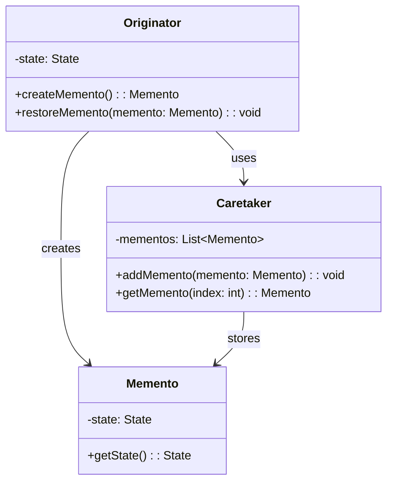

## 5.7. Memento Pattern

### Introduction

In the realm of software design patterns, the Memento Pattern stands out as a powerful tool for managing the state of an object. It allows an object's state to be captured and restored without violating encapsulation, which is crucial for maintaining the integrity of the object's internal structure. This pattern is particularly useful in scenarios where you need to implement undo functionality or maintain a history of states.

### Intent and Motivation

The primary intent of the Memento Pattern is to capture and externalize an object's internal state so that it can be restored later, without exposing the details of its implementation. This pattern is motivated by the need to provide a mechanism for saving and restoring the state of an object, which is often required in applications with complex state management needs.

#### Key Motivations:

- **Undo/Redo Functionality**: Many applications, such as text editors and graphic design tools, require the ability to undo and redo changes. The Memento Pattern provides a way to implement this by storing previous states of an object.
  
- **State Persistence**: In scenarios where the state of an object needs to be persisted across sessions, the Memento Pattern can be used to serialize and deserialize the state.

- **State History**: Applications that require maintaining a history of states, such as version control systems, can leverage this pattern to track changes over time.

### Diagrams

To better understand the Memento Pattern, let's visualize its structure using a class diagram:



#### Diagram Explanation:

- **Originator**: This is the object whose state needs to be saved and restored. It creates a Memento containing a snapshot of its current state and can restore its state from a Memento.

- **Memento**: This class stores the internal state of the Originator. It provides a way to retrieve the state but does not expose any operations that can modify it.

- **Caretaker**: This class is responsible for keeping track of the Mementos. It can store and retrieve Mementos but does not operate on or inspect the contents of a Memento.

### Key Participants

1. **Originator**: The object whose state is to be saved. It knows how to save its state to a Memento and how to restore its state from a Memento.

2. **Memento**: The object that stores the state of the Originator. It is opaque to the Caretaker and is only accessible by the Originator.

3. **Caretaker**: The object that manages the Mementos. It is responsible for storing and retrieving Mementos but does not modify them.

### Applicability

The Memento Pattern is applicable in the following scenarios:

- When you need to implement undo/redo functionality.
- When you want to save and restore the state of an object without exposing its internal structure.
- When you need to maintain a history of states for an object.

### Pseudocode Implementation

Let's dive into a pseudocode implementation of the Memento Pattern. We'll create a simple text editor that allows users to type text and undo their changes.

```pseudocode
// Define the Memento class
class Memento:
    private state: String
    
    constructor(state: String):
        this.state = state
    
    function getState(): String:
        return this.state

// Define the Originator class
class TextEditor:
    private text: String
    
    function type(words: String):
        this.text += words
    
    function save(): Memento:
        return new Memento(this.text)
    
    function restore(memento: Memento):
        this.text = memento.getState()
    
    function getText(): String:
        return this.text

// Define the Caretaker class
class History:
    private mementos: List<Memento> = []
    
    function push(memento: Memento):
        this.mementos.append(memento)
    
    function pop(): Memento:
        if not this.mementos.isEmpty():
            return this.mementos.pop()
        else:
            return null

// Client code
function main():
    editor = new TextEditor()
    history = new History()
    
    editor.type("Hello, ")
    history.push(editor.save())
    
    editor.type("world!")
    history.push(editor.save())
    
    print("Current Text: " + editor.getText()) // Output: Hello, world!
    
    editor.restore(history.pop())
    print("After Undo: " + editor.getText()) // Output: Hello, 
    
    editor.restore(history.pop())
    print("After Undo: " + editor.getText()) // Output: (empty string)
```

#### Explanation:

- **TextEditor**: Acts as the Originator. It can type text, save its current state to a Memento, and restore its state from a Memento.

- **Memento**: Stores the state of the TextEditor. It is immutable and only accessible by the TextEditor.

- **History**: Acts as the Caretaker. It maintains a stack of Mementos and provides methods to push and pop Mementos.

### Design Considerations

When implementing the Memento Pattern, consider the following:

- **Memory Usage**: Storing multiple Mementos can consume a significant amount of memory, especially if the state is large. Consider using compression or other optimization techniques if necessary.

- **Serialization**: If the state needs to be persisted, ensure that the Memento can be serialized and deserialized. This may involve implementing serialization interfaces or using external libraries.

- **Encapsulation**: The Memento should not expose any operations that modify its state. This ensures that the Originator's encapsulation is not violated.

- **Security**: If the state contains sensitive information, ensure that it is adequately protected, especially when serialized or stored externally.

### Serialization Considerations

Serialization is the process of converting an object into a format that can be easily stored or transmitted and later reconstructed. In the context of the Memento Pattern, serialization is crucial when you need to persist the state of an object across sessions or transmit it over a network.

#### Key Considerations:

- **Format**: Choose an appropriate serialization format (e.g., JSON, XML, binary) based on your requirements for readability, size, and compatibility.

- **Versioning**: If the state structure evolves over time, implement versioning to ensure backward compatibility.

- **Security**: Ensure that serialized data is encrypted or otherwise protected if it contains sensitive information.

- **Performance**: Consider the performance implications of serialization and deserialization, especially for large or complex states.

### Differences and Similarities

The Memento Pattern is often compared to other patterns, such as:

- **Command Pattern**: Both patterns can be used to implement undo functionality. However, the Command Pattern focuses on encapsulating actions as objects, while the Memento Pattern focuses on capturing and restoring state.

- **Prototype Pattern**: The Prototype Pattern involves cloning objects, which can be used to create a copy of an object's state. However, the Memento Pattern provides a more structured approach to capturing and restoring state without exposing the internal structure.

### Try It Yourself

To deepen your understanding of the Memento Pattern, try modifying the pseudocode example:

- **Add Redo Functionality**: Extend the History class to support redo operations.
- **Implement State Compression**: Modify the Memento class to compress the state before storing it.
- **Add Serialization**: Implement serialization and deserialization for the Memento class.

### Conclusion

The Memento Pattern is a powerful tool for managing the state of an object in a way that preserves encapsulation. By capturing and restoring state, it enables features like undo/redo, state persistence, and state history. When implementing this pattern, consider memory usage, serialization, and security to ensure a robust solution.

Remember, mastering design patterns is an ongoing journey. As you continue to explore and apply these patterns, you'll enhance your ability to design clean, efficient, and maintainable software.

## Quiz Time!



### What is the primary intent of the Memento Pattern?

- [x] To capture and restore an object's state without violating encapsulation
- [ ] To encapsulate actions as objects
- [ ] To create a copy of an object's state
- [ ] To manage object creation

> **Explanation:** The Memento Pattern is designed to capture and restore an object's state without exposing its internal structure, thus preserving encapsulation.

### Which class in the Memento Pattern is responsible for storing the state of the Originator?

- [ ] Originator
- [x] Memento
- [ ] Caretaker
- [ ] Client

> **Explanation:** The Memento class is responsible for storing the state of the Originator. It provides a way to retrieve the state but does not expose any operations to modify it.

### What role does the Caretaker play in the Memento Pattern?

- [ ] It modifies the state of the Memento
- [x] It stores and retrieves Mementos
- [ ] It creates Mementos
- [ ] It restores the state from a Memento

> **Explanation:** The Caretaker is responsible for storing and retrieving Mementos but does not modify them or inspect their contents.

### In what scenarios is the Memento Pattern particularly useful?

- [x] Implementing undo/redo functionality
- [ ] Managing object creation
- [ ] Encapsulating actions as objects
- [ ] Creating a copy of an object's state

> **Explanation:** The Memento Pattern is useful for implementing undo/redo functionality, state persistence, and maintaining a history of states.

### What is a key consideration when implementing the Memento Pattern?

- [x] Memory usage
- [ ] Object creation
- [ ] Action encapsulation
- [ ] Interface segregation

> **Explanation:** Memory usage is a key consideration because storing multiple Mementos can consume significant memory, especially if the state is large.

### How does the Memento Pattern differ from the Command Pattern?

- [x] The Memento Pattern focuses on capturing and restoring state, while the Command Pattern focuses on encapsulating actions as objects.
- [ ] Both patterns focus on encapsulating actions as objects.
- [ ] The Memento Pattern is used for object creation.
- [ ] The Command Pattern is used for capturing and restoring state.

> **Explanation:** The Memento Pattern captures and restores state, while the Command Pattern encapsulates actions as objects.

### What is a potential pitfall of the Memento Pattern?

- [x] High memory consumption
- [ ] Lack of encapsulation
- [ ] Difficulty in object creation
- [ ] Complexity in action encapsulation

> **Explanation:** High memory consumption can be a pitfall if many Mementos are stored, especially for large states.

### What is the role of the Originator in the Memento Pattern?

- [x] It creates and restores Mementos
- [ ] It stores and retrieves Mementos
- [ ] It modifies the state of the Memento
- [ ] It manages object creation

> **Explanation:** The Originator creates Mementos containing its state and can restore its state from a Memento.

### How can serialization be useful in the Memento Pattern?

- [x] For persisting the state across sessions
- [ ] For encapsulating actions as objects
- [ ] For managing object creation
- [ ] For creating a copy of an object's state

> **Explanation:** Serialization allows the state to be persisted across sessions or transmitted over a network.

### True or False: The Memento Pattern violates the encapsulation of the Originator.

- [ ] True
- [x] False

> **Explanation:** The Memento Pattern does not violate encapsulation as it allows the state to be captured and restored without exposing the internal structure of the Originator.




