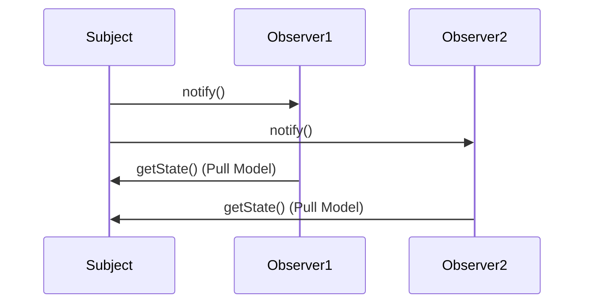

## 5.8. Observer Pattern

The Observer Pattern is a fundamental behavioral design pattern that defines a one-to-many dependency between objects, allowing multiple observers to listen to and react to events or changes in a subject. This pattern is particularly useful in scenarios where an object needs to notify other objects about changes in its state without being tightly coupled to them. Let's delve into the Observer Pattern, exploring its intent, motivation, and implementation using pseudocode. We'll also discuss the differences between push and pull models, providing a comprehensive understanding of this essential pattern.

### Intent and Motivation

The primary intent of the Observer Pattern is to establish a publish-subscribe mechanism that allows a subject to notify a list of observers about any changes in its state. This pattern is motivated by the need to maintain consistency across related objects without requiring them to be tightly coupled. By decoupling the subject from its observers, the Observer Pattern promotes flexibility and reusability in software design.

#### Key Concepts

- **Subject**: The core component that maintains a list of observers and notifies them of any state changes.
- **Observer**: An interface or abstract class that defines the update method, which is called by the subject when a change occurs.
- **ConcreteSubject**: A class that extends the subject and implements the logic to manage and notify observers.
- **ConcreteObserver**: A class that implements the observer interface and defines the specific actions to be taken when notified by the subject.

### Publish-Subscribe Mechanisms

The Observer Pattern is often associated with publish-subscribe mechanisms, where the subject acts as the publisher and the observers act as subscribers. This mechanism allows for a dynamic and flexible communication model, enabling observers to subscribe or unsubscribe from notifications at runtime.

#### Advantages of Publish-Subscribe Mechanisms

- **Decoupling**: The subject and observers are loosely coupled, allowing for independent development and maintenance.
- **Scalability**: New observers can be added without modifying the subject, enhancing the system's scalability.
- **Flexibility**: Observers can be dynamically added or removed, providing flexibility in managing dependencies.

#### Disadvantages of Publish-Subscribe Mechanisms

- **Complexity**: Managing a large number of observers can increase the complexity of the system.
- **Performance**: Frequent notifications can lead to performance bottlenecks, especially if the update logic is complex.

### Pseudocode Implementation

Let's explore the implementation of the Observer Pattern using pseudocode. We'll define the core components, including the subject, observer, concrete subject, and concrete observer, to illustrate the pattern's structure and behavior.

#### Subject Interface

The subject interface defines the methods for attaching, detaching, and notifying observers.

```pseudocode
interface Subject {
    method attach(observer: Observer)
    method detach(observer: Observer)
    method notify()
}
```

#### Observer Interface

The observer interface defines the update method, which is called by the subject when a change occurs.

```pseudocode
interface Observer {
    method update()
}
```

#### ConcreteSubject Class

The ConcreteSubject class extends the subject interface and implements the logic to manage and notify observers.

```pseudocode
class ConcreteSubject implements Subject {
    private observers: List<Observer> = []

    method attach(observer: Observer) {
        observers.add(observer)
    }

    method detach(observer: Observer) {
        observers.remove(observer)
    }

    method notify() {
        for each observer in observers {
            observer.update()
        }
    }

    method changeState() {
        // Logic to change the state
        notify() // Notify observers of the state change
    }
}
```

#### ConcreteObserver Class

The ConcreteObserver class implements the observer interface and defines the specific actions to be taken when notified by the subject.

```pseudocode
class ConcreteObserver implements Observer {
    method update() {
        // Logic to update the observer based on the subject's state
    }
}
```

### Push vs. Pull Models

The Observer Pattern can be implemented using either the push or pull model, each with its own advantages and trade-offs.

#### Push Model

In the push model, the subject sends detailed information about the change to the observers. This model is suitable when the subject's state changes frequently, and the observers need to be immediately updated with the latest information.

**Advantages**:
- Immediate updates: Observers receive detailed information as soon as the subject's state changes.
- Reduced observer complexity: Observers do not need to query the subject for additional information.

**Disadvantages**:
- Increased data transfer: The subject may send more data than necessary, leading to potential performance issues.
- Tight coupling: Observers may become dependent on the specific data format sent by the subject.

**Pseudocode Example**:

```pseudocode
class ConcreteSubject implements Subject {
    private state: State
    private observers: List<Observer> = []

    method notify() {
        for each observer in observers {
            observer.update(state) // Push the state to observers
        }
    }
}

class ConcreteObserver implements Observer {
    method update(state: State) {
        // Use the pushed state to update the observer
    }
}
```

#### Pull Model

In the pull model, the subject only notifies the observers of a change, and the observers are responsible for querying the subject for the specific details they need. This model is suitable when observers require different pieces of information from the subject.

**Advantages**:
- Reduced data transfer: Observers only request the information they need, minimizing unnecessary data transfer.
- Flexibility: Observers can decide what information to retrieve, allowing for more flexible implementations.

**Disadvantages**:
- Increased observer complexity: Observers must implement logic to query the subject for the required information.
- Delayed updates: Observers may not receive updates immediately, as they need to query the subject.

**Pseudocode Example**:

```pseudocode
class ConcreteSubject implements Subject {
    private state: State
    private observers: List<Observer> = []

    method notify() {
        for each observer in observers {
            observer.update() // Notify observers without pushing state
        }
    }

    method getState(): State {
        return state
    }
}

class ConcreteObserver implements Observer {
    method update() {
        state = subject.getState() // Pull the state from the subject
        // Use the pulled state to update the observer
    }
}
```

### Visualizing the Observer Pattern

To better understand the Observer Pattern, let's visualize its components and interactions using a Mermaid.js sequence diagram.



**Caption**: This sequence diagram illustrates the interaction between a subject and its observers in a pull model implementation. The subject notifies the observers, and each observer queries the subject for the current state.

### Design Considerations

When implementing the Observer Pattern, consider the following design considerations:

- **Observer Management**: Efficiently manage the list of observers to minimize performance overhead.
- **Update Frequency**: Balance the frequency of updates to avoid overwhelming observers with notifications.
- **Data Consistency**: Ensure that observers receive consistent and accurate data, especially in distributed systems.

### Differences and Similarities

The Observer Pattern is often compared to other design patterns, such as the Mediator Pattern and the Publish-Subscribe Pattern. Here's how they differ:

- **Mediator Pattern**: The Mediator Pattern centralizes communication between objects, whereas the Observer Pattern allows direct communication between the subject and observers.
- **Publish-Subscribe Pattern**: The Publish-Subscribe Pattern is a broader concept that encompasses the Observer Pattern. The Observer Pattern is a specific implementation of the publish-subscribe mechanism.

### Try It Yourself

To gain hands-on experience with the Observer Pattern, try modifying the pseudocode examples provided. Experiment with different notification strategies, such as changing the update frequency or implementing additional observer logic. Consider how the pattern can be applied to real-world scenarios, such as implementing a notification system or a live data feed.

### Knowledge Check

Before moving on, let's review some key concepts:

- What is the primary intent of the Observer Pattern?
- How does the push model differ from the pull model?
- What are the advantages and disadvantages of using the Observer Pattern?

### Embrace the Journey

Remember, mastering design patterns is a journey. The Observer Pattern is just one of many patterns that can enhance your software design skills. Keep experimenting, stay curious, and enjoy the process of learning and applying design patterns in your projects.

## Quiz Time!



### What is the primary intent of the Observer Pattern?

- [x] To define a one-to-many dependency between objects
- [ ] To centralize communication between objects
- [ ] To encapsulate actions as objects
- [ ] To separate abstraction from implementation

> **Explanation:** The Observer Pattern defines a one-to-many dependency between objects, allowing multiple observers to listen to and react to changes in a subject.

### In the push model of the Observer Pattern, what does the subject do?

- [x] Sends detailed information about the change to the observers
- [ ] Notifies observers without pushing state
- [ ] Queries observers for their state
- [ ] Centralizes communication between observers

> **Explanation:** In the push model, the subject sends detailed information about the change to the observers, allowing them to be immediately updated.

### What is a disadvantage of the pull model in the Observer Pattern?

- [x] Increased observer complexity
- [ ] Immediate updates
- [ ] Reduced data transfer
- [ ] Tight coupling

> **Explanation:** In the pull model, observers must implement logic to query the subject for the required information, increasing observer complexity.

### Which pattern centralizes communication between objects?

- [ ] Observer Pattern
- [x] Mediator Pattern
- [ ] Strategy Pattern
- [ ] Decorator Pattern

> **Explanation:** The Mediator Pattern centralizes communication between objects, unlike the Observer Pattern, which allows direct communication between the subject and observers.

### What is a key advantage of the publish-subscribe mechanism?

- [x] Decoupling between subject and observers
- [ ] Increased complexity
- [ ] Tight coupling
- [ ] Immediate updates

> **Explanation:** The publish-subscribe mechanism decouples the subject and observers, allowing for independent development and maintenance.

### In the Observer Pattern, what role does the ConcreteObserver class play?

- [x] Implements the observer interface and defines actions when notified
- [ ] Manages the list of observers
- [ ] Sends notifications to observers
- [ ] Centralizes communication between observers

> **Explanation:** The ConcreteObserver class implements the observer interface and defines the specific actions to be taken when notified by the subject.

### What is a potential performance issue with the push model?

- [x] Increased data transfer
- [ ] Reduced observer complexity
- [ ] Delayed updates
- [ ] Flexibility

> **Explanation:** The push model may send more data than necessary, leading to potential performance issues due to increased data transfer.

### How does the Observer Pattern promote flexibility?

- [x] By allowing observers to be dynamically added or removed
- [ ] By centralizing communication between objects
- [ ] By encapsulating actions as objects
- [ ] By separating abstraction from implementation

> **Explanation:** The Observer Pattern promotes flexibility by allowing observers to be dynamically added or removed, providing flexibility in managing dependencies.

### What is a key difference between the Observer Pattern and the Publish-Subscribe Pattern?

- [x] The Observer Pattern is a specific implementation of the publish-subscribe mechanism
- [ ] The Publish-Subscribe Pattern centralizes communication between objects
- [ ] The Observer Pattern encapsulates actions as objects
- [ ] The Publish-Subscribe Pattern defines a one-to-many dependency

> **Explanation:** The Observer Pattern is a specific implementation of the publish-subscribe mechanism, allowing a subject to notify multiple observers of changes.

### True or False: The Observer Pattern is suitable for scenarios where objects need to be tightly coupled.

- [ ] True
- [x] False

> **Explanation:** False. The Observer Pattern is suitable for scenarios where objects need to be loosely coupled, allowing for independent development and maintenance.




