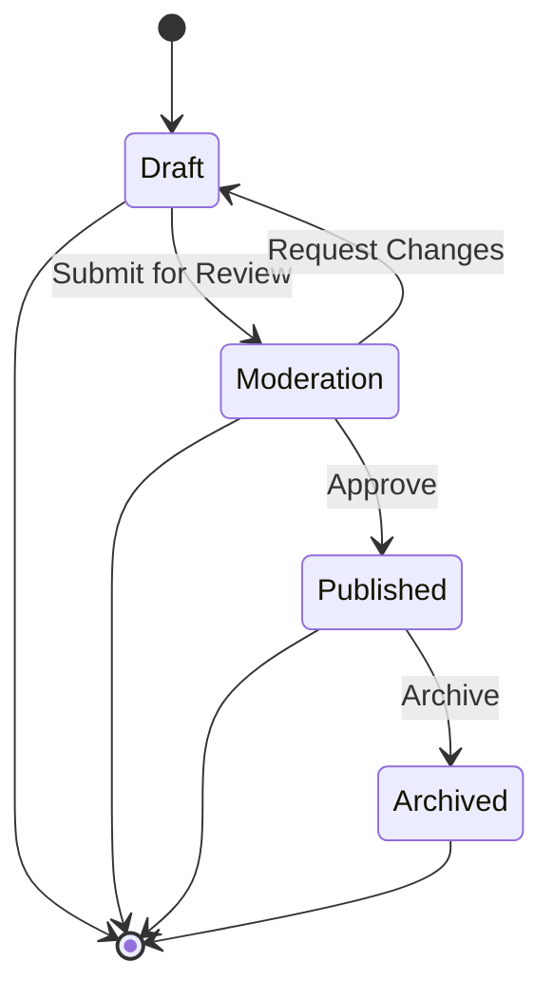
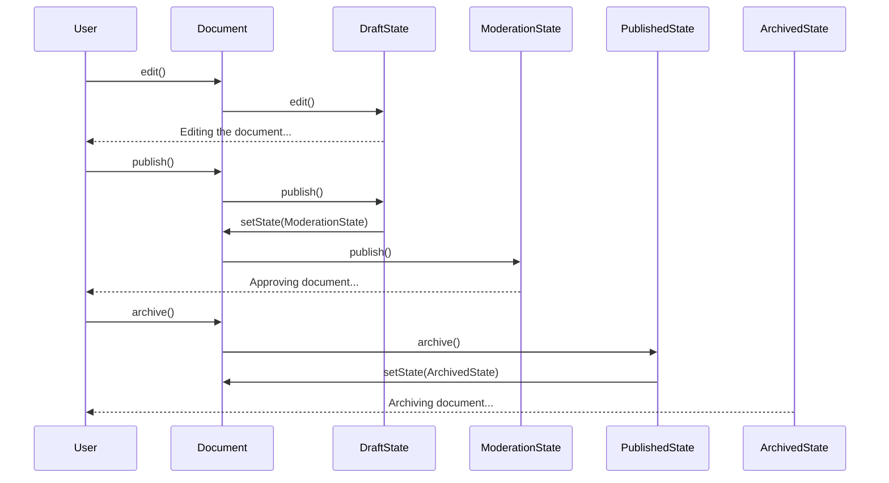

## 5.9. State Pattern

In the realm of software design, managing the state of an object can often become complex and unwieldy. The State Pattern emerges as a powerful tool to address this challenge by allowing an object to alter its behavior when its internal state changes. This pattern is particularly useful in scenarios where an object must exhibit different behaviors in different states, and it helps in organizing code that deals with state-specific behavior.

### Intent and Motivation

The primary intent of the State Pattern is to allow an object to change its behavior when its internal state changes. This pattern is often used in scenarios where an object must behave differently depending on its current state, and it provides a clean way to encapsulate state-specific behavior.

#### Key Concepts

- **State Encapsulation**: Encapsulate the varying behavior for the different states of an object and delegate the behavior to the current state object.
- **State Transition**: Allow the object to change its state, which can result in a change of behavior.
- **Simplification of Complex Conditionals**: Replace complex conditional logic that checks for state with state-specific classes.

#### Motivation

Consider a simple example of a document editor. A document can be in various states such as Draft, Moderation, Published, and Archived. Each state has different behaviors and rules. For instance, a Draft document can be edited, but a Published document cannot. Using the State Pattern, we can encapsulate these behaviors within state classes, making the code more maintainable and scalable.

### Diagrams

To better understand the State Pattern, let's visualize it using a state diagram. This diagram will illustrate how an object transitions between different states and how each state encapsulates its behavior.



**Figure 1: State Diagram for Document Lifecycle**

This diagram represents a document's lifecycle, showing how it transitions from one state to another based on certain actions.

### Key Participants

The State Pattern involves several key participants:

- **Context**: This is the class that maintains an instance of a ConcreteState subclass that defines the current state.
- **State**: This is an interface or abstract class that defines the behavior associated with a particular state of the Context.
- **ConcreteState**: These are subclasses that implement the behavior associated with a state of the Context.

### Applicability

The State Pattern is applicable in scenarios where:

- An object's behavior depends on its state, and it must change its behavior at runtime depending on that state.
- Operations have large, multipart conditional statements that depend on the object's state.

### Sample Code Snippets

Let's delve into a pseudocode implementation of the State Pattern. We will create a simple example of a document editor with different states.

```pseudocode
// State Interface
interface DocumentState {
    method edit()
    method publish()
    method archive()
}

// Concrete States
class DraftState implements DocumentState {
    method edit() {
        print("Editing the document...")
    }
    method publish() {
        print("Submitting document for review...")
        context.setState(new ModerationState())
    }
    method archive() {
        print("Cannot archive a draft document.")
    }
}

class ModerationState implements DocumentState {
    method edit() {
        print("Cannot edit document in moderation.")
    }
    method publish() {
        print("Approving document...")
        context.setState(new PublishedState())
    }
    method archive() {
        print("Cannot archive a document in moderation.")
    }
}

class PublishedState implements DocumentState {
    method edit() {
        print("Cannot edit a published document.")
    }
    method publish() {
        print("Document is already published.")
    }
    method archive() {
        print("Archiving document...")
        context.setState(new ArchivedState())
    }
}

class ArchivedState implements DocumentState {
    method edit() {
        print("Cannot edit an archived document.")
    }
    method publish() {
        print("Cannot publish an archived document.")
    }
    method archive() {
        print("Document is already archived.")
    }
}

// Context
class Document {
    private state: DocumentState

    constructor() {
        this.state = new DraftState()
    }

    method setState(newState: DocumentState) {
        this.state = newState
    }

    method edit() {
        this.state.edit()
    }

    method publish() {
        this.state.publish()
    }

    method archive() {
        this.state.archive()
    }
}

// Usage
document = new Document()
document.edit()    // Editing the document...
document.publish() // Submitting document for review...
document.publish() // Approving document...
document.archive() // Archiving document...
```

### Design Considerations

- **When to Use**: Use the State Pattern when you have an object whose behavior changes based on its state, and you want to avoid complex conditional logic.
- **Pitfalls**: Be cautious of the increased number of classes, which can make the system more complex if not managed properly.

### Differences and Similarities

The State Pattern is often confused with the Strategy Pattern. While both patterns involve encapsulating behavior, the key difference is that the State Pattern is used to change the behavior of an object based on its state, whereas the Strategy Pattern is used to select an algorithm at runtime.

### Try It Yourself

To better understand the State Pattern, try modifying the pseudocode example. For instance, add a new state, such as "Rejected," and define the behaviors for this state. Experiment with transitioning between states and observe how the behavior changes.

### Visualizing State Transitions

To further enhance your understanding, let's visualize the state transitions using a sequence diagram. This diagram will illustrate how a document transitions through different states based on user actions.



**Figure 2: Sequence Diagram for Document State Transitions**

This sequence diagram provides a step-by-step visualization of how a document transitions through different states based on user actions.

### Knowledge Check

- **Question**: What is the primary intent of the State Pattern?
- **Exercise**: Implement a simple traffic light system using the State Pattern, where each light (Red, Yellow, Green) represents a different state with specific behaviors.

### Embrace the Journey

Remember, mastering design patterns is a journey. The State Pattern is just one tool in your toolkit. As you continue to explore and experiment, you'll discover new ways to apply these patterns to solve complex problems. Stay curious, keep experimenting, and enjoy the journey!

## Quiz Time!



### What is the primary intent of the State Pattern?

- [x] To allow an object to change its behavior when its internal state changes.
- [ ] To encapsulate algorithms in separate classes.
- [ ] To provide a way to access elements of an aggregate object sequentially.
- [ ] To define a family of algorithms.

> **Explanation:** The State Pattern allows an object to change its behavior when its internal state changes, encapsulating state-specific behavior.

### Which of the following is a key participant in the State Pattern?

- [x] Context
- [ ] Observer
- [ ] Singleton
- [ ] Factory

> **Explanation:** The Context is a key participant in the State Pattern, maintaining an instance of a ConcreteState subclass that defines the current state.

### How does the State Pattern help in managing complex conditional logic?

- [x] By encapsulating state-specific behavior in separate classes.
- [ ] By using inheritance to extend behavior.
- [ ] By providing a single class with multiple methods.
- [ ] By using static methods for state transitions.

> **Explanation:** The State Pattern encapsulates state-specific behavior in separate classes, reducing complex conditional logic.

### What is the difference between the State Pattern and the Strategy Pattern?

- [x] State Pattern changes behavior based on state; Strategy Pattern selects an algorithm at runtime.
- [ ] State Pattern selects an algorithm at runtime; Strategy Pattern changes behavior based on state.
- [ ] Both patterns are identical.
- [ ] State Pattern is used for creating objects; Strategy Pattern is used for managing states.

> **Explanation:** The State Pattern changes behavior based on the object's state, while the Strategy Pattern selects an algorithm at runtime.

### In the provided pseudocode, what happens when the `publish()` method is called on a `DraftState`?

- [x] The document transitions to the `ModerationState`.
- [ ] The document transitions to the `PublishedState`.
- [ ] The document remains in the `DraftState`.
- [ ] The document transitions to the `ArchivedState`.

> **Explanation:** When `publish()` is called on a `DraftState`, the document transitions to the `ModerationState`.

### Which state transition is not possible in the provided state diagram?

- [x] From `Archived` to `Draft`
- [ ] From `Draft` to `Moderation`
- [ ] From `Moderation` to `Published`
- [ ] From `Published` to `Archived`

> **Explanation:** The state transition from `Archived` to `Draft` is not possible according to the provided state diagram.

### What is a potential pitfall of using the State Pattern?

- [x] Increased number of classes.
- [ ] Reduced flexibility in behavior changes.
- [ ] Difficulty in understanding state transitions.
- [ ] Lack of encapsulation.

> **Explanation:** A potential pitfall of using the State Pattern is the increased number of classes, which can make the system more complex.

### How does the State Pattern enhance code maintainability?

- [x] By organizing state-specific behavior into separate classes.
- [ ] By reducing the number of classes.
- [ ] By using global variables for state management.
- [ ] By centralizing all behavior in a single class.

> **Explanation:** The State Pattern enhances code maintainability by organizing state-specific behavior into separate classes, making the code easier to manage.

### Which method is responsible for changing the state of the context in the provided pseudocode?

- [x] `setState()`
- [ ] `edit()`
- [ ] `publish()`
- [ ] `archive()`

> **Explanation:** The `setState()` method is responsible for changing the state of the context in the provided pseudocode.

### True or False: The State Pattern is only applicable in object-oriented programming paradigms.

- [ ] True
- [x] False

> **Explanation:** False. The State Pattern can be adapted to functional programming paradigms as well, although it is primarily used in object-oriented programming.


