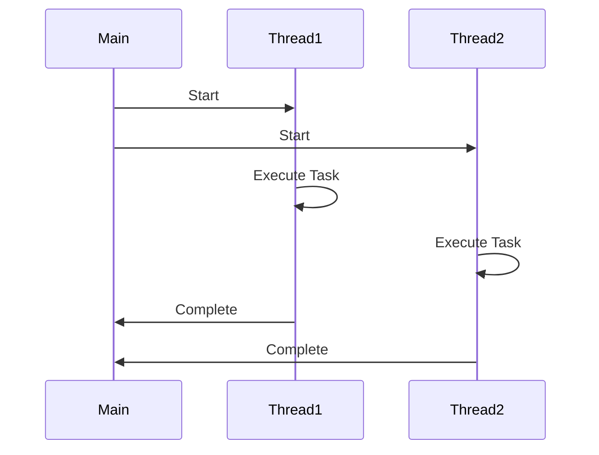

## 6.1. Introduction to Concurrency

Concurrency is a fundamental concept in modern software development, enabling programs to perform multiple tasks simultaneously. This capability is crucial for building responsive, efficient, and scalable applications. In this section, we will delve into the challenges of concurrent programming, explore the concepts of threads and processes, and provide practical insights and pseudocode examples to enhance your understanding.

### Understanding Concurrency

Concurrency refers to the ability of a system to manage multiple tasks at the same time. It is a key aspect of software that needs to handle multiple operations concurrently, such as web servers managing requests from numerous clients, or a desktop application performing background tasks while maintaining a responsive user interface.

#### Key Concepts

- **Parallelism vs. Concurrency**: While often used interchangeably, parallelism and concurrency are distinct concepts. Concurrency involves managing multiple tasks simultaneously, whereas parallelism involves executing multiple tasks at the same time, often on different processors or cores.
- **Threads and Processes**: These are the primary constructs used to achieve concurrency. Threads are lightweight units of execution within a process, sharing the same memory space, while processes are independent execution units with their own memory space.

### Challenges in Concurrent Programming

Concurrent programming introduces several challenges that developers must address to ensure the correctness and efficiency of their applications.

#### 1. Race Conditions

A race condition occurs when the outcome of a program depends on the sequence or timing of uncontrollable events, such as the order in which threads execute. This can lead to unpredictable behavior and bugs that are difficult to reproduce and fix.

**Example:**

```pseudocode
// Pseudocode illustrating a race condition
shared_counter = 0

function increment_counter() {
    temp = shared_counter
    temp = temp + 1
    shared_counter = temp
}

// Two threads executing increment_counter simultaneously
```

In this example, if two threads read the `shared_counter` at the same time, they may both increment it to the same value, leading to incorrect results.

#### 2. Deadlocks

A deadlock occurs when two or more threads are unable to proceed because each is waiting for the other to release a resource. This can cause the program to hang indefinitely.

**Example:**

```pseudocode
// Pseudocode illustrating a deadlock
lock1 = new Lock()
lock2 = new Lock()

function thread1() {
    lock1.acquire()
    lock2.acquire()
    // Perform operations
    lock2.release()
    lock1.release()
}

function thread2() {
    lock2.acquire()
    lock1.acquire()
    // Perform operations
    lock1.release()
    lock2.release()
}

// thread1 and thread2 can deadlock if they acquire locks in different orders
```

#### 3. Starvation

Starvation occurs when a thread is perpetually denied access to resources it needs to proceed, often because other threads are monopolizing those resources.

#### 4. Livelock

A livelock is similar to a deadlock, but the states of the threads involved constantly change with respect to one another, yet no progress is made.

### Threads and Processes

#### Threads

Threads are the smallest unit of processing that can be scheduled by an operating system. They are part of a process and share the same memory space, which makes communication between threads more efficient but also introduces challenges such as race conditions.

**Advantages of Threads:**

- **Efficiency**: Threads are lightweight and consume fewer resources than processes.
- **Shared Memory**: Threads within the same process can easily share data.

**Disadvantages of Threads:**

- **Complexity**: Managing thread synchronization and avoiding race conditions can be complex.
- **Safety**: Threads can interfere with each other if not properly synchronized.

#### Processes

Processes are independent execution units that have their own memory space. They are more isolated than threads, which makes them safer but also more resource-intensive.

**Advantages of Processes:**

- **Isolation**: Processes are isolated from each other, reducing the risk of interference.
- **Stability**: A crash in one process does not affect others.

**Disadvantages of Processes:**

- **Resource Intensive**: Processes consume more resources than threads.
- **Communication Overhead**: Inter-process communication is more complex and slower than thread communication.

### Concurrency Models

Different programming languages and environments offer various concurrency models to manage threads and processes. Understanding these models is crucial for designing efficient concurrent systems.

#### 1. Shared Memory Model

In the shared memory model, multiple threads share the same memory space, allowing them to communicate by reading and writing to shared variables. This model is efficient but requires careful synchronization to avoid race conditions.

**Example:**

```pseudocode
// Pseudocode for shared memory model
shared_variable = 0

function thread_function() {
    lock.acquire()
    shared_variable += 1
    lock.release()
}

// Multiple threads execute thread_function
```

#### 2. Message Passing Model

In the message passing model, threads or processes communicate by sending messages to each other. This model is safer as it avoids shared state, but it can introduce communication overhead.

**Example:**

```pseudocode
// Pseudocode for message passing model
message_queue = new Queue()

function sender() {
    message = "Hello"
    message_queue.send(message)
}

function receiver() {
    message = message_queue.receive()
    print(message)
}

// sender and receiver communicate via message_queue
```

### Synchronization Techniques

Synchronization is crucial in concurrent programming to ensure that multiple threads or processes can work together without interfering with each other.

#### 1. Locks

Locks are used to control access to shared resources. A lock allows only one thread to access a resource at a time, preventing race conditions.

**Example:**

```pseudocode
// Pseudocode for using locks
lock = new Lock()

function critical_section() {
    lock.acquire()
    // Perform operations on shared resource
    lock.release()
}
```

#### 2. Semaphores

Semaphores are signaling mechanisms that control access to a resource by multiple threads. They can be used to limit the number of threads accessing a resource simultaneously.

**Example:**

```pseudocode
// Pseudocode for using semaphores
semaphore = new Semaphore(3) // Allow 3 threads to access the resource

function limited_access() {
    semaphore.acquire()
    // Perform operations
    semaphore.release()
}
```

#### 3. Monitors

Monitors are high-level synchronization constructs that provide a mechanism for threads to safely access shared resources. They encapsulate both the data and the procedures that operate on the data, ensuring that only one thread can execute a procedure at a time.

**Example:**

```pseudocode
// Pseudocode for using monitors
monitor = new Monitor()

function synchronized_method() {
    monitor.enter()
    // Perform operations
    monitor.exit()
}
```

### Visualizing Concurrency

To better understand how threads and processes interact, let's visualize the flow of a simple concurrent program using a Mermaid.js diagram.



**Diagram Description:** This sequence diagram illustrates a main process starting two threads, each executing a task concurrently. Once the tasks are complete, the threads report back to the main process.

### Try It Yourself

Experiment with the pseudocode examples provided in this section. Try modifying the number of threads, the order of lock acquisition, or the communication methods to observe how these changes affect the program's behavior. This hands-on approach will deepen your understanding of concurrency.

### References and Further Reading

- [Concurrency in Java](https://docs.oracle.com/javase/tutorial/essential/concurrency/)
- [Python Threading](https://docs.python.org/3/library/threading.html)
- [Understanding Concurrency in C++](https://en.cppreference.com/w/cpp/thread)

### Knowledge Check

- What is the difference between concurrency and parallelism?
- How do race conditions occur, and how can they be prevented?
- What are the advantages and disadvantages of using threads vs. processes?
- How do locks and semaphores differ in terms of synchronization?

### Embrace the Journey

Concurrency is a complex but rewarding area of software development. As you continue exploring, remember that mastering concurrency will enhance your ability to build efficient, responsive, and scalable applications. Keep experimenting, stay curious, and enjoy the journey!

## Quiz Time!



### What is a race condition?

- [x] A situation where the outcome depends on the sequence or timing of uncontrollable events.
- [ ] A condition where a program runs faster than expected.
- [ ] A scenario where two threads never interact.
- [ ] A state where a program is immune to errors.

> **Explanation:** A race condition occurs when the outcome of a program depends on the sequence or timing of uncontrollable events, leading to unpredictable behavior.

### What is the main difference between threads and processes?

- [x] Threads share memory space, while processes have separate memory spaces.
- [ ] Threads are slower than processes.
- [ ] Processes are part of threads.
- [ ] Threads cannot communicate with each other.

> **Explanation:** Threads share the same memory space within a process, while processes have their own separate memory spaces.

### How can deadlocks be prevented?

- [x] By ensuring that all locks are acquired in a consistent order.
- [ ] By using more threads.
- [ ] By avoiding the use of locks altogether.
- [ ] By running the program on a single core.

> **Explanation:** Deadlocks can be prevented by acquiring locks in a consistent order, ensuring that no circular waiting occurs.

### What is a semaphore used for?

- [x] Controlling access to a resource by multiple threads.
- [ ] Speeding up thread execution.
- [ ] Preventing all types of errors.
- [ ] Eliminating the need for locks.

> **Explanation:** A semaphore is used to control access to a resource by multiple threads, often limiting the number of threads that can access the resource simultaneously.

### What is the primary advantage of using processes over threads?

- [x] Isolation between execution units.
- [ ] Faster execution.
- [ ] Easier to implement.
- [ ] Less resource consumption.

> **Explanation:** Processes provide isolation between execution units, reducing the risk of interference and increasing stability.

### Which synchronization technique encapsulates both data and procedures?

- [x] Monitors
- [ ] Locks
- [ ] Semaphores
- [ ] Threads

> **Explanation:** Monitors encapsulate both data and the procedures that operate on the data, ensuring safe access by threads.

### What is a livelock?

- [x] A situation where threads constantly change states without making progress.
- [ ] A condition where threads are permanently blocked.
- [ ] A state where threads run faster than expected.
- [ ] A scenario where threads never interact.

> **Explanation:** A livelock occurs when threads constantly change states with respect to one another but make no progress.

### How do message passing models differ from shared memory models?

- [x] Message passing avoids shared state, reducing the risk of race conditions.
- [ ] Message passing is always faster.
- [ ] Shared memory models do not require synchronization.
- [ ] Message passing models use more memory.

> **Explanation:** Message passing models avoid shared state, which reduces the risk of race conditions but can introduce communication overhead.

### What is the purpose of a lock in concurrent programming?

- [x] To control access to shared resources and prevent race conditions.
- [ ] To speed up program execution.
- [ ] To eliminate the need for threads.
- [ ] To increase memory usage.

> **Explanation:** A lock is used to control access to shared resources, ensuring that only one thread can access the resource at a time, thus preventing race conditions.

### True or False: Concurrency and parallelism are the same.

- [ ] True
- [x] False

> **Explanation:** Concurrency involves managing multiple tasks simultaneously, while parallelism involves executing multiple tasks at the same time, often on different processors or cores.


