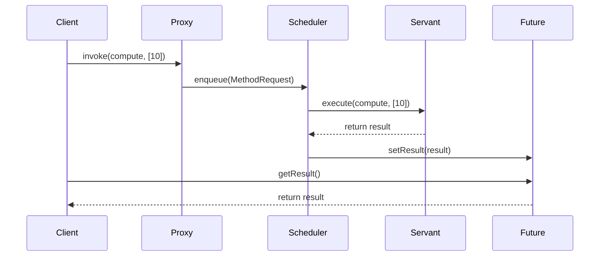

## 6.2. Active Object Pattern

In the realm of concurrent programming, managing the execution of multiple tasks while maintaining system responsiveness is a critical challenge. The Active Object Pattern is a powerful concurrency design pattern that addresses this challenge by decoupling method execution from method invocation. This pattern allows for asynchronous method execution, enabling systems to handle multiple tasks concurrently without blocking the caller.

### Intent and Motivation

The primary intent of the Active Object Pattern is to enhance system responsiveness and manage concurrent tasks effectively. By decoupling method execution from invocation, this pattern allows for asynchronous processing, which is crucial in environments where tasks may take varying amounts of time to complete.

#### Key Benefits

- **Improved Responsiveness:** By executing methods asynchronously, the system remains responsive to new requests even when processing long-running tasks.
- **Concurrency Management:** The pattern provides a structured approach to managing concurrent tasks, reducing the complexity associated with multithreading.
- **Decoupling Execution:** Separates the concerns of method invocation and execution, allowing for more flexible and maintainable code.

### Key Participants

The Active Object Pattern involves several key participants, each playing a crucial role in the pattern's implementation:

- **Proxy:** Provides an interface for clients to interact with the active object. It handles method invocation requests and forwards them to the scheduler.
- **Scheduler:** Manages the execution of method requests, ensuring they are processed in a controlled manner.
- **Servant:** The actual object that performs the requested operations.
- **Future:** Represents the result of an asynchronous operation, allowing clients to retrieve the result once it is available.
- **Method Request:** Encapsulates a method call, including the method to be executed and its parameters.

### Applicability

The Active Object Pattern is particularly useful in scenarios where:

- **Asynchronous Processing is Required:** Tasks need to be executed without blocking the caller, such as in GUI applications or network servers.
- **Complex Concurrency Management:** The system needs to manage multiple concurrent tasks efficiently.
- **Decoupling of Concerns:** There is a need to separate method invocation from execution, enhancing code modularity and maintainability.

### Pseudocode Implementation

Let's delve into a pseudocode implementation of the Active Object Pattern, illustrating how the various components interact to achieve asynchronous method execution.

```pseudocode
// Define the MethodRequest class
class MethodRequest {
    method: Function
    parameters: List
    future: Future

    // Constructor
    MethodRequest(method, parameters, future) {
        this.method = method
        this.parameters = parameters
        this.future = future
    }

    // Execute the method and set the result in the future
    execute() {
        result = this.method.apply(null, this.parameters)
        this.future.setResult(result)
    }
}

// Define the Future class
class Future {
    result: Any
    isCompleted: Boolean = false

    // Set the result of the future
    setResult(result) {
        this.result = result
        this.isCompleted = true
    }

    // Get the result of the future
    getResult() {
        while (!this.isCompleted) {
            wait() // Wait until the result is available
        }
        return this.result
    }
}

// Define the Scheduler class
class Scheduler {
    queue: Queue = new Queue()

    // Add a method request to the queue
    enqueue(request: MethodRequest) {
        this.queue.enqueue(request)
    }

    // Process method requests from the queue
    processRequests() {
        while (true) {
            if (!this.queue.isEmpty()) {
                request = this.queue.dequeue()
                request.execute()
            }
        }
    }
}

// Define the Proxy class
class Proxy {
    scheduler: Scheduler
    servant: Servant

    // Constructor
    Proxy(scheduler, servant) {
        this.scheduler = scheduler
        this.servant = servant
    }

    // Invoke a method asynchronously
    invoke(method: Function, parameters: List): Future {
        future = new Future()
        request = new MethodRequest(method.bind(this.servant), parameters, future)
        this.scheduler.enqueue(request)
        return future
    }
}

// Define the Servant class
class Servant {
    // Example method
    compute(data: Any): Any {
        // Perform some computation
        return data * 2
    }
}

// Main function to demonstrate the Active Object Pattern
function main() {
    servant = new Servant()
    scheduler = new Scheduler()
    proxy = new Proxy(scheduler, servant)

    // Start the scheduler in a separate thread
    startThread(() => scheduler.processRequests())

    // Invoke methods asynchronously
    future1 = proxy.invoke(servant.compute, [10])
    future2 = proxy.invoke(servant.compute, [20])

    // Retrieve results
    result1 = future1.getResult()
    result2 = future2.getResult()

    print("Result 1: " + result1)
    print("Result 2: " + result2)
}
```

### Diagram: Visualizing the Active Object Pattern

Below is a sequence diagram illustrating the interaction between the components of the Active Object Pattern:



### Design Considerations

When implementing the Active Object Pattern, consider the following:

- **Thread Management:** Ensure that the scheduler runs in a separate thread to process method requests concurrently.
- **Error Handling:** Implement robust error handling to manage exceptions that may occur during method execution.
- **Performance:** Monitor the performance of the system to ensure that the overhead of managing method requests does not outweigh the benefits of asynchronous execution.

### Differences and Similarities

The Active Object Pattern is often compared to other concurrency patterns, such as the **Future Pattern** and **Command Pattern**. While these patterns share similarities, they differ in their focus and implementation:

- **Future Pattern:** Primarily focuses on representing the result of an asynchronous operation, whereas the Active Object Pattern encompasses the entire process of method invocation and execution.
- **Command Pattern:** Encapsulates a request as an object, similar to the Method Request in the Active Object Pattern, but does not inherently manage concurrency.

### Try It Yourself

To deepen your understanding of the Active Object Pattern, try modifying the pseudocode example:

- **Add New Methods:** Implement additional methods in the `Servant` class and invoke them asynchronously.
- **Enhance Error Handling:** Introduce error handling mechanisms to manage exceptions during method execution.
- **Optimize Performance:** Experiment with different queue management strategies in the `Scheduler` to optimize performance.

### Knowledge Check

Before we conclude, let's reinforce what we've learned:

- **What is the primary intent of the Active Object Pattern?**
- **How does the pattern improve system responsiveness?**
- **What are the key participants in the Active Object Pattern?**
- **How does the pattern differ from the Future Pattern?**

### Embrace the Journey

Remember, mastering design patterns is a journey. The Active Object Pattern is just one tool in your toolkit for managing concurrency. As you continue to explore and experiment, you'll discover new ways to apply these patterns to solve complex software design challenges. Keep experimenting, stay curious, and enjoy the journey!

## Quiz Time!



### What is the primary intent of the Active Object Pattern?

- [x] To decouple method execution from method invocation
- [ ] To manage shared resources in a concurrent environment
- [ ] To encapsulate a request as an object
- [ ] To provide a mechanism for lazy initialization

> **Explanation:** The Active Object Pattern aims to decouple method execution from method invocation, allowing for asynchronous processing and improved system responsiveness.

### Which component in the Active Object Pattern represents the result of an asynchronous operation?

- [ ] Proxy
- [ ] Scheduler
- [x] Future
- [ ] Servant

> **Explanation:** The Future component represents the result of an asynchronous operation, allowing clients to retrieve the result once it is available.

### In the Active Object Pattern, which component manages the execution of method requests?

- [ ] Proxy
- [x] Scheduler
- [ ] Servant
- [ ] Future

> **Explanation:** The Scheduler component manages the execution of method requests, ensuring they are processed in a controlled manner.

### How does the Active Object Pattern improve system responsiveness?

- [x] By executing methods asynchronously
- [ ] By encapsulating requests as objects
- [ ] By managing shared resources
- [ ] By providing lazy initialization

> **Explanation:** The Active Object Pattern improves system responsiveness by executing methods asynchronously, allowing the system to handle new requests while processing long-running tasks.

### Which of the following is NOT a key participant in the Active Object Pattern?

- [ ] Proxy
- [ ] Scheduler
- [ ] Servant
- [x] Command

> **Explanation:** The Command is not a key participant in the Active Object Pattern. The key participants are Proxy, Scheduler, Servant, Method Request, and Future.

### What is the role of the Proxy in the Active Object Pattern?

- [x] To handle method invocation requests and forward them to the scheduler
- [ ] To manage the execution of method requests
- [ ] To perform the requested operations
- [ ] To represent the result of an asynchronous operation

> **Explanation:** The Proxy handles method invocation requests and forwards them to the scheduler for execution.

### How does the Active Object Pattern differ from the Future Pattern?

- [x] The Active Object Pattern encompasses the entire process of method invocation and execution, while the Future Pattern focuses on representing the result of an asynchronous operation.
- [ ] The Active Object Pattern manages shared resources, while the Future Pattern encapsulates requests as objects.
- [ ] The Active Object Pattern provides lazy initialization, while the Future Pattern manages concurrency.
- [ ] The Active Object Pattern is used for synchronous processing, while the Future Pattern is used for asynchronous processing.

> **Explanation:** The Active Object Pattern encompasses the entire process of method invocation and execution, while the Future Pattern focuses on representing the result of an asynchronous operation.

### What is the role of the Servant in the Active Object Pattern?

- [ ] To handle method invocation requests
- [ ] To manage the execution of method requests
- [x] To perform the requested operations
- [ ] To represent the result of an asynchronous operation

> **Explanation:** The Servant is the actual object that performs the requested operations.

### Which of the following is a benefit of using the Active Object Pattern?

- [x] Improved system responsiveness
- [ ] Simplified error handling
- [ ] Reduced memory usage
- [ ] Enhanced data security

> **Explanation:** The Active Object Pattern improves system responsiveness by allowing for asynchronous method execution.

### True or False: The Active Object Pattern is useful in scenarios where synchronous processing is required.

- [ ] True
- [x] False

> **Explanation:** False. The Active Object Pattern is useful in scenarios where asynchronous processing is required, allowing tasks to be executed without blocking the caller.


