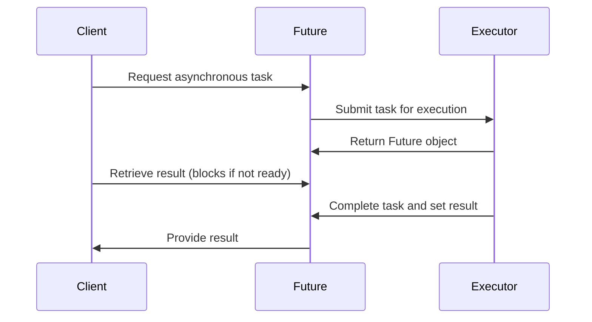
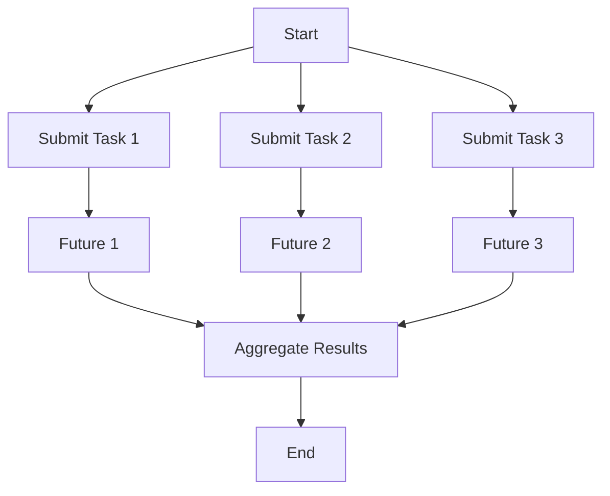

## 6.3. Future Pattern

In the realm of concurrent programming, managing asynchronous tasks efficiently is crucial for building responsive and scalable applications. The Future Pattern is a powerful concurrency design pattern that addresses this need by representing the result of an asynchronous computation. This section delves into the Future Pattern, explaining its intent, motivation, and implementation using pseudocode, and explores its applicability across different programming paradigms.

### Intent and Motivation

The primary intent of the Future Pattern is to provide a placeholder for a result that will eventually be available. This pattern allows a program to continue executing other tasks while waiting for the completion of an asynchronous operation. The Future Pattern is particularly useful in scenarios where operations such as network requests, file I/O, or complex computations may take an indeterminate amount of time to complete.

#### Key Benefits

- **Decoupling Execution and Retrieval**: By separating the initiation of an asynchronous task from the retrieval of its result, the Future Pattern enables non-blocking operations, allowing other tasks to proceed without waiting.
- **Improved Responsiveness**: Applications can remain responsive to user interactions or other events while waiting for the completion of background tasks.
- **Simplified Error Handling**: Futures can encapsulate both successful results and exceptions, providing a unified mechanism for handling errors in asynchronous operations.

### Diagrams

To better understand the Future Pattern, let's visualize its workflow using a sequence diagram. This diagram illustrates the interaction between a client, a future, and an executor responsible for performing the asynchronous task.



**Diagram Description**: This sequence diagram illustrates the interaction between a client, a future, and an executor. The client requests an asynchronous task, which is submitted to the executor. The executor returns a future object to the client. The client can retrieve the result from the future, which blocks if the task is not yet complete. Once the executor completes the task, it sets the result in the future, which is then provided to the client.

### Key Participants

- **Client**: Initiates the asynchronous operation and retrieves the result from the future.
- **Future**: Acts as a placeholder for the result of an asynchronous computation. It provides methods to check if the computation is complete, retrieve the result, or handle exceptions.
- **Executor**: Responsible for executing the asynchronous task and setting the result in the future once the task is complete.

### Applicability

The Future Pattern is applicable in various scenarios where asynchronous operations are required, including:

- **Network Communication**: Handling requests and responses without blocking the main thread.
- **File I/O**: Reading or writing large files asynchronously to prevent blocking.
- **Parallel Computations**: Distributing computational tasks across multiple threads or processors.

### Sample Code Snippets

Let's explore the implementation of the Future Pattern using pseudocode. We'll create a simple example where a client requests an asynchronous computation, and the result is retrieved using a future.

```pseudocode
class Future:
    def __init__(self):
        self.result = None
        self.is_done = False
        self.callbacks = []

    def set_result(self, result):
        self.result = result
        self.is_done = True
        for callback in self.callbacks:
            callback(result)

    def get_result(self):
        while not self.is_done:
            # Wait for the result to be set
            pass
        return self.result

    def add_callback(self, callback):
        if self.is_done:
            callback(self.result)
        else:
            self.callbacks.append(callback)

class Executor:
    def submit(self, task):
        future = Future()
        # Simulate asynchronous execution
        result = task()
        future.set_result(result)
        return future

def compute():
    # Simulate a long-running computation
    return "Computation Result"

executor = Executor()
future = executor.submit(compute)

future.add_callback(lambda result: print("Callback received:", result))

result = future.get_result()
print("Result:", result)
```

**Code Explanation**: In this pseudocode example, we define a `Future` class that holds the result of an asynchronous computation. The `Executor` class is responsible for executing tasks and returning a future. The client submits a task to the executor, retrieves the future, and adds a callback to be executed when the result is ready. The `get_result` method blocks until the result is available.

### Design Considerations

When using the Future Pattern, consider the following:

- **Blocking vs. Non-Blocking**: While futures provide a mechanism for non-blocking operations, retrieving the result using `get_result` can block if the computation is not complete. Consider using callbacks or other non-blocking mechanisms to handle results.
- **Error Handling**: Ensure that exceptions are properly encapsulated within the future and handled by the client. This may involve adding methods to check for exceptions or providing a separate callback for error handling.
- **Resource Management**: Be mindful of resource usage, especially when dealing with a large number of concurrent tasks. Consider using thread pools or other mechanisms to manage resources efficiently.

### Differences and Similarities

The Future Pattern is often compared to other concurrency patterns, such as Promises and Callbacks. Here are some key differences and similarities:

- **Future vs. Promise**: Both patterns represent the result of an asynchronous operation. However, promises often provide more advanced features, such as chaining and error propagation, making them more suitable for complex asynchronous workflows.
- **Future vs. Callback**: Callbacks are a simpler mechanism for handling asynchronous results but can lead to callback hell in complex scenarios. Futures provide a more structured approach, allowing for easier composition and error handling.

### Try It Yourself

To deepen your understanding of the Future Pattern, try modifying the pseudocode example:

- **Experiment with Error Handling**: Add error handling to the future and executor classes. Simulate a task that raises an exception and observe how it is handled.
- **Implement Non-Blocking Result Retrieval**: Modify the `get_result` method to support non-blocking retrieval using a timeout or polling mechanism.
- **Explore Advanced Features**: Implement additional features, such as chaining futures or combining results from multiple futures.

### Visualizing Future Pattern in Asynchronous Workflows

To further illustrate the Future Pattern's role in asynchronous workflows, let's visualize a typical use case where multiple asynchronous tasks are executed concurrently, and their results are aggregated.



**Diagram Description**: This flowchart represents a workflow where multiple tasks are submitted concurrently, each returning a future. The results of these futures are aggregated once all tasks are complete, demonstrating the Future Pattern's ability to handle concurrent operations efficiently.

### Knowledge Check

Before moving on, let's reinforce your understanding of the Future Pattern with a few questions:

1. What is the primary intent of the Future Pattern?
2. How does the Future Pattern improve application responsiveness?
3. What are some common use cases for the Future Pattern?
4. How does the Future Pattern differ from Promises and Callbacks?
5. What are some design considerations when implementing the Future Pattern?

### Embrace the Journey

Remember, mastering concurrency patterns like the Future Pattern is a journey. As you explore and experiment with these patterns, you'll gain valuable insights into building efficient and responsive applications. Keep experimenting, stay curious, and enjoy the journey!

## Quiz Time!



### What is the primary intent of the Future Pattern?

- [x] To provide a placeholder for a result that will eventually be available
- [ ] To execute tasks sequentially
- [ ] To handle synchronous operations
- [ ] To manage memory allocation

> **Explanation:** The primary intent of the Future Pattern is to represent the result of an asynchronous computation, allowing the program to continue executing other tasks while waiting for the result.

### How does the Future Pattern improve application responsiveness?

- [x] By allowing non-blocking operations
- [ ] By executing tasks in a single thread
- [ ] By increasing memory usage
- [ ] By simplifying synchronous code

> **Explanation:** The Future Pattern improves application responsiveness by enabling non-blocking operations, allowing other tasks to proceed without waiting for the completion of asynchronous operations.

### Which of the following is a common use case for the Future Pattern?

- [x] Network communication
- [ ] Sorting algorithms
- [ ] String manipulation
- [ ] Static code analysis

> **Explanation:** The Future Pattern is commonly used in scenarios involving network communication, where requests and responses can be handled asynchronously without blocking the main thread.

### How does the Future Pattern differ from Promises?

- [x] Promises often provide more advanced features like chaining and error propagation
- [ ] Futures are used for synchronous operations
- [ ] Promises are more suitable for single-threaded environments
- [ ] Futures cannot handle exceptions

> **Explanation:** While both futures and promises represent the result of an asynchronous operation, promises often provide more advanced features such as chaining and error propagation, making them more suitable for complex workflows.

### What is a key design consideration when implementing the Future Pattern?

- [x] Ensuring proper error handling
- [ ] Minimizing the number of threads
- [ ] Avoiding the use of callbacks
- [ ] Using synchronous execution

> **Explanation:** Proper error handling is crucial when implementing the Future Pattern to ensure that exceptions are encapsulated within the future and handled appropriately by the client.

### Which component is responsible for executing the asynchronous task in the Future Pattern?

- [x] Executor
- [ ] Client
- [ ] Future
- [ ] Callback

> **Explanation:** The executor is responsible for executing the asynchronous task and setting the result in the future once the task is complete.

### What method can be used to retrieve the result from a future?

- [x] get_result
- [ ] set_result
- [ ] execute_task
- [ ] submit_task

> **Explanation:** The `get_result` method is used to retrieve the result from a future, blocking if the computation is not yet complete.

### How can callbacks be used with the Future Pattern?

- [x] By adding them to be executed when the result is ready
- [ ] By executing them before the task is submitted
- [ ] By using them to initialize the future
- [ ] By replacing the executor

> **Explanation:** Callbacks can be added to a future to be executed when the result is ready, allowing for non-blocking handling of the result.

### What is a potential pitfall of using the Future Pattern?

- [x] Blocking when retrieving the result
- [ ] Overloading the main thread
- [ ] Increasing memory usage
- [ ] Simplifying error handling

> **Explanation:** A potential pitfall of using the Future Pattern is blocking when retrieving the result if the computation is not yet complete. Consider using non-blocking mechanisms to handle results.

### True or False: The Future Pattern is only applicable in object-oriented programming.

- [ ] True
- [x] False

> **Explanation:** False. The Future Pattern is applicable across various programming paradigms, including functional programming, where asynchronous operations are required.


