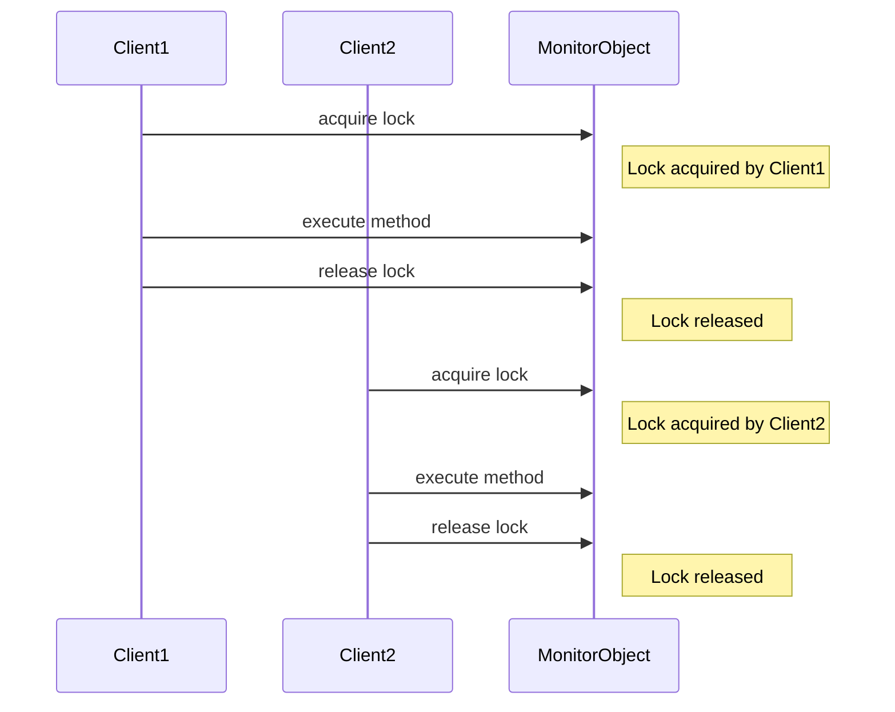

## 6.4. Monitor Object Pattern

In the realm of concurrent programming, managing access to shared resources is a critical challenge. The Monitor Object Pattern is a powerful design pattern that addresses this challenge by providing a structured way to synchronize access to an object. This pattern ensures that only one thread can execute a method on an object at a time, thus preventing race conditions and ensuring thread safety.

### Intent and Motivation

The primary intent of the Monitor Object Pattern is to encapsulate the synchronization logic within an object, thereby simplifying the management of concurrent access to the object's methods. By doing so, it abstracts away the complexity of synchronization from the client code, allowing developers to focus on the business logic rather than the intricacies of thread management.

#### Key Objectives:

- **Synchronization Constructs**: Use synchronization constructs to control access to the object's methods, ensuring that only one thread can execute a method at a time.
- **Encapsulation**: Encapsulate the synchronization logic within the object, providing a clean and simple interface for clients.
- **Thread Safety**: Ensure that the object's state remains consistent and correct when accessed by multiple threads concurrently.

#### Motivation:

In multithreaded applications, shared resources such as data structures or hardware devices can be accessed by multiple threads simultaneously. Without proper synchronization, this can lead to race conditions, data corruption, and unpredictable behavior. The Monitor Object Pattern provides a structured approach to managing access to these shared resources, ensuring that only one thread can access the resource at a time.

### Key Participants

1. **Monitor Object**: The object that encapsulates the shared resource and the synchronization logic. It provides synchronized methods that can be accessed by multiple threads.
2. **Client Threads**: The threads that interact with the Monitor Object. These threads invoke the synchronized methods to access the shared resource.

### Applicability

The Monitor Object Pattern is applicable in scenarios where:

- Multiple threads need to access a shared resource, and synchronization is required to prevent race conditions.
- The synchronization logic needs to be encapsulated within an object to simplify the client code.
- Thread safety is a critical requirement, and the object's state must remain consistent when accessed by multiple threads.

### Pseudocode Implementation

Let's explore a pseudocode implementation of the Monitor Object Pattern. In this example, we'll create a simple counter object that can be incremented by multiple threads. The counter object will use the Monitor Object Pattern to ensure that only one thread can increment the counter at a time.

```pseudocode
class MonitorCounter:
    private counter: integer = 0
    private lock: Lock = new Lock()

    method increment():
        lock.acquire()
        try:
            counter = counter + 1
        finally:
            lock.release()

    method getCounter() -> integer:
        lock.acquire()
        try:
            return counter
        finally:
            lock.release()
```

#### Explanation:

- **Lock**: The `lock` is a synchronization construct that controls access to the `increment` and `getCounter` methods. It ensures that only one thread can execute these methods at a time.
- **Increment Method**: The `increment` method acquires the lock before incrementing the counter and releases the lock afterward. This ensures that the counter is incremented atomically.
- **GetCounter Method**: The `getCounter` method acquires the lock before returning the counter value, ensuring that the value is read atomically.

### Design Considerations

When implementing the Monitor Object Pattern, consider the following:

- **Deadlock Prevention**: Ensure that locks are always released, even if an exception occurs. Use `try-finally` blocks to guarantee that locks are released.
- **Performance**: The use of locks can introduce performance overhead. Consider the trade-off between thread safety and performance.
- **Granularity**: Choose the appropriate level of granularity for locking. Fine-grained locks can improve performance but increase complexity, while coarse-grained locks are simpler but may reduce concurrency.

### Differences and Similarities

The Monitor Object Pattern is often compared to other synchronization patterns, such as:

- **Mutex Pattern**: Both patterns use locks to control access to shared resources. However, the Monitor Object Pattern encapsulates the synchronization logic within an object, while the Mutex Pattern typically involves explicit lock management by the client.
- **Semaphore Pattern**: Semaphores allow multiple threads to access a resource simultaneously, up to a specified limit. In contrast, the Monitor Object Pattern typically allows only one thread to access the resource at a time.

### Visualizing the Monitor Object Pattern

To better understand the Monitor Object Pattern, let's visualize the interaction between client threads and the Monitor Object using a sequence diagram.



#### Diagram Explanation:

- **Client1 and Client2**: These are the client threads that interact with the Monitor Object.
- **MonitorObject**: The object that encapsulates the synchronization logic. It manages the lock and ensures that only one client can execute a method at a time.

### Try It Yourself

To deepen your understanding of the Monitor Object Pattern, try modifying the pseudocode example:

- **Experiment with Different Lock Types**: Replace the lock with a read-write lock and observe how it affects the behavior of the `increment` and `getCounter` methods.
- **Add Additional Methods**: Add more methods to the Monitor Object and implement synchronization for these methods.
- **Simulate Concurrent Access**: Create multiple threads that access the Monitor Object concurrently and observe how the synchronization logic ensures thread safety.

### References and Links

For further reading on the Monitor Object Pattern and related concepts, consider the following resources:

- [Concurrency in Java](https://docs.oracle.com/javase/tutorial/essential/concurrency/)
- [Synchronization in Python](https://docs.python.org/3/library/threading.html#threading.Lock)
- [Multithreading in C++](https://en.cppreference.com/w/cpp/thread)

### Knowledge Check

Before moving on, let's reinforce our understanding of the Monitor Object Pattern with a few questions:

- What is the primary intent of the Monitor Object Pattern?
- How does the Monitor Object Pattern ensure thread safety?
- What are the key participants in the Monitor Object Pattern?
- How does the Monitor Object Pattern differ from the Mutex Pattern?

### Embrace the Journey

Remember, mastering concurrency patterns like the Monitor Object Pattern is a journey. As you continue to explore and experiment with these patterns, you'll gain a deeper understanding of how to manage concurrency in your applications effectively. Keep experimenting, stay curious, and enjoy the journey!

## Quiz Time!



### What is the primary intent of the Monitor Object Pattern?

- [x] To encapsulate synchronization logic within an object
- [ ] To allow multiple threads to execute a method simultaneously
- [ ] To eliminate the need for locks in concurrent programming
- [ ] To improve the performance of multithreaded applications

> **Explanation:** The primary intent of the Monitor Object Pattern is to encapsulate synchronization logic within an object, ensuring that only one thread can execute a method at a time.

### How does the Monitor Object Pattern ensure thread safety?

- [x] By using locks to control access to the object's methods
- [ ] By allowing multiple threads to access the object's methods simultaneously
- [ ] By eliminating the need for synchronization constructs
- [ ] By using semaphores to limit access to the object's methods

> **Explanation:** The Monitor Object Pattern ensures thread safety by using locks to control access to the object's methods, preventing race conditions.

### What are the key participants in the Monitor Object Pattern?

- [x] Monitor Object and Client Threads
- [ ] Mutex and Semaphore
- [ ] Producer and Consumer
- [ ] Publisher and Subscriber

> **Explanation:** The key participants in the Monitor Object Pattern are the Monitor Object, which encapsulates the synchronization logic, and the Client Threads, which interact with the Monitor Object.

### How does the Monitor Object Pattern differ from the Mutex Pattern?

- [x] The Monitor Object Pattern encapsulates synchronization logic within an object
- [ ] The Mutex Pattern allows multiple threads to execute a method simultaneously
- [ ] The Monitor Object Pattern eliminates the need for locks
- [ ] The Mutex Pattern is used for single-threaded applications

> **Explanation:** The Monitor Object Pattern encapsulates synchronization logic within an object, while the Mutex Pattern typically involves explicit lock management by the client.

### What is a potential drawback of using the Monitor Object Pattern?

- [x] Performance overhead due to lock management
- [ ] Inability to ensure thread safety
- [ ] Lack of encapsulation
- [ ] Complexity in client code

> **Explanation:** A potential drawback of using the Monitor Object Pattern is the performance overhead introduced by lock management.

### Which of the following is a synchronization construct used in the Monitor Object Pattern?

- [x] Lock
- [ ] Semaphore
- [ ] Thread
- [ ] Queue

> **Explanation:** A lock is a synchronization construct used in the Monitor Object Pattern to control access to the object's methods.

### What is the role of the Client Threads in the Monitor Object Pattern?

- [x] To interact with the Monitor Object and invoke its methods
- [ ] To manage the synchronization logic within the object
- [ ] To provide synchronization constructs for the Monitor Object
- [ ] To eliminate the need for locks in concurrent programming

> **Explanation:** The role of the Client Threads in the Monitor Object Pattern is to interact with the Monitor Object and invoke its methods.

### How does the Monitor Object Pattern prevent race conditions?

- [x] By ensuring that only one thread can execute a method at a time
- [ ] By allowing multiple threads to access the object's methods simultaneously
- [ ] By eliminating the need for synchronization constructs
- [ ] By using semaphores to limit access to the object's methods

> **Explanation:** The Monitor Object Pattern prevents race conditions by ensuring that only one thread can execute a method at a time.

### What is the purpose of encapsulating synchronization logic within an object?

- [x] To simplify the client code and focus on business logic
- [ ] To allow multiple threads to execute a method simultaneously
- [ ] To eliminate the need for locks in concurrent programming
- [ ] To improve the performance of multithreaded applications

> **Explanation:** The purpose of encapsulating synchronization logic within an object is to simplify the client code and allow developers to focus on business logic.

### True or False: The Monitor Object Pattern allows multiple threads to execute a method on an object simultaneously.

- [ ] True
- [x] False

> **Explanation:** False. The Monitor Object Pattern ensures that only one thread can execute a method on an object at a time, preventing race conditions.


