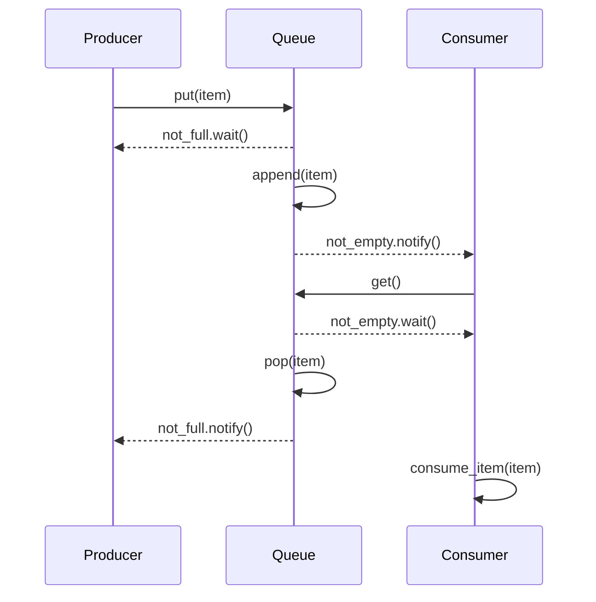
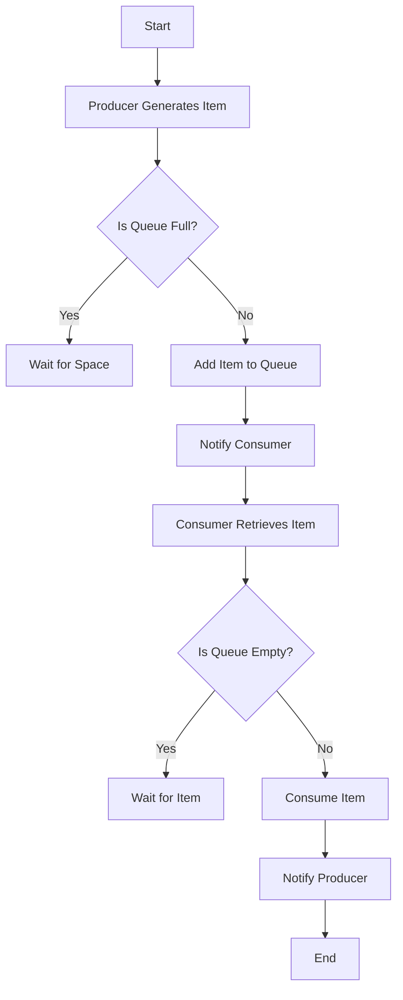

## 6.5. Producer-Consumer Pattern

Concurrency is a cornerstone of modern software development, allowing multiple tasks to be executed simultaneously, thereby improving the efficiency and responsiveness of applications. Among the various concurrency patterns, the Producer-Consumer pattern stands out as a fundamental design pattern for managing work queues. This pattern is widely used in scenarios where there is a need to balance the workload between producers, which generate data or tasks, and consumers, which process them.

### Intent and Motivation

The Producer-Consumer pattern is designed to solve the problem of coordinating work between two types of entities: producers and consumers. The primary intent is to decouple the production of data from its consumption, allowing both processes to operate independently and concurrently. This decoupling is achieved through a shared buffer or queue, where producers place items and consumers retrieve them.

Key motivations for using the Producer-Consumer pattern include:

- **Improved Throughput**: By allowing producers and consumers to work concurrently, the pattern can significantly enhance the throughput of the system.
- **Load Balancing**: It helps in balancing the workload between producers and consumers, ensuring that neither is overwhelmed.
- **Resource Management**: The pattern facilitates efficient resource utilization by controlling the rate at which items are produced and consumed.
- **Scalability**: It supports scalability by allowing multiple producers and consumers to operate simultaneously, adapting to varying loads.

### Key Participants

In the Producer-Consumer pattern, the key participants are:

- **Producers**: Entities responsible for generating data or tasks. They place items into a shared buffer or queue.
- **Consumers**: Entities responsible for processing the data or tasks. They retrieve items from the shared buffer or queue.
- **Buffer/Queue**: A shared data structure that acts as an intermediary between producers and consumers. It holds the items produced until they are consumed.

### Applicability

The Producer-Consumer pattern is applicable in various scenarios, including:

- **Multithreaded Applications**: Where tasks need to be processed concurrently by multiple threads.
- **Data Processing Pipelines**: Where data is produced by one component and consumed by another for further processing.
- **Asynchronous Systems**: Where tasks are produced and consumed at different rates, requiring a buffer to manage the flow.

### Pseudocode Implementation

To illustrate the Producer-Consumer pattern, let's consider a simple pseudocode implementation using a shared queue. This example will demonstrate how producers and consumers interact with the queue, ensuring thread safety and synchronization.

```pseudocode
class SharedQueue:
    def __init__(self, max_size):
        self.queue = []
        self.max_size = max_size
        self.lock = new Lock()
        self.not_empty = new Condition(self.lock)
        self.not_full = new Condition(self.lock)

    def put(self, item):
        with self.lock:
            while len(self.queue) >= self.max_size:
                self.not_full.wait()
            self.queue.append(item)
            self.not_empty.notify()

    def get(self):
        with self.lock:
            while len(self.queue) == 0:
                self.not_empty.wait()
            item = self.queue.pop(0)
            self.not_full.notify()
            return item

class Producer(Thread):
    def __init__(self, queue):
        self.queue = queue

    def run(self):
        while True:
            item = produce_item()
            self.queue.put(item)
            print("Produced:", item)

class Consumer(Thread):
    def __init__(self, queue):
        self.queue = queue

    def run(self):
        while True:
            item = self.queue.get()
            consume_item(item)
            print("Consumed:", item)

def main():
    queue = SharedQueue(max_size=10)
    producers = [Producer(queue) for _ in range(3)]
    consumers = [Consumer(queue) for _ in range(3)]

    for producer in producers:
        producer.start()

    for consumer in consumers:
        consumer.start()

main()
```

### Diagrams

To better understand the flow of the Producer-Consumer pattern, let's visualize it using a sequence diagram.



**Diagram Description**: The sequence diagram illustrates the interaction between producers, the shared queue, and consumers. Producers add items to the queue, and if the queue is full, they wait. Consumers retrieve items from the queue, and if the queue is empty, they wait. Notifications are used to signal when the queue is no longer full or empty.

### Design Considerations

When implementing the Producer-Consumer pattern, consider the following:

- **Thread Safety**: Ensure that the shared buffer is accessed in a thread-safe manner to prevent data corruption.
- **Synchronization**: Use synchronization mechanisms such as locks and conditions to manage access to the shared buffer.
- **Buffer Size**: Choose an appropriate buffer size to balance between memory usage and throughput.
- **Error Handling**: Implement error handling to manage exceptions that may occur during production or consumption.

### Differences and Similarities

The Producer-Consumer pattern is often compared to other concurrency patterns, such as:

- **Reader-Writer Pattern**: Both patterns involve managing access to shared resources, but the Reader-Writer pattern focuses on allowing multiple readers or a single writer, while the Producer-Consumer pattern focuses on balancing production and consumption.
- **Observer Pattern**: While the Observer pattern involves notifying observers of changes, the Producer-Consumer pattern involves transferring data between producers and consumers.

### Try It Yourself

To deepen your understanding of the Producer-Consumer pattern, try modifying the pseudocode example:

- **Experiment with Different Buffer Sizes**: Observe how changing the buffer size affects the system's throughput and responsiveness.
- **Add More Producers or Consumers**: See how the system behaves with varying numbers of producers and consumers.
- **Implement Error Handling**: Introduce error scenarios and handle them gracefully.

### Visualizing Producer-Consumer Pattern

To further illustrate the Producer-Consumer pattern, let's create a flowchart that visualizes the process.



**Flowchart Description**: This flowchart represents the flow of the Producer-Consumer pattern. Producers generate items and check if the queue is full. If full, they wait; otherwise, they add the item to the queue and notify consumers. Consumers retrieve items, check if the queue is empty, and consume the item, notifying producers when done.

### Knowledge Check

Let's reinforce your understanding with a few questions:

- What is the primary intent of the Producer-Consumer pattern?
- How does the pattern improve throughput in a system?
- What synchronization mechanisms are commonly used in this pattern?

### Exercises

1. **Implement a Priority Queue**: Modify the pseudocode to implement a priority queue, where items are consumed based on priority.
2. **Add Logging**: Enhance the pseudocode to include logging for each production and consumption event.
3. **Simulate Network Latency**: Introduce artificial delays in the producer or consumer to simulate network latency and observe the impact.

### Embrace the Journey

Remember, mastering concurrency patterns like Producer-Consumer is a journey. As you experiment and apply these concepts, you'll gain deeper insights into building efficient and responsive applications. Keep exploring, stay curious, and enjoy the process!

## Quiz Time!



### What is the primary intent of the Producer-Consumer pattern?

- [x] To decouple the production of data from its consumption
- [ ] To increase the speed of data processing
- [ ] To reduce memory usage
- [ ] To simplify code structure

> **Explanation:** The primary intent of the Producer-Consumer pattern is to decouple the production of data from its consumption, allowing both processes to operate independently and concurrently.

### Which of the following is a key participant in the Producer-Consumer pattern?

- [x] Producer
- [ ] Observer
- [ ] Singleton
- [x] Consumer

> **Explanation:** The key participants in the Producer-Consumer pattern are the Producer and Consumer, which interact with a shared buffer or queue.

### What synchronization mechanism is commonly used in the Producer-Consumer pattern?

- [x] Locks and Conditions
- [ ] Semaphores
- [ ] Mutexes
- [ ] Monitors

> **Explanation:** Locks and Conditions are commonly used to manage access to the shared buffer in the Producer-Consumer pattern, ensuring thread safety and synchronization.

### How does the Producer-Consumer pattern improve throughput?

- [x] By allowing producers and consumers to work concurrently
- [ ] By reducing the number of threads
- [ ] By increasing the buffer size
- [ ] By simplifying the code

> **Explanation:** The Producer-Consumer pattern improves throughput by allowing producers and consumers to work concurrently, balancing the workload between them.

### Which pattern is often compared to the Producer-Consumer pattern?

- [x] Reader-Writer Pattern
- [ ] Singleton Pattern
- [ ] Factory Pattern
- [x] Observer Pattern

> **Explanation:** The Producer-Consumer pattern is often compared to the Reader-Writer and Observer patterns, as they all involve managing access to shared resources or data.

### What is a common design consideration for the Producer-Consumer pattern?

- [x] Thread Safety
- [ ] Code Simplicity
- [ ] Memory Usage
- [ ] Network Latency

> **Explanation:** Thread safety is a common design consideration for the Producer-Consumer pattern, ensuring that the shared buffer is accessed safely by multiple threads.

### What is the role of the buffer in the Producer-Consumer pattern?

- [x] To act as an intermediary between producers and consumers
- [ ] To store configuration settings
- [ ] To manage user sessions
- [ ] To log system errors

> **Explanation:** The buffer acts as an intermediary between producers and consumers, holding the items produced until they are consumed.

### How can you experiment with the Producer-Consumer pattern?

- [x] By changing the buffer size
- [ ] By reducing the number of threads
- [ ] By simplifying the pseudocode
- [x] By adding more producers or consumers

> **Explanation:** You can experiment with the Producer-Consumer pattern by changing the buffer size or adding more producers or consumers to observe the impact on the system.

### True or False: The Producer-Consumer pattern is only applicable in multithreaded applications.

- [ ] True
- [x] False

> **Explanation:** False. While the Producer-Consumer pattern is commonly used in multithreaded applications, it is also applicable in other scenarios such as data processing pipelines and asynchronous systems.

### What is a common pitfall to avoid in the Producer-Consumer pattern?

- [x] Data corruption due to lack of synchronization
- [ ] Overuse of memory
- [ ] Excessive logging
- [ ] Simplifying the code too much

> **Explanation:** A common pitfall to avoid in the Producer-Consumer pattern is data corruption due to lack of synchronization, which can occur if the shared buffer is not accessed in a thread-safe manner.




