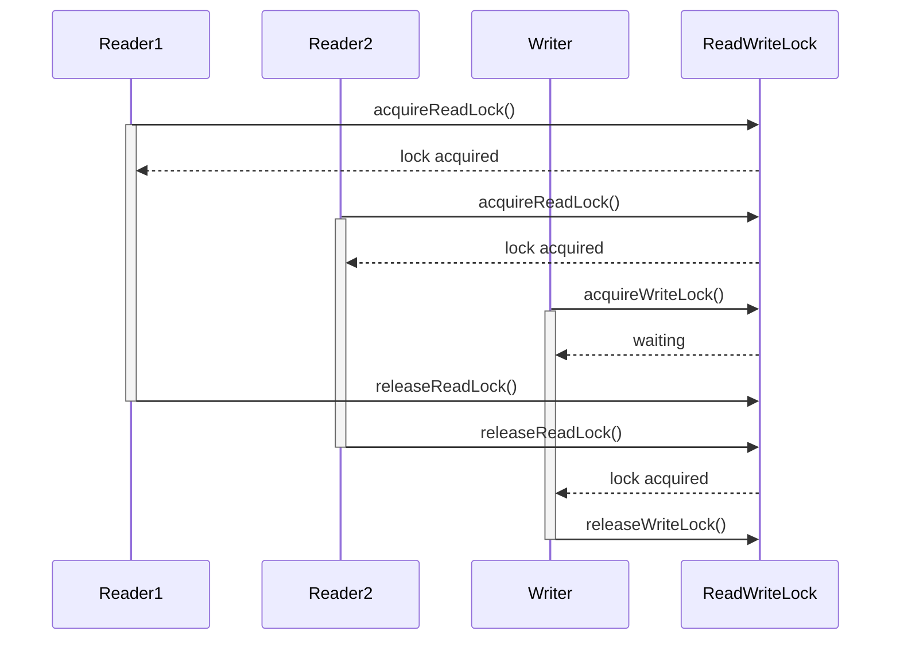

## 6.6. Read-Write Lock Pattern

Concurrency is a fundamental aspect of modern software systems, enabling multiple processes or threads to execute simultaneously. This capability is crucial for improving performance, especially in multi-core processors. However, concurrency introduces challenges, particularly when multiple threads need to access shared resources. The Read-Write Lock Pattern is a powerful concurrency design pattern that addresses these challenges by allowing multiple readers or a single writer to access a resource concurrently. This section delves into the Read-Write Lock Pattern, exploring its intent, motivation, implementation, and practical applications.

### Intent and Motivation

The primary intent of the Read-Write Lock Pattern is to improve concurrency by allowing multiple threads to read shared data simultaneously while ensuring exclusive access for threads that modify the data. This pattern is particularly useful in scenarios where read operations significantly outnumber write operations, as it minimizes the contention for resources, thereby enhancing performance.

#### Key Benefits

- **Increased Throughput**: By allowing multiple readers, the pattern increases the throughput of read operations, which are typically more frequent than write operations.
- **Reduced Contention**: It reduces contention by distinguishing between read and write locks, allowing more flexible access control.
- **Scalability**: The pattern scales well with the number of threads, particularly in read-heavy scenarios.

#### Use Cases

- **Database Systems**: In databases, read operations are often more frequent than write operations. The Read-Write Lock Pattern can optimize access to shared data structures.
- **Caching Mechanisms**: When implementing caches, multiple threads may need to read cached data concurrently, while updates are less frequent.
- **Configuration Management**: Systems that need to read configuration data frequently but update it rarely can benefit from this pattern.

### Key Participants

1. **Read-Write Lock**: Manages the acquisition and release of read and write locks.
2. **Reader**: A thread that acquires a read lock to access shared data.
3. **Writer**: A thread that acquires a write lock to modify shared data.

### Applicability

The Read-Write Lock Pattern is applicable in scenarios where:

- Read operations are more frequent than write operations.
- The cost of acquiring and releasing locks is justified by the performance gains.
- The system requires high concurrency and minimal contention for shared resources.

### Pseudocode Implementation

Let's explore a pseudocode implementation of the Read-Write Lock Pattern. This implementation demonstrates the core logic for managing read and write locks.

```pseudocode
class ReadWriteLock:
    private int readers = 0
    private boolean writer = false

    method acquireReadLock():
        while writer is true:
            wait()  // Wait until no writer holds the lock
        readers += 1

    method releaseReadLock():
        readers -= 1
        if readers == 0:
            notifyAll()  // Notify waiting writers

    method acquireWriteLock():
        while writer is true or readers > 0:
            wait()  // Wait until no readers or writers hold the lock
        writer = true

    method releaseWriteLock():
        writer = false
        notifyAll()  // Notify waiting readers and writers
```

#### Explanation

- **Read Lock Acquisition**: A reader waits if a writer holds the lock. Once the writer releases the lock, the reader increments the `readers` count and proceeds.
- **Read Lock Release**: The reader decrements the `readers` count. If no readers remain, it notifies waiting writers.
- **Write Lock Acquisition**: A writer waits if another writer holds the lock or if there are active readers. Once conditions are met, it sets the `writer` flag to true.
- **Write Lock Release**: The writer resets the `writer` flag and notifies waiting readers and writers.

### Design Considerations

- **Fairness**: Implementing fairness to prevent starvation of readers or writers is crucial. Techniques such as maintaining a queue of waiting threads can help.
- **Deadlock Prevention**: Careful design is necessary to avoid deadlocks, where threads wait indefinitely for locks.
- **Performance Trade-offs**: While the pattern improves concurrency, the overhead of managing locks can impact performance in write-heavy scenarios.

### Differences and Similarities

The Read-Write Lock Pattern is often compared to the traditional Mutex (Mutual Exclusion) pattern. While both manage access to shared resources, the Read-Write Lock Pattern offers more granular control by distinguishing between read and write operations. This distinction allows for higher concurrency in read-heavy environments.

### Visualizing the Read-Write Lock Pattern

To better understand the flow of the Read-Write Lock Pattern, let's visualize the process using a sequence diagram.



**Diagram Description**: This sequence diagram illustrates the interaction between readers, a writer, and the Read-Write Lock. Readers acquire and release read locks concurrently, while the writer waits until all read locks are released before acquiring the write lock.

### Try It Yourself

To deepen your understanding, try modifying the pseudocode to implement a fairness mechanism that ensures writers are not starved by continuous read operations. Consider using a queue to manage waiting threads.

### References and Links

For further reading on concurrency patterns and the Read-Write Lock Pattern, consider the following resources:

- [Java Concurrency in Practice](https://jcip.net/)
- [Concurrency Patterns in Go](https://golang.org/doc/effective_go.html#concurrency)
- [Python's Threading Module](https://docs.python.org/3/library/threading.html)

### Knowledge Check

- What is the primary benefit of using the Read-Write Lock Pattern?
- How does the pattern improve concurrency in read-heavy scenarios?
- What are the potential pitfalls of implementing this pattern?

### Embrace the Journey

Remember, mastering concurrency patterns like the Read-Write Lock is a journey. As you continue to explore and implement these patterns, you'll gain deeper insights into designing efficient, scalable software systems. Keep experimenting, stay curious, and enjoy the process!

## Quiz Time!



### What is the primary intent of the Read-Write Lock Pattern?

- [x] To allow multiple readers or a single writer to access a resource concurrently
- [ ] To allow only one thread to access a resource at a time
- [ ] To prevent any thread from accessing a resource
- [ ] To allow multiple writers to access a resource concurrently

> **Explanation:** The Read-Write Lock Pattern allows multiple readers or a single writer to access a resource concurrently, optimizing performance in read-heavy scenarios.

### In which scenario is the Read-Write Lock Pattern most beneficial?

- [x] When read operations significantly outnumber write operations
- [ ] When write operations significantly outnumber read operations
- [ ] When read and write operations are equally frequent
- [ ] When there are no read operations

> **Explanation:** The pattern is most beneficial when read operations significantly outnumber write operations, as it allows multiple readers to access the resource concurrently.

### What is a key consideration when implementing the Read-Write Lock Pattern?

- [x] Fairness to prevent starvation
- [ ] Allowing multiple writers to access the resource
- [ ] Preventing any readers from accessing the resource
- [ ] Ensuring only one reader can access the resource at a time

> **Explanation:** Fairness is crucial to prevent starvation of writers or readers, ensuring that all threads have a chance to access the resource.

### How does the Read-Write Lock Pattern improve concurrency?

- [x] By allowing multiple readers to access the resource simultaneously
- [ ] By allowing multiple writers to access the resource simultaneously
- [ ] By preventing any access to the resource
- [ ] By allowing only one thread to access the resource at a time

> **Explanation:** The pattern improves concurrency by allowing multiple readers to access the resource simultaneously, reducing contention.

### What should be done to avoid deadlocks in the Read-Write Lock Pattern?

- [x] Implement careful design and possibly use a queue for waiting threads
- [ ] Allow multiple writers to access the resource
- [ ] Prevent any readers from accessing the resource
- [ ] Ensure only one reader can access the resource at a time

> **Explanation:** Careful design and possibly using a queue for waiting threads can help avoid deadlocks, where threads wait indefinitely for locks.

### Which of the following is a key participant in the Read-Write Lock Pattern?

- [x] Read-Write Lock
- [ ] Mutex
- [ ] Semaphore
- [ ] Barrier

> **Explanation:** The Read-Write Lock is a key participant, managing the acquisition and release of read and write locks.

### What is a potential pitfall of the Read-Write Lock Pattern?

- [x] Overhead of managing locks in write-heavy scenarios
- [ ] Allowing multiple writers to access the resource
- [ ] Preventing any readers from accessing the resource
- [ ] Ensuring only one reader can access the resource at a time

> **Explanation:** The overhead of managing locks can impact performance in write-heavy scenarios, where the pattern may not be as beneficial.

### What is the role of a writer in the Read-Write Lock Pattern?

- [x] To acquire a write lock to modify shared data
- [ ] To acquire a read lock to access shared data
- [ ] To prevent any access to shared data
- [ ] To allow multiple writers to access shared data

> **Explanation:** A writer acquires a write lock to modify shared data, ensuring exclusive access.

### How does the pattern handle read lock release?

- [x] The reader decrements the readers count and notifies waiting writers if no readers remain
- [ ] The reader increments the readers count and notifies waiting writers if no readers remain
- [ ] The reader prevents any writers from accessing the resource
- [ ] The reader allows multiple writers to access the resource

> **Explanation:** Upon releasing a read lock, the reader decrements the readers count and notifies waiting writers if no readers remain.

### True or False: The Read-Write Lock Pattern allows multiple writers to access a resource concurrently.

- [ ] True
- [x] False

> **Explanation:** False. The pattern allows multiple readers or a single writer to access a resource concurrently, not multiple writers.


