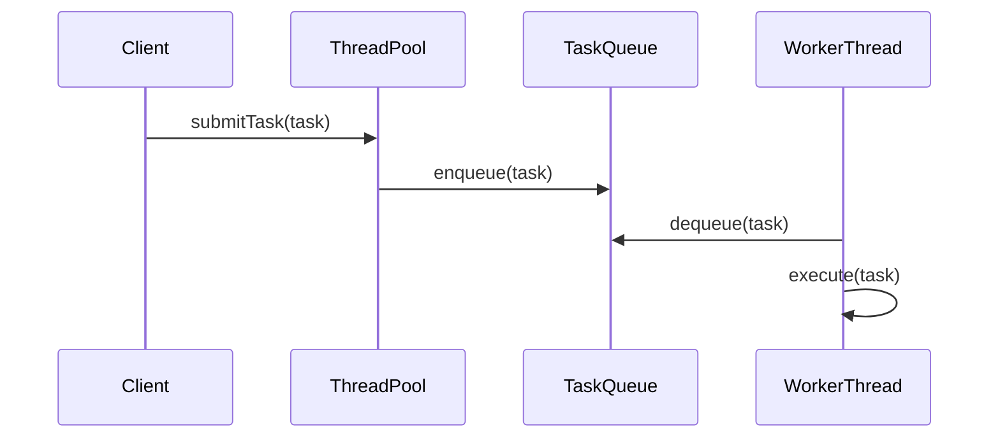

## 6.7. Thread Pool Pattern

Concurrency is a fundamental aspect of modern software development, enabling applications to perform multiple operations simultaneously. Among the various concurrency patterns, the Thread Pool Pattern stands out for its ability to efficiently manage and execute concurrent tasks. This section delves into the Thread Pool Pattern, exploring its intent, motivation, and implementation through detailed pseudocode examples.

### Intent and Motivation

The Thread Pool Pattern is a concurrency design pattern that aims to manage a pool of threads for executing tasks. Its primary intent is to optimize resource usage and improve application performance by reusing a fixed number of threads to execute multiple tasks. This pattern is particularly beneficial in scenarios where task creation and destruction overhead can degrade performance.

#### Key Benefits

1. **Resource Optimization**: By reusing threads, the Thread Pool Pattern minimizes the overhead associated with thread creation and destruction, leading to more efficient resource utilization.

2. **Improved Performance**: The pattern allows for concurrent execution of tasks, enhancing application responsiveness and throughput.

3. **Scalability**: Thread pools can be dynamically adjusted to handle varying workloads, making them suitable for scalable applications.

4. **Simplified Thread Management**: Developers can focus on task implementation without worrying about thread lifecycle management.

#### Use Cases

- **Web Servers**: Handling multiple client requests concurrently.
- **Database Connection Pools**: Managing a pool of database connections for efficient query execution.
- **Task Scheduling**: Executing scheduled tasks in parallel.

### Key Participants

The Thread Pool Pattern involves several key participants:

1. **Thread Pool**: Manages a collection of reusable threads for executing tasks.
2. **Task Queue**: Holds tasks waiting to be executed by the thread pool.
3. **Worker Threads**: Execute tasks from the task queue.
4. **Task**: Represents a unit of work to be executed by a worker thread.

### Applicability

The Thread Pool Pattern is applicable in scenarios where:

- Tasks are short-lived and frequent, making thread creation and destruction overhead significant.
- Resource constraints necessitate efficient thread management.
- Scalability and responsiveness are critical requirements.

### Pseudocode Implementation

Let's explore a pseudocode implementation of the Thread Pool Pattern. This example demonstrates how to create a basic thread pool, submit tasks, and execute them concurrently.

#### Thread Pool Initialization

The first step is to initialize the thread pool with a fixed number of worker threads.

```pseudocode
class ThreadPool:
    constructor(numThreads):
        this.taskQueue = new Queue()
        this.threads = new List()
        
        for i from 0 to numThreads:
            thread = new WorkerThread(this.taskQueue)
            this.threads.add(thread)
            thread.start()

    method submitTask(task):
        this.taskQueue.enqueue(task)
```

- **taskQueue**: A queue that holds tasks waiting to be executed.
- **threads**: A list of worker threads that execute tasks from the task queue.
- **submitTask**: Method to add tasks to the task queue.

#### Worker Thread Implementation

Worker threads continuously fetch and execute tasks from the task queue.

```pseudocode
class WorkerThread extends Thread:
    constructor(taskQueue):
        this.taskQueue = taskQueue
        this.isRunning = true

    method run():
        while this.isRunning:
            if not this.taskQueue.isEmpty():
                task = this.taskQueue.dequeue()
                task.execute()

    method stop():
        this.isRunning = false
```

- **run**: The main loop where the worker thread fetches and executes tasks.
- **stop**: Method to stop the worker thread gracefully.

#### Task Implementation

Tasks represent units of work to be executed by worker threads.

```pseudocode
class Task:
    method execute():
        // Implement task-specific logic here
```

- **execute**: Method where the task's logic is implemented.

### Visualizing the Thread Pool Pattern

To better understand the Thread Pool Pattern, let's visualize its components and interactions using a sequence diagram.



**Diagram Description**: This sequence diagram illustrates the interaction between the client, thread pool, task queue, and worker threads. The client submits a task to the thread pool, which enqueues it in the task queue. Worker threads dequeue tasks and execute them concurrently.

### Design Considerations

When implementing the Thread Pool Pattern, consider the following:

1. **Thread Pool Size**: Determine the optimal number of threads based on the application's workload and available resources. A pool that's too small may lead to underutilization, while a pool that's too large can cause resource contention.

2. **Task Queue Management**: Choose an appropriate data structure for the task queue. A blocking queue can be used to handle scenarios where tasks arrive faster than they can be executed.

3. **Graceful Shutdown**: Implement mechanisms to gracefully shut down the thread pool, ensuring all tasks are completed before terminating worker threads.

4. **Error Handling**: Ensure robust error handling within tasks and worker threads to prevent failures from affecting the entire pool.

### Differences and Similarities

The Thread Pool Pattern is often compared to other concurrency patterns, such as:

- **Producer-Consumer Pattern**: Both patterns involve task queues and worker threads. However, the Thread Pool Pattern focuses on reusing threads, while the Producer-Consumer Pattern emphasizes decoupling task production and consumption.

- **Future Pattern**: The Future Pattern deals with asynchronous task execution and result retrieval, whereas the Thread Pool Pattern manages concurrent task execution using a fixed number of threads.

### Try It Yourself

Experiment with the Thread Pool Pattern by modifying the pseudocode examples. Consider the following challenges:

1. **Dynamic Thread Pool**: Implement a thread pool that dynamically adjusts its size based on the workload.

2. **Task Prioritization**: Enhance the task queue to support task prioritization, ensuring high-priority tasks are executed first.

3. **Timeout Handling**: Add timeout handling to tasks, allowing worker threads to skip tasks that exceed a specified execution time.

### Knowledge Check

- What is the primary intent of the Thread Pool Pattern?
- How does the Thread Pool Pattern improve application performance?
- What are the key participants in the Thread Pool Pattern?
- How can you determine the optimal size for a thread pool?
- What are some common use cases for the Thread Pool Pattern?

### Summary

The Thread Pool Pattern is a powerful concurrency design pattern that optimizes resource usage and improves application performance by managing a pool of reusable threads. By understanding its intent, motivation, and implementation, developers can effectively leverage this pattern to build scalable and responsive applications. As you explore the Thread Pool Pattern, remember to experiment with different configurations and enhancements to tailor it to your specific needs.

## Quiz Time!



### What is the primary intent of the Thread Pool Pattern?

- [x] To manage a pool of threads for executing tasks efficiently.
- [ ] To create new threads for each task.
- [ ] To prioritize tasks based on their complexity.
- [ ] To handle errors in concurrent tasks.

> **Explanation:** The primary intent of the Thread Pool Pattern is to manage a pool of threads for executing tasks efficiently, minimizing the overhead associated with thread creation and destruction.

### Which component holds tasks waiting to be executed in the Thread Pool Pattern?

- [ ] Worker Thread
- [x] Task Queue
- [ ] Thread Pool
- [ ] Task

> **Explanation:** The Task Queue holds tasks waiting to be executed by the worker threads in the Thread Pool Pattern.

### How does the Thread Pool Pattern improve application performance?

- [x] By reusing threads to minimize creation and destruction overhead.
- [ ] By creating a new thread for each task.
- [ ] By executing tasks sequentially.
- [ ] By prioritizing tasks based on their size.

> **Explanation:** The Thread Pool Pattern improves application performance by reusing threads, which minimizes the overhead associated with creating and destroying threads for each task.

### What is a key consideration when implementing the Thread Pool Pattern?

- [x] Determining the optimal size of the thread pool.
- [ ] Ensuring each task has its own thread.
- [ ] Prioritizing tasks based on their complexity.
- [ ] Handling tasks sequentially.

> **Explanation:** A key consideration when implementing the Thread Pool Pattern is determining the optimal size of the thread pool to balance resource utilization and performance.

### Which pattern is often compared to the Thread Pool Pattern?

- [x] Producer-Consumer Pattern
- [ ] Singleton Pattern
- [ ] Observer Pattern
- [ ] Strategy Pattern

> **Explanation:** The Producer-Consumer Pattern is often compared to the Thread Pool Pattern, as both involve task queues and worker threads, but with different focuses.

### What is a common use case for the Thread Pool Pattern?

- [x] Handling multiple client requests concurrently in web servers.
- [ ] Managing a single task execution.
- [ ] Prioritizing tasks based on user input.
- [ ] Executing tasks in a single-threaded environment.

> **Explanation:** A common use case for the Thread Pool Pattern is handling multiple client requests concurrently in web servers, where efficient resource utilization is critical.

### How can you enhance the task queue in the Thread Pool Pattern?

- [x] By supporting task prioritization.
- [ ] By creating a new queue for each task.
- [ ] By executing tasks sequentially.
- [ ] By limiting the number of tasks.

> **Explanation:** You can enhance the task queue in the Thread Pool Pattern by supporting task prioritization, ensuring high-priority tasks are executed first.

### What is a benefit of using the Thread Pool Pattern?

- [x] Simplified thread management for developers.
- [ ] Increased complexity in task execution.
- [ ] Sequential task execution.
- [ ] Reduced application responsiveness.

> **Explanation:** A benefit of using the Thread Pool Pattern is simplified thread management for developers, allowing them to focus on task implementation without worrying about thread lifecycle management.

### What should be implemented for a graceful shutdown of the thread pool?

- [x] Mechanisms to ensure all tasks are completed before terminating worker threads.
- [ ] Immediate termination of all threads.
- [ ] Sequential execution of remaining tasks.
- [ ] Prioritization of tasks based on size.

> **Explanation:** For a graceful shutdown of the thread pool, mechanisms should be implemented to ensure all tasks are completed before terminating worker threads.

### The Thread Pool Pattern is suitable for tasks that are:

- [x] Short-lived and frequent.
- [ ] Long-running and infrequent.
- [ ] Sequential and infrequent.
- [ ] Complex and resource-intensive.

> **Explanation:** The Thread Pool Pattern is suitable for tasks that are short-lived and frequent, where the overhead of thread creation and destruction is significant.



Remember, mastering the Thread Pool Pattern is just the beginning. As you progress, you'll encounter more complex concurrency challenges. Keep experimenting, stay curious, and enjoy the journey!
