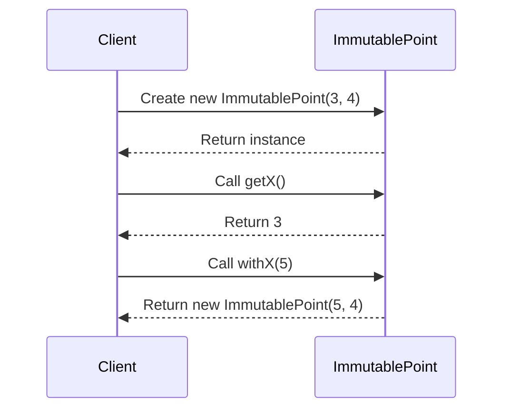

## 6.8. Immutable Pattern

In the realm of concurrent programming, managing shared data safely is a paramount concern. The Immutable Pattern offers a robust solution by ensuring that once data is created, it cannot be modified. This immutability guarantees thread safety, as multiple threads can access the data without the risk of race conditions or data corruption. Let's delve into the intent, motivation, and implementation of the Immutable Pattern, exploring how it can be effectively utilized across programming paradigms.

### Intent and Motivation

The primary intent of the Immutable Pattern is to create objects whose state cannot be altered after their creation. This immutability provides several advantages:

- **Thread Safety:** Immutable objects are inherently thread-safe. Since their state cannot change, they can be shared freely among threads without synchronization.
- **Predictability:** Immutable objects simplify reasoning about code, as their state remains consistent throughout their lifecycle.
- **Cache Efficiency:** Immutable objects can be cached without concern for stale data, as their state is fixed.

#### Why Immutability Matters

In concurrent environments, multiple threads often need to access shared data. Without proper synchronization, this can lead to race conditions, where the outcome depends on the sequence of thread execution. Immutability eliminates this risk by ensuring that shared data remains constant, allowing threads to read data without locks or other synchronization mechanisms.

### Key Participants

The Immutable Pattern involves several key participants:

- **Immutable Object:** The core participant whose state cannot change after creation.
- **Builder (Optional):** A helper that constructs complex immutable objects.
- **Factory Method:** A method that creates and returns immutable objects.

### Applicability

The Immutable Pattern is applicable in scenarios where:

- Data needs to be shared across multiple threads.
- Consistency and predictability of data are crucial.
- Performance is a concern, and avoiding locks can enhance efficiency.

### Pseudocode Implementation

Let's explore a pseudocode implementation of the Immutable Pattern. We'll create an immutable `Point` class representing a point in a 2D space.

```pseudocode
class ImmutablePoint:
    // Private variables to store coordinates
    private x
    private y

    // Constructor to initialize the point
    function __init__(x, y):
        this.x = x
        this.y = y

    // Getter for x-coordinate
    function getX():
        return this.x

    // Getter for y-coordinate
    function getY():
        return this.y

    // Method to create a new point with modified x-coordinate
    function withX(newX):
        return new ImmutablePoint(newX, this.y)

    // Method to create a new point with modified y-coordinate
    function withY(newY):
        return new ImmutablePoint(this.x, newY)
```

#### Explanation

- **Immutable Fields:** The `x` and `y` fields are private and not exposed for modification.
- **Constructor:** The constructor initializes the fields, and they cannot be changed afterward.
- **Getters:** Provide access to the fields without allowing modification.
- **Modification Methods:** Instead of modifying the object, methods like `withX` and `withY` return a new instance with the desired changes.

### Design Considerations

When using the Immutable Pattern, consider the following:

- **Memory Usage:** Immutable objects can lead to increased memory usage, as new instances are created for modifications.
- **Complexity:** For complex objects, consider using a builder pattern to simplify construction.
- **Performance:** While immutability can enhance performance by avoiding locks, the overhead of creating new instances should be considered.

### Differences and Similarities

The Immutable Pattern is often compared with the Singleton Pattern, as both ensure a consistent state. However, while Singleton focuses on a single instance, Immutable emphasizes unchangeable state. Additionally, the Immutable Pattern shares similarities with the Flyweight Pattern, where shared state is reused to save memory.

### Visualizing Immutability

To better understand the Immutable Pattern, let's visualize the creation and modification of an immutable object using a sequence diagram.



**Diagram Description:** This sequence diagram illustrates the creation of an `ImmutablePoint` object and accessing its properties. The `withX` method demonstrates how a new instance is created for modifications, maintaining immutability.

### Try It Yourself

Experiment with the pseudocode by modifying the `ImmutablePoint` class:

- Add a method to change both `x` and `y` simultaneously.
- Implement a `toString` method to print the point's coordinates.
- Create a `distanceTo` method to calculate the distance between two points.

### Real-World Applications

Immutability is widely used in functional programming languages like Haskell and Scala, where data immutability is a core principle. In object-oriented languages, immutability is often employed in value objects, configuration settings, and data transfer objects (DTOs).

### References and Links

For further reading on immutability and its benefits, consider the following resources:

- [Java's Immutable Objects](https://docs.oracle.com/javase/tutorial/essential/concurrency/imstrat.html)
- [Functional Programming in Scala](https://www.scala-lang.org/)

### Knowledge Check

- Why is immutability important in concurrent programming?
- How does the Immutable Pattern ensure thread safety?
- What are the trade-offs of using immutable objects?

### Embrace the Journey

Remember, mastering the Immutable Pattern is just the beginning. As you continue your journey in software development, you'll encounter more complex scenarios where immutability can be a powerful tool. Keep experimenting, stay curious, and enjoy the journey!

## Quiz Time!



### What is the primary benefit of using the Immutable Pattern in concurrent programming?

- [x] Ensures thread safety by preventing data modification
- [ ] Reduces memory usage by sharing instances
- [ ] Simplifies code by eliminating constructors
- [ ] Enhances performance by using locks

> **Explanation:** The Immutable Pattern ensures thread safety by preventing data modification, allowing multiple threads to access data without synchronization.

### How does the Immutable Pattern handle modifications to an object's state?

- [x] By creating a new instance with the modified state
- [ ] By using locks to synchronize access
- [ ] By modifying the existing instance directly
- [ ] By caching the modified state

> **Explanation:** The Immutable Pattern handles modifications by creating a new instance with the desired changes, maintaining the original object's state.

### Which of the following is a key participant in the Immutable Pattern?

- [x] Immutable Object
- [ ] Singleton Instance
- [ ] Adapter Class
- [ ] Proxy Object

> **Explanation:** The Immutable Object is the core participant in the Immutable Pattern, representing an object whose state cannot change.

### What is a potential drawback of using immutable objects?

- [x] Increased memory usage due to new instance creation
- [ ] Difficulty in reasoning about code
- [ ] Complexity in managing shared data
- [ ] Risk of stale data in caches

> **Explanation:** Immutable objects can lead to increased memory usage, as new instances are created for modifications.

### Which pattern is often compared with the Immutable Pattern due to its consistent state?

- [x] Singleton Pattern
- [ ] Factory Method Pattern
- [ ] Decorator Pattern
- [ ] Observer Pattern

> **Explanation:** The Singleton Pattern is often compared with the Immutable Pattern, as both ensure a consistent state.

### What is the role of a Builder in the Immutable Pattern?

- [x] To construct complex immutable objects
- [ ] To manage shared data safely
- [ ] To synchronize access to objects
- [ ] To provide caching for immutable objects

> **Explanation:** A Builder is used to construct complex immutable objects, simplifying their creation.

### In which programming paradigm is immutability a core principle?

- [x] Functional Programming
- [ ] Object-Oriented Programming
- [ ] Procedural Programming
- [ ] Concurrent Programming

> **Explanation:** Immutability is a core principle in Functional Programming, where data is typically immutable.

### What is a similarity between the Immutable Pattern and the Flyweight Pattern?

- [x] Both involve sharing state to save memory
- [ ] Both ensure a single instance of an object
- [ ] Both use locks for synchronization
- [ ] Both modify objects directly

> **Explanation:** The Immutable and Flyweight Patterns both involve sharing state to save memory, although they achieve this in different ways.

### True or False: Immutable objects can be modified after their creation.

- [ ] True
- [x] False

> **Explanation:** False. Immutable objects cannot be modified after their creation, ensuring their state remains constant.

### What is a common use case for immutable objects in object-oriented languages?

- [x] Configuration settings
- [ ] Dynamic data structures
- [ ] Real-time data processing
- [ ] Network communication

> **Explanation:** Immutable objects are commonly used for configuration settings, where consistency and predictability are crucial.


