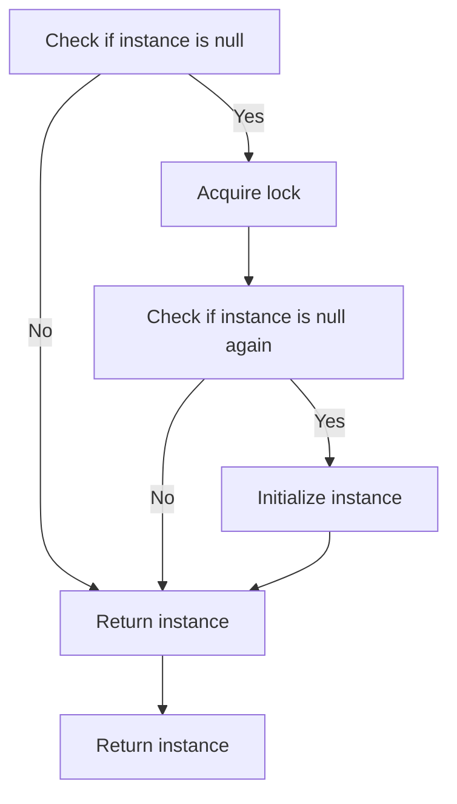

## 6.9. Double-Checked Locking

Concurrency is a fundamental aspect of modern software development, allowing programs to perform multiple tasks simultaneously. However, managing concurrent operations can be challenging, especially when it comes to ensuring thread safety and efficiency. One pattern that addresses these challenges is Double-Checked Locking (DCL). In this section, we will delve into the intricacies of Double-Checked Locking, exploring its intent, motivation, pseudocode implementation, pitfalls, and best practices.

### Intent and Motivation

The primary intent of the Double-Checked Locking pattern is to reduce the overhead of acquiring a lock by first testing the locking criterion (e.g., whether the resource is initialized) without actually acquiring the lock. Only if the criterion is not met, the lock is acquired, and the criterion is checked again. This pattern is particularly useful in scenarios where lazy initialization is required in a multithreaded environment.

#### Lazy Initialization in Multithreading

Lazy initialization is a design pattern that defers the creation of an object until it is needed. This can be beneficial in optimizing resource usage and improving performance, especially when the initialization of the object is costly. However, in a multithreaded environment, lazy initialization can lead to race conditions if not handled properly. Double-Checked Locking aims to address this by ensuring that the object is initialized only once and that subsequent accesses to the object do not incur the cost of synchronization.

### Pseudocode Implementation

Let's explore how Double-Checked Locking can be implemented using pseudocode. The following example demonstrates a typical scenario where a singleton instance is lazily initialized using Double-Checked Locking.

```pseudocode
class Singleton {
    private static volatile instance = null

    // Private constructor to prevent instantiation
    private Singleton() {}

    public static Singleton getInstance() {
        if (instance == null) { // First check (no locking)
            synchronized(Singleton.class) {
                if (instance == null) { // Second check (with locking)
                    instance = new Singleton()
                }
            }
        }
        return instance
    }
}
```

#### Explanation of the Pseudocode

1. **Volatile Keyword**: The `volatile` keyword ensures that changes to the `instance` variable are visible to all threads. This is crucial for preventing subtle bugs related to instruction reordering by the compiler or processor.

2. **First Check**: The first `if` statement checks if the `instance` is `null`. This is done without acquiring a lock to avoid unnecessary synchronization overhead when the instance is already initialized.

3. **Synchronization Block**: If the `instance` is `null`, a lock is acquired on the class. This ensures that only one thread can initialize the instance at a time.

4. **Second Check**: Inside the synchronized block, the `instance` is checked again. This second check is necessary because another thread might have initialized the instance between the first check and acquiring the lock.

5. **Initialization**: If the `instance` is still `null`, it is initialized. This ensures that the instance is created only once.

### Pitfalls and Best Practices

While Double-Checked Locking is a powerful pattern, it is not without its pitfalls. Understanding these pitfalls and following best practices can help you implement this pattern effectively.

#### Pitfalls

1. **Complexity**: Double-Checked Locking adds complexity to the code, making it harder to read and maintain. This complexity can lead to subtle bugs if not implemented correctly.

2. **Volatile Misuse**: Failing to use the `volatile` keyword can result in unexpected behavior due to instruction reordering. Without `volatile`, the `instance` variable may appear initialized to one thread but not to another.

3. **Performance Overhead**: While Double-Checked Locking reduces the overhead of synchronization, it still incurs some performance cost due to the checks and the use of `volatile`.

4. **Platform-Specific Issues**: Some platforms and older Java versions had issues with Double-Checked Locking due to the Java Memory Model. Ensure that your platform supports this pattern correctly.

#### Best Practices

1. **Use Modern Languages**: Modern programming languages and platforms have improved support for Double-Checked Locking. Ensure that you are using a version that supports this pattern correctly.

2. **Consider Alternatives**: In some cases, other patterns like Initialization-on-Demand Holder Idiom or using language-specific features like `std::call_once` in C++ may be more appropriate.

3. **Test Thoroughly**: Due to the complexity of multithreading, thoroughly test your implementation to ensure thread safety and correctness.

4. **Keep It Simple**: If the performance benefits of Double-Checked Locking are negligible, consider using simpler synchronization mechanisms.

### Visualizing Double-Checked Locking

To better understand the flow of Double-Checked Locking, let's visualize the process using a flowchart. This diagram illustrates the decision-making process involved in checking and initializing the singleton instance.



**Diagram Description**: This flowchart represents the Double-Checked Locking process. It begins with checking if the instance is `null`. If it is, a lock is acquired, and the instance is checked again. If it is still `null`, the instance is initialized. Finally, the instance is returned.

### Differences and Similarities with Other Patterns

Double-Checked Locking is often compared to other patterns and techniques used for lazy initialization and thread safety. Understanding these differences and similarities can help you choose the right pattern for your needs.

#### Differences

- **Initialization-on-Demand Holder Idiom**: This idiom is a simpler and more efficient alternative to Double-Checked Locking in Java. It leverages the class loader to ensure thread safety without explicit synchronization.

- **Synchronized Method**: Using a synchronized method for lazy initialization is simpler but incurs synchronization overhead on every access, unlike Double-Checked Locking, which minimizes this overhead.

#### Similarities

- **Lazy Initialization**: Both Double-Checked Locking and Initialization-on-Demand Holder Idiom are used for lazy initialization, ensuring that the object is created only when needed.

- **Thread Safety**: Both patterns ensure thread safety in a multithreaded environment, preventing race conditions during initialization.

### Try It Yourself

To deepen your understanding of Double-Checked Locking, try modifying the pseudocode example to handle different scenarios. For instance, experiment with removing the `volatile` keyword and observe the potential issues that arise. Additionally, consider implementing the pattern in a different programming language and compare the differences in syntax and behavior.

### Knowledge Check

Let's reinforce your understanding of Double-Checked Locking with a few questions:

1. What is the primary intent of Double-Checked Locking?
2. Why is the `volatile` keyword important in Double-Checked Locking?
3. What are the potential pitfalls of using Double-Checked Locking?
4. How does Double-Checked Locking differ from the Initialization-on-Demand Holder Idiom?
5. What are some best practices for implementing Double-Checked Locking?

### Conclusion

Double-Checked Locking is a valuable pattern for achieving lazy initialization in a multithreaded environment while minimizing synchronization overhead. By understanding its intent, implementation, pitfalls, and best practices, you can effectively apply this pattern to your software designs. Remember, mastering concurrency patterns like Double-Checked Locking is an ongoing journey. Keep experimenting, stay curious, and enjoy the process of learning and improving your software development skills.

## Quiz Time!



### What is the primary intent of Double-Checked Locking?

- [x] To reduce synchronization overhead by checking the locking criterion before acquiring a lock.
- [ ] To ensure that only one instance of a class is created.
- [ ] To improve the performance of single-threaded applications.
- [ ] To simplify the implementation of lazy initialization.

> **Explanation:** The primary intent of Double-Checked Locking is to reduce synchronization overhead by checking the locking criterion before acquiring a lock, ensuring that the lock is only acquired when necessary.

### Why is the `volatile` keyword important in Double-Checked Locking?

- [x] It ensures visibility of changes to the variable across threads.
- [ ] It prevents the variable from being modified.
- [ ] It allows the variable to be accessed by multiple threads simultaneously.
- [ ] It improves the performance of the code.

> **Explanation:** The `volatile` keyword ensures that changes to the variable are visible to all threads, preventing issues related to instruction reordering.

### What is a potential pitfall of using Double-Checked Locking?

- [x] Complexity and potential for subtle bugs.
- [ ] It always results in slower performance.
- [ ] It cannot be used in modern programming languages.
- [ ] It requires a large amount of memory.

> **Explanation:** Double-Checked Locking adds complexity to the code, which can lead to subtle bugs if not implemented correctly.

### How does Double-Checked Locking differ from the Initialization-on-Demand Holder Idiom?

- [x] Double-Checked Locking uses explicit synchronization, while Initialization-on-Demand Holder Idiom relies on the class loader.
- [ ] Double-Checked Locking is simpler to implement.
- [ ] Initialization-on-Demand Holder Idiom is not thread-safe.
- [ ] Double-Checked Locking is only applicable in single-threaded environments.

> **Explanation:** Double-Checked Locking uses explicit synchronization to ensure thread safety, while Initialization-on-Demand Holder Idiom leverages the class loader to achieve the same without explicit synchronization.

### Which of the following is a best practice for implementing Double-Checked Locking?

- [x] Use the `volatile` keyword for the instance variable.
- [ ] Avoid using synchronization altogether.
- [ ] Always use Double-Checked Locking, regardless of the situation.
- [ ] Use an older version of Java for better compatibility.

> **Explanation:** Using the `volatile` keyword for the instance variable is a best practice to ensure visibility of changes across threads.

### What is the role of the first check in Double-Checked Locking?

- [x] To avoid unnecessary synchronization when the instance is already initialized.
- [ ] To initialize the instance if it is `null`.
- [ ] To acquire a lock for thread safety.
- [ ] To ensure that the instance is always `null`.

> **Explanation:** The first check in Double-Checked Locking is performed without acquiring a lock to avoid unnecessary synchronization when the instance is already initialized.

### What is the significance of the second check in Double-Checked Locking?

- [x] To ensure that the instance is still `null` after acquiring the lock.
- [ ] To release the lock after initialization.
- [ ] To improve the performance of the code.
- [ ] To initialize the instance without synchronization.

> **Explanation:** The second check ensures that the instance is still `null` after acquiring the lock, preventing multiple initializations.

### Which of the following is a similarity between Double-Checked Locking and Initialization-on-Demand Holder Idiom?

- [x] Both ensure lazy initialization.
- [ ] Both require explicit synchronization.
- [ ] Both are only applicable in single-threaded environments.
- [ ] Both are used to improve the performance of single-threaded applications.

> **Explanation:** Both Double-Checked Locking and Initialization-on-Demand Holder Idiom ensure lazy initialization, creating the object only when needed.

### What is a potential issue with failing to use the `volatile` keyword in Double-Checked Locking?

- [x] Instruction reordering may cause unexpected behavior.
- [ ] The instance will always be `null`.
- [ ] The code will not compile.
- [ ] The performance will improve.

> **Explanation:** Failing to use the `volatile` keyword can lead to instruction reordering, causing unexpected behavior where the instance appears initialized to one thread but not to another.

### True or False: Double-Checked Locking is only applicable in Java.

- [ ] True
- [x] False

> **Explanation:** Double-Checked Locking is not limited to Java; it can be implemented in various programming languages that support multithreading and synchronization.


