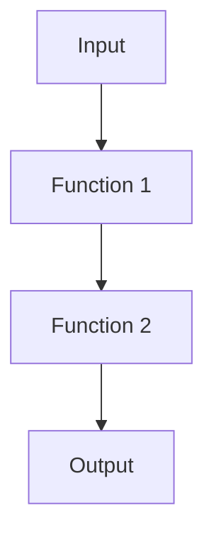
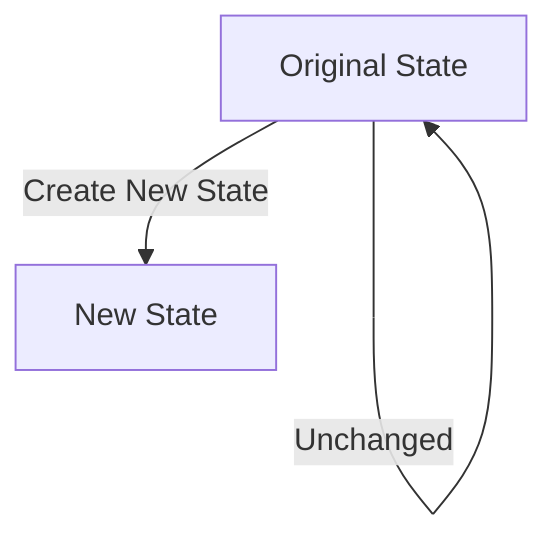

## 7.1. Introduction to Functional Programming

Functional Programming (FP) is a programming paradigm that treats computation as the evaluation of mathematical functions and avoids changing state and mutable data. This approach to programming offers a different perspective compared to the more traditional Object-Oriented Programming (OOP) paradigm. In this section, we will delve into the principles of FP, explore its core concepts, and highlight the differences from OOP, providing you with a comprehensive understanding of how FP can be leveraged to write clean, efficient, and maintainable code.

### Principles of Functional Programming

Functional programming is built upon several key principles that distinguish it from other programming paradigms. Let's explore these principles in detail:

#### 1. Immutability

Immutability is a cornerstone of functional programming. It refers to the concept that once a data structure is created, it cannot be changed. Instead of modifying existing data, new data structures are created. This approach leads to safer and more predictable code, as it eliminates side effects and makes it easier to reason about the program's behavior.

**Example:**

```pseudocode
// Define an immutable list
let numbers = [1, 2, 3, 4, 5]

// Create a new list by adding a number
let newNumbers = append(numbers, 6)

// Original list remains unchanged
```

In this example, the original list `numbers` remains unchanged when a new number is added, demonstrating the concept of immutability.

#### 2. Pure Functions

A pure function is a function where the output value is determined only by its input values, without observable side effects. This means that a pure function will always produce the same output given the same inputs, making it predictable and easier to test.

**Example:**

```pseudocode
// Define a pure function
function add(a, b) {
    return a + b
}

// Calling the function with the same inputs always returns the same result
let result = add(2, 3) // result is 5
```

Pure functions are a fundamental building block of functional programming, as they promote code that is easy to understand and maintain.

#### 3. First-Class and Higher-Order Functions

In functional programming, functions are first-class citizens, meaning they can be passed as arguments to other functions, returned as values from functions, and assigned to variables. Higher-order functions are functions that take other functions as arguments or return them as results.

**Example:**

```pseudocode
// Define a higher-order function
function applyFunction(func, value) {
    return func(value)
}

// Define a simple function
function square(x) {
    return x * x
}

// Use the higher-order function
let squaredValue = applyFunction(square, 5) // squaredValue is 25
```

This example illustrates how higher-order functions can be used to create flexible and reusable code.

#### 4. Function Composition

Function composition is the process of combining two or more functions to produce a new function. This allows for the creation of complex operations by chaining simple functions together.

**Example:**

```pseudocode
// Define two simple functions
function double(x) {
    return x * 2
}

function increment(x) {
    return x + 1
}

// Compose the functions
function doubleThenIncrement(x) {
    return increment(double(x))
}

let result = doubleThenIncrement(3) // result is 7
```

Function composition is a powerful tool in functional programming, enabling the construction of complex operations from simple, reusable functions.

#### 5. Declarative Programming

Functional programming emphasizes a declarative style of programming, where the focus is on what to do rather than how to do it. This contrasts with imperative programming, which focuses on explicit instructions to change the program's state.

**Example:**

```pseudocode
// Declarative approach to filtering a list
let numbers = [1, 2, 3, 4, 5]
let evenNumbers = filter(numbers, isEven)

// Imperative approach
let evenNumbers = []
for (let i = 0; i < numbers.length; i++) {
    if (isEven(numbers[i])) {
        evenNumbers.push(numbers[i])
    }
}
```

The declarative approach is often more concise and easier to read, as it abstracts away the details of the underlying implementation.

### Differences from Object-Oriented Programming

While both functional programming and object-oriented programming aim to improve code quality and maintainability, they do so through different means. Let's explore some key differences between these two paradigms:

#### 1. State Management

- **Functional Programming:** Emphasizes immutability and stateless functions. State is managed through function arguments and return values, leading to code that is easier to reason about and test.
- **Object-Oriented Programming:** Encapsulates state within objects, which can be modified through methods. This can lead to more complex state management, especially in large systems.

#### 2. Code Structure

- **Functional Programming:** Focuses on composing functions to build complex operations. Code is often more concise and expressive, with a focus on what the program should accomplish.
- **Object-Oriented Programming:** Organizes code around objects and classes, with a focus on modeling real-world entities and their interactions.

#### 3. Side Effects

- **Functional Programming:** Avoids side effects by using pure functions, leading to more predictable and reliable code.
- **Object-Oriented Programming:** Allows side effects through methods that modify object state, which can introduce complexity and make testing more challenging.

#### 4. Reusability

- **Functional Programming:** Encourages the use of higher-order functions and function composition, promoting code reuse and modularity.
- **Object-Oriented Programming:** Achieves reusability through inheritance and polymorphism, which can lead to tightly coupled code if not managed carefully.

### Visualizing Functional Programming Concepts

To better understand the concepts of functional programming, let's visualize some of the key ideas using diagrams.

#### Function Composition Diagram



**Caption:** This diagram illustrates the concept of function composition, where the output of one function becomes the input to the next, creating a pipeline of operations.

#### Immutability and State Management



**Caption:** This diagram demonstrates the principle of immutability, where the original state remains unchanged, and a new state is created when modifications are needed.

### Try It Yourself

To solidify your understanding of functional programming, try modifying the code examples provided. Experiment with creating your own pure functions, higher-order functions, and function compositions. Consider how these concepts can be applied to solve real-world problems in your projects.

### Further Reading

For more information on functional programming, consider exploring the following resources:

- [MDN Web Docs: Functional Programming](https://developer.mozilla.org/en-US/docs/Glossary/Functional_programming)
- [W3Schools: Functional Programming](https://www.w3schools.com/whatis/whatis_functional_programming.asp)

### Knowledge Check

To reinforce your understanding of functional programming, consider the following questions:

- What are the benefits of using pure functions in your code?
- How does immutability contribute to the reliability of a program?
- In what scenarios might you choose functional programming over object-oriented programming?

### Embrace the Journey

As you explore functional programming, remember that this is just the beginning. The principles and techniques you've learned here can be applied to a wide range of programming challenges. Keep experimenting, stay curious, and enjoy the journey of mastering functional programming!

## Quiz Time!



### What is a key characteristic of functional programming?

- [x] Immutability
- [ ] Mutable state
- [ ] Object encapsulation
- [ ] Inheritance

> **Explanation:** Immutability is a core principle of functional programming, emphasizing that data structures should not be changed after they are created.

### Which of the following is a pure function?

- [x] A function that returns the same output for the same input without side effects
- [ ] A function that modifies global variables
- [ ] A function that reads from a file
- [ ] A function that writes to a database

> **Explanation:** A pure function is one that consistently produces the same output for the same input and does not cause any side effects.

### What is the purpose of higher-order functions in functional programming?

- [x] To take other functions as arguments or return them as results
- [ ] To modify object state
- [ ] To encapsulate data
- [ ] To manage inheritance

> **Explanation:** Higher-order functions are a fundamental concept in functional programming, allowing functions to be passed around and composed.

### How does functional programming differ from object-oriented programming in terms of state management?

- [x] Functional programming emphasizes immutability and stateless functions
- [ ] Functional programming uses mutable state within objects
- [ ] Functional programming relies on class hierarchies
- [ ] Functional programming uses inheritance to manage state

> **Explanation:** Functional programming focuses on immutability and stateless functions, contrasting with the mutable state often found in object-oriented programming.

### What is function composition?

- [x] Combining two or more functions to create a new function
- [ ] Modifying an object's state
- [ ] Encapsulating data within a class
- [ ] Inheriting behavior from a parent class

> **Explanation:** Function composition involves combining multiple functions to form a new function, allowing for complex operations to be built from simple ones.

### Which of the following is a benefit of using pure functions?

- [x] Predictable and reliable code
- [ ] Increased complexity
- [ ] More side effects
- [ ] Greater difficulty in testing

> **Explanation:** Pure functions lead to predictable and reliable code, as they always produce the same output for the same input without side effects.

### What is a common advantage of using immutability in functional programming?

- [x] Easier reasoning about code behavior
- [ ] Increased risk of side effects
- [ ] More complex state management
- [ ] Greater difficulty in understanding code

> **Explanation:** Immutability simplifies reasoning about code behavior, as data structures do not change, reducing the risk of side effects.

### What is a declarative programming style?

- [x] Focusing on what to do rather than how to do it
- [ ] Providing explicit instructions to change state
- [ ] Encapsulating data within objects
- [ ] Using inheritance to share behavior

> **Explanation:** Declarative programming emphasizes describing what the program should accomplish, rather than detailing the steps to achieve it.

### True or False: In functional programming, functions cannot be passed as arguments to other functions.

- [ ] True
- [x] False

> **Explanation:** In functional programming, functions are first-class citizens and can be passed as arguments to other functions.

### True or False: Functional programming and object-oriented programming cannot be used together.

- [ ] True
- [x] False

> **Explanation:** Functional programming and object-oriented programming can be combined, allowing developers to leverage the strengths of both paradigms.



As you continue your journey in mastering functional programming, remember that practice is key. Experiment with the concepts and techniques you've learned, and explore how they can be applied to your own projects. Keep learning, stay curious, and enjoy the process of becoming a more versatile and skilled developer!
