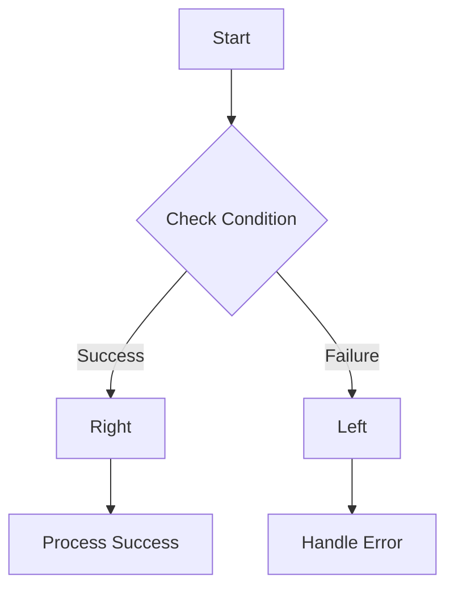
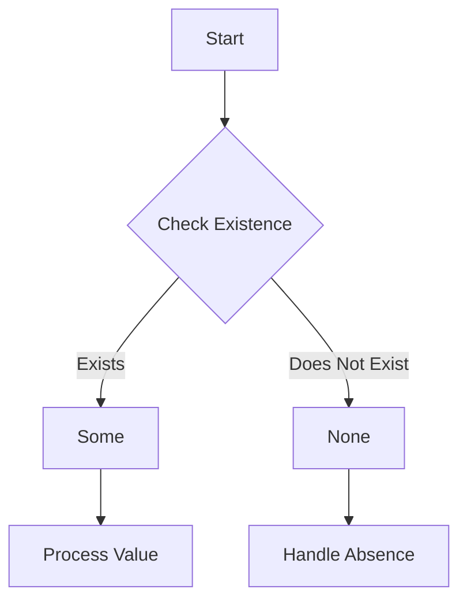

## 7.10. Error Handling in Functional Programming

Error handling is a critical aspect of software development, and functional programming offers unique approaches to managing errors effectively. In this section, we will delve into the concepts of error handling in functional programming, focusing on the use of `Either` and `Option` types. These types provide a robust mechanism for handling errors without resorting to exceptions, which can be cumbersome and error-prone.

### Introduction to Error Handling in Functional Programming

Functional programming (FP) emphasizes immutability, pure functions, and the use of higher-order functions. In this paradigm, error handling is approached differently compared to imperative programming. Instead of using exceptions, FP relies on types like `Either` and `Option` to represent computations that may fail.

#### Why Avoid Exceptions?

Exceptions are a common way to handle errors in many programming languages. However, they have several drawbacks:

- **Non-local Control Flow:** Exceptions can disrupt the normal flow of a program, making it difficult to understand and reason about the code.
- **Implicit Error Handling:** Exceptions are often handled implicitly, which can lead to missed errors if not properly managed.
- **Side Effects:** Throwing and catching exceptions can introduce side effects, which contradicts the principles of functional programming.

In contrast, functional programming promotes explicit error handling, where errors are treated as first-class citizens. This approach makes error handling more predictable and easier to manage.

### Using Either Type for Error Handling

The `Either` type is a powerful tool for handling errors in functional programming. It represents a value that can be one of two possible types: a success value or an error value. This dual nature makes it ideal for computations that may fail.

#### Structure of Either Type

The `Either` type is typically defined as follows:

```pseudocode
Either<L, R> = Left<L> | Right<R>
```

- **Left<L>:** Represents an error or failure, containing a value of type `L`.
- **Right<R>:** Represents a success, containing a value of type `R`.

This structure allows developers to handle errors and successes explicitly, without relying on exceptions.

#### Implementing Either Type

Let's implement a simple `Either` type in pseudocode:

```pseudocode
class Either
    method isLeft(): Boolean
    method isRight(): Boolean
    method map(func): Either
    method flatMap(func): Either

class Left extends Either
    constructor(value)
        this.value = value

    method isLeft(): Boolean
        return true

    method isRight(): Boolean
        return false

    method map(func): Either
        return this

    method flatMap(func): Either
        return this

class Right extends Either
    constructor(value)
        this.value = value

    method isLeft(): Boolean
        return false

    method isRight(): Boolean
        return true

    method map(func): Either
        return Right(func(this.value))

    method flatMap(func): Either
        return func(this.value)
```

In this implementation, `Left` and `Right` are subclasses of `Either`. The `map` and `flatMap` methods allow for function application on the contained value, enabling chaining of operations.

#### Using Either for Error Handling

Consider a function that divides two numbers, which may fail if the divisor is zero:

```pseudocode
function divide(numerator, denominator): Either
    if denominator == 0
        return Left("Division by zero error")
    else
        return Right(numerator / denominator)
```

With the `Either` type, we can handle the result explicitly:

```pseudocode
result = divide(10, 0)

if result.isLeft()
    print("Error: " + result.value)
else
    print("Result: " + result.value)
```

This approach makes error handling explicit and predictable, avoiding the pitfalls of exceptions.

### Using Option Type for Error Handling

The `Option` type is another tool for handling errors, particularly when dealing with optional values. It represents a value that may or may not be present.

#### Structure of Option Type

The `Option` type is defined as follows:

```pseudocode
Option<T> = Some<T> | None
```

- **Some<T>:** Represents a value of type `T`.
- **None:** Represents the absence of a value.

This type is useful for functions that may not return a value, such as searching for an element in a collection.

#### Implementing Option Type

Let's implement a simple `Option` type in pseudocode:

```pseudocode
class Option
    method isSome(): Boolean
    method isNone(): Boolean
    method map(func): Option
    method flatMap(func): Option

class Some extends Option
    constructor(value)
        this.value = value

    method isSome(): Boolean
        return true

    method isNone(): Boolean
        return false

    method map(func): Option
        return Some(func(this.value))

    method flatMap(func): Option
        return func(this.value)

class None extends Option
    method isSome(): Boolean
        return false

    method isNone(): Boolean
        return true

    method map(func): Option
        return this

    method flatMap(func): Option
        return this
```

In this implementation, `Some` and `None` are subclasses of `Option`. The `map` and `flatMap` methods allow for function application on the contained value, similar to `Either`.

#### Using Option for Error Handling

Consider a function that searches for an element in a list:

```pseudocode
function findElement(list, element): Option
    for each item in list
        if item == element
            return Some(item)
    return None
```

With the `Option` type, we can handle the result explicitly:

```pseudocode
result = findElement([1, 2, 3], 4)

if result.isSome()
    print("Found: " + result.value)
else
    print("Element not found")
```

This approach makes handling optional values explicit and clear.

### Functional Exception Handling

Functional programming provides several techniques for handling exceptions in a functional way. These techniques emphasize immutability and pure functions, avoiding side effects.

#### Using Higher-Order Functions

Higher-order functions are functions that take other functions as arguments or return them as results. They can be used to handle errors functionally.

Consider a function that applies a transformation to a list of numbers, handling errors gracefully:

```pseudocode
function transformList(list, transformFunc): List
    return list.map(item -> {
        try
            return transformFunc(item)
        catch (error)
            return "Error: " + error.message
    })
```

In this example, the `transformList` function applies `transformFunc` to each item in the list, catching any errors and returning an error message.

#### Using Monads for Error Handling

Monads are a powerful abstraction in functional programming, providing a way to handle errors and side effects. The `Either` and `Option` types are examples of monads.

Monads allow for chaining of operations, handling errors seamlessly. Consider a series of operations that may fail:

```pseudocode
function process(data): Either
    return validate(data)
        .flatMap(validData -> transform(validData))
        .flatMap(transformedData -> save(transformedData))
```

In this example, each operation returns an `Either` type, allowing for chaining of operations. If any operation fails, the error is propagated through the chain.

### Visualizing Error Handling with Either and Option Types

To better understand how `Either` and `Option` types work, let's visualize their flow using Mermaid.js diagrams.

#### Either Type Flow



**Caption:** This diagram illustrates the flow of the `Either` type, where a computation can result in either a `Right` (success) or a `Left` (failure).

#### Option Type Flow



**Caption:** This diagram illustrates the flow of the `Option` type, where a value may be present (`Some`) or absent (`None`).

### Try It Yourself

Experiment with the `Either` and `Option` types by modifying the pseudocode examples. Try implementing additional methods, such as `filter`, to further explore their capabilities.

### Key Takeaways

- Functional programming offers explicit error handling through types like `Either` and `Option`.
- These types provide a robust mechanism for handling errors without exceptions.
- Higher-order functions and monads facilitate functional exception handling.
- Visualizing error handling flows can aid in understanding these concepts.

### Further Reading

For more information on functional programming and error handling, consider the following resources:

- [Functional Programming in Scala](https://www.manning.com/books/functional-programming-in-scala)
- [Haskell Programming from First Principles](https://haskellbook.com/)
- [Learn You a Haskell for Great Good!](http://learnyouahaskell.com/)

## Quiz Time!



### What is the primary advantage of using Either and Option types for error handling in functional programming?

- [x] They provide explicit error handling without exceptions.
- [ ] They allow for implicit error handling.
- [ ] They are faster than exceptions.
- [ ] They require less code.

> **Explanation:** Either and Option types provide explicit error handling, making errors first-class citizens and avoiding the pitfalls of exceptions.

### How does the Either type represent errors and successes?

- [x] Left represents errors, and Right represents successes.
- [ ] Right represents errors, and Left represents successes.
- [ ] Both Left and Right represent errors.
- [ ] Both Left and Right represent successes.

> **Explanation:** In the Either type, Left represents an error or failure, while Right represents a success.

### What is the purpose of the map method in the Either and Option types?

- [x] To apply a function to the contained value if it exists.
- [ ] To handle errors in the contained value.
- [ ] To convert the contained value to a different type.
- [ ] To remove the contained value.

> **Explanation:** The map method applies a function to the contained value if it exists, allowing for chaining of operations.

### In the Option type, what does Some represent?

- [x] A value that is present.
- [ ] An error that occurred.
- [ ] The absence of a value.
- [ ] A default value.

> **Explanation:** In the Option type, Some represents a value that is present, while None represents the absence of a value.

### What is a common use case for the Option type?

- [x] Handling optional values that may or may not be present.
- [ ] Handling exceptions in imperative programming.
- [ ] Representing errors in network communication.
- [ ] Managing state transitions in state machines.

> **Explanation:** The Option type is commonly used to handle optional values that may or may not be present, such as searching for an element in a collection.

### How do higher-order functions facilitate functional exception handling?

- [x] By allowing functions to be passed as arguments or returned as results.
- [ ] By providing built-in error handling mechanisms.
- [ ] By automatically catching exceptions.
- [ ] By simplifying the syntax of error handling.

> **Explanation:** Higher-order functions facilitate functional exception handling by allowing functions to be passed as arguments or returned as results, enabling flexible error handling strategies.

### What is a Monad in functional programming?

- [x] An abstraction that allows for chaining of operations and handling of side effects.
- [ ] A type that represents optional values.
- [ ] A function that handles errors.
- [ ] A data structure for storing values.

> **Explanation:** A Monad is an abstraction in functional programming that allows for chaining of operations and handling of side effects, such as error handling with Either and Option types.

### Which of the following is a benefit of using functional exception handling?

- [x] It avoids side effects and promotes immutability.
- [ ] It simplifies the syntax of error handling.
- [ ] It provides implicit error handling.
- [ ] It is faster than traditional exception handling.

> **Explanation:** Functional exception handling avoids side effects and promotes immutability, aligning with the principles of functional programming.

### What is the role of the flatMap method in the Either and Option types?

- [x] To apply a function that returns an Either or Option, allowing for chaining of operations.
- [ ] To handle errors in the contained value.
- [ ] To convert the contained value to a different type.
- [ ] To remove the contained value.

> **Explanation:** The flatMap method applies a function that returns an Either or Option, allowing for chaining of operations and handling of nested structures.

### True or False: In functional programming, exceptions are the preferred method for error handling.

- [ ] True
- [x] False

> **Explanation:** False. In functional programming, exceptions are generally avoided in favor of explicit error handling using types like Either and Option.


