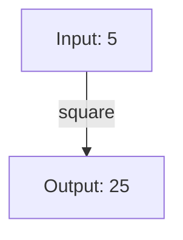

## 7.2. Immutability and Pure Functions

In the realm of functional programming, two concepts stand out as pillars of design: **immutability** and **pure functions**. These principles not only define the functional paradigm but also offer significant advantages in terms of code reliability, maintainability, and performance. In this section, we will delve into the intricacies of these concepts, exploring their benefits, how to implement them, and their impact on software development.

### Understanding Immutability

**Immutability** refers to the state of an object that cannot be modified after it has been created. In functional programming, immutability is a core principle that ensures data consistency and predictability. By preventing changes to data, immutability eliminates side effects, making code easier to understand and debug.

#### Benefits of Immutability

1. **Predictability**: Immutable data structures are predictable because their state does not change. This predictability simplifies reasoning about code behavior.

2. **Thread Safety**: Immutability inherently supports thread safety. Since immutable objects cannot be altered, concurrent threads can safely access them without synchronization.

3. **Ease of Testing**: Testing becomes more straightforward with immutable data, as there are no side effects to account for. Functions that operate on immutable data are easier to test and verify.

4. **Cache Efficiency**: Immutable objects can be cached and reused without concern for unintended modifications, leading to more efficient memory usage.

5. **Functional Purity**: Immutability aligns with the concept of pure functions, which rely on immutable data to ensure consistent outputs for given inputs.

#### Implementing Immutability

To implement immutability, we must ensure that once a data structure is created, it cannot be altered. This can be achieved through various techniques:

- **Copy-on-Write**: When a modification is needed, create a copy of the data structure with the desired changes, leaving the original unchanged.

- **Persistent Data Structures**: Use data structures designed to efficiently share and reuse parts of the structure, minimizing the cost of copying.

- **Immutable Collections**: Utilize libraries or language features that provide immutable collections, such as lists, maps, and sets.

#### Pseudocode Example: Immutable List

```pseudocode
class ImmutableList:
    def __init__(self, elements):
        self._elements = elements

    def add(self, element):
        # Return a new ImmutableList with the added element
        return ImmutableList(self._elements + [element])

    def remove(self, element):
        # Return a new ImmutableList without the specified element
        return ImmutableList([e for e in self._elements if e != element])

    def get_elements(self):
        # Return a copy of the elements to prevent modification
        return list(self._elements)

original_list = ImmutableList([1, 2, 3])
new_list = original_list.add(4)

print(original_list.get_elements())  # Output: [1, 2, 3]
print(new_list.get_elements())       # Output: [1, 2, 3, 4]
```

### Visualizing Immutability

To better understand how immutability works, let's visualize the process of modifying an immutable list:

```mermaid
graph TD;
    A[Original List: [1, 2, 3]] -->|add(4)| B[New List: [1, 2, 3, 4]];
    A -->|remove(2)| C[New List: [1, 3]];
```

**Caption**: The diagram illustrates how operations on an immutable list result in new lists, leaving the original list unchanged.

### Writing Pure Functions

**Pure functions** are functions that, given the same input, will always produce the same output without causing any side effects. They are deterministic and do not rely on or alter any external state. Pure functions are the building blocks of functional programming, promoting code that is modular, testable, and easy to reason about.

#### Characteristics of Pure Functions

1. **Deterministic**: A pure function always returns the same result for the same input.

2. **No Side Effects**: Pure functions do not modify any external state or depend on mutable data.

3. **Referential Transparency**: Pure functions can be replaced with their output value without changing the program's behavior.

#### Benefits of Pure Functions

1. **Ease of Testing**: Pure functions are inherently easier to test, as they do not depend on external state or produce side effects.

2. **Modularity**: Pure functions can be composed and reused across different parts of a program, enhancing modularity.

3. **Parallelism**: Pure functions can be executed in parallel without concerns about shared state, improving performance in concurrent environments.

4. **Debugging Simplicity**: With no side effects, debugging pure functions is more straightforward, as the source of errors is limited to the function's logic.

#### Pseudocode Example: Pure Function

```pseudocode
def square(x):
    return x * x

result = square(5)  # Output: 25
```

### Visualizing Pure Functions

To illustrate the concept of pure functions, consider the following diagram:



**Caption**: The diagram shows a pure function that takes an input and produces a consistent output without side effects.

### Combining Immutability and Pure Functions

Immutability and pure functions complement each other, forming the foundation of functional programming. By using immutable data structures and pure functions, we can create software that is robust, maintainable, and easy to understand.

#### Example: Pure Function with Immutable Data

```pseudocode
class ImmutablePoint:
    def __init__(self, x, y):
        self._x = x
        self._y = y

    def move(self, dx, dy):
        # Return a new ImmutablePoint with updated coordinates
        return ImmutablePoint(self._x + dx, self._y + dy)

    def get_coordinates(self):
        return (self._x, self._y)

def calculate_distance(point1, point2):
    x1, y1 = point1.get_coordinates()
    x2, y2 = point2.get_coordinates()
    return ((x2 - x1) ** 2 + (y2 - y1) ** 2) ** 0.5

point1 = ImmutablePoint(0, 0)
point2 = point1.move(3, 4)
distance = calculate_distance(point1, point2)  # Output: 5.0
```

### Visualizing the Interaction

```mermaid
graph TD;
    A[ImmutablePoint(0, 0)] -->|move(3, 4)| B[ImmutablePoint(3, 4)];
    A -->|calculate_distance| C[Distance: 5.0];
    B -->|calculate_distance| C;
```

**Caption**: The diagram demonstrates how immutable data and pure functions interact to produce consistent results.

### Try It Yourself

To deepen your understanding, try modifying the pseudocode examples:

- **Experiment with Different Data**: Change the input values and observe how the outputs remain consistent.
- **Create New Immutable Structures**: Design your own immutable data structures and implement pure functions to manipulate them.
- **Combine Functions**: Compose multiple pure functions to perform complex operations on immutable data.

### Knowledge Check

To reinforce your understanding, consider these questions:

- What are the key benefits of using immutable data structures?
- How do pure functions contribute to code modularity and testability?
- Why is referential transparency important in functional programming?

### Summary

In this section, we explored the principles of immutability and pure functions, two cornerstones of functional programming. We learned how immutability enhances predictability, thread safety, and cache efficiency, while pure functions promote modularity, ease of testing, and parallelism. By combining these concepts, we can create software that is reliable, maintainable, and easy to reason about.

### Further Reading

For more information on immutability and pure functions, consider exploring the following resources:

- [MDN Web Docs: Immutable Data Structures](https://developer.mozilla.org/en-US/docs/Web/JavaScript/Reference/Global_Objects/Object/freeze)
- [Functional Programming in JavaScript](https://www.smashingmagazine.com/2014/07/dont-be-scared-of-functional-programming/)
- [Understanding Pure Functions](https://medium.com/javascript-scene/pure-functions-functional-programming-1b8e67aaed3f)

## Quiz Time!



### What is a key benefit of immutability in functional programming?

- [x] Predictability
- [ ] Increased complexity
- [ ] Reduced performance
- [ ] More side effects

> **Explanation:** Immutability ensures that data does not change, making code behavior predictable and easier to reason about.

### How does immutability contribute to thread safety?

- [x] Immutable objects cannot be altered, allowing concurrent access without synchronization.
- [ ] Immutable objects require locks to prevent changes.
- [ ] Immutable objects are not used in multithreading.
- [ ] Immutable objects increase the need for synchronization.

> **Explanation:** Since immutable objects cannot be changed, they can be safely accessed by multiple threads without synchronization.

### What is a characteristic of a pure function?

- [x] It always returns the same output for the same input.
- [ ] It modifies global state.
- [ ] It relies on external data.
- [ ] It produces side effects.

> **Explanation:** Pure functions are deterministic and do not depend on or alter external state.

### Why are pure functions easier to test?

- [x] They have no side effects and produce consistent outputs.
- [ ] They require complex setup.
- [ ] They depend on global state.
- [ ] They produce random results.

> **Explanation:** Pure functions are easier to test because they do not have side effects and always produce the same output for the same input.

### What does referential transparency mean in functional programming?

- [x] A function call can be replaced with its output value without changing the program's behavior.
- [ ] A function modifies its input data.
- [ ] A function relies on external state.
- [ ] A function produces side effects.

> **Explanation:** Referential transparency allows a function call to be replaced with its output, ensuring consistent behavior.

### How do pure functions promote modularity?

- [x] They can be composed and reused across different parts of a program.
- [ ] They rely on global variables.
- [ ] They produce side effects.
- [ ] They require complex dependencies.

> **Explanation:** Pure functions are modular because they can be composed and reused without side effects.

### What is a benefit of combining immutability and pure functions?

- [x] Enhanced code reliability and maintainability.
- [ ] Increased complexity and debugging difficulty.
- [ ] More side effects and unpredictable behavior.
- [ ] Greater reliance on mutable state.

> **Explanation:** Combining immutability and pure functions results in code that is reliable, maintainable, and easy to understand.

### How does immutability improve cache efficiency?

- [x] Immutable objects can be cached and reused without concern for modifications.
- [ ] Immutable objects require frequent updates.
- [ ] Immutable objects increase memory usage.
- [ ] Immutable objects are not suitable for caching.

> **Explanation:** Immutable objects can be safely cached and reused, improving memory efficiency.

### What is the relationship between immutability and functional purity?

- [x] Immutability supports functional purity by ensuring consistent outputs for given inputs.
- [ ] Immutability hinders functional purity by allowing state changes.
- [ ] Immutability and functional purity are unrelated.
- [ ] Immutability decreases the need for pure functions.

> **Explanation:** Immutability aligns with functional purity by preventing state changes, ensuring consistent function outputs.

### True or False: Pure functions can modify external state.

- [ ] True
- [x] False

> **Explanation:** Pure functions do not modify external state; they rely solely on their input parameters.



Remember, mastering immutability and pure functions is a journey. As you continue to explore these concepts, you'll discover new ways to enhance your code's reliability and maintainability. Keep experimenting, stay curious, and enjoy the journey!
